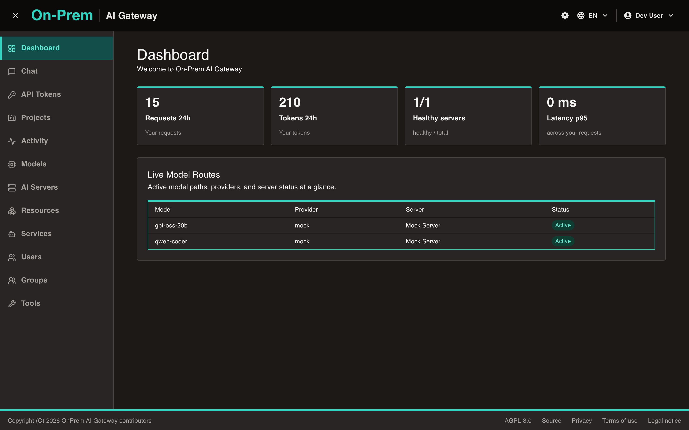
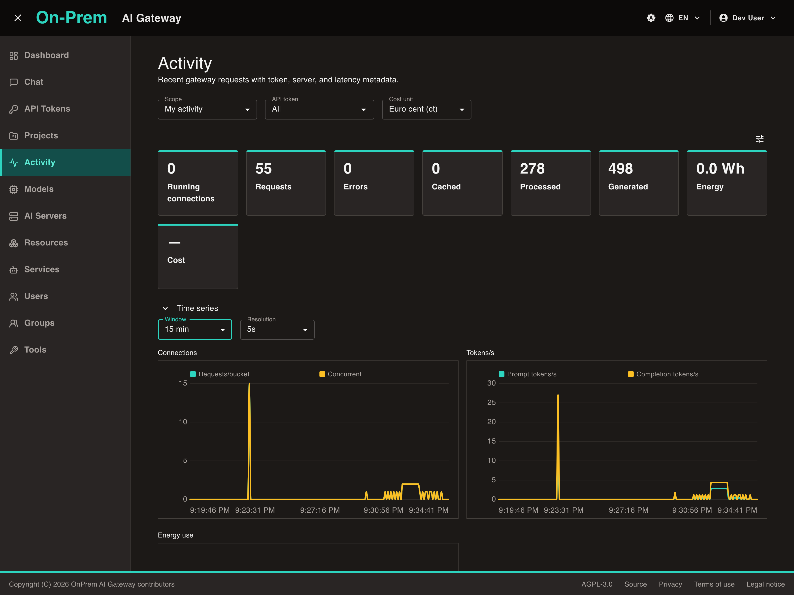
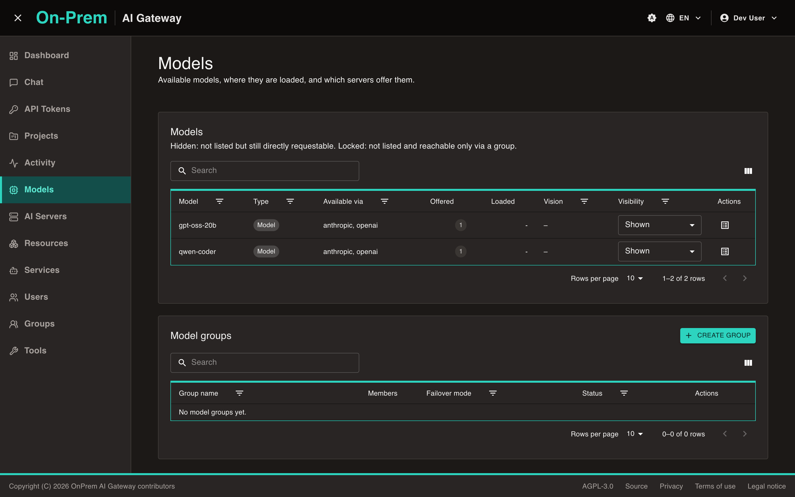
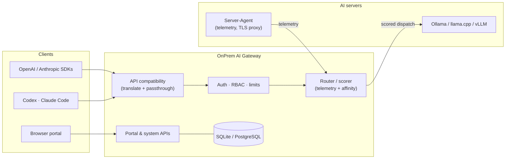

<div align="center">

# OnPrem AI Gateway

**Run your own AI fleet behind one gateway.**

A self-hostable AI gateway and management portal for servers running
**Ollama**, **llama.cpp**, or **vLLM** — with drop-in **OpenAI-** and
**Anthropic-compatible** APIs, load-aware routing, usage/cost/energy
analytics, and an optional private mesh.

[](https://github.com/JLor08/op-ai-gateway/actions/workflows/ci.yml)
[](LICENSE)
[](gateway/backend)
[](gateway/frontend)



</div>

---

Point your existing tools — OpenAI/Anthropic SDKs, **Codex**, **Claude Code**,
anything speaking those APIs — at one URL. The gateway authenticates the
caller, picks the best server for the requested model from **live host
telemetry**, dispatches (translating between API flavors when needed), and
records who used which model, where, at what cost, and with how much energy.
Operators manage servers, models, users, and policies in a bilingual
(English/German), themable web portal.

## Features

**Drop-in client APIs**

- OpenAI-compatible **Chat Completions** and **Responses** APIs and an
  **Anthropic-compatible Messages** API — streaming, tool calling, and image
  input included; unified model discovery (`/v1/models`, per-flavor variants).
- One gateway model name can map to different backend model names per server;
  requests are translated between flavors when client and backend differ.
- Works as the backend for coding agents: Codex (Responses API) and
  Claude Code (Messages API) run against it unchanged.

**Load-aware routing**

- Operator-managed **model mappings** tie gateway models to applications
  (inference endpoints) on registered AI servers.
- The resolver scores candidates by live telemetry (load, health, queue) plus
  per-application priority/weight, with **route affinity** keeping
  context-heavy clients on the same server while it stays suitable.
- **Model groups** with failover; built-in **benchmarks** to compare routes.

**Identity, access & limits**

- Local users with **invite-based provisioning** (no self-registration),
  server-side sessions + CSRF for browsers, scoped **API tokens** for
  programs, three roles (`user < admin < system_admin`), optional **TOTP 2FA**.
- Groups, projects, services (service accounts), and resource groups for
  fleet-scale organization; per-model visibility (hidden/locked models).
- Optional per-user/per-service **rate limits, request/token quotas, and cost
  budgets** — hard admission gates in front of routing.

**Observability**

- Per-request usage with **token counts, cost, and energy attribution**;
  time-series charts, group-by analytics, and a live running-connections
  panel (SSE).
- Optional **payload capture** for debugging — opt-in per token (with an
  explicit system-admin override to force capture globally), encrypted at
  rest (AES-256-GCM) or volatile in RAM, with sensitive headers redacted.
- Live log view with runtime log-level switching; OpenTelemetry tracing.

**Fleet & mesh**

- A standalone, CGO-free **Server-Agent** (Linux/Windows/macOS) reports host,
  GPU, power, temperature, and hardware-inventory telemetry over
  HTTP/WebSocket; agent binaries and ready-to-use configs are downloadable
  through the gateway (portal, or the agent-token endpoint over the mesh).
- Optional **NetBird mesh** integration with a gateway-managed internal CA:
  edge and mesh TLS certificates issued and rotated by the gateway, including
  a TLS-terminating agent proxy in front of the AI server.

**Agent-managed model runtime** (replaces llama-swap)

- Model server **processes** are started and stopped on demand by the agent: a
  request for a model that is not loaded starts it, waits for it to become
  healthy, and proxies — behind **one** router port per AI server, with the
  child processes bound to loopback.
- Launch specifications (binary, arguments, environment, working directory,
  timeouts) are maintained in the portal, while the AI server's own operator
  keeps a **binary allowlist** that decides what may execute at all. Model
  secrets never enter the gateway: a spec's environment values are
  `${AGENT_ENV:NAME}` references resolved on the AI server.
- **Admission control before every start:** a pairwise co-residency matrix, a
  per-server process limit, and per-GPU **VRAM budgets** with measured usage fed
  back from the agent — so co-locating models does not become GPU OOM. Drain-first
  eviction never aborts an in-flight response.
- Live per-model status in the portal (state, PID, port, in-flight, restarts, and
  the last load error with a stderr tail), start/stop/restart as desired-state
  overrides, and an optional **local-file mode** where the AI server's operator
  owns the configuration and the portal is read-only.

**Operations**

- Three storage drivers: in-memory (dev), **SQLite**, **PostgreSQL** —
  versioned, auto-applied migrations.
- Docker Compose and Kubernetes deployments: distroless backend, nginx-baked
  frontend; **external data-only themes** deployable without a rebuild.

## Screenshots

| Usage analytics | Model management |
| :---: | :---: |
|  |  |

## How it works



A **model mapping** ties a gateway model name to an application (a running
inference endpoint) on an AI server. For each request the resolver builds the
candidate `(server, application, mapping)` set, scores it by live server
telemetry and the application's routing tuning, and dispatches — honoring
route affinity so conversational clients keep hitting the same backend. The
full design is documented in
[`docs/architecture/`](docs/architecture/README.md) (arc42, with diagrams);
start with
[Routing & Model Selection](docs/architecture/cross-cutting/routing-and-model-selection.md).

## Quick start (Docker)

Requires Docker with the Compose plugin.

```bash
git clone https://github.com/JLor08/op-ai-gateway.git
cd op-ai-gateway/gateway/deploy
cp .env.example .env      # set OP_AI_GATEWAY_BOOTSTRAP_API_TOKEN, e.g. via: openssl rand -hex 32
docker compose -f docker-compose.no-netbird.yml up --build
```

Open `http://localhost:8080/` (redirects to `/portal/`) and log in with the
one-time set-password link printed in the backend logs:

```bash
docker compose -f docker-compose.no-netbird.yml logs backend | grep set-password
```

This stack runs the distroless gateway, the nginx-served portal, and
PostgreSQL with automatic schema migration. The default
`docker-compose.yml` additionally runs the gateway as a **NetBird mesh peer**
(a sidecar sharing the backend's network namespace); Compose and Kubernetes
variants with and without the mesh are provided — see the full runbook in
[`gateway/deploy/README.md`](gateway/deploy/README.md), including certificates
and the mesh setup.

## Point your clients at it

Create an API token in the portal (**API Tokens**), then:

| Client | Base URL / endpoint |
|---|---|
| OpenAI SDKs & tools | `http://<gateway>/openai/v1` (Chat Completions, Responses, Models) |
| Anthropic SDKs | `http://<gateway>/anthropic/v1` (Messages, Models) |
| Codex | Responses API at `/v1/responses` |
| Claude Code | Messages API at `/v1/messages` |
| Generic / mixed | Unprefixed `/v1/*` accepts both flavors' inference calls |

```bash
curl -s http://localhost:8080/openai/v1/chat/completions \
  -H 'Authorization: Bearer <your-api-token>' \
  -H 'Content-Type: application/json' \
  -d '{"model":"qwen-coder","messages":[{"role":"user","content":"hello"}]}'
```

Browsers authenticate with a session cookie + `X-OP-CSRF` header instead
(`/v1/chat/completions` additionally accepts that session auth; the other
inference endpoints are bearer-only). The portal's chat playground runs each
turn as a server-side run — surviving page reloads and disconnects — and
streams it to the browser over SSE. The complete endpoint reference is in
[HTTP API Surface](docs/architecture/reference/api-surface.md).

## Local development

Requires **Go 1.26+** and **Node.js 22+**.

```bash
make dev
```

starts a disposable full stack (gateway in in-memory mode + Vite dev server)
and serves the portal at `http://127.0.0.1:4173/portal/`. Log in as the seeded
dev user `dev@example.test` / `dev-secret` (a `system_admin`; two mock models
are pre-wired so routing, chat, and analytics work without a real AI server).
Memory mode is ephemeral — for persistent local state run the gateway with
the SQLite driver:

```bash
export OP_AI_GATEWAY_BOOTSTRAP_API_TOKEN="$(openssl rand -hex 32)"

OP_AI_GATEWAY_DB_DRIVER=sqlite \
OP_AI_GATEWAY_SQLITE_PATH=./data/op-ai-gateway.db \
OP_AI_GATEWAY_BOOTSTRAP_ADMIN_EMAIL=admin@example.test \
OP_AI_GATEWAY_BOOTSTRAP_ADMIN_NAME="Admin User" \
make run-gateway
```

### Tests & quality gates

```bash
make test        # Go backend + frontend unit tests
```

```bash
make test-e2e    # Playwright end-to-end suite (real gateway + built portal)
```

```bash
make lint        # golangci-lint across both Go modules (make fmt to format)
```

Scenario e2e suites (certificates, capture, TOTP, SMTP, limits, the
agent-managed model runtime, …) live in `gateway/e2e` as npm scripts and are
local-only gates — CI runs the Go and frontend jobs, not Playwright. Architecture tests (frozen dependency rules for
both Go modules and the frontend) run inside the normal test suites, and a
local, headless **SonarQube quality gate** is available via `make sonar-up` /
`make sonar-gate`. The full tooling reference is
[Development Tooling & Quality Gates](docs/architecture/cross-cutting/development-and-quality.md).

## Configuration

Everything is configured through `OP_AI_GATEWAY_*` environment variables
(driver selection, listeners, TLS, capture, mesh, SMTP, theming directory,
…) — the complete reference is
[Configuration & Environment Variables](docs/architecture/reference/config-env.md).

## Repository layout

| Component | Path | What it is |
|---|---|---|
| **Gateway** | `gateway/backend/` (Go module `op-ai-gateway`) | Terminates client/inference APIs, routes and dispatches inference, serves portal/system/agent APIs, runs background reconcilers. |
| **Portal** | `gateway/frontend/` (React + TypeScript + Vite + MUI) | Administration, server/model management, analytics, and a streaming chat playground. Served under `/portal/`. |
| **Server-Agent** | `server-agent/` (Go module `op-ai-server-agent`) | Standalone binary installed next to an AI server; reports host/GPU/power/temperature/hardware telemetry, can terminate mesh TLS in front of the local server, and can start/stop the local model server processes on demand. See [`server-agent/README.md`](server-agent/README.md). |
| **Deploy** | `gateway/deploy/` | Dockerfiles, `docker-compose*.yml`, `k8s/`, `nginx/`, deployable `themes/`, and operator runbooks. See [`gateway/deploy/README.md`](gateway/deploy/README.md). |
| **Docs** | `docs/architecture/` | arc42 architecture documentation — the reference for how the system is built and why. |

## Documentation

- [Architecture overview](docs/architecture/README.md) — arc42 index (goals,
  constraints, building blocks, runtime views, deployment, ADRs)
- [Security, Authentication & Authorization](docs/architecture/cross-cutting/security-auth-rbac.md)
- [Routing & Model Selection](docs/architecture/cross-cutting/routing-and-model-selection.md)
- [Agent-Managed Model Runtime](docs/architecture/cross-cutting/agent-runtime-manager.md)
- [Persistence](docs/architecture/cross-cutting/persistence.md) ·
  [Networking & Mesh](docs/architecture/cross-cutting/networking-mesh.md) ·
  [Certificates & TLS](docs/architecture/cross-cutting/certificates-tls.md)
- [HTTP API Surface](docs/architecture/reference/api-surface.md) ·
  [Configuration Reference](docs/architecture/reference/config-env.md) ·
  [Data Model](docs/architecture/reference/data-model.md)

## Contributing

Issues and pull requests are welcome. Before submitting, please run
`make lint` and `make test` (CI enforces format, lint, build, and tests for
both Go modules and the frontend). Repository conventions, test suites, and
the quality gates are documented in
[Development Tooling & Quality Gates](docs/architecture/cross-cutting/development-and-quality.md).

Please read [CONTRIBUTING.md](CONTRIBUTING.md) and follow the security process
in [SECURITY.md](SECURITY.md). Voluntary contributor recognition is maintained
in [CONTRIBUTORS.md](CONTRIBUTORS.md).

## License

OnPrem AI Gateway is free software licensed under the **GNU Affero General
Public License, version 3 only (`AGPL-3.0-only`)**. See [LICENSE](LICENSE) for
the full text. Copyright (C) 2026 OnPrem AI Gateway contributors.

The canonical source repository is <https://github.com/JLor08/op-ai-gateway>.

Because the gateway is a network service, the AGPL's section 13 applies: if
you run a **modified** version and let users interact with it over a network,
you must offer those users access to the corresponding source of your modified
version. The unmodified upstream source is always available at the repository
link above.

Third-party dependencies keep their own licenses; see
[THIRD-PARTY-NOTICES.md](THIRD-PARTY-NOTICES.md) for attributions and
[Licensing](docs/architecture/cross-cutting/licensing.md) for the dependency
policy.
