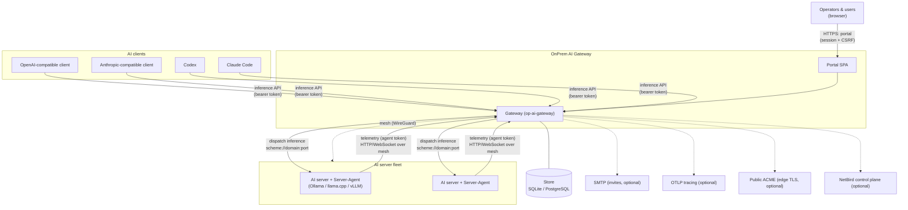

# 3. Context & Scope

The system boundary: who and what OnPrem AI Gateway talks to, and through which
interfaces.

## 3.1 System context (C4 Level 1)

## 3.2 External interfaces

### Inbound

| Actor | Interface | Auth |
|---|---|---|
| AI clients (OpenAI/Anthropic/Codex/Claude Code) | Inference APIs: `/v1/*`, `/openai/v1/*`, `/anthropic/v1/*` (chat/completions, responses, messages, count_tokens, models) | Bearer API token (chat/completions also accepts session+CSRF — the basis of the in-portal chat) |
| Operators & users | Portal SPA + portal/system APIs `/api/portal/*`, `/api/system/*`, `/api/auth/*` | Server-side session cookie + `X-OP-CSRF`; some endpoints require the `admin`/`system` scope |
| Server-Agents | Agent APIs `/api/agent/v1/*` (telemetry, system-report, ca, certificate, proxy-routes, stream, download) | Per-server bearer **agent token** |
| Load balancers / uptime checks | `/healthz`, and the container `-healthcheck` subcommand | none |

### Outbound / dependencies

| Dependency | Purpose | Required? |
|---|---|---|
| AI servers (Ollama / llama.cpp / vLLM) | The actual inference backends the gateway dispatches to | Yes (that is the point) |
| Store (SQLite or PostgreSQL) | All persistent state | Yes (memory driver for dev only) |
| Server-Agent | Host/GPU/power/temperature/hardware telemetry; optional mesh-TLS proxy in front of the AI server | Recommended (routing degrades without telemetry) |
| NetBird | Private WireGuard mesh linking the gateway and AI servers; gateway-managed peers/policies | Optional |
| Public ACME | Edge (public-facing) TLS certificates | Optional |
| SMTP | Invite and password/e-mail delivery | Optional |
| OTLP endpoint | OpenTelemetry trace export | Optional |

## 3.3 Scope

**In scope:** API compatibility and translation; model-mapping-based routing and
load-aware selection; the management portal; identity/RBAC; usage/cost/energy
analytics; the reporting agent; mesh networking and gateway-managed mTLS; themable,
localized UI; three persistence drivers.

**Out of scope:** running the inference engines themselves (Ollama/llama.cpp/vLLM
are external); training or fine-tuning models; being a general-purpose reverse
proxy; providing the NetBird control plane (it integrates with one).
