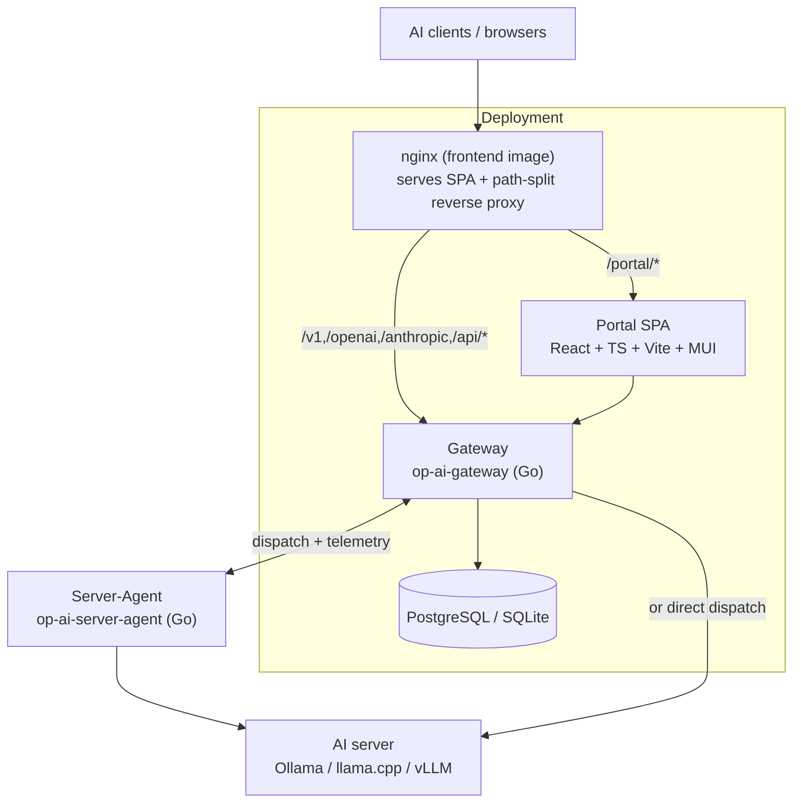
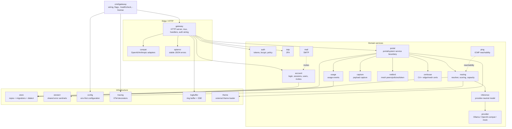

# 5. Building Block View

Static decomposition, from containers (C4 Level 1) down to the backend and agent
components (C4 Level 2).

## 5.1 Level 1 — Containers

| Container | Tech | Responsibility |
|---|---|---|
| **Gateway** | Go (`op-ai-gateway`) | Terminates client/inference APIs, portal/system/agent APIs; routing + dispatch; persistence; background reconcilers (certs, netbird token, energy, availability). |
| **Portal SPA** | React 19 + TypeScript + Vite + MUI | Administration, server/model management, analytics, chat playground. Served under `/portal/`. |
| **nginx (frontend image)** | nginx | Serves the built SPA and reverse-proxies backend paths (path-split mirrors the Vite dev proxy). |
| **Server-Agent** | Go (`op-ai-server-agent`) | Host/GPU/power/temperature/hardware telemetry; optional mesh-TLS proxy in front of the AI server. Imports nothing from the gateway. |
| **Store** | PostgreSQL / SQLite (memory for dev) | All persistent state, behind one dialect seam. |

## 5.2 Level 2 — Gateway backend components

The backend is one Go binary; `internal/*` packages are its components.

| Package | Responsibility |
|---|---|
| `cmd/gateway` | Process entry: config load, dependency wiring per store driver, HTTP server start, background loops; the `-healthcheck` and `-license` subcommands. |
| `gateway` | HTTP server, route registration (public mux + agent mux), request auth, and all handler wiring (inference, portal, system, agent). |
| `compat` | OpenAI/Anthropic request/response compatibility adapters. |
| `apierror` | Stable JSON error response helpers (clients depend on predictable failures). |
| `account` | Auth + session + user management: login, session resolution, logout, set/change password, invite/list/update users, last-admin guard. |
| `auth` | Token authentication primitives; bcrypt password hashing/policy. |
| `totp` | TOTP 2FA enrollment and verification. |
| `portal` | The service boundary behind the portal/system APIs: current-user data, tokens, dashboards, model lists, server/application/mapping management, groups/projects/services/resource-groups, system settings. |
| `routing` | Candidate scoring, the mapping-based resolver, AI-server/routing repository interfaces, domain types (`AiServer`, `Application`, `ModelMapping`), affinity, capacity/admission. |
| `inference` | The internal provider-neutral inference model. |
| `provider` | Provider client interface (incl. `ModelLister`), Ollama adapter, OpenAI-compatible adapter (vLLM/llama.cpp), mock provider. |
| `usage` | Usage-event recording and aggregation inputs. |
| `capture` | Opt-in payload capture (encrypted-at-rest or volatile-RAM), header redaction. |
| `netbird` | NetBird integration: peers, groups, policies, the gateway-managed PAT and its rotation. |
| `certissue` | Internal CA; edge (public) and mesh certificate issuance/rotation. |
| `ping` | Unprivileged ICMP reachability checks. |
| `mail` | SMTP delivery for invites/test mail. |
| `store` | Persistence: repository implementations, the versioned migration runner, the SQLite/PostgreSQL dialect seam. |
| `storeerr` | Shared store error sentinels (prevents `store`↔`routing` import cycles). |
| `config` | Env-first runtime configuration. |
| `tracing` | OpenTelemetry method-tracing decorators (generated), wired via the OTel global. |
| `logbuffer` | In-memory log ring buffer with live SSE streaming and level control. |
| `theme` | Loads and validates external, data-only themes from the themes directory. |

**The sanctioned seam for a service → server callback.**
`gateway.ServerDeps.SetRuntimeConfigChangedHook func(func(serverID string))`
exists because `portalService` and the gateway `Server` are never in scope in the
same function: `buildRuntime` assigns the field where `portalService` is
available, and `buildGatewayServer` invokes it with `srv.PushRuntimeConfig`
immediately after `gateway.New` returns — so the `Server` never sees a
`*portal.Service`. The field looks like dead weight on `ServerDeps` and would be
deleted by a tidy-up; it exists solely to bridge that wiring-order gap. **Tried,
reviewed and rejected — do not re-attempt:** a `portal.UnwrapService(api API)
*Service` helper that reached through the generated OTel tracing decorator to
recover the concrete service from `srv.Portal`. It defeats the exact
`Portal portal.API` boundary the decorator exists to enforce; because
`api_tracing_gen.go` is generated, a template change or a second wrapping layer
would break the type assertion with **no compile error, only a nil at runtime**;
and it added permanent public API surface a later reader would treat as a
sanctioned escape hatch. It has been deleted.

**A per-server registry that `cmd/gateway` must prune needs an exported
constructor.** Without one, `gateway.New`'s internal nil-default fallback builds
an instance `cmd/gateway` never sees, so a `Retain` method — however correct —
runs against an object production never writes to and prunes nothing, silently:
everything compiles and the prune runs. Both `runtimeStatusRegistry` and
`agentFeaturesRegistry` therefore have exported constructors, are constructed
once in `main.go`, and are passed both into `ServerDeps` and into the
`agentRegistries` bundle whose `Retain(live)` runs at the end of each app-health
cycle. Each field of that bundle is declared as an **inline structural interface
with an explicit nil check**, for two reasons that are both needed: the concrete
type is unexported, and a nil *interface* cannot forward to a nil-safe receiver
the way a nil concrete pointer can. Pruning here is a memory bound, not a
correctness fix — server ids are 32 random hex characters and are never reused,
so a stale entry can never make a lookup return true for a live server.

## 5.3 Level 2 — Portal frontend

A single SPA under `gateway/frontend/src`: an app shell (`App.tsx`, topbar +
collapsible `NavSidebar`), feature views (Dashboard, Chat, Tokens, Activity,
Models, AI Servers, Users, Tools, System, NetBird, Logs, legal pages), shared
components, a **view registry** (`components/views.tsx`) as the single source
of truth for "who may see which view" — one entry per view id carries the
same `gate` function for both the nav item (`NavSidebar` filters with it) and
the routed content (`App.tsx` renders only if the gate holds, else falls back
to the dashboard), so nav visibility and content access can never diverge;
adding a view is one registry entry plus the `View` union member. Further:
an `api.ts` typed client (a barrel re-exporting the domain
modules under `api/` — auth, tokens, users, groups, resourceGroups, projects,
servers, services, models, usage, system, netbird, chat), a `theme/` subsystem
(MUI + CSS-variable bridge + `ThemeRoot`), and `i18n.ts` (de/en). It talks
only to the gateway HTTP APIs.

Two additions worth knowing when looking for code on this side:

- The `api.ts` barrel also carries a **`runtime` domain module**
  (`api/runtime.ts`) covering mapping-scoped launch specs, application-scoped
  co-residency and warnings, server-scoped GPU budgets, the file-mode report
  view, and the per-server live-status SSE subscription. In the AI-servers
  drill-down an application of type `server_agent` renders `RuntimeAdminSection`
  **instead of** `MappingSection` — same row-action label, only the destination
  differs — which is why that section must also cover the plain mapping CRUD
  `MappingSection` would otherwise have provided, and why a reader looking for
  the mapping editor on an agent-managed server will not find it. It covers it
  on its leftmost **model mapping** tab, rendering the *same* table and the
  *same* edit mask through two shared definitions —
  `components/shared/mappingColumns.tsx` and `components/MappingForm.tsx`,
  both also used by `MappingSection`. Which screen may WRITE which field is an
  ownership split, not a UI preference; it is specified in
  [`agent-runtime-manager.md` §11.4](cross-cutting/agent-runtime-manager.md#114-which-screen-owns-which-field).
  A shared
  `components/shared/ResourceFallback.tsx` (`resourceState()` +
  `<ResourceFallback>`) was extracted there as the canonical
  loading/error/stale-error/ready rendering for `useResource` call sites.
- `RowAction.title` — the "why is this disabled" reason — is now honoured on
  **both** rendering paths. `RowActionsCell` previously dropped it on the inline
  icon path, and `IconAction` spent its only tooltip on the action's label
  anchored directly on the `IconButton`, which meant a **disabled** inline action
  showed no tooltip at all, not even its own label (MUI warns about exactly this:
  a disabled element fires no events, so a Tooltip needs a wrapper element).
  `IconAction` now takes an optional `title`, wraps only the disabled button in a
  `span`, and prefers `title` over `label` when both are set — the reason is
  strictly more informative than the name, which the icon and the `aria-label`
  already carry. The enabled path's DOM is unchanged, so no other screen's
  markup, layout or queries move.

## 5.4 Level 2 — Server-Agent components

| Package | Responsibility |
|---|---|
| `agent` | The agent run loop, version, and orchestration of collection + reporting. |
| `collector` | Host (gopsutil), GPU (nvidia-smi/rocm-smi/ioreg), power, CPU-temperature, and hardware-inventory collectors; optional inference `/metrics` scraper and loaded-model lister. |
| `client` | HTTP and WebSocket senders that push telemetry to the gateway. |
| `sample` | Telemetry sample shaping. |
| `trust` | Gateway trust store (CA handling) for outbound TLS. |
| `certinstall` | Fetches/installs mesh certificates for the local AI server. |
| `proxy` | The TLS-terminating reverse proxy in front of the AI server (`cert_mode=proxy`). |
| `runtime` | The [agent-managed model runtime](cross-cutting/agent-runtime-manager.md): launch-spec wire types, the admission policy, the agent-local security policy, the process manager, the log ring buffer, the router, both config sources, the features client, the redacted report builder, and the driver. |
| `config` | Agent configuration (env `OP_AGENT_*`, config file, flags). |

`internal/runtime` is modelled on `internal/proxy` (focused files) and is worth
naming file by file, because two of its properties are what make the component
analysable at all:

| File | Holds |
|---|---|
| `types.go` | The runtime-config wire types and their parser (tolerant of unknown fields, hard-fails a duplicate spec id, silently drops a dangling co-residency pair). |
| `policy.go` | The admission decision — matrix, per-GPU budgets, process limit, victim selection — as **pure functions over snapshots**: no clocks, no I/O, no goroutines, no logging. This is why it is the most heavily tested part, and why anything needing a clock or a syscall belongs in the manager instead. |
| `policy_local.go` | The agent-operator boundary: the binary allowlist, permitted directories, and placeholder expansion. |
| `manager.go` | Child processes, reconciled against desired state by a **single serialized owner goroutine** with the proxy manager's generation discipline, so a late process exit can never clobber its successor. |
| `router.go` | The single HTTP listener and both proxy paths. |
| `config_client.go` | The gateway conditional-GET source (mirroring `proxy.RoutesClient`) plus the atomic on-disk last-good cache; and the local-file source in file mode. |
| `features_client.go` | The gateway's declared feature list, ETag-conditional. |
| `logs.go` | A bounded per-process stdout/stderr ring buffer — local-only today, but present from the start so the later log-streaming sub-project need not touch process startup. |
| `driver.go` | The top-level object wiring all of it into the agent's main loop behind `Deps.RuntimeDriver`, symmetric with `Deps.ProxyDriver`. |

The package name shadows the standard library's `runtime`, so importers alias it
(`runtimectl`). Its only allowed module-internal import is `internal/gwapi` — see
[Architecture Tests](cross-cutting/architecture-tests.md).
