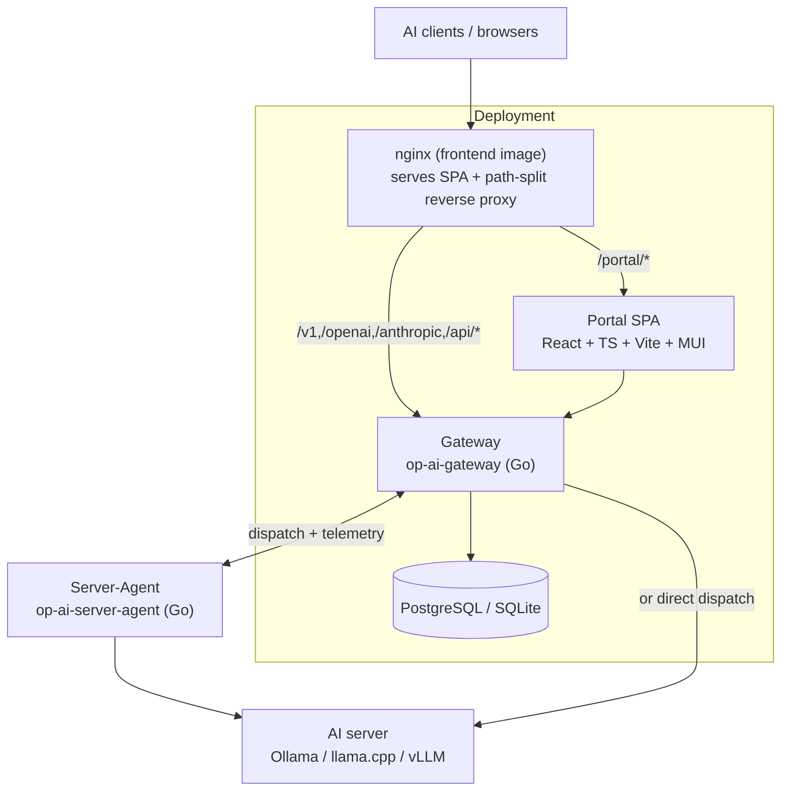
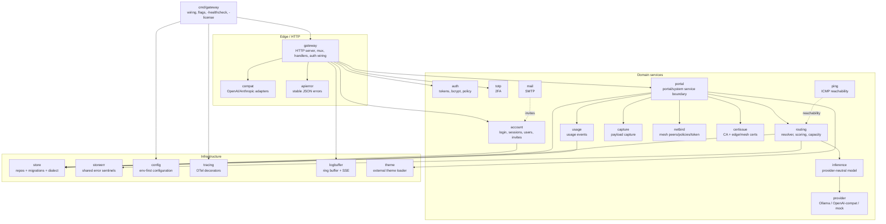

# 5. Building Block View

Static decomposition, from containers (C4 Level 1) down to the backend and agent
components (C4 Level 2).

## 5.1 Level 1 — Containers

| Container | Tech | Responsibility |
|---|---|---|
| **Gateway** | Go (`op-ai-gateway`) | Terminates client/inference APIs, portal/system/agent APIs; routing + dispatch; persistence; background reconcilers (certs, netbird token, energy, availability). |
| **Portal SPA** | React 19 + TypeScript + Vite + MUI | Administration, server/model management, analytics, chat playground. Served under `/portal/`. |
| **nginx (frontend image)** | nginx | Serves the built SPA and reverse-proxies backend paths (path-split mirrors the Vite dev proxy). |
| **Server-Agent** | Go (`op-ai-server-agent`) | Host/GPU/power/temperature/hardware telemetry; optional mesh-TLS proxy in front of the AI server. Imports nothing from the gateway. |
| **Store** | PostgreSQL / SQLite (memory for dev) | All persistent state, behind one dialect seam. |

## 5.2 Level 2 — Gateway backend components

The backend is one Go binary; `internal/*` packages are its components.

| Package | Responsibility |
|---|---|
| `cmd/gateway` | Process entry: config load, dependency wiring per store driver, HTTP server start, background loops; the `-healthcheck` and `-license` subcommands. |
| `gateway` | HTTP server, route registration (public mux + agent mux), request auth, and all handler wiring (inference, portal, system, agent). |
| `compat` | OpenAI/Anthropic request/response compatibility adapters. |
| `apierror` | Stable JSON error response helpers (clients depend on predictable failures). |
| `account` | Auth + session + user management: login, session resolution, logout, set/change password, invite/list/update users, last-admin guard. |
| `auth` | Token authentication primitives; bcrypt password hashing/policy. |
| `totp` | TOTP 2FA enrollment and verification. |
| `portal` | The service boundary behind the portal/system APIs: current-user data, tokens, dashboards, model lists, server/application/mapping management, groups/projects/services/resource-groups, system settings. |
| `routing` | Candidate scoring, the mapping-based resolver, AI-server/routing repository interfaces, domain types (`AiServer`, `Application`, `ModelMapping`), affinity, capacity/admission. |
| `inference` | The internal provider-neutral inference model. |
| `provider` | Provider client interface (incl. `ModelLister`), Ollama adapter, OpenAI-compatible adapter (vLLM/llama.cpp), mock provider. |
| `usage` | Usage-event recording and aggregation inputs. |
| `capture` | Opt-in payload capture (encrypted-at-rest or volatile-RAM), header redaction. |
| `netbird` | NetBird integration: peers, groups, policies, the gateway-managed PAT and its rotation. |
| `certissue` | Internal CA; edge (public) and mesh certificate issuance/rotation. |
| `ping` | Unprivileged ICMP reachability checks. |
| `mail` | SMTP delivery for invites/test mail. |
| `store` | Persistence: repository implementations, the versioned migration runner, the SQLite/PostgreSQL dialect seam. |
| `storeerr` | Shared store error sentinels (prevents `store`↔`routing` import cycles). |
| `config` | Env-first runtime configuration. |
| `tracing` | OpenTelemetry method-tracing decorators (generated), wired via the OTel global. |
| `logbuffer` | In-memory log ring buffer with live SSE streaming and level control. |
| `theme` | Loads and validates external, data-only themes from the themes directory. |

## 5.3 Level 2 — Portal frontend

A single SPA under `gateway/frontend/src`: an app shell (`App.tsx`, topbar +
collapsible `NavSidebar`), feature views (Dashboard, Chat, Tokens, Activity,
Models, AI Servers, Users, Tools, System, NetBird, Logs, legal pages), shared
components, a **view registry** (`components/views.tsx`) as the single source
of truth for "who may see which view" — one entry per view id carries the
same `gate` function for both the nav item (`NavSidebar` filters with it) and
the routed content (`App.tsx` renders only if the gate holds, else falls back
to the dashboard), so nav visibility and content access can never diverge;
adding a view is one registry entry plus the `View` union member. Further:
an `api.ts` typed client (a barrel re-exporting the domain
modules under `api/` — auth, tokens, users, groups, resourceGroups, projects,
servers, services, models, usage, system, netbird, chat), a `theme/` subsystem
(MUI + CSS-variable bridge + `ThemeRoot`), and `i18n.ts` (de/en). It talks
only to the gateway HTTP APIs.

## 5.4 Level 2 — Server-Agent components

| Package | Responsibility |
|---|---|
| `agent` | The agent run loop, version, and orchestration of collection + reporting. |
| `collector` | Host (gopsutil), GPU (nvidia-smi/rocm-smi/ioreg), power, CPU-temperature, and hardware-inventory collectors; optional inference `/metrics` scraper and loaded-model lister. |
| `client` | HTTP and WebSocket senders that push telemetry to the gateway. |
| `sample` | Telemetry sample shaping. |
| `trust` | Gateway trust store (CA handling) for outbound TLS. |
| `certinstall` | Fetches/installs mesh certificates for the local AI server. |
| `proxy` | The TLS-terminating reverse proxy in front of the AI server (`cert_mode=proxy`). |
| `config` | Agent configuration (env `OP_AGENT_*`, config file, flags). |
