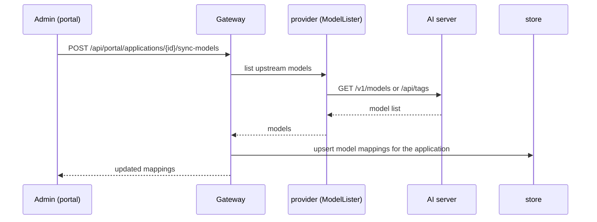

# 6. Runtime View

Key runtime scenarios as sequence diagrams. Details of each subsystem are in the
[cross-cutting concepts](README.md#8-cross-cutting-concepts).

## 6.1 Inference request (routing, dispatch, streaming)

```mermaid
sequenceDiagram
    participant C as AI client
    participant GW as Gateway (edge)
    participant CO as compat
    participant R as routing (resolver+scorer)
    participant P as provider client
    participant AI as AI server
    participant U as usage

    C->>GW: POST /v1/chat/completions (Bearer token)
    GW->>GW: authenticate (bearer or session+CSRF)
    GW->>CO: translate request → internal model
    GW->>R: resolve(model, flavor) → candidates
    R->>R: score by telemetry, priority/weight, capacity
    R-->>GW: chosen (server, application, mapping)
    GW->>P: dispatch to scheme://domain:port (app model name)
    P->>AI: upstream request
    alt streaming
        AI-->>P: SSE chunks
        P-->>GW: chunks
        GW-->>C: SSE chunks (idle watchdog; deadlines lifted)
    else non-streaming
        AI-->>P: response
        P-->>GW: response
        GW-->>C: response
    end
    GW->>U: record usage event (tokens, cost, energy, status)
```

Notes: the four inference endpoints read the request body with no size cap (large
multimodal payloads) and lift the server read/write deadlines; SSE streams are
bounded by an idle watchdog and client disconnect, not a total cap. See
[Compatibility & Inference](cross-cutting/compatibility-and-inference.md).

## 6.2 Portal login (session + CSRF) with optional TOTP

```mermaid
sequenceDiagram
    participant B as Browser (SPA)
    participant GW as Gateway
    participant AC as account
    participant T as totp
    participant S as store

    B->>GW: POST /api/auth/login (email, password, X-OP-CSRF)
    GW->>AC: verify credentials (bcrypt)
    AC->>S: load user
    alt TOTP enabled/required
        AC-->>B: 2FA required
        B->>GW: POST /api/auth/login (+ TOTP code)
        GW->>T: verify code
    end
    AC->>S: create server-side session
    GW-->>B: Set-Cookie (session); principal + scopes
    B->>GW: GET /api/portal/me (cookie + X-OP-CSRF)
    GW-->>B: current user, role/scopes, session elevation
```

## 6.3 Server-Agent telemetry ingest

```mermaid
sequenceDiagram
    participant AG as Server-Agent
    participant GW as Gateway (agent mux)
    participant R as routing/telemetry store
    participant SSE as portal SSE

    loop every interval
        AG->>AG: collect host/GPU/power/temp
        AG->>GW: POST /api/agent/v1/telemetry (Bearer agent token)
        GW->>GW: derive server from token; whitelist fields
        GW->>R: store sample; update availability
        R-->>SSE: fan out live sample (per-server /events)
    end
    Note over AG,GW: WebSocket transport (/api/agent/v1/stream) is an<br/>alternative to per-interval POSTs; liveness via active Ping
    AG->>GW: POST /api/agent/v1/system-report (hardware inventory)
```

## 6.4 Model synchronization



## 6.5 Model-selection benchmark

```mermaid
sequenceDiagram
    participant A as Admin/scheduler
    participant GW as Gateway
    participant R as routing/benchmark
    participant AI as AI server
    participant SSE as portal SSE

    A->>GW: trigger benchmark (manual / scheduled / opportunistic)
    GW->>R: run capacity + speed probes
    R->>AI: probe requests (context size, throughput, concurrency)
    AI-->>R: measurements
    R->>R: persist metrics; update selection inputs
    R-->>SSE: live progress
    Note over R: metrics feed candidate scoring;<br/>hybrid swap-protection avoids thrashing
```

## 6.6 Mesh certificate issuance & HTTPS auto-switch

```mermaid
sequenceDiagram
    participant AG as Server-Agent
    participant GW as Gateway
    participant CA as certissue (internal CA)
    participant APP as AI server (behind agent proxy)

    AG->>GW: GET /api/agent/v1/ca
    GW-->>AG: CA bundle (trust store)
    AG->>GW: request leaf certificate
    GW->>CA: issue mesh leaf (SANs)
    CA-->>AG: leaf + key
    AG->>AG: start TLS-terminating proxy (cert_mode=proxy)
    AG->>GW: telemetry proxy_routes[] (tls_active:true)
    GW->>GW: ReconcileHTTPSSwitch → set application scheme=https
    Note over GW,APP: gateway now dispatches over HTTPS to the<br/>agent proxy; a scope-exit reverts to http
```

## 6.7 Theme resolution (built-in vs external)

```mermaid
sequenceDiagram
    participant B as Browser (ThemeRoot)
    participant GW as Gateway
    participant TH as theme (external loader)

    B->>GW: GET /api/system/theme (public, pre-auth)
    GW->>TH: is active id an external theme?
    alt external
        TH-->>GW: theme data (tokens, brand, product name)
        GW-->>B: {theme, source: external, data}
        B->>B: apply data as CSS variables; favicon/logo via /api/system/themes/{id}/…
    else built-in
        GW-->>B: {theme, source: builtin, data: null}
        B->>B: apply compiled built-in theme
    end
```
