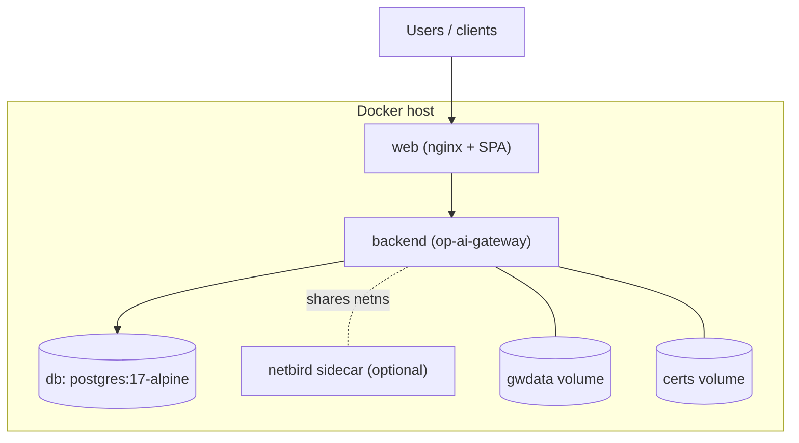

# 7. Deployment View

How OnPrem AI Gateway is packaged and run. Configuration details are in the
[Configuration reference](reference/config-env.md).

## 7.1 Images

Built from the `gateway/` build context (`gateway/deploy/`):

| Image | Base | Contents |
|---|---|---|
| **backend** (`Dockerfile.backend`) | `gcr.io/distroless/static-debian12:nonroot` | The static, CGO-free `op-ai-gateway` binary; a `/data` volume; the baked `deploy/themes/` at `/themes`; a `-healthcheck` subcommand for the container HEALTHCHECK (no shell in distroless). |
| **frontend** (`Dockerfile.frontend`) | nginx | The built SPA served under `/portal/`, reverse-proxying backend paths (path-split mirrors the Vite dev/preview proxy: `/portal/*` → SPA, backend paths → gateway, `/` → `/portal/`). |
| **agent-builder** (`Dockerfile.agent-builder`) | golang | One-shot cross-compiler that produces the `server-agent` binaries offered for download. |
| **netbird sidecar** (`Dockerfile.netbird`) | NetBird client | The stock client plus a small entrypoint wrapper that accepts a setup key at runtime via a shared-volume file. |

## 7.2 Docker Compose

- `docker-compose.yml` — `web` + `backend` + `db` (PostgreSQL), with the backend
  sharing the NetBird sidecar's network namespace for the mesh. The backend waits
  for `db` to be healthy and auto-migrates the schema on startup.
- `docker-compose.no-netbird.yml` — the same stack without the NetBird sidecar;
  the backend runs in its own network namespace and nginx proxies straight to it.
- Volumes: `gwdata` (state), `certs` (edge certificate delivery, shared with the
  web tier for bootstrap), plus agent-binary and PostgreSQL data volumes.
- External themes: `deploy/themes/` is baked into the image at `/themes`; a host
  directory can be mounted over it (`- ./themes:/themes:ro`) to add or override
  operator themes without rebuilding. See
  [Theming](cross-cutting/theming-and-i18n.md).

## 7.3 Kubernetes

- `gateway/deploy/k8s/` — a Kustomize base: the gateway pod (NetBird sidecar +
  gateway backend in one pod), a public `web` tier, PostgreSQL, ClusterIP
  services, an Ingress fronting the public surface only, NetworkPolicies, PVCs, and
  ConfigMaps/Secrets.
- `gateway/deploy/k8s-no-netbird/` — a Kustomize overlay (`resources: ../k8s`) that
  removes the NetBird sidecar (no `NET_ADMIN`/`SYS_ADMIN`, no `/dev/net/tun`) and
  patches the config accordingly.
- The public Ingress exposes only the public/edge surface; the portal/admin and
  agent/mesh surfaces are separate.

## 7.4 Listeners

The gateway runs distinct listeners with independent enforcement:

| Listener | Purpose | Auth / TLS |
|---|---|---|
| **Public** (`OP_AI_GATEWAY_ADDR`) | Inference APIs, portal/system APIs, SPA path-split target | Bearer / session+CSRF; **edge TLS** (public ACME) |
| **Agent / mesh** (`OP_AI_GATEWAY_AGENT_ADDR` / optional separate `AGENT_TLS_ADDR`) | `/api/agent/v1/*` telemetry, cert, proxy-routes, stream | Per-server **agent token**; **mesh mTLS** from the internal CA |
| **Health** | `/healthz` and the `-healthcheck` subcommand | none |

The agent endpoints are registered on both the public mux and the agent/mesh mux;
per-listener behavior (mesh observation, mesh-only enforcement) is threaded through
request context. See [Certificates & TLS](cross-cutting/certificates-tls.md).

## 7.5 Server-Agent deployment

The agent is a single binary per OS (Linux/Windows/macOS), downloadable from the
gateway (`/api/portal/agent-binaries`, served from the `agent-builder` output). It
is configured with `OP_AGENT_GATEWAY_URL` and a per-server `OP_AGENT_TOKEN`
(minted/rotated in the portal), plus optional certificate and metrics settings. It
runs unprivileged where possible, collecting the richest telemetry each platform
allows. See [Telemetry](cross-cutting/telemetry-usage-observability.md).

## 7.6 Startup & background work

On startup the gateway loads configuration (env-first), opens the store, applies
pending migrations (when `OP_AI_GATEWAY_AUTO_MIGRATE` is on), seeds the bootstrap
admin/token if configured, loads external themes, and starts background
reconcilers: certificate renewal/reconcile, NetBird token auto-rotation, energy
reconciliation, availability/telemetry retention pruning, and (opportunistic)
benchmark scheduling.
