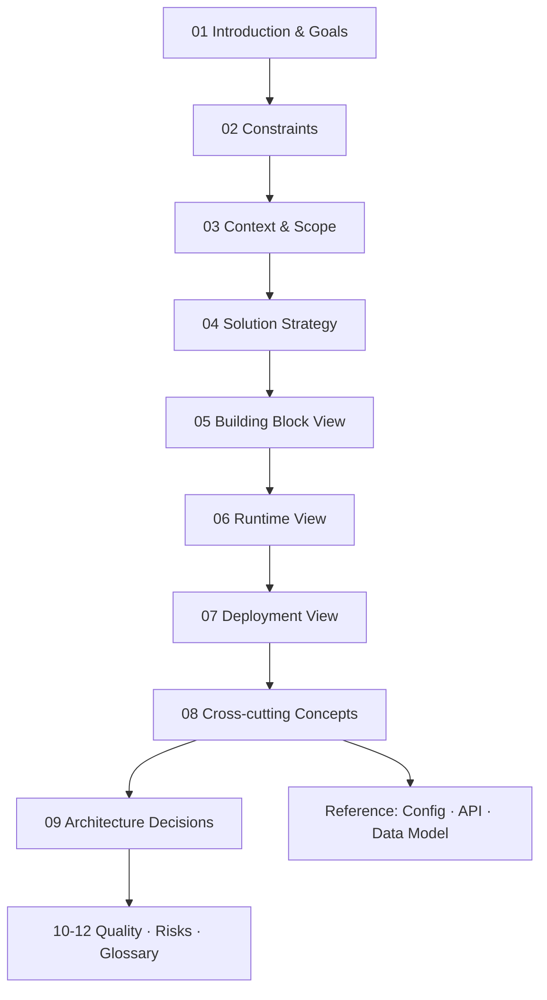

# OnPrem AI Gateway — Architecture Documentation

This is the canonical, self-contained architecture documentation for **OnPrem AI
Gateway** (short form: **OP AI Gateway**). It follows the
[arc42](https://arc42.org) template and is the single source of truth for how the
system is built and why.

OnPrem AI Gateway is a Linux-first, cross-platform, self-hostable **AI gateway
portal**. It routes AI client requests — OpenAI-compatible, Anthropic-compatible,
Codex, Claude Code, and a built-in portal chat — by public model name and API
flavor through operator-managed model mappings to AI servers running Ollama,
llama.cpp, or vLLM, scoring candidates by live host telemetry. Around that core it
provides authentication and RBAC, usage/cost/energy analytics, an optional
encrypted payload capture, a multi-platform reporting agent, a NetBird mesh
integration with gateway-managed mTLS, and a themable bilingual portal. It is free
software licensed under **AGPL-3.0-only**.

## How to read this

## Contents

### Core (arc42)
1. [Introduction & Goals](01-introduction-and-goals.md) — purpose, quality goals, stakeholders
2. [Constraints](02-constraints.md) — technical and organizational constraints
3. [Context & Scope](03-context-and-scope.md) — system context and external interfaces
4. [Solution Strategy](04-solution-strategy.md) — the load-bearing strategic decisions
5. [Building Block View](05-building-block-view.md) — containers and components (C4)
6. [Runtime View](06-runtime-view.md) — key runtime scenarios (sequence diagrams)
7. [Deployment View](07-deployment-view.md) — how it is deployed and operated

### 8. Cross-cutting Concepts
- [Security, Authentication & Authorization](cross-cutting/security-auth-rbac.md)
- [Persistence](cross-cutting/persistence.md)
- [Routing & Model Selection](cross-cutting/routing-and-model-selection.md)
- [Telemetry, Usage Analytics & Observability](cross-cutting/telemetry-usage-observability.md)
- [Networking & Mesh (NetBird)](cross-cutting/networking-mesh.md)
- [Certificates & TLS](cross-cutting/certificates-tls.md)
- [API Compatibility & Inference](cross-cutting/compatibility-and-inference.md)
- [Theming & Internationalization](cross-cutting/theming-and-i18n.md)
- [Licensing & Third-Party Notices](cross-cutting/licensing.md)
- [Configuration](cross-cutting/configuration.md)
- [Architecture Tests](cross-cutting/architecture-tests.md)
- [Development Tooling & Quality Gates](cross-cutting/development-and-quality.md)

### 9-12
- [Architecture Decisions (ADR log)](09-architecture-decisions.md)
- [Quality Requirements](10-quality-requirements.md)
- [Risks & Technical Debt](11-risks-and-technical-debt.md)
- [Glossary](12-glossary.md)

### Reference
- [Configuration & Environment Variables](reference/config-env.md)
- [HTTP API Surface](reference/api-surface.md) (machine-readable: [openapi.yaml](reference/openapi.yaml))
- [Data Model](reference/data-model.md)

## Repository shape (orientation)

- `gateway/backend/` — the Go module `op-ai-gateway` (`cmd/gateway` entry point,
  `internal/*` packages).
- `gateway/frontend/` — the React + TypeScript + Vite portal (served under
  `/portal/`).
- `gateway/e2e/` — Playwright end-to-end suites.
- `gateway/deploy/` — Dockerfiles, `docker-compose*.yml`, `k8s/`, `nginx/`,
  and the deployable `themes/` directory.
- `server-agent/` — the standalone reporting agent (Go module
  `op-ai-server-agent`), which imports nothing from the gateway.
