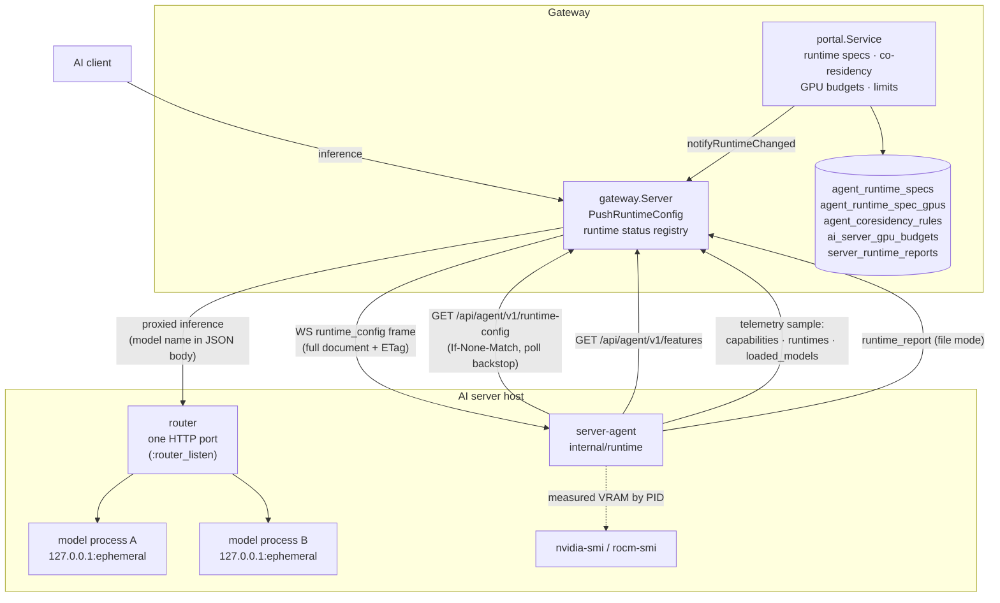

# Agent-Managed Model Runtime

How the gateway drives model server *processes* on an AI server — the launch
specifications it stores, the admission rules the agent enforces before starting
one, the single router port every managed model is reached through, the lifecycle
an operator sees in the portal, and the timeout budget the whole feature exists
to fix.

This replaces [llama-swap](https://github.com/mostlygeek/llama-swap) with
first-party machinery: the same on-demand behaviour (a request for a cold model
starts it, waits for it to become healthy and then proxies), but with the launch
command, the co-residency rules and the per-GPU VRAM budgets held in the gateway
database and edited in the portal, and with authoritative loaded-state reported
back through telemetry instead of scraped out of a third-party status page.
Classic non-managed applications keep working unchanged on the same server, so a
fleet can migrate one server at a time.

Everything here is **negotiated and additive**. The feature is active for a
server only when the gateway and that server's agent both declare the
`runtime_manager` feature flag; an agent without the flag is byte-identical on
the wire to a pre-feature agent, and a gateway that never sees the flag stores
launch specifications that simply do nothing. Nothing in the routing layer
changed: the resolver sees an ordinary application with ordinary model mappings.

## 1. Overview

- **Gateway side** (`internal/portal/service_runtime.go`,
  `internal/gateway/agent_runtime.go`, `internal/routing`, `internal/store`):
  the launch specifications and limits, the document assembled from them, the
  push that announces a change, a volatile in-RAM status registry, and the
  portal admin screen.
- **AI-server side** (`server-agent/internal/runtime`, aliased `runtimectl` by
  importers because the package name shadows the standard library's `runtime`):
  the config source, the admission policy, the process manager, the router, the
  agent-local security policy, and the driver that ties them into the agent's
  main loop behind `Deps.RuntimeDriver`.
- **One `Application` row per server, not per model.** The agent exposes a
  single router port; the gateway sees an ordinary application of type
  `server_agent` and dispatches it through the same shared
  `provider.NewOpenAICompatibleClient` used for `vllm`, `llama_cpp`,
  `llama_swap` and `litellm`, because the router speaks the OpenAI-compatible
  dialect.

## 2. Why it exists: the cold-load problem

A long investigation into cold-load and time-to-first-token failures produced
the constraint set this feature is built around. The relevant facts are recorded
in [API Compatibility & Inference](compatibility-and-inference.md); the two that
shape the design are:

- **`Application.timeout_ms` is a total request deadline, never reset by
  upstream activity.** A cold load longer than the stock 30 s therefore fails
  reproducibly with `502 provider.timeout`. This is why the `server_agent`
  application type defaults `timeout_ms` to 600000 (10 minutes) — a value a
  later "consistency" cleanup must not normalise back.
- **The application health probe flips an application unreachable after a single
  failed 3 s cycle.** A model server that blocks its health endpoint during a
  cold load therefore drops out of routing and can never warm up again. Escaping
  that trap is precisely what llama-swap did for the fleet, and it is the
  property the agent's router must preserve.

A long time-to-first-token from a large prefill is the *same* failure class as a
cold load — a silent window with no bytes — not a separate problem, which is why
the router's streaming heartbeats (§4.4) cover both phases.

The gateway-side remedies that need routing intelligence — deadlines computed
from measured `load_time_ms` and prompt-token rate, benchmark-watchdog
decoupling, and the cross-server double-load fix — are deliberately deferred to
a later routing-integration sub-project. This feature contributes the
authoritative loaded-state that work will consume.

## 3. Authority: the gateway specifies, the AI server permits

The full launch specification — binary, argv, environment, working directory,
listen port, health path, timeouts — lives in the gateway database and is
maintained in the portal. What may actually execute is decided **only** on the
AI server, by the agent's own local configuration. The rule is: *the server
operator decides what may run at all; the gateway decides when and how.*

See [ADR-024](../09-architecture-decisions.md#adr-024--managed-runtime-the-gateway-specifies-the-launch-the-ai-server-permits-it).

### 3.1 The agent-local policy

`LocalPolicy.Permit` (`server-agent/internal/runtime/policy_local.go`) applies
three checks, in order, and the asymmetry of the two empty-list defaults is
deliberate:

| Check | Rule | Empty list means |
|---|---|---|
| Binary allowlist | `runtime_allowed_binaries` / `OP_AGENT_RUNTIME_ALLOWED_BINARIES`. `spec.binary` must be absolute (`filepath.IsAbs`) and match an entry **exactly**; non-absolute allowlist entries are skipped when scanning. | **Nothing starts.** An unconfigured agent refuses every spec — enabling the feature is an explicit act on each host. |
| Work-directory containment | `runtime_allowed_dirs` / `OP_AGENT_RUNTIME_ALLOWED_DIRS`. `filepath.Clean` both sides, then require exact equality or a prefix up to *and including* the separator. A bare entry is already a subtree; `allowedDirBase` accepts a trailing whole-segment wildcard (`<dir>/*` or `<dir>\*`) as an exactly-equivalent synonym by stripping it to `<dir>` before that same check (see §3.1.1). | **Any `work_dir` permitted.** The directory check is defence in depth behind an already-allowlisted binary, not the primary boundary. |
| Placeholder expansion | §3.2. | — |

Three details are one line away from a bypass and must not be "simplified":
the absolute-path requirement (a relative binary would otherwise resolve through
`PATH`); the exact match plus the empty-list refusal together (a config-file typo
such as `runtime_allowed_binaries: [""]` would otherwise exactly-match an empty
`spec.binary`); and the separator boundary in the containment check (a bare
`strings.HasPrefix` admits `/srv/models-evil` against a `/srv/models` rule).

**An empty `work_dir` runs the child beside its binary (R2).** A spec that sets
no `work_dir` is *permitted* — `effectiveWorkDir` resolves it to
`filepath.Dir(spec.Binary)`, the directory the allowlisted binary lives in, and
the child actually launches there (`cmd.Dir` at exec) and is reported as running
there (the log panel's `ResolvedCommand.WorkDir`). This holds **independent of
`runtime_allowed_dirs`**: the binary is on the exact `runtime_allowed_binaries`
boundary, so its own directory is trusted by construction, and Permit returns
`nil` for an empty `work_dir` before it consults `AllowedDirs` at all — a narrow
`runtime_allowed_dirs` cannot reject the binary's directory. `effectiveWorkDir`
is a pure read at each of the three call sites, never a write-back into
`spec.WorkDir`: `reconcile` diffs the stored spec with `reflect.DeepEqual`, so a
rewrite would read as a changed spec and could trigger a needless restart.

A non-empty `runtime_allowed_dirs` still contains every spec that *does* set a
`work_dir`: such a `work_dir` must sit inside one of the permitted subtrees, or
the spec lands in `not_permitted`. That refusal message names the *setting* and
the *count* of configured paths, never the paths themselves, because the text
travels to the gateway as `last_error.message` and the allowlist is the agent
operator's local filesystem layout. "Make the error more helpful by listing the
allowed directories" leaks it.

There is no shell interpreter anywhere on this path: the agent `exec`s directly
with an argv array, as an unprivileged user, in its own process group on unix.

#### 3.1.1 Wildcards in `runtime_allowed_dirs` are subtree synonyms, not a glob

`withinDir` already makes a **bare** entry mean "the directory itself and
everything strictly beneath it". A trailing whole-segment wildcard — `<dir>/*`
or `<dir>\*` — is therefore not a new capability; it is an **exactly
equivalent** spelling that an operator naturally reaches for ("`c:\llama_cpp\*`
= der Ordner und alle Unterordner"). `allowedDirBase`
(`server-agent/internal/runtime/policy_local.go`) strips that trailing
separator-plus-`*` from the entry and hands the concrete base to the unchanged
`withinDir`. Both separators are recognised on every GOOS, deliberately: this
is a Windows deployment and CI runs no Windows job, so the backslash form is
handled — and unit-tested — on the Linux runner (`TestAllowedDirBase`).

It is emphatically **not** a glob, and that is the security decision:

- The untrusted `work_dir` is never matched against a wildcard. There is no
  glob engine. `allowedDirBase` only ever **shortens the trusted operator
  config entry**; the candidate still flows through `filepath.Clean` and the
  separator-boundary check in `withinDir`. A `*` never participates in
  matching, so it can never swallow a separator to jump levels — `c:\llama_cpp\*`
  rejects `c:\llama_cpp\..\windows` and the sibling `c:\llama_cpp_evil`, exactly
  as a bare `c:\llama_cpp` does.
- A `*` that is not a whole trailing segment (`/srv/models*`, `a/*/b`, `**`) is
  left verbatim, so it stays an ordinary path character and matches nothing
  useful — `/srv/models*` does **not** permit `/srv/models-evil`.
- A bare `*` reduces to `""`, which `withinDir` treats as "permits nothing"
  (fail closed), never the whole filesystem.

Mid-path globbing, and any convention where `**` would mean a subtree, are
explicitly not supported: the operator's only need is a trailing star standing
for the subtree, which the bare entry already delivers, and a real glob would
move containment off the audited `withinDir` for a capability nobody asked for.
`runtime_allow_binary_dirs` (§3.1.2) reuses this same `withinDir` subtree check,
so the auto-added binary directories and the wildcard entries agree on semantics
by construction.

#### 3.1.2 `runtime_allow_binary_dirs` auto-allows each binary's parent directory

The agent config toggle `runtime_allow_binary_dirs` /
`OP_AGENT_RUNTIME_ALLOW_BINARY_DIRS` (a bool, **no flag form**, same
operator-only provenance as the two allowlists) treats each
`runtime_allowed_binaries` entry's **parent directory** as an allowed `work_dir`
prefix without the operator also listing it in `runtime_allowed_dirs`. It is
consumed inside `Permit`, after the explicit `AllowedDirs` loop: for each
absolute allowed binary, `withinDir(spec.WorkDir, filepath.Dir(binary))`. A
non-absolute allowlist entry contributes no directory (it can never permit a
binary, so it must not widen the work-dir set either), and `AllowedBinaries` is
guaranteed non-empty at that point because the empty-allowlist gate returned
early, so the toggle always has at least one directory to add.

Because those auto-added directories are plain paths handed to the **same**
`withinDir` that the explicit `runtime_allowed_dirs` entries use (§3.1.1), R3 and
R4 agree on containment by construction — a binary directory permits its subtree
and rejects a separator-boundary sibling exactly as an explicit entry does.

**Composition (R2/R3/R4).** The three are orthogonal and funnel through the one
audited primitive:

- **R2 stands alone.** An empty `work_dir` returns `nil` at the top of Permit's
  work-dir section, before any `AllowedDirs`/`AllowBinaryDirs` logic; the
  binary's own directory is trusted by `runtime_allowed_binaries` and needs no
  auto-allow plumbing to pass.
- **R3 governs a non-empty `work_dir`** that sits under a binary's parent
  directory; it enlarges the effective allowed set.
- **R4 governs how each `runtime_allowed_dirs` entry is matched**;
  `allowedDirBase` normalises the trusted entry and `withinDir` does the
  untrusted-candidate containment.

All three leave `withinDir` and its symlink/TOCTOU acceptance exactly as audited;
`runtime_allowed_binaries` (exact, absolute match) remains the real boundary and
work-dir containment stays defence in depth.

**Footgun, intended:** turning `runtime_allow_binary_dirs` on while
`runtime_allowed_dirs` is empty flips work-dir handling from permissive (any) to
restrictive (the binary subtrees, plus R2's empty case) — the same flip adding
the first `runtime_allowed_dirs` entry causes.

### 3.2 Placeholders, and why no secret enters the gateway

A spec's `env` values are **referential placeholders** resolved on the AI
server, e.g. `{"HF_TOKEN": "${AGENT_ENV:HF_TOKEN}"}`. The value stays on the AI
server, so the system-wide no-plaintext-secrets rule needs no new exception:
nothing here gives the gateway a model secret to store. The accepted cost,
stated plainly: the secret must already exist on the AI server, and the portal
cannot set it. Two channels can still carry a **resolved** value upward, both
arising on the agent side and both stated in §8.3: a **literal** secret written
into `args` rather than referenced as `${AGENT_ENV:NAME}`, and a child that
prints its own argv or environment into the output that
`last_error.stderr_tail` samples. The third place a resolved value could have
travelled — the launch command the log stream reports — masks every
placeholder-derived value by recorded provenance instead
([§14.7](#147-the-resolved-command-what-actually-ran)).
See [ADR-027](../09-architecture-decisions.md#adr-027--model-secrets-never-enter-the-gateway).

Exactly four placeholders are resolved, in both `args` and `env` values:

- `${PORT}` — an exact match substitutes the child's listen port.
- `${MODEL}` — an exact match substitutes the spec's **`upstream_model`**: the
  **application-side** model name, i.e. the owning mapping's `app_model_name`,
  *not* the gateway-facing `model` (`gateway_model_name`). That distinction is
  the whole point of the placeholder — it is what the model server itself calls
  the model, so `["--alias", "${MODEL}"]` or
  `/srv/models/${MODEL}/weights.gguf` name the thing the child expects. An
  **empty `upstream_model` while `${MODEL}` is used is a hard error**, on the
  same reasoning as a missing variable; a spec that never mentions the
  placeholder is unaffected. The gateway-facing name has no placeholder: it was
  not asked for, and a second token would have to be named so neither reading is
  ambiguous (`${GATEWAY_MODEL}`, never `${MODEL_NAME}`).
- `${HOST_GPU_IDS}` — an exact match substitutes the spec's own declared GPU
  indices **as the host sees them**, ascending, deduplicated, comma-separated
  (`"2,5"`). It is the manual escape hatch beside `set_visible_devices`
  ([§3.3](#33-set_visible_devices-turning-the-gpu-list-into-an-enforcement)):
  an operator on a runtime the agent has no vendor mapping for writes
  `{"ONEAPI_DEVICE_SELECTOR": "level_zero:${HOST_GPU_IDS}"}` themselves rather
  than hand-copying the index list into a second place where it can drift from
  the GPU rows that drive admission. **The name carries the invariant on
  purpose**: these are *host* indices, and the child renumbers from zero, so
  the same digits mean different cards on the two sides of the `exec` boundary
  — a token called `${GPU_IDS}` would have read as either. Using it on a spec
  that declares **no** GPUs is a hard error, on the same reasoning as an empty
  `upstream_model`: substituting `""` produces an empty visibility value, and
  an empty visibility value does not mean "no restriction", it means *nothing
  is visible*. Ascending and deduplicated because the declared order never
  survives a save anyway (the store reads GPU rows back `order by gpu_index`)
  and because CUDA stops parsing the list at the first repeated entry, so
  `1,1,2` would silently yield one visible device rather than three.
- `${AGENT_ENV:NAME}` — resolved from the agent's own process environment. A
  **missing variable is a hard error naming the variable**, never a silent empty
  substitution.

Everything else passes through byte-for-byte so a model server's own templating
syntax survives — *except* a near-miss, which is a hard error: if the
upper-cased inner text has the **prefix** `PORT` or `AGENT_ENV`, the token is
refused by name (`${PORTX}`, `${PORT_1}`, `${port}`, `${AGENT_ENVV:…}`,
`${AGENT_ENV:}`). The accepted consequence is that `${PORT_RANGE}` is refused
rather than passed through: in this position it is far more likely a typo of
`${PORT}` than genuine templating.

**`MODEL` and `HOST_GPU_IDS` are deliberately absent from that prefix list**,
and the asymmetry is a decision, not an oversight. The near-miss rule's own justification is that
nothing plausible starts with `PORT` or `AGENT_ENV` except an attempt at those
placeholders — and that reasoning does not transfer: `${MODEL_PATH}`,
`${MODELS_DIR}`, `${MODEL_ID}` and `${MODEL_NAME}` are all plausible tokens an
operator wants handed to a model server that templates them itself, so a prefix
rule on `MODEL` would reintroduce, under a new name, exactly the defect fixed
when a containment rule on `PORT` wrongly refused `${TRANSPORT}`,
`${EXPORT_DIR}` and `${IMPORT_PATH}`. The accepted cost, stated so it is not a
surprise: a typo (`${MDOEL}`) or the wrong case (`${model}`) reaches the child
as literal text rather than erroring — the cheaper of the two mistakes, since an
over-eager refusal breaks specs that work while a literal pass-through breaks
only a spec that was already wrong. `HOST_GPU_IDS` inherits that rule for the
same reason (`${GPU_IDS_FILE}`, `${HOST_GPU_IDS_JSON}`), with the same accepted
cost: `${GPU_IDS}` — the shorter name this token deliberately does *not* use —
reaches the child as literal text.

`${MODEL}` and `${HOST_GPU_IDS}` need **no feature flag**
([ADR-025](../09-architecture-decisions.md) negotiation), and that was checked
rather than assumed. The silent failure mode is real — an agent that does not
know a token passes it through as literal characters instead of failing loudly
— but no such agent can exist in the field: `runtime_manager` and both
placeholders ship in the same unreleased `0.2.0`, so every agent that can run a
spec at all understands them. The same argument covers `set_visible_devices`:
an agent that did not know the field would ignore it and silently run
unconstrained, but no such agent exists.
`agent.Features` is append-only and an entry can never be removed, so a flag
whose intersection is true from the day it ships is permanent dead weight. The
branch's single `0.2.0` bump covers this change; no further bump (`Version` is
per shipped change, not per commit).

Four properties of that one pass are load-bearing, and each has a wrong
implementation that shipped once:

1. **Prefix, not containment.** `strings.Contains(inner, "PORT")` rejects every
   legitimate `${TRANSPORT}`, `${EXPORT_DIR}`, `${REPORT_INTERVAL}`,
   `${MY_AGENT_ENVIRONMENT}`.
2. **Classify against the original text, inside the single substitution pass.**
   Scanning the *substituted result* misclassifies a resolved secret whose value
   happens to contain `${…}` — a JSON blob or a connection string — and echoes a
   literal fragment of that secret into the error message.
3. **Non-recursive.** A resolved value's own `${…}` content is never re-scanned.
4. **No error path formats a value.** Errors name an argument *index*, a
   variable *name*, a binary path, a `work_dir` or the malformed token — never
   the content, because the caller cannot know which arguments are sensitive.
   `expand arg 3: required agent environment variable "HF_TOKEN" is not set` is
   the shape.

Two namespaces are refused rather than resolved:

- **`${AGENT_ENV:OP_AGENT_*}`** — refused before `getenv` is consulted. Without
  it a portal-authored spec could read `OP_AGENT_TOKEN`, the bearer token that
  authenticates the certificate endpoint which issues a private key, and the
  spawned child could then act as that agent.
- **A spec `env` key naming any base variable** (the six below), in **any**
  capitalisation — refused unconditionally, even when the agent's own
  environment defines none of them. A gateway-supplied `PATH` or `SystemRoot`
  would undo the absolute-binary allowlist by steering a permitted binary's
  dynamic linker, DLL search or any helper it shells out to; `HOME`,
  `USERPROFILE` and `LOCALAPPDATA` influence config and cache discovery in the
  same class. A model server needing a non-default base gets it from the
  agent's own process environment. Reversing this needs an explicit opt-in, not
  a silent allow.

The child's environment is built **from scratch**: the base copied from the
agent's environment only where actually defined there (nothing is fabricated),
then the spec's expanded `env` in sorted-key order for determinism. Nothing
else. `os.Environ()` as the base — the default habit in Go — would leak the
agent's bearer token and every other model's secrets into every child.

The base is **OS-appropriate**, and that is one list, not a `GOOS` switch:
`PATH`, `HOME`, `USERPROFILE`, `LOCALAPPDATA`, `SYSTEMROOT`, `WINDIR`, each
copied only when the agent itself has it. Presence does the selecting — a Linux
agent defines none of the four Windows names and its children see exactly the
`PATH`/`HOME` they always did; a Windows agent defines no `HOME` and its
children get the Windows four instead. A union rather than a per-platform list
because **CI compiles nothing for Windows**
([§11.1](../11-risks-and-technical-debt.md)), so a `GOOS`-selected list would
hide the Windows half behind a branch no test on any CI host can enter — the
same blind spot that let two case-sensitivity defects ship. As a union it is
exercised end-to-end from a Linux runner through the injected `getenv` seam.

`USERPROFILE` is what a Windows child actually needs and what a POSIX-shaped
base denied it: Windows sets no `HOME`, so such a child received **no home
indicator at all** and every per-user path resolution failed —
`llama-server` reports it as `failed to initialize router models: Failed to
determine HF cache directory`, since the Hugging Face cache root is
`~/.cache/huggingface` and `~` on Windows *is* `%USERPROFILE%`. `LOCALAPPDATA`
is the same failure one function over (llama.cpp's `fs_get_cache_directory()`
reads it directly on `_WIN32`). **`SYSTEMROOT` is the one a reader will be
tempted to delete as unnecessary and must not**: besides the system DLL search
path, Winsock initialisation fails without it (`WSAStartup` → `10107`), so a
child missing it is not a model server with a bad cache path but a network
server that cannot open a socket — a far more confusing failure than the one
that prompted the fix.

Deliberately **outside** the base, and therefore still settable by a spec:
`TEMP`/`TMP` (a legitimate per-spec lever on a host that downloads multi-gigabyte
weights; `GetTempPath` still falls back to `%USERPROFILE%`), `APPDATA`,
`PATHEXT`, `COMSPEC`, `NUMBER_OF_PROCESSORS`, `PROCESSOR_ARCHITECTURE` and
`HOMEDRIVE`/`HOMEPATH`. That last one matters operationally: because `HOME` is
reserved in every spelling, the pair — or the tool's own `HF_HOME`,
`HF_HUB_CACHE`, `XDG_CACHE_HOME`, `LLAMA_CACHE` — is what a Windows operator has
left to redirect a child's home or cache. The reservation must never close the
last door, so the exclusion list is chosen as deliberately as the base is.

Every placeholder-expansion failure maps to lifecycle state `not_permitted`,
including a missing variable, because none of them resolve without an operator
editing the spec or the host environment. Treating a missing variable as
transient would send it into crash backoff instead of surfacing it as the
configuration error it is. Expansion is also **dry-run with port 0 before any
resource is acquired**, so a permanently broken spec fails without grabbing an
ephemeral port; the port value only substitutes a decimal string, so the dry run
is faithful.

### 3.3 `set_visible_devices`: turning the GPU list into an enforcement

A spec's `gpus` rows drive the per-GPU admission arithmetic
([§5.2](#52-the-three-gates)) and the VRAM measurement mapping
([§5.1](#51-the-per-gpu-data-model)) — but on their own they are
a **declaration, not an enforcement**. Nothing constrains the child to those
cards. Set `CUDA_VISIBLE_DEVICES` yourself in `env` and the two agree; forget
to, and the accounting believes a model sits on GPU 2 with 18 GB while it
actually landed on GPU 0. Nothing warns, because nothing can: the agent has no
way to know which card a process *meant* to use.

The obvious shell workaround does not exist on this path. The agent runs
`exec.Command(spec.Binary, args...)` with an explicit `cmd.Env` and **no shell**
([§3.1](#31-the-agent-local-policy)), and the allowlist requires an exact
absolute binary path — so `VAR=x /path/binary` cannot work, on Linux either, and
Windows has no prefix form at all. A per-spec option is therefore the only clean
route, and it is OS-independent for the same reason: the environment is built
programmatically.

**`set_visible_devices` (per spec, default off)** asks the agent to set the
visibility variable **its own detected hardware** uses, to **this spec's own
GPU indices**:

| Detected stack | Variable set |
|---|---|
| NVIDIA (`nvidia-smi` present) | `CUDA_VISIBLE_DEVICES` |
| AMD (`rocm-smi` present) | `ROCR_VISIBLE_DEVICES` — **and nothing else** |
| Apple, or no recognised stack | *nothing*, and that is a success, not an error |

The vendor comes from the **same** detection the telemetry collectors use
(`collector.DetectGPUCollectors`, which probes nvidia → amd → apple in that
fixed order and keeps whichever reports `Available()`). It is a hardware
capability discovered locally, never a gateway-supplied value — the same posture
as the VRAM measurer ([§5.1](#51-the-per-gpu-data-model)). The
gateway carries the boolean and nothing about the variable name, because it
cannot know what is in the machine.

> **AMD sets the ROCR level only, and adding `HIP_VISIBLE_DEVICES` is the
> mistake to expect.** The two are not synonyms, they are *stacked* filters.
> `ROCR_VISIBLE_DEVICES` is read by the ROCr runtime and selects from the
> machine's real cards; `HIP_VISIBLE_DEVICES` is read one layer up by HIP and
> selects from **what ROCR already left visible**. Setting both to the same host
> list is the classic double-filter trap: with `ROCR_VISIBLE_DEVICES=2,3` the
> HIP layer sees two devices numbered `0,1`, so a simultaneous
> `HIP_VISIBLE_DEVICES=2,3` selects two devices that do not exist and the child
> comes up with **no usable GPU at all**. One level — the lowest one — is the
> whole of the correct answer.

#### The four traps, and where each is handled

1. **An empty value is not "no restriction" — it means "nothing visible".** The
   option with no GPU rows would emit `CUDA_VISIBLE_DEVICES=`, hiding every card
   from the model; it presents as a model that silently falls back to CPU, or
   fails with *no CUDA-capable device is detected*, for a reason nothing in the
   config hints at. **Refused, not emitted** — by the portal at save
   (`runtime_spec.visible_devices_no_gpus`, HTTP 400) **and** by the agent at
   launch (`not_permitted`). Both, deliberately: only the portal can tell an
   operator *in the moment*, and only the agent covers the **file-mode** path,
   where a hand-written local document never passes through the portal at all.
   The agent's refusal is **vendor-independent** — an Apple host refuses the
   combination too, although it would have set nothing — because one rule on
   every platform is the only version a reader can check, and because a spec
   document that is silently fine on the laptop and hides every card on the GPU
   box is the worst available behaviour.
2. **The child renumbers from 0.** With `CUDA_VISIBLE_DEVICES=3,4` the child
   enumerates devices `0` and `1`, not `3` and `4` — so any **argument** naming
   a device number (`--main-gpu`, `--tensor-split`, `--device`) is expressed in
   the *child's* numbering from then on, while the spec's GPU rows, the budgets
   and the measurements stay in the *host's*. This cannot be enforced: the agent
   cannot parse an arbitrary model server's argv. It is therefore **surfaced
   where the operator turns the option on** — the portal states it in the hint
   directly under the checkbox, in German and English, and a test asserts the
   hint is there. It does **not** make two specs interfere (see below).
3. **Conflict with a hand-set entry.** The option together with a
   visibility variable in the spec's own `env` is **refused, never silently
   resolved**. Both resolution orders are defensible, which is exactly the
   problem: whichever wins, the spec reads identically, so an operator cannot
   tell from the configuration which cards the model is on. Refusing converts an
   invisible ambiguity into a message
   (`runtime_spec.visible_devices_conflict`, HTTP 400; `not_permitted`
   agent-side). The owned set is `CUDA_VISIBLE_DEVICES`,
   `ROCR_VISIBLE_DEVICES`, `HIP_VISIBLE_DEVICES`, compared case-insensitively,
   and it is **vendor-independent on both sides** — the gateway cannot know the
   target host's hardware, and a portal rule that could not mirror the agent's
   would reintroduce, in the validator, the very "two states that look identical
   and mean different things" defect this option removes. `HIP_VISIBLE_DEVICES`
   is in the set although the agent never *sets* it, precisely because it
   double-filters what ROCR already filtered. `ONEAPI_DEVICE_SELECTOR` and
   `GPU_DEVICE_ORDINAL` are deliberately **not** owned: composing one of those
   with the option is the documented escape hatch (`${HOST_GPU_IDS}`), not a
   contradiction.
4. **Host indices, not child indices.** The emitted value is the spec's declared
   indices as the **host** sees them — the same numbers `nvidia-smi`/`rocm-smi`
   report and the same ones the per-GPU budgets and measurement rows are keyed
   by. `${HOST_GPU_IDS}` carries host indices too, which is why it is named that
   and not `${GPU_IDS}` ([§3.2](#32-placeholders-and-why-no-secret-enters-the-gateway)).

#### Isolation is structural

Every spec has its own setting and they do not interfere — one model on three
GPUs, another on two, at the same time. That is not a property that had to be
added: the child environment is built **per spec** in `ExpandPlaceholders`, from
the spec it was handed, into a fresh slice that becomes exactly one
`exec.Cmd.Env`. There is no shared or process-wide state for one spec's value to
leak into another's. It is nevertheless **pinned by a test that runs two
co-resident specs on disjoint GPU sets concurrently and asserts on what each
*child* read out of its own environment** — proved rather than assumed, because
"structurally impossible" is what every leak looked like before it was found.

**A spec with the option off is byte-identical to the pre-feature behaviour** —
same environment entries, same order — which is every deployment that exists
today. A test asserts that literally, on all four vendor values, including for a
spec that declares GPUs (the case where the feature had something it *could*
have emitted).

## 4. One router port per AI server

The agent listens on a single HTTP port, reads the `model` field out of each
request body, ensures the matching child process is running, and reverse-proxies
to it. Child model servers bind loopback only and are reachable exclusively
through the router.

This was chosen so that routing, the TLS proxy and the firewall/mesh surface all
stay unchanged: the gateway sees exactly one `Application` row. The accepted
trade-offs are double forwarding of every request and the agent being a single
point of failure for that server's managed models. The rejected alternative —
one gateway-visible application per model process — would multiply rows, ports
and mesh surface per model.

### 4.1 Control routes

Four fixed GET-only paths; any other method on those exact paths falls through
to model routing.

| Route | Answers | Blocks during a load? |
|---|---|---|
| `GET /health`, `GET /v1/health` | `200 {"status":"ok"}` as soon as the listener is bound, with nothing loaded. Never touches the process manager. | Never |
| `GET /running` | llama-swap's shape, `{"running":[{"model":"<upstream>","state":"ready"}]}` — **only** specs in state `running`. | Never |
| `GET /v1/models` | OpenAI's shape, listing **every** managed spec including cold ones. | Never |

**The health endpoints are load-bearing, not a formality.** Reachability means
"the router accepts requests", never "a model is warm". Making the health check
"more honest" by reporting model readiness produces a server that drops out of
routing on its first cold load (§2) and can never come back. Monitoring and UI
must not read a 200 as evidence that any model process exists.

`/running` is kept in llama-swap's shape deliberately, so the gateway's existing
`LoadedModelsFormat: "llama_swap"` detection works unchanged — and it is a
second, independent source of loaded-state truth beside telemetry, not
redundant with it.

### 4.2 Model routing

Every other request is routed on a `model` field in a JSON request body.

- **Request bodies are buffered** (bounded at 32 MiB; over that is
  `413 runtime.request_too_large`) because the router must read `model` and
  `stream` before it knows where to send the request. **Responses are never
  buffered** — `httputil.ReverseProxy` with `FlushInterval: -1` on the plain
  path, a hand-rolled splice loop flushing after every write on the streaming
  path.
- The `model` value resolves against the mapping's **`app_model_name`**, because
  that is what the gateway actually sends upstream (`resolver.go` sets
  `ProviderModel = mapping.AppModelName`) — not the portal-facing gateway model
  name. Matching the wrong one of the two produces a 404 for every request.
- Two specs claiming the same `upstream_model` are logged at Warn naming both
  spec ids when the index is rebuilt. Which one wins is not a contract.
- A request with **no body, a non-JSON body, or a body naming no managed
  model** gets `404 runtime.model_not_managed`. See §4.5 for what that means for
  websocket-serving model servers.

### 4.3 Stable error codes

One mapping produces both HTTP statuses and in-stream SSE error frames. The
envelope is the gateway's own `{"error":{"code","message"}}` shape, reproduced by
the agent, which imports nothing from the gateway — the same mirroring `ws.go`
already does. There is deliberately no `request_id`: the agent has no
request-id concept.

| Code | Status | Meaning |
|---|---|---|
| `runtime.model_not_managed` | 404 | No active launch spec for this model. |
| `runtime.start_failed` | 502 | The process exited or never became healthy. |
| `runtime.start_timeout` | 504 | `startup_timeout_seconds` elapsed — kept distinct from `start_failed` because it is a different diagnosis. |
| `runtime.admission_blocked` | 503 | No slot freed within the wait window. |
| `runtime.not_permitted` | 502 | Agent-local policy refused the binary, the directory or a placeholder — a configuration error, explicitly **not** transient. |
| `runtime.request_too_large` | 413 | Body over the router's limit. |
| `runtime.upstream_gone` | 502 | The child died during the request — **and the fallthrough** for a raw connection failure, a non-2xx the router could not forward, or the manager-closed sentinel. |

Collapsing or renaming any of these destroys the distinction between a
misconfiguration, a slow load and a crash. The fallthrough to
`runtime.upstream_gone` is the part a reader cannot infer from the enumerated
list.

### 4.4 Streaming: heartbeats and the lazy 200

For a `"stream": true` request the router emits `: keepalive` SSE comment lines
at the heartbeat interval (10 s) during any silent window, then splices the
child's stream through verbatim. Heartbeats span **three** phases on one
continuous ticker — admission and cold start, the upstream round trip, and the
wait for the child's first body byte (time-to-first-token for an already-warm
child) — and stop for good the instant real bytes flow. Covering only the
admission phase leaves a warm-but-slow model looking dead to the client.

`Accept-Encoding` is stripped from the outbound request so the transport can
negotiate and transparently decompress; forwarding it would splice gzip bytes
out under SSE headers.

**The 200 plus SSE headers are committed lazily and idempotently** — on the
first heartbeat tick or the first real byte, whichever comes first — never at
the top of the handler. An earlier implementation committed eagerly, which
buried every fast pre-forward failure inside a `data:` frame discoverable only
by an SSE-aware client; `runtime.model_not_managed`, the single most common
misconfiguration this router emits, became invisible to ordinary clients. Under
lazy commit a streaming request naming an unmanaged model gets a real 404 with
`Content-Type: application/json`.

The accepted trade-off is therefore **scoped, not blanket**:

- **Before commit:** a failure is a genuine HTTP status via the same code
  mapping the non-streaming path uses. A **non-2xx from an already-admitted
  child** is forwarded verbatim — its status, its headers minus hop-by-hop, its
  body, flushed per write — because a 400 for context length or a 422 for a bad
  tool schema is the model server's own legitimate answer, not a router failure.
- **After commit:** a later failure can only be a terminal SSE frame
  `data: {"error":{"code":…,"message":…}}` carrying the same stable code — the
  shape the gateway's own translate path already uses for mid-stream failures.
  What is genuinely lost is the child's real response headers.

Four properties of the proxy paths are each one edit from a leaked request slot
or a pinned model process:

1. **The wait for the admission outcome must never be abandoned on the caller's
   context cancellation.** Admission can succeed in the very instant the
   caller's context fires; abandoning the wait drops the `release()` for a spec
   that did start, leaving it permanently un-evictable and never
   idle-unloadable. Only the *post*-admission waits may abandon, because by then
   the release is deferred and the child's body can simply be closed.
2. **The router must close the child's response body itself** the moment it
   observes its own inbound context is done — in both the first-byte wait and
   the splice. Cancelling the downstream request does **not** promptly unblock an
   in-flight `Read` on the child's body, because that hop's `RoundTrip` has
   already returned; verified empirically in the two-hop
   client → router → child topology.
3. **`release()` is called exactly once on every path** — success, client
   disconnect mid-stream, upstream non-2xx, upstream crash. The manager's own
   release closure carries a `sync.Once` that silently absorbs a caller-side
   double release, so the property can only be checked from outside the manager.
   A client disconnect during the splice is reported as no error at all; there
   is nobody left to report to.
4. **A write deadline (30 s) is refreshed before every write to the downstream
   client** on both paths — the lazy commit, each heartbeat, every spliced
   chunk, the verbatim non-2xx forward, and the plain path via a wrapper around
   the response writer. Without it a stalled downstream reader pins the copy
   goroutine and its `release()` indefinitely. The tests prove the wiring, not
   that a genuinely stalled TCP peer is freed end to end.

### 4.5 No protocol upgrades — and what that costs

**The router never proxies a protocol upgrade, and two independent mechanisms
keep it that way.** Both must stay; each looks redundant beside the other.

- `deadlineWriter.Hijack` returns `http.ErrNotSupported`. This is *required*
  because `deadlineWriter` declares `Unwrap() http.ResponseWriter` (so
  `http.NewResponseController` can reach the real writer for
  `SetWriteDeadline`), and `http.ResponseController` walks the `Unwrap` chain for
  **every** optional method — `Hijack` included — so `httputil.ReverseProxy`
  would reach it that way for a 101 response. A successful hijack blocks on the
  raw connection with no write deadline (the wrapper is out of the picture), no
  request-context cancellation, and no rescue from `Server.Close` (hijacked
  connections are untracked), so the deferred `release()` never runs and **that
  spec becomes permanently un-evictable, holding its VRAM for the agent's
  lifetime**.
- `servePlainProxy` deletes `Connection` and `Upgrade` from the outbound
  request. This is *not* hop-by-hop hygiene — `ReverseProxy` strips hop-by-hop
  headers and then deliberately re-adds those two for an upgrade-shaped request.
  Its contribution is that the router never *offers* a switch it cannot honour,
  so a compliant child is never invited to switch and then abandoned.

Relatedly, `io.ReaderFrom` is deliberately **not** forwarded by
`deadlineWriter`: promoting `ReadFrom` would let `io.Copy` bypass `Write` and
with it the per-write deadline refresh that is the wrapper's whole purpose. Note
the asymmetry — for `io.ReaderFrom`, not declaring the method suffices; for
`http.Hijacker` it does not, because `Unwrap` promotes it.

**The operator-visible consequence: a WebSocket-first model server cannot be
driven through a `server_agent` application.** A WebSocket handshake is a
bodiless GET, so it is rejected at the front door with
`404 runtime.model_not_managed` — the HTTP/JSON endpoints of such a server work,
its socket endpoints do not (text-generation-webui's and koboldcpp's streaming
sockets are the concrete cases). This is a design boundary, not a missing
feature: adding upgrade support would need an in-flight model for long-lived
connections, an idle-based deadline on the raw connection, and a drain that
closes hijacked connections. It is not a re-added `Hijack`. The limitation is
recorded in §13 of this document.

One residual risk is accepted rather than fixed: **a child that answers `101`
unsolicited leaks its raw connection.** Verified against the Go 1.26.5 source,
*every* early return in `httputil.ReverseProxy`'s `handleUpgradeResponse` —
invalid protocol, the upgrade-token mismatch, a non-writable body, an
`ErrNotSupported` hijack — returns before `defer res.Body.Close()` is installed.
The header strip only changes which branch the 101 leaves through. The trade is
deliberate: a leaked TCP connection to a local child, instead of a permanently
pinned `release()` and an un-evictable spec.

### 4.6 The bind host is operator-controlled

**The router authenticates nothing.** The gateway supplies the router's *port*
(`router_listen`, derived from the `server_agent` application's `Port`); the bind
host never comes from the gateway. Resolution order:

1. the explicit `runtime_router_bind` / `OP_AGENT_RUNTIME_ROUTER_BIND` setting;
2. else the agent's mesh identity derived from the installed leaf certificate in
   `cert_dir` (the same derivation `internal/proxy` uses for the TLS proxy,
   exported so the runtime package need not import the proxy or config packages);
3. else **all interfaces**, logged at Warn naming the setting that would
   restrict it.

The derivation in step 2 tests one thing only: whether `cert_dir` holds a
loadable leaf certificate with a usable SAN. `DeriveBindHost` takes the
directory as its single argument and **never consults `cert_mode`** — so a
`cert_dir` left populated after the mode was switched back to `"off"` still
derives an address, which is worth knowing when the router turns out to be
bound somewhere narrower than expected. The portal's generated agent config
ships `cert_mode: "off"` with an **empty `cert_dir`**, and that empty directory
— not the mode — is why **the shipped default always falls through to all
interfaces.** Deriving a mesh address is the unusual case, not the default. An
operator who does not want an unauthenticated inference port on every interface
must set the value explicitly (the mesh IP, or `127.0.0.1`).

**The resolution runs once, at process start.** `main.go` resolves the bind host
before the runtime driver is built (`runtimeBindHost := cfg.RuntimeRouterBindHost`,
falling back to `proxy.DeriveBindHost(cfg.CertDir)`) and the driver stores the
result, so an agent that boots before its first leaf is installed binds all
interfaces until it is restarted, however many certificates arrive afterwards, and
a renewed certificate with a different SAN does not move the router. The every-sync
`StartRouter` described below re-binds `d.bindHost` — the value stored at
construction — so it retries a failed *bind*, it never re-derives the *host*.

Binding all interfaces is also the only way "router behind the agent's own proxy
listener, loopback only" is expressible as *unavailable*: that deployment needs
the explicit setting.

The router listener is (re)started on **every** feature-active sync, ahead of
the applied short-circuit, not only when the config changed. `StartRouter` is
idempotent in the desired state, so this costs nothing — and it is the only
thing that ever retries a bind that failed once, for example a port still held
by a previous process at boot. Symmetrically, after `Close` a late in-flight
sync must not resurrect the listener.

### 4.7 The router has two ways in, and only one of them is a socket

Under `cert_mode=proxy` the mesh listener above is *not* how the gateway
reaches this router. The gateway publishes the agent's TLS-proxy route for the
`server_agent` application with a hard-wired `http://127.0.0.1:<app.Port>`
upstream, while §4.6's derivation binds the router on the agent's **mesh
identity** instead — so the dial had nothing to reach and every proxied
request was a `502`. The agent-side fix keeps the proxy terminating TLS exactly
as before and hands the request to the router's `http.Handler` **in process**
whenever the route's upstream is a loopback target on the router's currently
published port. See
[`certificates-tls.md` §6](certificates-tls.md#6-the-agent-side-tls-terminating-reverse-proxy-cert_modeproxy)
for the proxy half and the predicate that guards it.

Two properties of the publish site (`runtime.Driver.publishLocalRouter`,
`local_router.go`) are load-bearing:

- **One router instance serves both paths.** One `http.Transport`, one
  connection pool to the managed children. Two instances would silently split
  keep-alives and double the pool.
- **The publish happens *before* `net.Listen`**, and a failed bind does not
  retract it. This is a deliberate departure from "the router is up exactly
  when its listener is up": the socket is one of two ways in, and the other
  does not need it, so a mesh bind that fails still leaves the proxied path
  serving. Consequently the clear lives in `Close` (and in `StartRouter(0)`,
  which means *no `server_agent` application*), **not** in `stopRouterLocked`
  — `StartRouter` calls that on every 60 s retry, where clearing would blink
  the in-process path off once a minute for as long as a bind kept failing.
  A retry also **reuses** the already-published handler rather than building a
  fresh router, so the connection pool survives it.

The port and the handler live in **one** reference swapped atomically, so a
reader can never observe a fresh port beside a stale handler. `StartRouter(0)`
clears it, which is what lets a disabled runtime fall back cleanly to the
dialled upstream's pre-existing semantics.

Note the consequence for `runtime_router_bind`: after this change a loopback
override is no longer needed to make the *proxied* path work, and it is no
longer free — it confines the router to loopback, so an application routed as
plain `http` to that same port becomes unreachable from the gateway. The agent
says so at Warn on startup when it sees that combination.

## 5. Admission control

### 5.1 The per-GPU data model

VRAM demand is **per GPU, not per spec**, because a tensor-parallel model may
span GPUs unevenly. Every VRAM figure in this feature is **megabytes**; live GPU
telemetry reports bytes and must be converted at the boundary. Full column
detail is in [Data Model](../reference/data-model.md); the semantics that matter
here:

| Field | Owner | Meaning |
|---|---|---|
| `agent_runtime_spec_gpus.vram_estimate_mb` | Operator (portal) | Declared demand for this spec on this GPU index. |
| `agent_runtime_spec_gpus.vram_measured_mb` | Agent | Measured actual usage, written back through telemetry. **Always ignored on a portal write** — `PutRuntimeSpec` copies each index's stored measured value forward. |
| `agent_runtime_specs.vram_locked` | Operator | "My estimate is authoritative": stops the agent's write-back **and** makes the runtime-config document carry `vram_estimate_mb` instead of `vram_measured_mb`. Never consulted by the portal write path. |
| `ai_server_gpu_budgets.budget_mb` | Operator | The ceiling for that GPU index on that server. **`0` means "no budget for this GPU" = unconstrained**, identical to an absent row — see §5.2. |
| `ai_servers.runtime_max_processes` | Operator | Concurrent managed processes; `0` = unlimited. |

The split of VRAM ownership is the load-bearing rule of the whole budget
feature: a future PUT handler that starts trusting `vram_measured_mb` from the
request lets a UI round-trip erase real measurements, after which the agent's
admission arithmetic uses estimates it has already disproved.

The document the agent receives carries, per GPU, the **measured** value if
present and the estimate otherwise — unless the spec is `vram_locked`, in which
case it carries the estimate — with `0` meaning *unknown* (never omitted, never
null).

> **`vram_locked` has to reach the config document, not only the write-back,
> and that is what makes it an escape hatch instead of decoration.** The
> measurement loop is closed and one-way: the agent measures its own child, the
> write-back stores it, the document above prefers measured over estimate, the
> agent reads it back **as the spec's own declared demand**, and §5.2's rule 3
> answers a demand exceeding its GPU's budget *on its own* with a **terminal**
> `not_permitted`. A 24 GB card budgeted at 20000 MB for headroom, an 18000 MB
> estimate that served fine, and one 22000 MB measurement — llama.cpp with a
> large KV cache — is the entire scenario: from then on every start of a model
> that had been working is refused, with no operator action having occurred.
>
> It also could not be undone. `PutRuntimeSpec` deliberately copies the stored
> measured value forward and ignores what the request sends, the write-back
> skips values `<= 0`, and the spec never runs again so no newer measurement is
> ever taken. Raising the budget past what the card physically holds is a
> capitulation, not a lever, and deleting and re-adding the GPU row across two
> saves is not something an operator can be expected to find.
>
> Locking is that lever, and it is deliberately the *only* one: the operator
> chooses whether to be **governed** by the measurement, never what it says, so
> the agent stays the owner of the number and the measurement stays on file and
> on screen as the evidence explaining why they had to intervene. Unlocking
> hands it straight back. The portal states this at the checkbox — whose label
> read "VRAM locked (not evictable)" until this was written, describing
> `pinned` and not this flag at all.
>
> **An operator-facing "reset the measured value to 0" button was rejected.**
> It escapes the trap exactly once and then re-arms it within one measurement
> beat: the spec starts on its estimate, is measured at the same 22000 MB, and
> is refused again. It would need to be combined with locking to be durable, at
> which point locking alone is the whole answer with one control instead of two.
> **Treating a measured breach as non-terminal was rejected too** — the agent
> cannot tell a measured demand from a declared one (the wire carries one
> number by design), and inferring it would mean either running a process the
> operator's budget says does not fit, or silently discarding the measurement.
> Refusing and explaining is the honest behaviour; the defect was never the
> refusal, it was the absent lever.

### 5.2 The three gates

A spec `S` may start alongside the running set `R` only if **all three** hold:

1. **Co-residency matrix** — a permitted pair exists for every `(S, r)`,
   `r ∈ R`. Row present means pair allowed; there is no `allowed` column, so
   "not co-resident" is the structural default (exactly llama-swap's behaviour
   until an operator opens a cell). **This rule is checked over every running
   spec regardless of GPU overlap.** Two specs pinned to disjoint cards still
   need their pair opened, and without it starting one evicts the other even
   though they never share a GPU. Rule 3 below is the *only* rule that asks
   which GPUs a spec touches; reading its "GPUs no common spec touches do not
   compete" as a general exemption is the misreading this rule attracts, and a
   real operator hit it — they concluded two models on separate GPUs needed no
   permission and could not be granted one. The portal's cell tooltip now
   states the consequence at the cell (§11.5).
2. **Process limit** — `|R| + 1 ≤ runtime_max_processes` (`0` = unlimited).
3. **Per-GPU arithmetic** — for every GPU `g` that `S` touches *and that has a
   budget* (`budget(g) > 0`; an absent row or a `0` is unconstrained and not
   gated at all), the sum of VRAM demand over `S` and every `r ∈ R` that also
   touches `g` is within `budget(g)`. GPUs no common spec touches do not
   compete, and a running process is charged only its usage **on the index being
   checked** — never the sum of its whole GPU map, which would produce spurious
   evictions on multi-GPU hosts.

**The matrix and the arithmetic are not redundant.** The matrix expresses
operator *intent* and covers the non-VRAM constraints nobody can compute — PCIe
bandwidth, system RAM, CPU contention — none of which is per-GPU, which is
exactly why the matrix is not per-GPU either. The arithmetic is the *veto*: the
matrix alone cannot stop three pairwise-compatible models from jointly exceeding VRAM.
An open matrix cell is not a guarantee that the pair fits, and the portal's
per-cell VRAM tooltip says so on every cell.

Because an eviction looks the same whichever gate caused it, diagnosing "why did
my model get evicted" requires checking both the matrix and the arithmetic. The
mirror-image question has one extra answer, and that one says so itself: a spec
that sits waiting while an **idle** process occupies its card is not
necessarily a stuck decision — if the waiting spec's own `vram_estimate_mb` is
`0`, that is §5.3's precedence declining to evict a correctly-configured
neighbour, and filling the estimate in is the fix. That case is the one `Wait`
that writes a `last_error` (naming the occupant and the card, see §5.3); every
other `Wait` leaves the spec queued silently, so a waiting spec with no reason
string is waiting for something that resolves on its own.

Three zero-values mean "no constraint", not "zero": `max_processes == 0` is
unlimited, a spec GPU entry with `vram_mb == 0` means *unknown* demand and
routes to §5.3 rather than to the arithmetic, and `budget_mb == 0` means "no
budget for this GPU" — **unconstrained, identical to a GPU with no budget row
at all**. Reading any of them as a literal zero turns an unconfigured field
into a hard refusal of every start.

> **A budget of `0` and an absent budget row must stay indistinguishable, and
> that is easy to break.** `0` is reachable operator input, not a hypothetical:
> the portal's write validation rejects only *negative* values, the limits form
> seeds a brand-new budget row at `0` MB when telemetry offers no total-memory
> figure, and clearing the MB field yields `0` too. The meaning is defined by
> the data model — the doc comment on `routing.ServerGPUBudget.BudgetMB` — and
> honoured on the far side of the wire by the agent: `Admit` skips any GPU index
> whose budget is `<= 0`, so an operator who zeroes a budget gets a no-op, not
> `not_permitted` for every model on that card. The two comments name each
> other deliberately; change one and the other must change in the same commit.
> The check lives in `Admit` rather than in `owner.buildSnapshot`, where the
> budget map is built, because `PolicySnapshot.Budgets` is an exported field any
> caller can populate: filtering at one producer would leave every other
> producer free to reintroduce the divergence, while filtering at the single
> place that *interprets* a budget cannot be bypassed. The portal's advisory
> matrix tooltip follows the same rule — it renders a `0` as a bare sum, never
> as an over-budget warning for a ceiling the agent does not enforce.
>
> **Do not "fix" a future recurrence by making the portal reject `0`.** That
> would turn a row an operator cleared to zero into an error rather than a
> no-op, and would leave the gateway and the agent disagreeing about a value the
> store already persists.

`Admit` evaluates in a fixed order, and the order is deliberate. A candidate
whose *own* demand exceeds one of its own budgets is refused **first**, ahead of
every rule that reads the running set at all, because that is the one verdict no
running set can change; then an unknown VRAM demand on *either* side of the pair
(§5.3), contested with a *pinned* process, short-circuits; then matrix
incompatibility and both unknown-VRAM rules are collected against the original
running set; the per-GPU budget is evaluated with those evictions notionally
already removed; **the process-count limit runs last** and asks only for as many
*additional* victims as the earlier rules have not already supplied. Reversing
the last two over-evicts, and the already-counted chaining is the only thing
preventing double eviction.

**Only one of the two unknown-VRAM rules proposes victims**, and that is the
precedence in §5.3 and
[ADR-032](../09-architecture-decisions.md#adr-032--known-vram-demand-outranks-unknown-the-unknown-side-blocks-never-evicts):
*known demand beats unknown demand*. The occupant-side rule
evicts (an idle occupant whose own demand is unknown); the candidate-side rule
only **blocks** — a candidate whose own demand is unknown may insist on having
its cards to itself, but never by drain-stopping an occupant whose estimate is
filled in, and that block stands even where the matrix or the arithmetic would
have evicted that occupant anyway. Two consequences for anyone reading `Admit`:
the two rules can no longer name the same victim (they did whenever both sides
were unknown, and the spec-id-keyed victim map was what made the overlap
harmless), and a `Wait` no longer implies that every idle victim was exhausted.

**The occupant-side unknown-VRAM rule's placement is pinned by tests**, not by
its comment alone. Collected *after* the arithmetic, it makes the arithmetic
evict a bystander: an unknown occupant contributes `0` to the sum and releases
`0` when evicted, so the sum never comes down and the loop drain-stops the next
idle process on the card instead — one that rule 5 was about to free anyway.
Collected *after* the process-count limit, it makes that limit evict a second
process for a slot that was already coming free. Both re-orderings compile and
leave every other admission test green.

Two guards read as trivial and are not:

- **The candidate is filtered out of the effective running set once, up front,
  ahead of all rules.** The gateway's `coresident` list never pairs a spec with
  itself, so an already-running instance reads as matrix-incompatible with
  itself; rule 3 would double-book one physical process as two; rule 2 would
  count it toward the limit and then offer it as a victim for the count it
  created. Removing this one line reintroduces the same destructive bug through
  four separate paths.
- **A candidate whose own demand on one GPU already exceeds that GPU's budget
  fails terminally**, with `not_permitted` plus a disambiguating message such as
  `spec X: gpu 0 demand 9000 MB exceeds budget 8000 MB on its own` — not `Wait`.
  No eviction anywhere can make it fit, so waiting would queue the request until
  its admission timeout for a pure configuration error. `not_permitted` was
  *reused* rather than adding a new state, because a state value the portal does
  not know renders as nothing; the message is what tells this cause apart from
  the other two that share the state (a local-policy refusal of the
  binary/directory, and the closed-matrix case in §5.3).
  **This check runs before the unknown-VRAM short-circuit because it was being
  shadowed by it.** Executed on both revisions: candidate demand 9000 MB against
  an 8000 MB budget, plus a pinned occupant of unknown demand on the same card,
  reported `pending_vram_unknown` with an empty message — inviting the operator
  to go fill in a *different* spec's estimate, which cannot make 9000 MB fit
  under 8000 MB. The permanent cause has to outrank the resolvable one, and this
  one reads only the spec and the budget map, never the running set, so putting
  it first cannot disturb any other rule's inputs.

Co-residency pairs travel in **wire order** while the policy's allowed set is
canonical (`a ≤ b`, via `PairKey`). Building the lookup map by hand from the raw
pairs — the obvious two-line thing to do — yields a silently one-directional
map: the pair reads as missing exactly when the wire named the two ids in the
other order, presenting as a random, hard-to-reproduce matrix failure.
`Config.AllowedPairs()` exists solely to make that impossible.

### 5.3 Unknown VRAM resolves itself by measurement

A spec whose demand on a GPU is unknown may start only **alone** on that GPU;
otherwise it sits in `pending_vram_unknown` with the reason visible in the
portal. **The rule is symmetric in *subject* — it is the unknown demand that
makes a card unshareable, on whichever side of the pair it sits — and
deliberately asymmetric in *outcome*: known demand beats unknown demand, so
only the side that has a real number may evict to get the card.** An
already-running process with an unknown demand of its *own* blocks a new
candidate on **every card it holds**, exactly the way an unknown candidate is
blocked on every card it wants, whatever that candidate declares for itself:
that occupant is evicted if it is idle, yields `Wait` if it is busy or still
loading, and yields the terminal `pending_vram_unknown` if it is pinned. The
other direction gets **no eviction at all**: a candidate whose own demand is
unknown waits for an occupant of known demand that could still leave, and
reports the same terminal for one that never can.

**Both halves of that symmetry are whole-process, and the contention between
them is per-GPU.** "Unknown" is a property of the process — one unknown card
makes its whole footprint unaccounted — while what makes it *this* candidate's
problem is holding one of the candidate's cards. Scoping the occupant half
per-card instead (unknown *at the index the candidate wants*) reads as the
tighter rule and reopens the hole: an occupant of `{gpu 0: unknown, gpu 1:
5000}` was admitted only on the promise of running **alone on both** cards, so a
candidate let onto gpu 1 — where that occupant's figure happens to be known —
revokes one card of the aloneness the rule had just granted. Measured on the
per-card version: `OK` with that occupant idle, busy **and** pinned. An occupant
holding no card the candidate wants stays ignored either way; widening *that*
half to "any unknown process anywhere" would evict half the host on every start.

**Known demand beats unknown demand, as a total order
([ADR-032](../09-architecture-decisions.md#adr-032--known-vram-demand-outranks-unknown-the-unknown-side-blocks-never-evicts))
— and the outcome-symmetric version it replaced did not converge.** The occupant-side
rule evicts an unknown-demand occupant on behalf of a known-demand candidate,
so as long as the candidate-side rule also evicted a *known*-demand occupant,
one mixed pair contesting one card evicted in **both directions**. Executed on
both revisions, one card, both processes idle, the pair open and no budget at
all: candidate `a` (unknown demand) answered `Evict [b]` while candidate `b`
(known demand) answered `Evict [a]`, so a host alternating requests between the
two paid a cold load for every single request, forever, with no state in
between that either request could be served from. The candidate-side rule
therefore keeps the aloneness demand and gives up the eviction: an
unknown-demand spec may still refuse to share its cards — that is what "may
start only alone" means — but it may no longer drain-stop a spec whose estimate
someone filled in to get them. The order is total, so it converges, and the
side that loses is always the misconfigured one. **The block is
unconditional**: a closed matrix cell (rule 1) or an overflowing sibling budget
(rule 3) does supply an independent reason to evict that same occupant, and
honouring the order only where no such reason exists would leave those pairs
evicting in both directions too — the same defect, one rule over. What it costs
is a `Wait` returned while an idle victim was plainly available: `Decision`'s
own doc comment had to be corrected for it, because `Wait` no longer means
"nothing *can* be evicted to help" but "nothing *may* be". How long such a
wait can last is the terminal-reason paragraph below.

**The tie is not decided and still thrashes.** Nothing in the order ranks two
specs that are *both* of unknown demand, so those still evict each other in
both directions exactly as before — unchanged, not fixed. It is a recorded
acceptance
([§11.4](../11-risks-and-technical-debt.md#114-deliberate-design-acceptances)):
filling in either spec's estimate turns it into the mixed case, which
converges.

On an NVIDIA host the agent then measures actual usage of **its own
child PIDs** — exact because the agent knows which PIDs are its children — and
writes the measurement back to the gateway. There "unknown" is a self-resolving
transient, not a permanent hole in the OOM protection. *How* it measures is
platform-specific: `nvidia-smi --query-compute-apps=pid,gpu_uuid,used_memory`
everywhere except Windows, and PDH performance counters on Windows, where that
query reports nothing usable at all (both are described below).

**What makes it self-resolving is a measurement of a process that is merely
RUNNING**, and for a while nothing took one. The measurer was consulted from
exactly one place — the admission snapshot — whose PID list is built from the
specs that *already* have a live process, so the spec being admitted is never
in its own list and a server whose specs are all up never builds another
snapshot at all. A server with one managed spec invoked the measurer once,
with an empty PID list, and never again; `vram_measured_mb` stayed `0` for the
life of the deployment and the whole write-back chain behind it never ran. So
the invitation to leave `vram_estimate_mb` at `0` and let measurement take
over was, in practice, an invitation into the unknown-demand class for good.
Measurement is now also dispatched from the owner's housekeeping beat and the
moment a child first passes a health probe — the point where a model server
has finished mapping its weights, so the first number is already the
meaningful one.

**Measurement is NVIDIA-only, and which NVIDIA measurer runs is decided per
platform.** `main.go` installs exactly one measurer,
`collector.NewVRAMMeasurer()` — a build-tag split (`measurer_other.go` /
`measurer_windows.go`), not a `runtime.GOOS` branch — which yields the
compute-apps measurer on every non-Windows host, the PDH measurer on Windows,
and **nil** whenever the chosen one cannot work on this host. Both of them need
`nvidia-smi` on PATH, so the NVIDIA-only scope is unchanged: an AMD host (the
host-level `rocm-smi` collector reports no per-PID split), an Apple
unified-memory host, and a host with no GPU at all install **no** measurer and
never write a measurement back. On those hosts the operator's
`vram_estimate_mb` is the only number there will ever be. The rule above still applies — a spec left at the default `0` waits
while a pinned or busy spec holds one of its GPUs — but nothing resolves it
except the other spec becoming evictable or the operator filling the estimate
in. Waiting for the measurement to arrive is waiting for something that will
not happen (§13).

**Fail-open was explicitly rejected**: letting an unknown-demand spec start
anyway hollows out exactly the protection the VRAM budget exists for, and
removes the pressure that makes the measurement self-heal. Measurement
capability is deliberately *not* a negotiated feature flag — flags negotiate
protocol, not hardware — an agent with no measurement path simply omits the
field.

The **compute-apps** measurer (every non-Windows host) resolves GPU UUID →
index from a cached `--query-gpu=index,uuid` mapping, re-fetched only on the
first call or when a *wanted* PID's UUID is missing from the cache (a card
added, removed or reindexed), so the steady state spawns one subprocess per
measurement rather than two. An unknown UUID is skipped, never guessed.

**On Windows that query measures nothing, and this document used to claim
otherwise.** Under the **WDDM** driver model the OS, not the NVIDIA driver, owns
GPU memory, so `nvidia-smi --query-compute-apps=pid,gpu_uuid,used_memory`
answers `[N/A]` for `used_memory` on every compute app. Only the **TCC** driver
model restores per-process reporting, and TCC turns off the adapter's display
output and is unavailable on most GeForce parts — not something an operator of a
workstation-class AI server can switch on. So this section described a whole
host class as self-resolving when nothing on it ever resolved.

**And the failure was worse than a missing number.** `naInt("[N/A]")` is `0`, so
the compute-apps measurer returned a **non-nil** `map[pid]map[gpuIndex]0`, and
`buildSnapshot` reads `if v, ok := byGPU[g.Index]; ok` — a present key is
authoritative. Every managed process on every Windows host was therefore charged
**0 MB**, each GPU's budget read as entirely free however much was resident, and
co-residency admission lost exactly the OOM protection it exists for. The
estimate was never consulted, so filling one in changed nothing. Two guards now
stand where there were none:

- **The compute-apps measurer is never installed on Windows.** The platform
  selector there offers PDH *or nothing* (`collector/measurer_windows.go`), and
  nothing is strictly safer than a measured zero: no measurer means the manager
  falls back to the operator's estimate, while a measured `0` overrode it.
- **A measured `<= 0` no longer overrides an estimate, on any platform.**
  `realMeasurement` (`runtime/manager.go`) keeps only strictly positive
  entries and reports "nothing measured" when none remain — applied **per GPU
  index**, so one unanswered index cannot discard a real number measured on its
  sibling. It is the same `<= 0` rule the gateway's ingest already applies at
  the far end of the same loop (`if g.VRAMMeasuredMB <= 0 { continue }`),
  brought to the one place that lacked it; a measured `0` means *unknown*,
  exactly as a spec's own `vram_mb: 0` does (§5.1).

**What Windows measures instead: PDH performance counters, plus a
LUID → PCI → GPU-index bridge.** Three steps, because no single interface
carries both a PID and the GPU index specs and budgets are written in terms of:

1. **`\GPU Process Memory(*)\Dedicated Usage`** (pdh.dll) → bytes per PID per
   adapter. This is the figure Task Manager's per-process GPU-memory column
   shows, and unlike the `nvidia-smi` query it works under WDDM. Instance names
   are `pid_<PID>_luid_0x<HighPart>_0x<LowPart>_phys_<N>` — the **high part
   comes first**, which is a measured fact and not a documented one. The counter
   is added through `PdhAddEnglishCounterW`, because performance-object and
   counter names are localized on Windows and the localized API would need the
   German (or Japanese, …) spelling of both halves. **One
   `PdhCollectQueryData`** suffices: the counter behaves as a raw gauge, so
   there is no second sample and no settling sleep. A process holds VRAM on
   several physical segments of the same adapter, so the `phys_<N>` segments are
   summed away and only the per-adapter total is kept.
2. **Adapter LUID → PCI address** via the gdi32 exports
   `D3DKMTOpenAdapterFromLuid` and
   `D3DKMTQueryAdapterInfo(KMTQAITYPE_ADAPTERADDRESS)`, which are user-mode
   callable from the unprivileged agent. The address is compared as three
   numbers, never as text: `nvidia-smi` prints `00000000:21:00.0` in **hex**
   while `D3DKMT_ADAPTERADDRESS` reports the same location as decimal ints, so a
   textual join would silently never match (bus `0x21` vs bus `33`).
3. **PCI address → GPU index** via `nvidia-smi --query-gpu=index,pci.bus_id`.
   The PCI address is the *only* identifier the two sides share — compute-apps'
   GPU UUID is unavailable from D3DKMT, and D3DKMT's LUID is unavailable from
   `nvidia-smi`.

Steps 2 and 3 describe the host's fixed topology, so the LUID → index bridge is
cached across measurement cycles, both halves of it. In the steady state a
measurement is therefore **one PDH read and no subprocess at all**. The rules
for the **negative** half are the load-bearing part, because a LUID written off
there can no longer trigger the re-fetch that is its only escape: only a
**durable verdict** may enter it, and three findings qualify — D3DKMT
*refusing* to open the adapter (`STATUS_INVALID_PARAMETER` from
`D3DKMTOpenAdapterFromLuid`, a property of the adapter), an address the adapter
*did* report that no PCI bus could hold (a completed, repeatable reading — see
the plausibility gate below), and a **fresh and complete** `nvidia-smi` reading
that has no GPU at the adapter's PCI address (a property of the host's
topology). Everything else is the *absence* of an answer and is retried next
cycle, on **both** sides of the bridge:

- `nvidia-smi` failing, timing out, or answering with rows missing. An earlier
  revision asked only whether `nvidia-smi` had ever answered, so on a warm
  cache a single 2 s timeout wrote a perfectly good GPU off for the life of the
  process.
- A **transient** D3DKMT failure: `STATUS_DEVICE_REMOVED` from a TDR or driver
  reset, `STATUS_NO_MEMORY` under momentary pressure, or *any* failure of the
  address query — that query runs on a handle the open call has already
  produced, so the adapter has answered for its identity and what a failure
  there can mean instead is a wrong `KMTQUERYADAPTERINFOTYPE` literal or mirror
  struct, a defect in every adapter's probe alike (the compile-time layout
  assertions are what guard that, and a negative-cache entry would hide it).
  The rule is therefore an **allowlist**: a status nobody has classified is
  retried, not written off. `STATUS_NOT_SUPPORTED` is deliberately outside it
  even though "this adapter has no address to report" is a plausible reading —
  the two mistakes cost different amounts, three syscalls a cycle against a
  real GPU losing its measurement until the agent restarts.

One further refusal belongs to the same discipline:
`D3DKMT_ADAPTERADDRESS` reports no PCI **domain**, so two cards in different
PCI segments collapse onto one join key — an address claimed twice is *removed*
rather than resolved to whichever row came last, and both adapters fall back to
the operator's estimate.

Failure is always fail-soft and never a wrong number, and the blast radius
differs by which half failed. A **PDH** error — the query, the counter add, the
sizing call — yields `nil` for the whole cycle (logged at debug, like the other
optional collectors), which the manager already reads as "nothing measured". A
**D3DKMT** error costs only its own adapter: that LUID is skipped and the
remaining ones are still measured, and the cycle yields `nil` only when *no*
adapter resolved at all. An unresolvable adapter is skipped rather than charged
to a guessed index 0, and — per the allowlist above — a transient failure is
asked again on the next cycle rather than remembered. The one subprocess the
chain can spawn is bounded by the same 2 s deadline the compute-apps measurer
uses, for the same reason: the admission-time measurement runs on the serialized
owner goroutine (§5.5).

**Where the numbers in the paragraphs above come from.** The chain was proven
end to end on the operator's 3-GPU Windows host (driver 610.62) with a
standalone probe, and the numbers are worth recording because they are why the
design looks as it does: per-GPU totals came within **0.04–0.8 %** of
`nvidia-smi --query-gpu=memory.used`; the LUID→index attribution agreed with
`nvidia-smi`'s own PID→GPU mapping for **15 of 15** PIDs; a single collection
already returned non-zero values (hence one `PdhCollectQueryData`); and one
adapter LUID (`0x0_0x16026`) failed `D3DKMTOpenAdapterFromLuid` with
`STATUS_INVALID_PARAMETER` and was retried once per counter instance — six
wasted syscalls per cycle for an answer that cannot change, which is why a
refusal is cached. The operator's own model spans all three cards, so the
per-adapter split is a requirement rather than a nicety. **Nothing here detects
VRAM spillover into host memory**: the neighbouring `Shared Usage` and
`Non Local Usage` counters read *identically* (4694 MiB) on all three GPUs of
that host, so they are not per-adapter figures, and only `Dedicated Usage` is
read.

**The Windows code is split so that CI can test the half that can be wrong.**
Every grammar, all the arithmetic and the whole cache-decision logic live in
`collector/nvidia_pdh.go`, which carries **no build tag** and is unit-tested on
Linux; only the syscalls sit behind `//go:build windows` in
`nvidia_pdh_windows.go`, where they are pinned by compile-time struct-layout
assertions and reviewed rather than tested. CI runs on `ubuntu-latest` and
neither builds nor vets for Windows, which is the reason for the split and a
standing risk in its own right
([§11.3](../11-risks-and-technical-debt.md#113-testing-blind-spots-to-remember)).

**The recurring measurement runs OFF the owner goroutine; the admission-time
one still runs on it.** That split is deliberate, and it is what let
measurement become recurring at all. The owner (§5.5) is the single serialized
owner of all state and also answers `Status()` for the 1 s telemetry tick and
every `EnsureRunning` over an unbuffered channel, so a subprocess spawn on it
is a stall for all of them. An admission can afford that because it is
occasional — the UUID cache above exists because even *that* was worth
reducing. A beat cannot, because the cost stops being occasional and becomes
constant. So the beat's dispatch does only the part that needs owner state
(reading the live generation set) and hands the subprocess to its own
goroutine, whose result returns as an ordinary command; at most one
measurement is ever outstanding, so a measurer slower than the beat skips
beats instead of accumulating subprocesses. The admission-time call stays
synchronous on purpose: that is the arithmetic deciding whether one more
process may share a GPU, and a spec started since the last beat would
otherwise be charged its operator *estimate* — an estimate understating
reality is exactly how a co-resident pair reaches an OOM.

A returning measurement is matched to the **generation** it was taken for (the
`*runningProc`, not the PID) before it is recorded: a subprocess takes real
time, in which a spec can exit, restart or be reconfigured, and the OS recycles
PIDs. A target the measurer says nothing about keeps its previous value —
`nvidia-smi` not listing a PID for one cycle is a transient, not evidence that
a process stopped using VRAM. Only an actual exit clears it.

An installed measurer **must bound its own runtime**: nothing interrupts it,
and `Close` waits for an in-flight one. The shipped measurer uses a 2 s context
deadline covering both possible subprocess spawns.

**On a host with no measurer installed none of this exists**: the dispatch
returns before spawning or allocating anything, which is what keeps every AMD,
Apple and CPU-only deployment byte-for-byte unchanged.

`pending_vram_unknown` as a *terminal* reason is reserved for a holder that can
never leave — a **pinned** process on the contested GPU. Any other occupant
yields `Wait`, which is the honest shape but not always a short one. A busy
occupant drains. An idle occupant of known demand — the one the order above
forbids evicting — is unloaded by the idle scan (§6) **if** its
`idle_timeout_seconds` is positive; `0` there means *never unload*, so an idle,
unpinned, never-again-requested occupant keeps the card until the operator
fills the candidate's estimate in (or, on an NVIDIA host, a measurement lands),
and the candidate's requests queue to their
`admission_wait_timeout_seconds` meanwhile. It is not reported as terminal
because none of the three ways out is closed. That wait is the accepted price
of "known demand beats unknown demand": the alternative is the unknown-demand
spec drain-stopping the configured one, which is the non-converging behaviour
above.

**So this one `Wait` says why, and it is the only one that does.** `Wait` is
otherwise the manager's silent branch — the spec stays queued, its state is
untouched, no `last_error` is written — which is right for a wait that resolves
itself: a busy neighbour finishes, a queued victim drains. The precedence wait
need not resolve at all, and a spec that will never start while nothing
anywhere says why is not an acceptable outcome, so `Admit` attaches a message
to *that* decision and the manager records it as the candidate's `last_error`:
`spec X: its own demand on gpu 0 is unknown, so it waits for spec Y to leave
gpu 0 rather than evicting it`. Both cards are named because they need not be
the same one (rule 4 demands aloneness on *every* card the candidate wants),
and the occupant is chosen by lowest spec id — `Running` arrives in Go map
order, and an operator-facing string must not name a different spec on every
admission. The portal renders `last_error` in an always-visible column, so
this is where the stall becomes visible. Scope is deliberate: **an ordinary
`Wait` still records nothing**, because a warning on every contested start is
how a diagnostic stops being read. Neither the state nor the failure count
moves either — nothing was attempted, so this is not a failed start — and a
successful start clears it, like every other reason string. Retried requests
re-derive the identical message and leave the original timestamp alone, so
`last_error.at` reads as *since when*, not *last asked*.

**A terminal reason must name a cause that resolving it actually unblocks**,
and two things follow from that.

- **The occupant case carries a message, and it names the other spec.** The
  candidate case does not need one: the estimate to fill in belongs to the spec
  already displaying the state. The occupant case is the opposite — the spec in
  `pending_vram_unknown` is the one with a usable estimate, while the unfilled
  field is on the pinned spec beside it — so the reason travels with
  `spec X: gpu 1 is held by pinned spec Y, whose own demand on gpu 0 is unknown`
  as the spec's `last_error`. Without it the portal shows a spec waiting for
  VRAM and nothing anywhere says whose number is missing; on a host with no
  measurer (below) filling that number in is the *only* way out.
- **A closed co-residency cell is reported as itself, not as a missing VRAM
  number.** If the pinned occupant is one the matrix does not let this candidate
  sit beside anyway, filling in its estimate resolves nothing — rule 1 refuses
  the pair whatever the numbers say. That case is therefore `not_permitted` with
  `spec X: gpu 0 is held by pinned spec Y, and that pair is not permitted by the
  co-residency matrix`: still terminal (a pinned occupant can neither be evicted
  nor drain, so `Wait` would queue every request to its admission timeout for a
  block that never lifts), but naming the cause an operator can act on. Where
  several pinned occupants qualify, a closed cell outranks an open one and
  equal-precedence occupants break on the lowest spec id — the snapshot's
  running list arrives in map order, and a message that named a different spec
  on every admission would be worse than none. The **candidate**-side terminal
  deliberately keeps its older shape (`pending_vram_unknown` even behind a
  closed cell); revising that is a separate decision about a behaviour that
  predates the occupant rule.

> **The occupant half of that symmetry was missing, and it made "alone on that
> GPU" a promise that expired the instant it was granted.** Both unknown-VRAM
> checks keyed on the *candidate*, while the per-GPU arithmetic charges a
> running process whatever its VRAM map holds for the index being checked — and
> for a process of unknown demand that is `0` **with the key present**, which
> per §5.1 means *unknown*, never a zero-cost claim. So the spec that had just
> been granted a card to itself was charged nothing on it, and the very next
> admission placed a second process on the same card regardless of how large
> the first really was, and regardless of whether it was idle, **busy, or
> pinned**. Measured against `Admit` before the fix: an occupant of unknown
> demand produced `OK` with an empty evict list in all three of those cases,
> where the same occupant declaring 6000 MB produced an eviction. Two processes
> sharing a card with no accounting for either is precisely the OOM the budget
> exists to prevent. It was never a deliberate asymmetry: this section already
> accepts that an unknown-demand *spec* waits behind a pinned or busy holder,
> and that is only coherent if the reverse holds too.
>
> **It is an explicit rule, not a bigger number in the arithmetic.** Charging an
> unknown occupant the whole budget looks like the smaller change and does not
> work: the arithmetic's eviction loop releases a victim by subtracting that
> same `0`, so evicting the unknown occupant never reduces the sum. That
> version evicts every idle process on the card, still finds itself over budget,
> and answers `Wait` — destroying running work **and** blocking the candidate.
> Charge and release would both have to be made consistent, which means
> inventing a VRAM figure for a process nobody has measured. Naming the
> contention needs no number at all.
>
> **Terminal is a report, not a permanent verdict — but what lifts it is
> host-dependent, and on most hosts it is only the operator.** A pinned
> occupant's `pending_vram_unknown` is re-evaluated once
> `notPermittedRetryInterval` elapses, and unlike a candidate that cannot start,
> a pinned occupant *is* running — so **where a measurer is installed** the
> housekeeping beat measures it and the block clears with nothing evicted. That
> is the NVIDIA case and only the NVIDIA case: on AMD, Apple-silicon and
> GPU-less hosts the agent installs no measurer at all, so nothing but an
> operator filling the estimate in will ever clear it, and the re-evaluation
> loop simply re-confirms the same block every five seconds. Do not read
> "terminal is not permanent" as a property of the state — it is a property of
> the host, which is why the message has to name the spec whose estimate is
> missing.

### 5.4 Eviction, queueing and drain

When admission is blocked, the policy proposes victims: **only processes
currently serving no request and not still loading, oldest-`last_used` first,
never a `pinned` spec.** Ties break on ascending spec id — not determinism
theatre: the victim set is accumulated in a map (Go randomises map iteration
order per run) and `sort.Slice` is not stable, so without the tie-break the
same snapshot evicts different processes on different runs, a non-reproducible
failure single-run testing cannot detect.

**A process that has not yet passed a health probe is never an eviction
victim.** "Serving no request" alone reads a still-loading process as idle,
when it is in fact the most expensive thing on the host *and* has a request
queued on it. Two concurrent requests for two models that cannot co-reside then
evict each other while loading, forever: each eviction frees the slot the other
immediately takes, no request ever progresses, and every iteration is a model
server beginning to map a model file and then being killed. It is unbounded
rather than self-limiting, because `admission_wait_timeout_seconds` bounds the
*duration* of the storm and never its rate. With the clause, each exec buys at
least one served request: the loser Waits (bounded by `startup_timeout_seconds`,
which is what actually bounds `starting`), the winner finishes loading and
serves, and only then becomes evictable. This is **not** the same guard as
`pinned`: `pinned` is permanent, while `starting` is a state every process
passes through exactly once per generation and always leaves — healthy, start
timeout, or exit.

**A spec evicted *for* another spec's queued request gives that spec first
refusal on the freed slot.** The victim records who it was drained for, and
when its process finally exits those specs are admitted *by name* before the
victim may re-admit itself. Without it the fix above trades a busy loop for
starvation: sustained traffic for the victim's own model can keep re-taking the
slot its eviction paid for, one full model load per cycle. A bare reordering of
the two admission attempts is not sufficient, because the general wake pass
reaches the victim too, in randomised map order; only the explicit by-name step
orders the two.

Every other admission retry runs **oldest-queued-request-first**, and covers
every spec that *wants* to be up rather than only those with a queued request —
a `pinned` or `force_running` spec has no waiter at all, so a wake keyed on
"has a pending request" would leave it Stopped after a `Wait` until some
unrelated config `Apply` happened to retry it.

**`Admit` never returns a partial eviction list.** If any blocker anywhere in
the pipeline is non-evictable — busy, or pinned outside the unknown-VRAM
short-circuit — the whole decision becomes `Wait` with an empty evict set,
because evicting only some blockers destroys running work for no admission gain.

If everything blocking the candidate is busy or pinned, the request **queues**
and is re-evaluated on every completion, failing at the spec's
`admission_wait_timeout_seconds` with `runtime.admission_blocked`. `0` means wait
until the client disconnects — the same semantics as the gateway's
`admission_queue_timeout_seconds`, and the reason `0` must not be read as "no
wait". The timer is owner-scheduled per waiter, not a caller-side context
deadline, because only the owner resolves an upstream model name to a spec and
therefore knows which spec's timeout applies.

**Every waiter's admission timer is cancelled the moment its target enters
`starting`, and is not re-armed against the startup deadline.** Otherwise the
admission timer keeps running through the child's startup and returns
`admission_blocked` mid-start to a caller that should have been waiting out
`startup_timeout_seconds` — the classic double-counting bug where a request
fails at the shorter of two timeouts covering adjacent phases. The guard is on
`state == starting` specifically, never on "a process exists": a draining
generation also has a live process and there **no** other bound exists, so a
request queued while its spec drained would run to its HTTP context deadline
instead of getting a bounded refusal. A dying generation has been *de-admitted*,
not admitted, so its waiters are once again waiting for a slot.

**Every stop drains.** The spec moves to `draining` immediately so routing and
the loaded-models list stop selecting it, then the manager waits for in-flight
to reach zero up to the drain grace (10 s) — checked event-driven on every
request release, not by polling, so a release that brings it to zero proceeds at
once instead of waiting out the grace — then SIGTERM to the process group, then
SIGKILL after the kill grace (5 s). The startup-timeout path kills through the
same helper. State-before-signal is what keeps new requests off a process that
is about to die; a polled drain wait would silently add up to a full grace
period to every eviction.

Real model servers routinely outlast SIGTERM by seconds while finishing
in-flight generations, so the SIGKILL escalation is the path that normally ends
a child, not an exceptional one.

**No code path may remove a spec or a queued waiter without resolving that
waiter's reply channel.** Three leaks of this shape were found and fixed — a
caller's context cancelling while queued, a spec removed by `Apply`, and both
spec-deletion sites needing an explicit fail-pending with `ErrModelNotManaged`.
Each hangs a request forever with no log line and no metric; the general rule is
the only thing preventing a fourth.

### 5.5 One serialized owner

**All admission decisions run through a single goroutine — never a mutex around
scattered checks.** Computing "does it still fit" and actually starting the
process must be one indivisible operation, because two concurrent requests each
independently concluding "still fits" and both starting is the single most
severe defect available in this feature: it defeats every VRAM budget at once.

That goroutine owns every mutable field (the spec map, the upstream index, the
allowed-pair set, the applied config, the closing/stopped flags) and is reached
only through an unbuffered command channel carrying small typed commands, each
with its own buffered reply channel. There is no mutex anywhere in the manager.
Correctness arguments are therefore about command *ordering*, not lock ordering,
and any new state must be reached the same way — a mutex-guarded side field
defeats the model.

**Work that blocks belongs on a side goroutine that posts a command back**, and
the VRAM measurement is the worked example (§5.3): the owner reads the live
generation set, the subprocess runs elsewhere, and the answer arrives as an
ordinary command carrying the `*runningProc` it was taken for, so a result for
a superseded generation is discarded exactly like every other late report. That
shape is what keeps `Status()` non-blocking — a deliberate property, since the
telemetry loop reads it every second and a stalled owner makes the whole agent
look wedged.

The ordering that guarantees at most one process per spec: inside the owner,
`admitAndStart` runs Permit → `Admit` → mark victims draining or the target
starting → `exec.Cmd.Start()` **synchronously**, and only afterwards spawns the
health-poll and exit-wait goroutines, once the new generation is already
recorded. A second concurrent attempt then sees a non-nil current process and
no-ops. Moving the blocking `exec.Start` off the owner goroutine looks like an
obvious latency win and silently permits two children for one spec.

The admission *policy* is a pure function over a snapshot —
`Admit(PolicySnapshot, Spec) Decision` has no clocks, no I/O, no goroutines, no
logging — which is why the entire rule set is exhaustively table-testable
without spawning a process. Anything that needs a clock or a syscall belongs in
the manager, not the policy.

Only request **forwarding** is concurrent; it touches in-flight counters and
never the state machine. `Status()` and `LoadedModels()` are answered on the
same command channel but interleaved with — never behind — a pending admission
or start, so the router's non-blocking endpoints stay non-blocking.

### 5.6 What a pushed config applies, and what it does not

Admission is evaluated only when a request arrives for a spec that is **not
currently running**, plus a re-attempt for queued waiters when a release frees
resources. Nothing re-evaluates admission for processes already up. So:

| A pushed configuration change | Effect |
|---|---|
| Spec removed from the document | **Applied immediately** — the spec drains. |
| `admin_state` set to `force_stopped` | **Applied immediately** — a running child drains. |
| Lowered per-GPU VRAM budget | **Not retroactive.** Binds at the next start. |
| Removed co-residency pair | **Not retroactive.** Binds at the next start. |
| Lowered `runtime_max_processes` | **Not retroactive.** Binds at the next start. |

An operator who lowers a budget to reclaim VRAM and sees nothing happen will
conclude the setting is broken. Operator guidance: to make a tightened limit
take effect now, force-stop the running spec — which *is* applied on push — or
accept that it binds when the process next stops for another reason.

Applying a document resets a spec's terminal or backoff state **only for specs
whose own spec document actually changed** (compared field-wise), and `Apply`
short-circuits entirely when the incoming ETag equals the applied one. A blanket
"config changed, re-evaluate everything" reset would give an operator a way to
defeat crash-loop protection by touching an unrelated spec.

## 6. Process lifecycle

Nine states are visible per spec, and they are a **wire contract** — portal
badges, the SSE status stream and the e2e assertions all key on these exact
strings.

| State | What it means to an operator |
|---|---|
| `stopped` | Nothing running. May still carry a `last_error` (see below). |
| `starting` | Process up, health not yet green. The user-facing "loading". |
| `running` | Loaded and serving. The only state counted as loaded. |
| `draining` | No new requests routed; in-flight finishing before SIGTERM. |
| `backoff` | Crash-loop wait. |
| `start_failed` | Never became healthy. |
| `crashed` | Died while running. |
| `pending_vram_unknown` | Cannot start because its VRAM demand is unknown and the GPU is occupied (§5.3). |
| `not_permitted` | Agent-local policy or placeholder expansion refused it, or its own demand exceeds a GPU budget outright. A configuration error. |

A state transition rings the manager's buffered(1) `Transitions()` doorbell,
which makes the agent take an immediate coalesced telemetry sample instead of
waiting for its tick — that is what makes a transient state such as `starting`
observable on the portal's SSE stream at all. Because the channel is buffered(1)
and bursts coalesce, the guarantee is "a sample promptly after a change", **not
one sample per transition**: a very fast start can collapse several transitions
into fewer frames, so no consumer may assume it sees every intermediate state.

**Crash backoff.** Both failure classes enter it — a crash while `running` and a
start that never became healthy — so `crashed` and `start_failed` each flip to
`backoff` in the same synchronous transition, and a status snapshot taken after
a failure normally shows `backoff`. An earlier design left `start_failed` outside
backoff so a too-short startup timeout would not force an escalating wait; that
was rejected because it left a failing start path re-`exec`ing the child on
every request with no rate limit, and never retried a pinned spec at all.

Three rules keep the backoff honest:

- **The consecutive-failure counter is reset only by a stable run** (default 60 s
  in `running`), never by a merely successful start. Clearing it on start is the
  intuitive place and quietly disables the entire escalation: every crash then
  computes the same base delay.
- **`StateBackoff` implies no live process.** Entering backoff while the child is
  still alive is both a self-contradictory status — the portal shows `backoff`
  next to a live PID for a process still holding its VRAM — and a defeated rate
  limit, because the retry is dropped whenever the delay is shorter than the
  child's time-to-die. `enterBackoff` therefore refuses while a process is live
  and records a deferred backoff the exit handler consumes, so the delay bounds
  the interval between *attempts*.
- **A spec the operator force-stopped rests at `stopped`, never `backoff`.** The
  guard is narrow on purpose: for a spec *evicted* or *idle-unloaded* while
  carrying a start failure the backoff is truthful and load-bearing, and it must
  stay in that one caller so a force-stopped spec whose child genuinely crashes
  on the way out is still reported as a crash.
- **A backoff timer must never outlive its spec.** Retry timers are in the
  manager's `WaitGroup` and `Close()` ends with `wg.Wait()`, so an orphan blocks
  agent shutdown for the whole remaining delay (up to the backoff cap, 60 s) with
  nothing left to retry. Two guards enforce it: `enterBackoff` returns early
  while closing, and the config-apply removal loop cancels the timer before
  deleting a spec.

**`last_error` is cleared only by the next successful start — never by a state
change.** A spec can therefore be `stopped` and still show "last load attempt
failed, yesterday 14:32, exit code 1". That is this feature's headline case, and
clearing `last_error` on transition to `stopped` looks like tidy state hygiene
while erasing the only diagnosis an operator has for a model that quietly never
loads. It carries message, timestamp, exit code, failure count, and a bounded
stderr tail (~2 KB) — just enough to carry the one `CUDA error: out of memory`
line. Two counters mean different things and are easy to conflate in a UI:
`restarts` counts successful (re)starts after the first, while
`last_error.failures` is the consecutive-failure streak the backoff math uses.

**Idle unload** is a ticker-driven scan on the owner goroutine (15 s cadence)
that drain-stops specs which are `running`, **not pinned, not force-running**,
have a positive `idle_timeout_seconds`, zero in-flight requests, and have been
unused for at least that timeout. The exemption set and the zero-in-flight
precondition are the difference between reclaiming a GPU and killing a live
model.

**Logs are retained per spec and streamed on demand.** Each child's stdout and
stderr are captured into one in-memory record buffer per **spec** — not per
process — mutex-guarded because `os/exec` writes from two goroutines. Its tail
is what populates `last_error.stderr_tail`, and a portal log view is what makes
the agent stream it upward. Capacity is an operator setting
(`runtime_log_buffer_bytes`, default 1 MiB; `runtime_log_buffer_total_bytes`,
default 16 MiB). Full description in [§14](#14-managed-process-logs-t3).

**Generation identity.** Every asynchronous report about a child — exited,
start-result, drain-grace expired, kill-grace expired, stable-run — is keyed on
the running-process *pointer*, not the spec id, and dropped if it does not match
the spec's current generation. Keying by spec id is the obvious choice and
produces cross-generation corruption that only appears under restart churn: a
kill timer from a dead process killing its replacement. This mirrors the
serve-generation discipline `internal/proxy` already uses. Several guards in the
manager exist for specific interleavings of that kind, and the two whose reasons
are not recoverable from the code are:

- **Whether an exit is a crash or a start failure is decided by whether that
  generation ever passed a health check**, recorded on the process record — not
  by the spec's current state. Reading the current state misclassifies a child
  that exits on its own while `draining`, losing both the exit code's meaning and
  the correct backoff. The flag is recorded *before* the draining-discard early
  return, because a generation that answered a health probe and then died before
  its drain command was dequeued must still be classified as a crash.
- **A draining generation is superseded**: the start-result handler returns
  immediately in `draining`. Its pointer-identity check cannot see a drain,
  because a drain does not swap the process pointer. Without the guard a
  SIGTERM'd process is put back into `LoadedModels()` — which feeds both
  `/running` and the authoritative `loaded_models` telemetry field — and the
  wrong state *outlives the process*, so both keep advertising a model that is
  not loaded, persistently rather than transiently.

Two more that generalise: **a spec's in-flight counter must be reset to zero in
the exit handler**, not only via `release()`, or a crash with requests in flight
leaves it permanently non-zero and the spec behaves as if pinned forever with
nothing in its status explaining why; and **a removed spec is deleted regardless
of how its process died**, because being removed is a property of the spec, not
of how the process ended — otherwise it stays in `Status()`, enters backoff,
gets restarted if pinned, and remains *routable* because the upstream index
still holds it.

`not_permitted` and `pending_vram_unknown` are neither sticky nor re-evaluated
per request: they re-evaluate at most once per spec per retry interval (5 s), and
a request inside that window gets the cached error immediately with no permit
check, no snapshot and no port grab. Both endpoints of that trade-off were tried
and rejected — sticky meant an operator who fixed a missing environment variable
saw no recovery until an unrelated config edit; unbounded re-evaluation cost a
`net.Listen`/`Close` pair per request and, for `pending_vram_unknown`, one
external `nvidia-smi` invocation per request on the serialized owner goroutine
with every other command queued behind it.

## 7. Feature negotiation

Gateway and agent negotiate by **named feature flags whose intersection decides
behaviour** — never by comparing version numbers, which are fragile under forks
and backports. A feature is active if and only if a string-equal name appears on
both sides' lists.
See [ADR-025](../09-architecture-decisions.md#adr-025--agent-capabilities-negotiate-by-named-feature-flags-not-versions).

| Direction | Channel |
|---|---|
| Agent → gateway | The telemetry sample's existing `capabilities` object: `{"features":["runtime_manager"]}`. Already persisted in `server_telemetry.capabilities`; no wire change; both transports carry it. |
| Gateway → agent | `GET /api/agent/v1/features`, ETag-conditional. Deliberately **not** a hello frame, so it works identically for POST and WS agents, is cacheable, and needs no connection state machine. |

Degradation is built in: an agent sending no or empty features reads as ∅ on the
gateway; a 404 on `/features` reads as ∅ on the agent (an older gateway is not a
failure — and the 404 also resets the tracked ETag, since a 404-returning server
would ignore a stale validator anyway); a transport error, unparseable body or
unexpected status returns the last known set with a nil error; unknown names are
ignored on both sides. One flag per **shipped** capability, not per plan: today
`runtime_manager` (the managed runtime itself) and `runtime_logs`
([§14](#14-managed-process-logs-t3)).

`runtime_logs` is negotiated in the opposite direction from `runtime_manager`,
and the asymmetry is worth stating because it looks like an oversight otherwise.
`runtime_manager` is checked by the AGENT: it manages nothing unless the gateway
declares the flag. `runtime_logs` is checked by the GATEWAY, against what the
agent declared, and it gates nothing the agent does — an agent needs no
permission to answer a command it was sent, and an agent that does not
understand the command discards it harmlessly. What it gates is the PORTAL's
honesty: a log view on a server whose agent lacks the flag says "update the
agent" instead of showing a window that will never fill. The frame itself is
sent unconditionally, because feature-gating the send would silently skip the
first connection of a freshly started agent, whose declared features are not yet
known.

**Negotiation is continuous, not decided at boot.** The manager, config source
and driver are constructed unconditionally with no startup-blocking probe, and
every driver `Sync` re-decides whether the gateway currently declares the flag.
A boot-time-only probe produces a silently feature-less agent after any gateway
restart that overlaps an agent restart, with no error anywhere.

Because of that, **every consumer must gate on *active*, not on the driver
existing.** Two distinct failures follow from getting this wrong: the telemetry
sample's `loaded_models` override would let a constructed-but-never-negotiated
driver wipe the real model-status scraper's list with an empty one; and the
periodic report resend, which runs from the system-report ticker outside any
sync cycle, would POST a file-mode agent's runtime-config report to a gateway
that never asked for it — the exact data exposure the gate exists to prevent.

A `nil` `Deps.RuntimeDriver` is a **complete no-op**: no ticker, no wake, and no
`runtimes` key in the sample at all — the same invariant `Deps.ProxyDriver`
carries, pinned by a test asserting the marshalled sample JSON never contains
the substring `"runtimes"`.

Two implementation notes that are easy to reverse:

- The intersection lives in `server-agent/internal/runtime`;
  `internal/agent` only *declares* features. `internal/runtime` cannot import
  `internal/agent` without an import cycle, so a helper on the declaring side has
  no possible production caller.
- **Do not put `agent_version` inside the `capabilities` object.** It was
  specified in the design and removed during implementation: the version already
  rides on every sample as the top-level `agent_version`, which is what the
  gateway persists and the portal renders, and the gateway's parser reads nothing
  but `features`. Reintroducing it creates a second, silently-ignored version
  channel — and it is what keeps a version bump a one-place edit (§7.1).

**Visibility is mandatory when negotiation goes the other way.** When a runtime
configuration exists in the gateway but the agent has not declared
`runtime_manager`, the server's agent panel and the runtime admin must say so
explicitly — reported version, declared features, active features, and what the
gateway wanted that the agent cannot do. A negotiated-away feature is never a
silent no-op. The same principle covers gateway-side specs on a file-mode
server, which the portal marks explicitly as ineffective (§8.2).

What actually happens when an agent reports an empty capabilities blob is
narrower than it looks, and the naive reading ("the models stop") is wrong:
push immediacy is lost, because `PushRuntimeConfig` is feature-gated while the
agent's config *poll* is not; and the portal DTO carries `agent_features: []`,
which makes the feature-mismatch banner misattribute an unrelated silent runtime
to "the agent is too old". Managed processes keep running, because the agent's
own active flag is computed against the **gateway's** declared list. Those two
consequences are why the capabilities payload is marshalled once at package init
by a function that **panics** on failure rather than falling back to `{}` per
sample: the panic runs on every process start and in every test binary touching
the package, so a payload made unmarshalable by a later edit fails immediately
and identically everywhere.

The gateway derives **two independent** per-agent feature lists from the same
wire field, and "the derived set" is ambiguous: `agentFeaturesRegistry` (fed by
`internal/gateway/agent_ingest.go`, sole consumer `PushRuntimeConfig`'s gate),
and `internal/portal/service_runtime.go`'s own parse, which feeds the portal
DTO's `agent_features` and hence the mismatch banner. Same field, separate
state, separate consumers. The duplication is not a DRY violation:
`internal/portal` may not import `internal/gateway` (see
[Architecture Tests](architecture-tests.md)).

### 7.1 Agent versioning

`agent.Version` (`server-agent/internal/agent/agent.go`) is bumped **per shipped
change**: MINOR for a new feature flag, PATCH otherwise. A registry in
`internal/agent/features.go` holds `{Name, Since}` per flag, and a guard test
asserts valid SemVer, `Since ≤ Version`, uniqueness and snake_case names — so
forgetting the bump when adding a flag fails a test.

Its honest limit, stated rather than faked: a forgotten PATCH bump after a plain
bugfix is **not** machine-detectable, because the guard has no external signal
for what changed. That half stays a process rule in
[`AGENTS.md`](../../../AGENTS.md).

## 8. The two configuration sources

The agent's configuration source is per-agent: `OP_AGENT_RUNTIME_SOURCE` is
`gateway` (default) or `file`. **In file mode the file uses exactly the
runtime-config JSON schema** — one parser, one validation, one reconciler. The
mode is a source switch, not a second code path, and the binary allowlist
applies in both. Letting file mode grow its own schema or its own reconciler
would double the surface where admission and policy bugs can differ between
modes.

### 8.1 Gateway mode: push, poll, and a disk cache

The document is one JSON object with `router_listen`, `max_processes`,
`gpu_budgets[]`, `specs[]`, `coresident[]` and `etag`; the full field list is in
[HTTP API Surface](../reference/api-surface.md). **The ETag is the version
counter**, and the same document is the WS frame payload, the conditional-GET
body and the file-mode file schema — one representation, three uses.

Delivery is layered, and the layering is the whole reliability story:

| Layer | Role |
|---|---|
| WS `runtime_config` frame | Latency optimisation. Carries the **complete document plus its ETag** as payload — never a delta, never a command. Every frame is self-contained, idempotent and last-wins; the agent applies it only if the ETag differs. A full per-connection queue drops the frame (logged at Debug) with no error. |
| `GET /api/agent/v1/runtime-config` | The authoritative path: startup, every reconnect, POST-transport agents, and the 60 s poll backstop. A missed frame is harmless by construction. |
| On-disk cache | The last known-good document, loaded at construction **strictly before any gateway contact**, so managed processes start after a host reboot while the gateway is unreachable. |

Switching to deltas to save bandwidth would make frame delivery order and
completeness load-bearing, which the reconnect path cannot guarantee. Old agents
discard unknown frame types — a verified contract of `ws.go`.

`runtime_config` is the first gateway→agent frame that carries an *instruction*
rather than being a doorbell like `cert_update`/`ca_update`, which carry a
fingerprint at most and tell the agent only to go and look. It reaches the agent
loop on a latest-wins buffered(1) channel: **drain any stale pending document,
then send non-blocking.** A plain buffered(1) channel without
the drain is wrong in the opposite direction from the intuition — the *second*
send is dropped, so the consumer observes the **stale** document. Both halves of
drain-then-send are non-blocking selects (a blocked WS read loop stops answering
pings and the connection is eventually torn down), and the pair is guarded by
its **own** mutex, separate from the connection-state mutex: there are two
producers (the read loop and the reconnect hook, which wakes with `nil`), and
drain and send are two independent channel operations, so unguarded interleaving
makes "which document survives" undefined. That concurrency bug is invisible to
any test — the buggy version passed 1000 race-detector runs — so only the
written reasoning protects the mutex.

A `nil` payload on that channel means **"resync over HTTP"**, and consumers must
treat every `nil` that way regardless of origin: the reconnect hook sends one
deliberately, and a syntactically valid but contract-malformed frame
(`{"type":"runtime_config"}` with no `data`) also decodes to `nil`. Nil is
therefore not proof that a reconnect happened.

Four rules on the config-source side, each with a total failure behind it:

- **No bad answer may tear down running models.** Every non-200 outcome returns
  the last known-good config with `changed=false` and a **nil** error: 304, 404,
  a transport error, an unexpected status, an unreadable or unparseable body. A
  malformed WS-pushed document returns a non-nil error *together with* the
  unchanged last-known-good config, so even a caller that applies the returned
  config regardless of the error cannot tear anything down over one corrupt
  frame. Returning a zero-value config plus an error — the idiomatic Go shape —
  would stop every managed model on a single bad frame or a brief gateway outage.

  **The rule binds the gateway too, and stating only the agent's half is not
  enough** — every clause above keys on the outcome *not* being a 200, so the
  whole discipline is defeated by an answer that **is** one. The gateway must
  therefore **never synthesise a well-formed document it did not derive.** The
  empty runtime-config document means exactly one thing — "this server runs
  nothing managed" (no such server row, or no `server_agent` application) — and
  a *derivation failure* is a **500** on the HTTP path and **no push at all**
  on the WS path, because on both transports the last known-good config is the
  safe answer and only a non-200 (or silence) reaches it. This was a real
  defect, not a hypothetical: a transient store read failure used to collapse
  into the empty document with a nil error, which parses happily, carries a
  valid but different ETag, overwrites the agent's disk cache, drops the router
  listener and drains every spec — and, having a nil error, also walked
  straight through the WS push path's own never-push-on-error guard.

  The same obligation binds **`/proxy-routes`**, for the same reason and with a
  different blast radius: its empty route list closes every TLS listener the
  agent is running, leaving each already-proxy-switched application pointed at
  a dead port, and the https-auto-switch reconcile cannot undo it (a torn-down
  route reads as *missing* from the status snapshot, which is deliberately
  never a revert). A store failure there is a 500 as well.
- **"Config unchanged since the last fetch" and "config already applied to the
  manager" are different facts**, and the driver tracks applied-state separately
  from the ETag. They diverge across a process restart: the agent restarts,
  seeds its ETag from its own disk cache, gets an identical ETag, concludes
  nothing changed, and never applies anything. Conflating them meant the runtime
  worked only on a fresh agent's very first start. The driver therefore applies
  when `changed || !applied`.
- **The agent tracks the document's own unquoted `etag` body field** as
  `If-None-Match`, deliberately not the HTTP `ETag` response header (the
  convention the routes client and installer use), because the same document
  arrives over a conditional GET *and* a WS push with no HTTP headers at all;
  two representations would silently disagree and a WS-applied document would
  report a spurious change on the next fetch. The gateway accepts quoted,
  unquoted and weak forms, comma-separated lists and `*`.
- **The cache write is atomic**: a dot-prefixed temp file created inside the
  *target* directory — never the system temp dir, which can resolve across a
  filesystem boundary and break the rename — written, chmod 0600, renamed. Any
  failure returns before the rename, and a cache-write failure must not reject
  an otherwise-good live fetch.

The "gateway has no runtime-config endpoint" line is logged at Debug **exactly
once per consecutive streak of 404s**, and both a 200 and a 304 clear the latch.
Both halves matter: at a fast poll cadence against a merely older gateway,
logging per poll is thousands of lines a day, while a latch that never cleared
would silence the line for the process's whole remaining lifetime.

Parsing rules are deliberately asymmetric, and a later "be consistent" refactor
would flatten them in one direction or the other: **unknown top-level fields are
tolerated** (forward compatibility with a newer gateway); **a duplicate spec id
is a hard error**, because silently keeping one of the two would launch the wrong
process for whichever mapping lost; **a `coresident` pair naming an absent spec
id is dropped silently** with the rest of the document left usable, because that
is reachable from an ordinary stale or racy read on the gateway side rather than
a defect worth failing the whole configuration over. Every collection-shaped
field is normalised to non-nil so callers never nil-check.

### 8.2 File mode

`OP_AGENT_RUNTIME_CONFIG` names a local file the agent polls by **mtime** on the
existing cadence; an unchanged mtime returns without re-reading. A parse error
keeps the last good config, records a last-parse-error code and timestamp
(cleared by the next successful parse, the same convention `last_error` uses),
and **still advances the tracked mtime** — so an untouched broken file is not
re-parsed every cycle, while a further edit is still noticed.

A file that is **missing or unreadable** is treated the same way — last good
config kept, failure recorded — but with the mtime memory **discarded** rather
than advanced, since there is no mtime to trust and the next successful read
must not be skipped as unchanged. Its code (`file_missing` or `read_failed`)
travels upward in the report exactly as a parse error's does; see
[§8.3](#83-the-upward-report-and-what-it-redacts). Only the unchanged-mtime
path records nothing at all.

**In file mode the portal is read-only by design, and the treatment is total:**
no create button, no spec row actions, the co-residency matrix disabled, no
GPU-budget or process-limit form, no Save, and no override actions. Specs,
matrix and limits render from the agent's upward report instead of the gateway's
own rows, and the mode banner sits above the tab strip so it is true on every
tab. Live status, badges and `last_error` still work unchanged, because they ride
the telemetry sample rather than the config document.

Start/stop buttons are **hidden rather than disabled**: the admin override lives
in the gateway document that file mode does not consume, and a dead button is
worse than none. Whoever owns the configuration owns the operations. The agent
discards incoming `runtime_config` frames in file mode, and the gateway stops
sending them once the report reveals the mode — doubly harmless. Re-enabling
start/stop here would produce buttons that appear to work and change nothing;
"file mode offers no remote operations" is an accepted limitation, not an
oversight.

Gateway-side specs that still exist are shown with an **"ineffective
configuration" warning** that names where they live, states they are not
deleted, and states they take effect again as soon as the source is switched
back to `gateway`. Without that wording, gateway-side configuration looks
deleted rather than dormant.

### 8.3 The upward report, and what it redacts

A file-mode agent reports its **effective** configuration upward — WS frame
`runtime_report`, or `POST /api/agent/v1/runtime-report` — carrying the config
with **env values masked, keys visible**, plus `runtime_source`, the load
timestamp and any parse error. It is sent on four triggers: at driver start, on
a detected file change, on every WS reconnect (the transport re-sends its cached
report, mirroring the system report), and — for the POST transport, which has no
reconnect event — on the existing system-report ticker via an explicit resend
that re-reads the current config regardless of its changed flag. Piggybacking
the existing ticker was chosen over teaching the driver which transport it runs
on. It is sent **only** when the gateway declared `runtime_manager`.

Redaction happens **agent-side, where the plaintext is**, because a local file
may legitimately contain real secrets that must never reach the gateway. It is
**structural, not a string scan**: the report is re-parsed into a fully-typed
mirror of the runtime-config schema, masked, and re-marshalled, so an unmodelled
field is dropped for free and the redaction fails closed for fields nobody
thought of. Every value of every spec's `env` map is replaced with `•••`
unconditionally — **including a value that is already an `${AGENT_ENV:NAME}`
placeholder**, because the report is an audit of what the managed process
actually sees, not a config echo. The gateway re-masks on ingest as defence in
depth, not as a substitute; correspondingly, the redaction *test* lives
agent-side, because a gateway-side test would assert on values that arrive
already masked.

> **Limitation — `args` are not masked *in this report*.** The report's wire
> contract scopes redaction to `env` values, and `args` are deliberately outside
> it, so **a literal secret typed into an argument of a local `runtime.json`
> reaches the gateway unmasked.** This was reviewed and upheld as spec-correct.
> **Operator guidance is unchanged: put secrets in `env`, never in `args` — and
> reference them as `${AGENT_ENV:NAME}` rather than writing the value.**
>
> **Narrowed, not closed.** The half of this limitation about *resolved
> placeholder* values is now closed on the channel that would otherwise have
> widened it. The reported launch command
> ([§14.7](#147-the-resolved-command-what-actually-ran)) masks every
> `${AGENT_ENV:NAME}`-derived value **in `args` as well as in `env`**, precisely,
> by recorded provenance — so the one new upward channel this branch adds is born
> masked in both fields rather than inheriting the asymmetry. What remains
> genuinely open is narrower and worth stating exactly:
>
> - a **literal** secret typed into an `args` entry (either mode) or into an
>   `env` value of a **gateway-authored** spec is shown, because the gateway
>   already holds that text — in its own database, and the portal's spec editor
>   renders it back to the same admins. The exposure is the plaintext spec, not
>   this view of it;
> - the **child's own output**, below.
>
> **The report is not the only upward channel, either.** `last_error.stderr_tail`
> carries the tail of the child's own combined output (§6), and the child was
> launched with every `${AGENT_ENV:NAME}` already resolved — in `env` as well as
> in `args`. A model server that echoes its command line or its environment at
> startup and then dies, which is what a bad flag or a missing model file looks
> like, puts that plaintext into the tail. From there it rides telemetry to the
> gateway and is rendered to portal admins on the runtime screen. Everything
> mechanical around it is deliberate and correct — volatile registry, never
> persisted, clamped on ingest (see
> [Telemetry & Observability](telemetry-usage-observability.md)) — but the scope
> of the redaction claim is `env` values **in the report** plus every
> placeholder-derived value **in the reported command**, not "no secret ever
> reaches the wire". Nothing agent-side can mask a value the child chose to
> print.

`parse_error` is a first-class case, not an edge case: the agent may
legitimately report an empty `config` alongside a non-empty `parse_error` — a
broken file keeps the last-good runtime running while still reporting why the
on-disk state could not be adopted. The portal raises it as its own banner and
stops rendering `config` while it is set. Treating an empty config as "nothing
configured" produces a confidently empty screen for the one case where the
operator most needs the truth.

**The field carries a code from a closed set, and no free text at all.** That
is the whole contract, and it is what makes the field simultaneously safe and
useful — a config-loader error routinely quotes the offending source line, and
in this schema that line may legitimately hold a plaintext secret, so
agent-chosen prose can never be allowed through (see
[Security](security-auth-rbac.md)):

| Code | Meaning |
|---|---|
| `json_syntax` | The file is not valid JSON, in any of the ways `encoding/json` reports. |
| `duplicate_spec_id` | Two entries in the file share a spec id — the one parse failure that is not a syntax error. |
| `file_missing` | Nothing exists at the configured path. |
| `read_failed` | Something is there, but the agent could not stat or read it — permissions, a non-directory path component, an I/O error. |
| *(empty)* | **No failure.** The field is `omitempty`, so a healthy agent sends nothing here. |

**The last two are not parse failures**, and the field's name is a wire name,
not a description of its contents: it carries *why the local file was not
adopted*, whatever stage that happened at. They exist because the field used to
be silent about them. `FileSource.Load` returned the last known-good config with
no recorded failure from both its `os.Stat` and its `os.ReadFile` error paths —
so a file-mode agent whose `runtime.json` was missing, moved or unreadable ran
indefinitely and reported nothing, and the portal showed "nothing configured":
the *absent* state rendered exactly like the *empty* one, which is the specific
outcome this whole mechanism exists to prevent. They are kept apart from each
other because they send an operator to different places — a missing file is a
path typo, a failed deploy, or a legitimately fresh install; a file that is
there but unreadable is an ownership or permission fault that is never
legitimate.

Two properties of the reporting are load-bearing and easy to break on a
re-implementation. An **unchanged** file must stay silent — that is the steady
state every poll lands in, and recording there would have a healthy agent
reporting a failure several times a minute. And a file restored with an mtime
the agent has **already seen** (a timestamp-preserving restore, an atomic
replace by a copy of the same bytes) must still clear the failure: an access
failure therefore discards the agent's mtime memory, so the next successful
stat cannot take the unchanged shortcut past the re-parse that clears the code.

The agent additionally owns an `unclassified` floor which nothing currently
produces; it is a defensive value, not a fifth meaning, and the gateway
degrades it like any other unknown code.

It is a **three-sided contract with no compiler on any seam**, so adding a code
is three coordinated changes:

1. the **agent's** closed `ParseErrorCode` set — typed end to end (`ParseConfig`
   → `FileSource` → `BuildReport`), so "this field carries no free text" is a
   compile-time property of the agent rather than a promise its loader is
   trusted to keep;
2. the **gateway's** allow-list on ingest, which keeps a listed code verbatim,
   rewrites everything else — the agent's own floor included — to a fixed
   generic constant, and leaves an **empty** value empty (an empty
   `parse_error` is not a redaction case, it is the healthy case);
3. the **portal's** code→sentence map plus its i18n keys, which never renders
   the raw identifier: an unrecognised code degrades to "the reason was not
   reported" and still suppresses the config view, because the gate is
   truthiness rather than membership of the map.

Steps 2 and 3 each degrade independently, so an agent that ships a new code
ahead of the gateway or the portal produces a vaguer banner, never a wrong one.

The report's `config` is an opaque document from a file a human edits on another
machine, so the portal narrows it defensively at every level rather than casting
it. A cast crashes the whole screen on a structurally malformed report —
including the file-mode banner itself — so the operator loses even the
explanation of what mode the server is in. Subtrees that do not parse render as
far as they can and raise a "configuration not fully recognised" warning rather
than being dropped silently.

## 9. Keeping the agent current: the notification rule

**The rule, stated once** (it lives as the doc comment on `notifyRuntimeChanged`
in `internal/portal/service_runtime.go`, the single funnel every notification
passes through):

> Any successful write that **can** change a server's runtime-config document
> notifies that server's agent — and what decides it is the **write path's own
> scope** (which row it writes, and for an application-owned row whether that
> application is the server's `server_agent` one), **never** which field the
> request happened to change.

See [ADR-028](../09-architecture-decisions.md#adr-028--runtime-config-notifications-are-gated-by-write-scope-not-by-changed-field).

Checking a new write path against it is mechanical: does the path write one of
the six document-input rows, and does its own signature confine it to columns
outside the document? Row yes and confinement no → it notifies.

**The six document-input rows.** `AgentRuntimeConfig` derives the entire
document from exactly these:

1. the **AI server row** → `max_processes`;
2. that server's single **`server_agent` application row** → `router_listen`
   (its `Port`); its id is also the key for rows 3–5;
3. that application's **mappings** → each spec's `model` / `upstream_model` (the
   mapping's `gateway_model_name` / `app_model_name`, for which the agent has no
   other source);
4. those mappings' **runtime specs** and per-spec GPU rows → `specs[]`;
5. that application's **co-residency rules** → `coresident[]`;
6. the server's **per-GPU VRAM budgets** → `gpu_budgets[]`.

This closed list is what makes the rule checkable, and it shows why an
application row or a mapping *rename* is a runtime-config change at all —
non-obvious, since neither looks like a runtime object.

**Twelve call sites**, by row: `UpdateServer` (1);
`CreateApplication` / `UpdateApplication` / `DeleteApplication` (2, via
`notifyRuntimeChangedForApplication`); `CreateMapping` / `UpdateMapping` /
`DeleteMapping` / `reconcileApplicationModels` (3, via
`notifyRuntimeChangedForMapping`); `PutRuntimeSpec` / `DeleteRuntimeSpec` (4);
`SetCoResidency` (5); `SetServerGPUBudgets` (6). All are **best-effort**: they
return no error and must never turn a successful write into a failed request
(the hook is nil in tests that do not care).

**Why not a "relevant fields" filter.** It would be a second, uncompiled copy of
`AgentRuntimeConfig`'s derivation in a different file, with no compiler or test
forcing the two to agree — it rots the first time that derivation grows a field.
(Today only `Type` and `Port` of the application row matter; that is a fact
about today, not a rule.) Over-notifying is provably cheap; under-notifying is
the actual bug. `UpdateServer` therefore notifies unconditionally — neither
gated on the field nor on the server having a `server_agent` application — and
both non-gates are asserted by tests so a later narrowing fails rather than
passes quietly.

**What licenses all that over-notification** is a single fail-closed guard at
the delivery point: `PushRuntimeConfig` returns early unless the agent has
declared `runtime_manager` and is not in file mode — a **map lookup**, taken
before any store read. It asks the accurate question ("is there an agent that
could act on this?") more cheaply than any caller-side gate could ask the
approximate one. Remove or weaken it and the deliberate over-notification
upstream stops being harmless. Beyond it, the push reads the document under a
5 s bound (never `context.Background()`, because one goroutine is spawned per
portal write and an unbounded call could accumulate goroutines under sustained
write pressure) and runs in its own goroutine so a portal write never blocks on
delivery. 5 s matches the `persistCapture` precedent rather than
`model_warmer.go`'s 60 s, because the document is a bounded local assembly over
a handful of store reads, not a network round trip that may wait for a model to
load.

**Placement.** Every notification sits **after** the successful store write, so
a rejected write never announces a change that did not happen, and **before** the
slower follow-on work of the same request — the mesh peer rename, the owner
write — because a slow round trip must not delay a push whose entire purpose is
promptness, and a failing owner write must not swallow an announcement that is
already true. `DeleteMapping` needed restructuring for this: it captures the
owning application and server from `authorizeMapping` (which already walks
mapping → application → server, so no extra read) *before* the row is deleted.

**Two gate helpers, deliberately not symmetric.**
`notifyRuntimeChangedForApplication` takes the previous *and* current type and
fires when **either** is `server_agent`, because gating on the current type alone
misses retyping an application *away* from `server_agent` — precisely the write
after which the agent must tear its router down and stop managing specs it no
longer owns. (`UpdateApplication` therefore captures the previous type
immediately after authorization, because the mutation block below reassigns it
in place. This gate is deliberately *not* shared with the `server_agent`
uniqueness gate, which looks only at the incoming type: correct for that
invariant, wrong for this one.) `notifyRuntimeChangedForMapping` takes **one**
type, because the mirror "moved between applications" case is not expressible —
a mapping has no type of its own and no write path reassigns its
`application_id`. If such a move is ever added it becomes exactly the
retype-away case and needs both sides here, for the same reason.

`reconcileApplicationModels` — reached from both the manual "Sync models" action
and the background `model_sync` probe loop — creates and disables mappings and
does not special-case `server_agent`, so it is a runtime-config write path like
any other. It notifies once per reconcile, gated on having written anything at
all, and the call is registered as a `defer` **before** the reconcile mutex is
taken: LIFO defer order then runs it after the mutex is released, and a reconcile
that fails halfway still announces the writes it did make. A tail-placed call
would silently under-notify on exactly the partial-write case. A background sync
loop is the least likely place a reader looks for a runtime-config write.

**The exclusion list** — writes that touch a document-input row and deliberately
do **not** notify. All are exemptions of a whole write *path*, never of a field,
which is what keeps them from being the rejected allow-list:

| Path | Why |
|---|---|
| `persistApplicationSchemeSwitch` | Signature confines it to `Scheme`. |
| `AgentProxyRoutes`' proxy-listen-port assignment | Confined to `ProxyListenPort` — and it is itself an agent poll **read** path, so notifying from it would push in response to the agent's own fetch. |
| `SetServerEnergyConfig` | Confined to the five energy columns. |
| Telemetry ingest's `UpdateAIServer` | Read-modify-writes the server row but sets only `LastSeenAt`/`UpdatedAt`. |
| `UpdateRuntimeSpecGPUMeasured` (the agent's own VRAM write-back) | The **only** deliberate exclusion of a real document change. A measured value does win over the operator's estimate — but it arrives *from* the agent, so a push would echo the agent its own measurement once per telemetry sample for a value that keeps moving. |
| `DeleteServer` | It also deletes the agent's token and tears the WS connection down, so there is no agent left to tell, and the derive would race the row deletion. This is the one path that looks like a gap in the rule and has no code comment, because the argument is about a notification that does not exist. |

An auditor applying the rule without this list finds five apparent violations
and either "fixes" them — the VRAM one would create a push storm at telemetry
cadence — or concludes the rule is not real.

**The diagnostic signature of a missing notification** is that a runtime change
takes effect *after about a minute*, because the agent's 60 s poll is the
backstop behind every push. Three concrete symptoms were found this way and
fixed on this branch, and they are what identifies a re-introduced gap rather
than an agent fault:

- Creating (or retyping) a `server_agent` application appeared to do nothing:
  the agent stayed unaware for up to a minute, its router did not bind, and —
  because the app-health probe does not special-case `server_agent` — the fresh
  application read *unhealthy* for that whole minute.
- Renaming a mapping's `gateway_model_name` left inference under the **new** name
  404-ing at the agent's router while the old name still routed.
- `runtime_max_processes` reached the agent only on the poll.

Finally: **the runtime-config document is derived for the server that owns the
agent token the agent authenticates with.** The development seed
`dev-agent-secret` belongs to the seeded mock AI server `mock-server`, so an
agent started with that token manages *mock-server's* runtime — not that of any
server created afterwards, however the agent is otherwise configured. Any dev or
test setup that wants a specific server managed must mint a fresh agent token
for it. An agent that connects, negotiates and reports healthy while managing a
different server's (empty) document is a silent no-op that is very hard to
attribute to the token.

## 10. Runtime status: volatile, and a full snapshot every time

Runtime status on the gateway side is held in a **volatile in-RAM registry and
never written to the database.** This is a policy decision, not an optimisation:
a model server's stderr can carry prompt fragments, and the payload-capture
policy forbids such content at rest outside opt-in capture (see
[Security](security-auth-rbac.md)). Accepted consequences: a gateway restart
forgets all runtime status and the next sample (~1 s) repopulates it; the agent
itself retains `last_error` until *it* restarts, so an agent restart loses the
last failure permanently. Persisting this to make it survive a restart is an
obvious-looking improvement that would put prompt text in the database.

**Every sample's `runtimes` value replaces the per-server snapshot — including
an absent or empty one.** There is no "leave it as it was" option, which is why
the SSE `snapshot` and `update` frames carry the identical shape and a consumer
must **replace** its rows, never append. Omitting `runtimes` is additive at the
*schema* level but replaces the snapshot with empty at the *behaviour* level, so
an agent that emits it on only a subset of its ~1 s samples makes the portal's
live table visibly flicker empty between them. **An agent that supports the
feature must include the key on every sample it emits**; only a fully absent
runtime driver may omit it.

The agent fills the sample's flat `loaded_models` list **authoritatively** from
the runtime manager, overriding the generic model-status lister: only specs in
state `running` count, and `starting` explicitly does not. Counting `starting` as
loaded — to make the portal look responsive — sends real traffic to a model that
cannot answer yet, turning a warm-up into user-visible timeouts.

The registry's `subscribe` copies the current snapshot **and** registers the
subscriber channel under a single lock acquisition, so no publish between the two
can be lost (the `serverPerfRegistry` discipline). Delivery is non-blocking: a
full subscriber buffer drops that update and the subscriber catches up on the
next one. The subscribe snapshot can legitimately be a bare nil, so
non-nil-ness is enforced one layer up at serialization — and must be applied to
**both** the initial snapshot and every subsequent update. Status rows carry no
GPU field by design: measured VRAM reaches the UI through the spec's
`gpus[].vram_measured_mb` after the write-back, never through this stream.

For the wire shape of the stream and its unusual envelope key, see
[HTTP API Surface](../reference/api-surface.md); for the sample's two additive
keys, [Telemetry, Usage Analytics &
Observability](telemetry-usage-observability.md).

## 11. The portal admin surface

There is **no new top-level portal view and no new RBAC surface**. The runtime
admin lives in the existing drill-down: for an application whose type is
`server_agent`, the application row's existing "manage model mappings" action
opens `RuntimeAdminSection` instead of the ordinary mapping form. The row
action's label is deliberately unchanged; only the destination differs — so an
operator or maintainer looking for the runtime admin will not find it under a
runtime-shaped menu, and a UI contributor must not "fix" the shared entry point.
Because that section replaces `MappingSection`, it also owns the plain mapping
CRUD an agent-managed server needs — on a **dedicated tab**, and split from the
launch-spec form by ownership rather than by convenience (§11.4).

Five tabs: **model mapping**, **launch specs**, the **co-residency matrix**,
**server limits**, and **live status**. The mapping tab is leftmost because a
mapping is the parent row: a spec's id IS its mapping's id, `mapping_id` is
`unique` and `on delete cascade`, and a mapping can exist with no spec while a
spec can never exist without a mapping. Authorization is exactly the model-mapping write rule and is
enforced inside `portal.Service`, never in the gateway handler — see
[Security, Authentication & Authorization](security-auth-rbac.md).

**The type picker refuses a second `server_agent` before the form is filled in,
not after.** At most one `server_agent` application may exist per AI server —
only one agent runs there, and `AgentRuntimeConfig`'s "first match wins" lookup
is deterministic only because of that. The rule is enforced three levels down
(migration 68's partial unique index, the service's pre-read, and the 409
`application.server_agent_exists`), but until it also reached the create/edit
mask an operator could pick the type, fill in every field, submit, and only then
be refused. `ApplicationSection` now **disables** the `server_agent` option, and
states the reason on the field itself as `helperText`, whenever the server
already holds an agent application other than the row being edited.

Three details there are load-bearing and must not be "simplified":

- **Disabled, never filtered out of the list.** Opening an edit seeds the form's
  type from the row; a value with no matching menu item renders a *blank*
  combobox, so the operator cannot see what the application is while editing it.
  That is a usability defect, **not** a data-integrity one: an earlier version of
  this paragraph claimed a filtered option would make the edit form "a silent
  retype", and that is false — probed against a filtering variant, the save path
  still sends `type: server_agent`, because the form holds the seeded value
  whether or not a menu item matches it. The blank field is reason enough; the
  overstatement is what invites the "fix" that brings it back. The
  predicate excludes the edited row's id, mirroring the service's `excludeAppID`
  exactly (create passes `""`, update passes `app.ID`): that application keeps
  its type selected, selectable and re-saveable, and can switch away and back
  before saving, while retyping *any other* application to `server_agent` is
  blocked — the second write path the backend guards with the same sentinel.
- **The reason rides on the field, not on the option.** MUI leaves
  `disabledItemsFocusable` false, so arrow-key navigation skips a disabled
  option entirely and a tooltip or `title` anchored there would be unreachable
  by keyboard and screen reader. `helperText` is wired to the combobox through
  `aria-describedby`, so it is announced on focus, before the menu is opened.
  Its wording carries the rule, the reason for it, and the remedy (edit or
  delete the existing application); the 409's own string stays terse because
  `formatPortalError` prefixes it with the raw error code.
- **It is an affordance, not the enforcement.** The applications list is fetched
  once and never polled, and it reads as empty both while the first fetch is in
  flight and after one failed — and the create button is not loading-gated. In
  each of those windows the gate silently opens, the operator submits, and the
  409 is what refuses them, with the form left open and every typed value
  intact. Neither the error-code mapping nor either store-level backstop may be
  dropped on the grounds that "the portal prevents this now".

On a server flagged `managed_runtime_only` the applications view steers the
operator rather than letting them fail: a standing informational banner; the
create button hidden once the server has its one `server_agent` application; the
create form seeded to type `server_agent`; the other five types **disabled on
that create form**, with the reason on the field; and an auto-drill into the
single `server_agent` application the first time the list resolves. That drill
**latches once per mount** on purpose — the 0→1 transition caused by the
operator's own create does *not* bounce them out of the form they just
submitted, and the latch also stops the drill re-firing on the parent list's
poll.

**That type gate is CREATE-ONLY, and the `&& !editing` in its predicate is
load-bearing.** `Server.ManagedRuntimeOnly` is read in exactly one place in the
service — inside `CreateApplication`, against the raw requested type — and
`UpdateApplication` never looks at it. A portal gate written as plain
`managedRuntimeOnly` would therefore refuse, on an *edit*, writes the backend
accepts, and refuse them **silently**: a disabled option produces no error code
to look up, so the operator has nothing to search for. That is a worse failure
than the one the affordance closes. The gate follows the backend's own scope or
it is a defect. Unlike the `server_agent` gate above this one reads the *server*
DTO rather than the applications list, so no fetch window opens it — but that
DTO is fetched by the parent list and never refreshed here, so a `PATCH` that
sets the flag afterwards still leaves the form offering all six types, and the
409 remains the enforcement.

**Two reasons share one `helperText` slot, and they are co-reachable — through
exactly one window.** In the settled state they cannot co-occur: on a managed
server that already holds an agent application the create button is not rendered
at all, so the create form — the only place the managed reason applies — cannot
be opened. While the *first fetch* is in flight `applications` reads `[]` and the
create button is not loading-gated, so it can, and both reasons then bite at
once. Composed narrowest-first ("only `server_agent` is creatable here", then
"and that one is taken"), which together say the intersection is empty — exactly
what the then-fully-disabled option list shows. With one agent application that
composed state is transient (the auto-drill fires on the same settle and
replaces the form); with two — the pre-migration-68 duplicate case — it
persists, which is the state the suite pins.

**The vanished create button says why, and stays hidden rather than becoming a
disabled one.** Once the server holds its agent application the two backend
gates intersect to the empty set — `managed_runtime_only` permits only
`server_agent`, and the one-agent rule refuses a second of it — so no create of
any type can succeed and the button is not offered. A second sentence in the
existing info banner, rendered on the *same* condition as the button rather than
restated, gives the reason. This is deliberately the opposite call to the one
made for the type option, because the alternatives are not the same: removing an
option from a select blanks the combobox (the form's `type` is seeded from the
row whether or not a menu item matches it), whereas removing a button costs
nothing structurally — and the reason must be readable without a hover.
`helperText` gave the field such a carrier via `aria-describedby`; a disabled MUI
`Button` is out of the tab order and sets `pointer-events: none`, so its only
reason-carrier would be a `Tooltip` on a wrapper span, unreachable by keyboard
and screen reader — issue #26 again. Plain text in the reading order, where the
button was, beats both. The banner keeps its own text node so it stays matchable
exactly.

**The flag is written from the server form, not from this screen.** Everything
above is driven by `managed_runtime_only` as it arrives on the server DTO; the
control that sets it is a checkbox in `ServerList`'s create/edit mask, beside
name, domain, status and owners, and it is on **both** paths because
`portal.CreateServerRequest` carries the field too — a managed-only server can
be provisioned in one `POST` rather than created and then `PATCH`ed. It is
deliberately **not** on the server-limits tab beside `runtime_max_processes`,
where it would look at home: that tab is reachable only through an existing
`server_agent` application's manage-models action, so a control there could
first be set only *after* creating the very application the flag governs, which
is not when an operator wants it.

**Its authorization is the plain server-update rule, and the control must not
invent a stricter one.** `UpdateServer` runs `authorizeServer` (system scope, or
a server owner, or a manager of one of the server's admin groups) and then adds
exactly one field-level check — `req.OwnerIDs != nil && !isAdmin(principal)` →
`ErrServerForbidden`. `ManagedRuntimeOnly` has no such check, and the HTTP layer
asks only for `scopeGatewayUse`, so a **server owner** may flip it. The owners
field sitting directly below it in the same form *is* gated on `isAdmin`,
mirroring that one backend check; copying that gate onto this checkbox would
hide a control the backend accepts, and is the obvious wrong move for anyone
reading the two fields side by side.

**The `*bool` is load-bearing on the edit path.** `UpdateServer` applies the
field under `if req.ManagedRuntimeOnly != nil`, so the wire has three states,
not two: absent = leave unchanged, `true` = restrict, `false` = lift the
restriction. `submitEdit` therefore sends the key **only when the checkbox
differs from the value the form was seeded with**, and then in whichever
direction it moved. Sending the checkbox state unconditionally compiles, passes
a "the switch works" test, and is still a defect: every save made for an
unrelated reason — a rename, a status change — would restate the policy from
whatever this form last read, and on a server another operator flipped in the
meantime it would restate it wrong, clear the flag, and return an ordinary 200
with nothing to notice. The seed is captured once per form open and is not
re-synced by `applyServerUpdate`, so a panel save that brings back a fresher DTO
cannot turn an untouched checkbox into a policy write. Create has no such case —
a row that does not exist has no value to leave unchanged — so the create body
states the value outright.

**The checkbox's caption carries two consequences the label cannot.** Both are
invisible from the control and neither is guessable: the flag is **not
retroactive** (the service reads `Server.ManagedRuntimeOnly` inside
`CreateApplication` only, so applications that already exist keep running and
stay editable to any type), and once the server holds its one `server_agent`
application the applications view stops offering a create button **at all**. The
caption is a real element wired to the checkbox through `aria-describedby`, not
a `title` or a `Tooltip` — announced on focus, reachable by keyboard, the same
call `helperText` makes on the type field above and what issue #26 asks for.

### 11.1 Writes are full-document replaces, gated on their own GET

Every runtime-domain write is a **full replacement**: the spec PUT applies the
whole spec verbatim, the co-residency PUT replaces the application's complete
pair list, the GPU-budget PUT replaces the server's complete budget list.
See [ADR-029](../09-architecture-decisions.md#adr-029--runtime-domain-writes-are-full-document-replaces-gated-on-their-own-get).

The hard rule that follows: **a control that triggers such a write must not
exist until its own GET has resolved.** `null` (not loaded yet) and `[]` (loaded
and genuinely empty) are different facts, and the idiomatic `data ?? []`
collapses them — a single matrix click landing before the pair list settled once
PUT a one-pair list as the *entire* pair set, erasing every saved pair; a Save
click before the budgets settled PUT an empty list and erased every configured
budget. Both produce a successful 200 with no error anywhere. While not ready
the tab renders a loading line **instead of** the form, not a disabled form, so
there is nothing to click.

Three refinements of that gate, each with its own silent data loss:

- **`ready` must exclude a failed reload over an existing payload.** A reload
  failure leaves the previous payload in place, so a "data is present" test
  reports ready; the co-residency toggle then computes the whole new list from
  pairs it just failed to refresh, and the budget form is worse because its rows
  are only re-seeded when the payload changes — on a failed reload it is still
  fully populated with pre-failure values and looks perfectly normal while Save
  PUTs them as the complete replacement set. The shared states are therefore
  `loading | error | stale-error | ready` (`resourceState` / `ResourceFallback`,
  extracted here as the canonical rendering for `useResource` call sites), and
  `error` must be tested **before** `data !== null`. On this screen the reachable
  trigger for a re-fetch — and hence for `stale-error` — is the **language
  switch**, not a server switch: a server switch remounts the component, while a
  locale change re-runs every loader without remounting anything.
- **A full-replace write also needs an in-flight guard, not only a load guard.**
  Two quick matrix toggles each computed a correct list, but reconciling from a
  late first response overwrote state that already reflected the second, and the
  next toggle PUT a list missing a pair. The fix is disable-while-in-flight, not
  a queued click: every other full-replace write on the screen already disables
  its trigger, and a silently queued click is easy to mistake for a dropped one.
- **Writes are additionally gated on the runtime report having settled**
  (`reportStatus === 'ready' && !fileMode`). Until the report resolves the portal
  does not know whether the screen is about to become read-only, so it must not
  offer any edit affordance. Dropping the report half leaves only `!fileMode`,
  which a test asserting file-mode read-only alone does not catch.

A failing report GET is a **third state that must be named on screen**, not
silently equivalent to "not loaded": the screen renders a banner saying the
server's operating mode could not be determined, keeps writes off, and offers a
retry.

Two more rules on this screen generalise:

- **An `admin_state` write builds its PUT body by rest-spreading the actual
  loaded spec** and replacing the one field, never by assembling an explicit
  field list — so a field added to the spec later carries through instead of
  being silently defaulted. A status row whose spec is not loaded therefore
  offers **no** override actions rather than synthesising a body. A test that
  asserts only that `admin_state` came out right passes against a body that has
  quietly reset the operator's binary path, args, timeouts and GPU rows.
- **When a control's meaning depends on state that may be unknown, the unknown
  case resolves to the *smaller* operation, and one function decides for both
  the label and the endpoint.** The specs list offers a single Delete that means
  either "delete the runtime spec" or "delete the mapping" — the latter
  destroying the model route. Deriving that from "no cache entry" read *unknown*
  as *no spec*, so during the per-row fan-out and permanently on any row whose
  spec GET failed, the destructive branch was the **default**. One
  `deleteMeaning()` now answers `spec | mapping | unknown`, read by both the row
  action and the confirm handler — their disagreement having been the actual
  defect — with `unknown` falling through to the smaller operation.

### 11.2 Restart is a sequence, not an endpoint

`admin_state` has exactly three valid wire values: `""`, `"force_running"`,
`"force_stopped"`. **There is no restart value and no restart endpoint** — the
runtime API is deliberately state-shaped (see
[ADR-026](../09-architecture-decisions.md#adr-026--gatewayagent-control-is-desired-state-not-commands)),
so a "restart" is a three-step UI sequence: write `force_stopped`, wait for the
stream to report the spec `stopped`, then clear the override. Because there is
no endpoint, the sequence carries all the correctness burden:

- One flow at a time; while it runs, **all** override actions on **every** row
  are disabled, because any `admin_state` write would fight it.
- Restart is offered only on a row whose `admin_state` is `""` — the sequence
  ends with *no* override, so offering it on a `force_running` row would silently
  discard that override, and on a `force_stopped` row it is meaningless.
- Restart is offered only on states from which a `stopped` frame can actually
  follow: `running`, `starting`, `draining`, `backoff`, `start_failed`,
  `crashed`. On `stopped`, `pending_vram_unknown` and `not_permitted` a
  `force_stopped` write with no live process does nothing at all — no state
  change, no frame — and the manager's changed-spec reset covers only
  `start_failed`/`crashed`/`backoff`. Offering it there means the UI waits out
  the full timeout, reports a failure, and leaves `force_stopped` in force: a UI
  action that made a model unavailable and reported it as a timeout. An unknown
  state from a newer agent is treated as non-restartable for the same reason. The
  gate is re-asserted **at click time against the latest stream frame**, because
  a row can go non-restartable between the render that enabled the button and the
  click.
- **The sequence completes on a state *transition*, not a state.** Watching the
  current rows for `stopped` confirms whatever is already true, so a `stopped`
  frame predating the sequence's own write completed it immediately and fired the
  clear PUT back-to-back with the stop PUT — releasing a process the in-flight
  write was about to stop. A monotonic frame watermark captured when the
  `force_stopped` write *resolves* is what fixes it.
- The mapping id (the write key) is captured at flow start and the clearing step
  re-reads the spec from the per-mapping cache, so the final write depends
  neither on a stream join still resolving nor on a synthesized body. The
  deadline is **absolute**, so re-arming on each phase change cannot extend the
  overall bound.
- A row vanishing from the stream gets an 8 s grace period before the sequence
  treats it as deleted, because gateway-side status is volatile RAM: a gateway
  restart empties the list entirely and the next sample refills it, so treating
  one empty frame as a deletion would abort legitimate restarts on every gateway
  bounce. When the row is gone for good, **no clear PUT is sent at all** —
  PUTting a spec whose mapping may have been deleted would either 404 or
  resurrect a spec the operator just removed.
- **On timeout the override is deliberately not cleared.** The portal cannot
  distinguish a wedged child from a merely slow one, and clearing would hand
  control back to normal policy at an unknown moment. The notice states plainly
  that force-stop is still in effect and must be cleared by hand.

**The wait is bounded at 120 s (`RESTART_STOP_TIMEOUT_MS`), and the number is
derived, not guessed:** an agent on the POST transport picks a changed desired
state up only on its own runtime poll (60 s), and a row in `backoff` has its own
timer capped (60 s) before that poll applies — 60 + 60 lands exactly on 120 s,
with the drain grace, kill grace and the ~1 s status sample all fitting inside. A
WebSocket-connected agent gets the push immediately and normally finishes in
seconds, so for that transport the bound is far longer than needed; a shorter
bound would mean introducing transport state as a second source of truth into
this screen.

> **Insurance.** That bound is derived from four **agent-side** constants —
> `runtimePollInterval` (`internal/agent/agent.go`), and `backoffCap`,
> `drainGrace` and `killGrace` (`internal/runtime/manager.go`) — across a
> process boundary and across two Go modules, with **nothing in either codebase
> enforcing the link**. The derivation is written out in the comment above
> `RESTART_STOP_TIMEOUT_MS`, and that comment is the only connection that
> exists. A change to any of those four must be checked against the portal's
> bound, and vice versa.

Every `admin_state` write is additionally bounded client-side by a 30 s watchdog,
because the portal's HTTP transport has no `AbortController`: nothing else ever
gives up on a request, so a PUT that never settles would leave the busy flag set
for the life of the page, disabling every action on every row with no escape but
a reload. It is deliberately far shorter than the restart bound — this one bounds
a single gateway round trip writing one document, that one bounds an agent-side
process lifecycle. Each flow also carries a run token, so a response landing
after its bound cannot toast success, re-lock the table, or resurrect a sequence
the operator has been told is over — **but the token must gate only the
user-visible half.** An abandoned write that later *succeeds* still changed the
server, so the locally cached spec is updated regardless; otherwise the cache
holds `force_stopped` while the server holds `""` and the row offers an action
that is already done — in the worst case hiding "Clear override" immediately
after the timeout notice told the operator to clear one by hand.

Restart notices render at **screen level, last in the banner stack**, not inside
the status tab: the sequence is bounded at two minutes so switching tabs during
it is ordinary behaviour, every notice instructs the operator to act on *another
tab*, and what they report — a model left admission-blocked behind a
`force_stopped` override — is the one message on this screen that must not be
missable. They are cleared by any successful spec write that lands an empty
`admin_state`, deliberately not correlated to the notice's own mapping, because
the operator who reaches the specs tab has just performed the remediation.

### 11.3 What each tab shows

**Model mapping.** The same table and the same create/edit mask an ordinary
application's model screen shows — one definition of each
(`shared/mappingColumns.tsx`, `MappingForm.tsx`), rendered by both screens, so
"the same table" is enforced rather than intended. A missing column is visible
on screen; a metric field added to one *copy* of the mask and not the other
would not be, which is why the form is shared and not merely imitated.

Four things the ordinary screen offers are **absent here**, each because it
would break something specific to an agent-managed server:

- **Delete** — `agent_runtime_specs.mapping_id` cascades, so deleting a row
  here would silently destroy a launch spec the operator never saw. The specs
  tab already decides between "delete the spec" and "delete the mapping" and
  refuses to guess while the spec state is unknown.
- **Create** — creating a model here is two sequenced writes (mapping, then its
  spec); a plain mapping create would mint a route the agent can never start.
  The panel says where creation lives instead.
- **Modelle synchronisieren** — a sync disables every mapping whose
  `app_model_name` the agent's `/v1/models` does not list, and the agent lists
  only *enabled* specs, so one click would take every cold-configured model out
  of service. (The background `model_sync` health mode can still do this; the
  button is what is removed, not the coupling — §13.)
- **Benchmark** — it is navigation, not a table action: it replaces the whole
  render with the benchmark area and its own breadcrumb bar inside a screen
  that already has one. Per-model runs stay reachable from the server's
  benchmark area, whose scope selector offers each mapping.

The tab is deliberately **not** gated on `writesAllowed`. §11.1's rule exists
for full-document replaces; the mapping PATCH merges per field. Substantively, a
mapping is a gateway route and stays real on a file-mode server — the specs are
ineffective there, but taking a model out of service still matters.

The rows are the screen's single copy of the mapping list, shared with the specs
table, the matrix's spec set and the live-status `spec_id` → mapping join, so a
rename or a status flip here is immediately true on every other tab with no
refetch.

### 11.4 Which screen owns which field

The two model names are **not interchangeable**, and after the split each screen
shows both but edits only its own:

| field | model-mapping tab | launch-spec form (edit) | launch-spec form (create) |
|---|---|---|---|
| `gateway_model_name` | editable | read-only | editable, required |
| `app_model_name` | read-only | editable, required | editable, required |
| `status` | editable (form + row toggle) | not shown | not shown |
| metrics, `is_mtp`, `vision_capable`, `metrics_locked` | editable | not shown | not shown |

The **mapping** owns the gateway-facing name and the active/disabled status:
`status` gates whether the gateway routes the model at all, and the
runtime-config document never reads it (§8.1). The **runtime spec** owns the
application model name, because that name *is* the spec's `upstream_model` — the
only thing `${MODEL}` expands to when the agent builds the process argv (§3.2),
and the gateway-facing name has no placeholder at all. Changing it under a live
process re-keys the agent's upstream index to a name that process does not
serve, which is a decision that belongs behind the form showing the args, not on
a tab an operator visits casually. It stays *visible* (read-only) on the mapping
tab because the portal never warns about `${MODEL}` with an empty upstream name.

Read-only is that boundary, not a convenience, and **a form does not send a
field it does not let you edit**: the spec form's mapping call is
`{ app_model_name }` alone, and the mapping tab's omits `app_model_name`. Every
field of the mapping PATCH is a pointer, so an omitted key carries no value for
that field; re-stating a value the form captured when it opened is how a second
writer silently reverts the first *on every save*. The `status` case is the
sharp one: the spec form's state defaulted to `active`, so leaving the key in
the body while removing the control would make every launch-config save
re-enable a model an operator deliberately took out of service — no error, no
diff, and no column on the specs tab that contradicts it.

**Omission removes the clobber, not the race, and this split is the first thing
that makes two simultaneous mapping writers a designed workflow.**
`Service.UpdateMapping` loads the row, applies the pointer fields and writes the
**whole struct** back with no compare-and-set, so two PATCHes in flight at once
still lose an update — the later writer reverts the earlier writer's field even
though it never sent that key. The split shrinks the fields both screens send
from three to zero, which is what stops the overwrite happening on *every*
submit; it does not close the window. That is a **backend contract gap** (the
endpoint has no `If-Match` and the row has no version column), recorded as its
own entry in [§11.1 Operational
risks](../11-risks-and-technical-debt.md#111-operational-risks) rather than
worked around here. Nothing below should be read as saying the two screens
cannot race.

**Nothing server-side enforces this.** No mapping endpoint special-cases
`server_agent` (the type is read only to decide whether to push a runtime-config
notification), and `PutRuntimeSpecRequest` has no name and no status member at
all — the spec endpoint is *physically incapable* of writing any of the three.
Those fields ever appeared on the spec form only because submit makes a second
call to the mapping endpoint. The split is therefore a portal-side convention
held up by the comments at both call sites and by the regression test named
after its failure ("a spec edit on a disabled mapping does not re-enable it").

**Create is the deliberate exception** and keeps `gateway_model_name` editable
and required: that call creates the mapping whose returned id keys the spec PUT,
the backend refuses an empty gateway name, and the spec form is the only
mapping-create path a `server_agent` application has — the mapping tab has no
create button. `status` is dropped from create too, with no behaviour change
(`CreateMapping` normalises an absent status to active), so the form carries one
rule rather than a create/edit special case.

### 11.5 What each remaining tab shows

**Launch specs.** One form maintains the mapping and its spec together, so
creating an agent-managed model is **two sequenced writes** with the partial
failure handled explicitly: if the mapping create fails nothing else runs; if the
mapping is created but the spec PUT fails, the mapping stays in the list visibly
unconfigured and the toast says so, followed by the underlying error. Deletion is
contextual for the same reason — a configured row's delete removes the spec only
(keeping the mapping for re-sync), an unconfigured row's delete removes the
mapping, which is safe because the spec's `mapping_id` foreign key is
`on delete cascade`.

The specs table's live-state column is labelled **`runtimeLiveStatus`
("Live-Status"), not `tableStatus` ("Status")**, and that is a rule rather than a
preference: the mapping tab immediately to its left carries a "Status" column
meaning the mapping's *active/disabled*, while this one means the process's
*running/stopped/unknown*. **Two adjacent tabs must not label two different facts
with one word.** The column `id` is deliberately unchanged (`live_status`), so
stored column preferences survive the relabel. It is pinned by
`RuntimeAdminSection.test.tsx`'s *"labels the two tabs' status columns with two
different words"* — which asserts the **column headers on both tabs**, in both
directions. The tab-strip assertions that scope `getByRole('tab', …)` because the
label now matches twice are **not** coverage for it: they read the tab's label,
which the relabel did not touch, and they pass either way.

Three field semantics the form encodes rather than leaving to guesswork:
`vram_measured_mb` is agent-owned and always ignored on write, so it renders as
read-only text and never as an input; `vram_locked` is the operator's opt-out of
being *governed* by that measurement — the label says so, and its hint names the
case that sends people looking for it, a measurement above the GPU budget
leaving the spec refusing to start (§5.1); and `listen_port: 0` means "the agent
picks a free ephemeral port", stated as helper text rather than left to look
like an error.

Each spec GPU row carries a **picker of the server's reported cards** that
writes the chosen card's index into the numeric field beside it. It exists
because **4×/8× of the same card is the normal AI-server build**, and the
picker is designed around that rather than tolerating it: an option is
`GPU <index> · <name> · <handle>` — the index first because it is the value
being set and the only part always present, the name for recognition, and the
strongest identifier telemetry actually reported as the tie-breaker
(`pci_bus_id`, else a shortened `uuid`, else nothing). A list that reads as
eight copies of one string has failed even though the values behind it differ.
`memory_total_bytes` is deliberately not in the label: on the host this exists
for it is identical across every card, so it lengthens the row and breaks no
tie.

Three rules keep it an aid rather than a gate:

- **It augments the numeric index, never replaces it.** Telemetry can be
  stale, absent, or behind the hardware in the machine, and a server being
  configured before it has ever reported must still be fully configurable by
  typing.
- **No telemetry means no picker**, plus one sentence saying why — not an empty
  dropdown, which reads as broken, and never a disabled row. The sentence is
  withheld until the hardware fetch has actually settled, so it is never a
  claim about hardware the portal has simply not heard about yet.
- **An index a sibling row already holds is not offered.** `duplicateGpuIndex`
  refuses that collision at submit and the backend refuses it again, so
  offering it only to fail validation afterwards is worse than omitting it. The
  row's *own* index stays offered, or the picker would read as unset. This does
  not tighten typing: an operator swapping two rows' indices must pass through
  a colliding intermediate state, so the keystroke is still accepted and the
  collision still caught at submit.

**Selecting a card prefills nothing else, and specifically not the VRAM
estimate.** `memory_total_bytes` sits right next to a VRAM field, but a card's
total memory is not a model's demand — it is off by whatever fraction of the
card the model actually uses — and that field feeds the admission arithmetic.
A confidently wrong number there is worse than an empty one. (The *limits*
form does prefill `budget_mb` from total memory, and that is not the same
thing: a budget is a ceiling on the card, which is exactly what total memory
is.) The limits form deliberately did **not** get this picker: `addBudgetRow`
already prefills index and VRAM from telemetry, so it never had the gap, and
its rows carry `expected_uuid`/`expected_name` drift state that
`updateBudgetRow` clears on an index change — a second index-setting path
would be a second place that has to remember to clear it.

`args` are **one per line and never split on spaces** — `--system-prompt "You are
helpful"` would be destroyed. The parser preserves every line verbatim, strips
only a trailing `\r` from a CRLF paste, and drops **at most one** trailing blank
line (the textarea's cursor artifact) rather than filtering blank lines
generally: filtering silently dropped a deliberately empty argument and corrupted
any argument with meaningful leading or trailing whitespace on an untouched save.
`env` follows the same discipline — `KEY=value` split on the **first** `=` only,
with only the key trimmed. The accepted cost of the one-trailing-blank rule is
that **a trailing empty argument is unrepresentable**: `['--foo','','--bar','']`
re-saved without editing becomes `['--foo','','--bar']`. An internal blank
survives; a trailing one does not.

That rule is correct and is **not** softened with quoting rules, but it used to
be stated **nowhere**: the field's label read `Arguments` and nothing else, so
the first thing an operator learned about it was the model server's own
rejection of the whole pasted command line as one invalid argument — a foreign
program's error that cannot explain our rule. The field therefore carries the
rule *and an example that shows it* (a flag and its value on two lines, `${PORT}`
rather than a number, a Windows path whose internal spaces do not split it), plus
three live signals rendered under it as the operator types:

| Signal | Fires when | Deliberately does **not** fire on |
|---|---|---|
| Pasted command line | one argument holds **two or more flag-shaped tokens** (`-`/`--` then a *letter*) separated by whitespace | a value that merely contains a space (Windows path, chat template, prompt), or dash-prefixed tokens without a letter (Jinja `-%}`, `-1`, `---`) |
| Hard-coded port | `listen_port` is 0 **and** a `--port`/`-port` flag carries a literal 1–65535 | a bare number after any other flag (`--ctx-size 32768`, `-ngl 99`), `${PORT}`, `--rpc-port`, or any literal once `listen_port` is pinned |
| Edge whitespace | an argument starts or ends with whitespace (reported separately from a whitespace-**only** line), rendered with `·`/`→` and the line number | an argument the operator left genuinely empty |

All three **warn and never block the save**, and that is the load-bearing
difference from the placeholder mirror above it. The mirror restates a rule the
agent itself enforces, so a spec that trips it provably cannot start and
refusing costs nothing. These three are guesses about *intent* over a field
whose legitimate contents are arbitrary strings from a foreign CLI: a heuristic
that refuses is a wall with no way around it for the one operator whose
legitimate value trips it, and this form has no "save anyway". For the same
reason the whitespace signal **names** the invisible character rather than
trimming it — silently rewriting what the operator typed would turn a visible
bug into an invisible one, and `parseArgsText` keeps its verbatim contract.

The form mirrors the agent's placeholder policy client-side at save time, and the
mirror is **additive safety, not a backend contract** — the gateway's spec PUT
validates env *keys* only, so a reserved base name and `${AGENT_ENV:OP_AGENT_*}`
references are accepted and persisted, and the real rejection fires only when the
agent tries to start the process, surfacing as a `last_error`. The mirror knows
all six reserved base names and folds case exactly as the agent does, so `Path`
and `SystemRoot` — the only spellings a Windows operator types — are refused in
the form rather than at process start. The authority remains
`ExpandPlaceholders`; the mirror is early feedback on the same rule, never a
second contract. Two properties of
the mirror are load-bearing: it covers `args` as well as `env`, and it classifies
by **prefix**, not substring, in both directions (a substring test on `PORT`
wrongly rejects `${TRANSPORT}`; an `includes('${AGENT_ENV:OP_AGENT_')` test
wrongly accepts the near-misses the agent refuses).

A per-application warnings endpoint returns opaque string codes and today emits
two. Both are pure derivations with no store write, reloaded after every spec
save or delete. An unmapped future code renders its raw wire string rather than
a wrong label — the forward-compatibility convention applied to **every** opaque
wire enum on this screen, runtime states included.

**`timeout_ms_below_startup_timeout`** — the application's request `timeout_ms`
is below the largest `startup_timeout_seconds` among its **enabled** specs, so
the gateway's request deadline expires before a cold load can finish.

**`binary_path_os_mismatch`** — a spec's `binary` is absolute for the *other*
platform than the GOOS this server's agent reports in its telemetry (a `C:\…`
path on a linux-reporting server, or a `/…` path on a windows-reporting one), so
the agent's `filepath.IsAbs` (§3.1) will refuse it at launch with a terminal
`not_permitted`. Three properties are deliberate. It **warns and never
rejects**: the reported OS is telemetry, a freshly enrolled server has none, and
a spec must be configurable before — or independently of — an agent ever
checking in, which is why the spec PUT accepts either platform's absolute form
unconditionally and only this advisory carries the OS knowledge. It does **not**
skip disabled specs, unlike the timeout warning above: that one describes a
consequence of *running*, this one describes a value the operator just typed,
and a spec is routinely created disabled and enabled afterwards. And a path
absolute under **both** rules (a UNC share spelled with forward slashes,
`//host/share/x`) contradicts nothing and stays silent.

**Co-residency matrix.** A strict lower triangle: rows are specs `1..n-1`,
columns `0..i-1` for row `i`, so `n` specs produce exactly `n(n-1)/2` toggle
cells and neither the diagonal nor the upper triangle ever renders. Fewer than
two specs renders a hint instead of a table. Every mapping of the application
becomes a row and a column — including one with no spec configured, whose GPU
list is then empty and which the tooltip renders as "no shared GPU"; that
inclusion prevents a crash rather than being an oversight.

**Both axes are ordered by model name**, with the spec id as tie-break, sorted
once inside the component over the single array both slices are taken from.
Sorting one slice alone is the one way to break "cell *k* sits under header
*k*"; the triangle itself is permutation-invariant, so every unordered pair
still appears exactly once for any order. Display order changes nothing that is
stored or sent: a toggle still emits the pair canonicalised **by id**
(`SetCoResidency` stores and compares pairs that way), and the backend's
`order by id` is untouched. The comparator is an `Intl.Collator` at the runtime
default locale with `numeric: true` — a deliberate deviation from the house's
bare `localeCompare`, because model names are size and quantisation ladders and
bare collation orders them `Llama-3.1-405B, Llama-3.1-70B, Llama-3.1-8B`, which
an operator reads as broken. That option has one cosmetic edge: `numeric: true`
parses digit runs as numbers, so `8 === 08` and the collator reports *equal* for
two distinct names that differ only by a leading zero — measured,
`compare('Qwen3-8B', 'Qwen3-08B')` and `compare('Llama-3.1-8B',
'Llama-3.01-8B')` are both `0`, where the bare house collator returns `1`. A
raw-code-unit comparison of the names runs before the id tie-break for exactly
that case, so two distinct names are never ordered by opaque hex; it cannot fire
for any pair the collator already separates. The id tie-break is required rather
than decorative: two specs may legally carry the same `Model` string in file mode
(the agent rejects duplicate spec *IDs*, and says nothing about `Model`), and
without it those rows fall back to the store's id order, so a re-fetch could
swap them and move a checkbox under the operator's cursor. The sort lives in
the component and not at the callers because the same arrays also feed
user-sortable list tables on that screen, whose order is the operator's own
persisted choice.

**Column headers are rotated to read bottom-to-top**, because the column count
grows with the spec count and a dozen model names side by side needs more width
than any viewport has — scrolling past headers you cannot see while hunting for
a cell is how the matrix stops being usable. The mechanism is
`writing-mode: vertical-rl` plus `transform: rotate(180deg)`, deliberately not a
bare `rotate(-90deg)`: the writing-mode form gives the label a genuinely
vertical layout *box*, where a bare transform leaves the box horizontal, which
is what forces the explicit heights and absolute positioning that then drift a
few pixels per column. That vertical box does **not**, by itself, make the table
column reserve the right footprint — whether it does is an engine-by-engine
fact, and an earlier revision of this paragraph asserted the opposite. See
**The column has to be made to measure its own rotated header** below, which is
the bug that assertion hid. Bottom-to-top is the Western
data-table/chart-axis convention and it puts the *start* of the name next to the
cells it labels. The rotation is
CSS over intact text — never images or per-character markup — so the header's
text content, its `scope="col"` association and the cells' own `aria-label`s are
all unaffected. The header keeps a tooltip carrying the model name **and nothing
else**, so it cannot be confused with the cell tooltip below — but what that
tooltip reveals is the **orientation**, not hidden characters. Since both axes
wrap (below), neither hides anything, and "reveal the truncated tail" is no
longer a reason for either of them; what is left is that a rotated, two-line
vertical label is harder to read than running text, and the tooltip renders the
same string horizontally on one line. Only the column headers rotate: the corner
and the row labels stay horizontal.

**Long names on both axes are bounded by wrapping, never by an ellipsis**, and
that corrects what shipped here first. One budget (160 px) governs both axes:
`max-width` on the horizontal row labels, `max-height` on the vertical column
headers, because `writing-mode: vertical-rl` makes the *height* the inline size.
A name that exceeds the budget wraps onto a second line; no character is ever
dropped. This is load-bearing rather than a preference, and the reason is the
name sort above. The first implementation elided the headers with
`text-overflow: ellipsis`, and the earlier claim here that "the height cap
truncates away from the grid" was true only of where the ellipsis *glyph* sits:
the inline axis is vertical, so the clip fell at the inline end — the end of the
string — and `rotate(180deg)` is a paint-time transform that selects no
different characters. The characters dropped were therefore the quantisation or
context suffix, which is the *only* difference between two builds of one model,
and sorting by name guarantees those two are neighbours. Measured in Chromium at
the 160 px cap, `Qwen3-Coder-30B-A3B-Instruct-UD-Q4_K_XL` and
`Qwen3-Coder-30B-A3B-Instruct-UD-Q8_0` both rendered as `Qwen3-Coder-30B-A3…` —
two different facts drawn identically, in a grid whose only question is whether
*these two* may run together. Wrapping removes that unconditionally, and it is
cheap: re-measured with fourteen realistic specs at a 1100 px container, a
header column is 46 px while its name fits one vertical line (up to ~20
characters at this budget: `Qwen3-Embedding-8B` is 144 px of the 160 px cap) and
56 px once it wraps to two, and the header row is 168.5 px — the column is
sized by the checkbox far more than by the header, and a vertical line box is
24 px wide. (An earlier revision of this paragraph claimed 46 px for a "36–40
character name, rising to 56 px only past ~41 characters"; that is not what the
component measures — a 39-character name wraps to two lines and its column is
56 px.) A wrapped label spends row
height, the abundant axis: re-measured at a 1100 px container, the label element
is 20 px at one line, 40 px at two and 60 px at three, and the row it sits in is
47 px (the checkbox cell, not the label, sets that floor), 53 px and 73 px.
`overflow: hidden` is gone rather than kept as a backstop: with wrapping the
inline size cannot exceed the cap, so it could only ever hide something
silently. The row labels carry no tooltip — not because nothing is hidden (that
is equally true of the headers, which keep theirs) but because a row label is
already horizontal running text, so a tooltip would repeat the same characters
in the same orientation.

**The column has to be made to measure its own rotated header**, and one box
shape is what makes every engine do it. A `vertical-rl` label is an *orthogonal
flow*: its **block** size runs along the table's inline axis, so a column is
wide enough for a wrapped header only if the layout asks the rotated box for
that block size. Blink and Gecko ask. **WebKit does not** — Safari on macOS and
iOS, and every WKWebView, which is where an operator reported column headers
overprinting each other. Measured with the `<tbody>` removed, so the column is
sized by its header alone (one 51-character name, three line boxes, rotated box
72 px, cell padding 4 + 4 px): Chromium 80 px, Firefox 80 px, **WebKit 8 px** —
the padding, and nothing from the rotated box at all. The column then falls back
to its only other content, the 46 px checkbox cell, for *any* line count, and
the rotated box hangs out of it to the right. Two extents cross the column edge
at different line counts, and which one is meant matters: the label's border box
is 24 px per line box, while its **ink** — the union of the text-run rects, what
is actually painted — is 8 px narrower (4 px of half-leading each side).
Measured in WebKit for a header of *L* ≥ 2 line boxes in a 46 px column, the box
crosses into the next header's box by `24·L − 46` px (+2 / +26 / +50 / +74 at
*L* = 2…5) and the ink over the next header's ink by `24·L − 54` px (−6 / +18 /
+42 / +66), both constant at every container width from 1400 px down to 360 px
and at 5, 8 and 14 specs. So the *box* crosses the boundary from two line boxes
on and the *glyphs* first overprint at three — a 44-character name at this font
and this cap. The fix is to wrap the label in a `display: grid` box, whose
intrinsic sizing does derive an orthogonal child's block size in all three
engines; `justify-content: center` on that wrapper replaces the `mx: 'auto'`
that used to centre the label, and correcting that is why Gecko is *not*
byte-identical before and after: a one-line header sat flush against its
column's left edge in Firefox (0 px auto margins where Chromium and WebKit
resolved 7 px) and now sits at 11 px from the cell edge in all three. Blink is
byte-identical at all 54 configurations sampled. **Grid and not flex**: both are
right on a freshly loaded page in all three engines, but only grid survives a
re-render, which this component does on every telemetry poll — measured over 400
randomised re-renders from one mount, grid failed 0 renders in WebKit and flex
31 (Chromium and Firefox: 0 for both). Flex's failure is this same defect, not a
worse one: `overflow` computes to `visible` throughout, every line box is still
painted, no character is lost, and its ink-over-ink overlap measures identical
to the unfixed component.

**That fix trades horizontal room for correctness, and only WebKit pays.** Each
column whose header wraps to *L* ≥ 2 line boxes grows by `24·L − 38` px — 10 px
at two lines, 34 px at three, 58 px at four — and a single-line header costs
nothing. Measured in WebKit with the same fourteen realistic specs the
`width: auto` paragraph below uses (thirteen columns, eight of them two-line
and five one-line, so 8 × 10 px = 80 px): at a 900 px container or wider the
table goes from 790 px to 870 px wide with its height unchanged at 828 px; at an
800 px container the table is pinned at 800 px, the row-label column gives up
192 → 122 px and the table grows **828 → 1107 px tall** (nothing scrolls in
either case — `scrollWidth` equals `clientWidth` at 800 px); at 700 px and below
it goes 707 → 787 px and now overflows the enclosure, which scrolls, with the
height unchanged at 1287 px. At five specs the same fix costs 376 → 396 px and
at eight 514 → 564 px. `overflowX: auto` absorbs the growth only where the table
already exceeds its container; between the two shrink-to-fit widths it is paid
in row height instead, which is the lossless degradation described above.

**The wrap mode is `overflow-wrap: break-word` on both axes, and specifically
not `anywhere`.** Both wrap and neither drops a character; they differ only in
the min-content size the box reports, and on the horizontal axis that difference
is a defect. `anywhere` lowers min-content to **one character**, and under
`table-layout: auto` the algorithm then always prefers squeezing the label
column over letting the table overflow — which disarms the `overflowX: auto`
below instead of using it. Measured in Chromium (14 realistic specs, default MUI
theme, label column / tallest row / table height): at a 1100 px container both
modes give 192 / 53 / 828 px; at 600 px `anywhere` gives **43.8 / 734 / 6,703
px**, with every label rendering **one character per line** (36 line boxes:
`Q`,`w`,`e`,`n`,`3`,`-`, …), while `break-word` gives 109 / 133 / 1,379 px. The
`anywhere` figure is the wrapping defect all over again on a different axis: the
three sorted-adjacent `Qwen3-Coder-…` siblings become identical for their first
~26 lines and differ hundreds of pixels down a row taller than the viewport, so
no two of them can be seen together. It is reachable on ordinary hardware — with
the 264 px sidebar and the page's `clamp(20px, 4vw, 54px)` padding, a 1280 px
window leaves ~866 px of content and a 1024 px window ~630 px. `break-word`
reports the longest **unbreakable** run instead, so a hyphenated model name
floors at its longest hyphen-free segment; a name with no hyphen at all is still
bounded, by `max-width` clamping the min-content *contribution* rather than by
the wrap mode (measured: a 43-character hyphen-free name holds at exactly 160 px
at both 1100 px and 600 px inside a 15-spec grid). On the **vertical** header
axis the choice is measurably free — `anywhere` and `break-word` give identical
geometry there (header row 168.5 px, span 160 px, widest header column 56 px,
two line boxes, at both 1100 px and 600 px), and re-measured after the grid
wrapper landed: identical in Chromium, Firefox and WebKit over 48 comparisons
(1 to 5 line boxes × 1100 px and 600 px containers × three engines), 0
differences. That is what was measured, and the earlier gloss on it — "because
table layout distributes *width* and a `vertical-rl` box's inline size is its
height" — is dropped rather than kept: it reasons about the axis that was never
at risk in order to conclude something about the axis that was, which is the
same false premise the paragraphs above correct. One declaration is used for
both axes so the component teaches one rule.

**The table shrinks to its content (`width: auto`)**, overriding MUI's
`width: 100%`, and that is what makes the row-label cap reach the *column*
rather than only the text. Under `table-layout: auto` a full-width table hands
its surplus back to the columns in proportion to their content, so a capped
160 px label still sat inside a 491 px cell — measured on the real component,
five realistic names at a 1100 px viewport, against 725 px (66 % of the table)
before the cap — leaving roughly 330 px of empty gutter between a name and its
own first checkbox. Shrink-to-fit makes the label column 192 px
(160 + MUI's 2 × 16 px small padding) and the grid columns 46 px; with fourteen
realistic specs the table then measures 870 px wide and 828 px tall.

Those figures hold **while the container can afford that shrink-to-fit width** —
here ~870 px. Below it the table has to give something up, and auto layout takes
it from the widest column: measured with the same fourteen specs, the label
column is still 192 px at a 900 px container, 182 px at 860 px and 122 px at
800 px, with the rows growing taller as names wrap onto more lines. The
degradation is lossless — no character is ever dropped — and `break-word` puts a
floor under it (109 px for these names; 192 px again as soon as one name has no
hyphen at all). It is **not** true that this only happens where the grid already
scrolls: at an 800 px container the enclosure's `scrollWidth` equals its width
(800 = 800, measured), so nothing is scrolling yet and the label has already
given up 70 px. `overflowX: auto` is what absorbs the rest, and it does take
over further down — at a 600 px container the box is 600 px around a 787 px
table, which scrolls inside its own box rather than widening the page.

**The cell is a checkbox, and its off state must not read as a prohibition.**
This was a real defect: the cell rendered as an icon button whose off state was
a crossed-circle "block" glyph, and an operator who wanted two models co-resident
on *different* GPUs read that plus a tooltip about disjoint GPUs as a refusal and
stopped — reporting that no tick could be made. Nothing in the stack prevented
them (`SetCoResidency` rejects only empty, identical, foreign and duplicate
pairs, and says nothing about GPUs), so the one configuration the matrix exists
to express was the one the UI discouraged hardest. Four renderings, because
"off" and "not editable" are different facts that used to share a glyph:

| | editable | disabled |
|---|---|---|
| allowed | ticked box (success) | filled circle-check |
| not allowed | empty box | crossed circle |

The **square** family means "a control you can operate", the **circle** family
"a read-out you cannot". The old `CheckCircleIcon`/`BlockIcon` pair was not
discarded, only moved to the read-only state it actually describes — a crossed
circle finally means prohibition. Keeping the allowed/off distinction visible in
*both* columns is required, not cosmetic: a single "disabled glyph" would render
a disabled **allowed** pair as forbidden. The matrix is disabled in file mode and
while a toggle PUT is in flight, and each carries its own reason on hover (same
rule as `RowActionsCell`/`IconAction`) — a permanent "the agent owns its own
config file" and a transient "still saving", which must not be interchanged.

Pairs are canonically ordered (`a < b`) and **the portal enforces that on both
sides even though the backend is already tolerant**: the service sorts every
incoming pair, so a non-canonical write would survive silently. The portal sorts
before writing (regardless of which id is the visual row) and accepts either
order when deciding whether a cell shows as allowed, so a pair that ever arrived
non-canonical still renders correctly rather than making the matrix lie. Note the
trap: a naive pass-through `onToggle(rowId, colId)` emits *position* order for
every below-diagonal cell.

**The cell tooltip leads with what the cell controls, and the VRAM arithmetic is
the secondary detail.** It used to open with "no shared GPU — these two models
never compete for VRAM", which sitting next to the old prohibition glyph read as
the *reason* the pair was forbidden rather than as the unrelated informational
note it is. The lead line is now the consequence of leaving the pair off,
including the property that surprised the operator: the matrix applies
**regardless of GPUs** (§5.2 rule 1), so without the pair one model evicts the
other even on separate cards. When the cell is disabled the reason why leads
ahead of even that, because an operator who does not know the grid is read-only
will keep clicking a control that will never respond.

The per-cell VRAM tooltip is **advisory and says so on every cell**. It sums each
**shared** GPU's estimate across the two specs and compares against the **saved**
budget — never the limits tab's in-progress draft, because an unsaved edit on
another tab must not change what the matrix claims the budget is. Over-budget is
conveyed by red text *and* an explicit text marker, since colour alone would be
lost on a colour-blind operator. Because the tooltip's job is to *predict the
agent*, it applies the agent's own zero rule (§5.2): a budget of `0` renders as a
bare sum, exactly like a GPU with no budget row, never as `/ 0 MB (over budget)`
for a ceiling admission does not enforce. Every tooltip ends by reminding the reader that
the agent's own arithmetic at admission time is the actual veto, so a
matrix-allowed pair can still be refused at runtime and vice versa. Turning
either this or the drift warning below into a hard client-side block would make
the portal refuse configurations the agent would accept.

**Server limits.** Per-GPU budgets and the process limit. Budget rows prefill
from the **existing** hardware telemetry path the hardware panel already uses —
reading each GPU's index, name, optional UUID and total memory, seeding the
budget from total memory — falling back to "lowest unused index, 0 MB" only when
telemetry offers no further unconfigured GPU. Reusing that fetch is what prevents
a second, divergent source of GPU inventory. That `0 MB` fallback is safe
precisely because `0` means unconstrained (§5.2): a row the operator saves
without filling in is a no-op, not a refusal of every model on that card.

**Drift detection is descriptive and must never block.** A budget row's
`expected_uuid` / `expected_name` are snapshotted server-side from live telemetry
when the row is first created, are never client-writable, and are copied forward
verbatim on every later write — because drift is only meaningful against the
*original* snapshot. The portal warns only when the stored and live UUIDs are
**both non-empty and differ**: an absent UUID (AMD and Apple GPUs report none)
means "no drift detection available", not "drift detected", and that guard is one
`&&` away from firing a false alarm on every Apple and AMD server. The warning
never disables the row, its fields, or Save — a driver update that renumbers
cards must not take a server out of service, and a warning that blocked Save
would lock operators out of the screen they need to fix it. Editing a row's index
clears the locally held expected values, because they described the old GPU
identity; the backend re-snapshots on save.

A **duplicate GPU index is refused by the backend as a whole-write failure, not
deduped**, before any store call — so no filled-in row is silently discarded, but
the entire write is rejected after a round trip with a code naming neither the row
nor the reason. The portal therefore validates client-side at submit in both
forms, naming the colliding index, and deliberately **allows** a collision *while
typing*: swapping two rows' indices must pass through a colliding intermediate
state.

The budget row set is re-seeded from the server only while the operator's draft
is untouched, and the dirty flag is cleared by a successful save **before** the
new payload is stored — that ordering lets the authoritative post-save list land,
which matters because it carries the `expected_*` snapshots the form does not
render and a kept draft would send back empty. Three triggers would otherwise
clobber a draft with no indication at all: the initial load, the language switch
(which needs no failure), and the failed-resource Retry.

One known lost update is accepted here: `runtime_max_processes` is initialised
once and never re-seeded from props, so a value another admin changed
meanwhile is overwritten on Save. That is the ordinary controlled-form-draft
tension the whole portal shares — see [§11.1
Operational risks](../11-risks-and-technical-debt.md).

**Live status.** Rows are labelled with the **gateway-facing** model name
(resolved back through `spec_id → spec.mapping_id → mapping`, needing no extra
fetch), with the agent-reported upstream name as a subordinate line. The
name-disagreement marker compares the agent-reported name against the mapping's
`app_model_name` — the **upstream** name, because that is what the agent reports;
comparing against the gateway name flags every correctly configured row. A row
that cannot be resolved keeps the agent-reported name, carries an "Unmatched"
chip explaining that the stream is server-scoped while mappings are
application-scoped, and offers no override actions — and because specs are
fetched one GET per mapping, that chip renders only once every spec GET has
**settled**, failures included, or every ordinary row would flash "Unmatched"
during the fan-out. (The fan-out is once-only by design; the retry path for a
failed spec read is the row's own Edit action, which issues exactly the needed
GET.)

`last_error` is rendered off **its own presence, never off the state** —
including on a `stopped` row, this feature's headline case. It gets an
always-visible column: message inline, with timestamp, exit code, failure count
and the bounded stderr tail in the tooltip. Gating it on `crashed`/`start_failed`
is the intuitive implementation and loses the diagnostic on the most common
failure shape.

**"The agent reports no managed process" and "the live stream is interrupted, so
what is running right now is unknown" are different facts and must never share
one rendering.** The panel surfaces stream health twice on purpose — a state chip
in the header, and a *different* empty-table sentence per state. One shared "no
data" string makes a dead stream look like an idle server.

Two "the agent cannot do this" banners are keyed on three signals rather than on
the version alone. **Agent never reported** (runtime silent, no version, no
features, agent not active) → "install/connect the agent", deliberately printing
no version or feature list, because printing "Agent version: —" is what made a
single combined banner misdiagnose this case. **Feature mismatch** (report
settled, at least one gateway-side spec configured, stream reports nothing,
`agent_features` lacks `runtime_manager`) → name the reported version and the
declared features, i.e. what to upgrade. Keying on features rather than the
version is essential: version alone over-triggers, and agent status alone
misclassifies an *active* agent that reports no features.

For the state → colour mapping and why colour can only carry coarse facts here,
see [Theming & Internationalization](theming-and-i18n.md).

## 12. The timeout budget

Five bounds sit on one request to a cold managed model, and they are only
consistent if configured together.

| Bound | Where | Default | Covers |
|---|---|---|---|
| `Application.timeout_ms` | Gateway, per application | 600000 for `server_agent` (30000 elsewhere) | **Total** request deadline, never reset by upstream activity. |
| `OP_AI_GATEWAY_STREAM_IDLE_TIMEOUT` | Gateway | 120 s | Idle watchdog on streaming responses. |
| `spec.admission_wait_timeout_seconds` | Agent, per spec | `0` = until the client disconnects | Queueing for a slot. |
| `spec.startup_timeout_seconds` | Agent, per spec | 180 (floored at 30 when unset) | Process start until first green health probe. |
| `spec.health_timeout_seconds` | Agent, per spec | 5 (agent falls back to 2 when unset) | One health probe. |

The two parenthesised fallbacks belong to the agent; the headline numbers
belong to the gateway. `180` and `5` are what `PutRuntimeSpec` normalises a
gateway-authored spec to, so a spec that reaches the agent through the portal
never exercises the fallbacks. A **file-mode** document (§8.2) uses the same
schema with **no** such normalisation, so a field left out there gets 30 s of
startup budget and a 2 s probe timeout instead. A model server whose health
endpoint answers slowly under load is where that difference shows.

The portal's one cross-field warning
(`timeout_ms_below_startup_timeout`, §11.5) exists because the gateway's total
deadline keeps running while the agent's router holds the request: **the agent
runtime alone does not heal the 30 s case.**

Streaming heartbeats (§4.4) re-arm two of the three consumers that matter, and
the honest limits are worth stating rather than presenting heartbeats as the
general cold-load fix:

- **They do help** the gateway's native passthrough path — the path Codex and
  Claude Code use — whose idle watchdog is byte-based, and nginx's own 3600 s
  timer.
- **They do not help** the gateway's *translate*-path idle watchdog, whose reset
  is event-based and whose scanner skips SSE comment lines.
- **They do not help the non-streaming total deadline at all.**

The remedy for the other two is the deferred routing-integration work: deadlines
computed from measured load time and prompt-token rate. Immediate operator
relief, independent of this feature: raise `timeout_ms` on applications serving
large models, and raise `OP_AI_GATEWAY_STREAM_IDLE_TIMEOUT` — at the cost of
detecting genuine hangs later.

## 13. Known limitations and accepted risks

The operational risks and deliberate acceptances live in
[§11 Risks & Technical Debt](../11-risks-and-technical-debt.md). The ones an
operator meets first:

- **The agent is a single point of failure for its server's managed models.**
  Mitigated only by the migration path: classic non-managed applications may
  coexist on the same server, so llama-swap and the managed runtime can run side
  by side.
- **A portal admin with server-management rights effectively chooses what runs on
  the AI servers**, bounded solely by the agent-local binary allowlist (§3.1).
- **WebSocket-serving model servers are not supported** through a `server_agent`
  application (§4.5). Their HTTP/JSON endpoints work.
- **VRAM measurement is NVIDIA-only** (§5.3). On AMD, Apple unified memory and
  GPU-less hosts the agent installs no measurer, so `vram_estimate_mb` is
  authoritative for good and an unfilled estimate is not something waiting for
  the agent to resolve.
- **A *literal* secret written into a spec reaches the gateway unmasked** — in
  `args` in either mode, or in an `env` value of a gateway-authored spec, where
  the gateway holds the plaintext document anyway. A resolved secret of either
  kind can also reach it inside `last_error.stderr_tail`, which no masking can
  reach (§8.3). Reference secrets as `${AGENT_ENV:NAME}` and keep them in `env`:
  a placeholder-derived value is masked in the report's `env` and in the reported
  launch command's `args` and `env` alike
  ([§14.7](#147-the-resolved-command-what-actually-ran)).
- **The router authenticates nothing and its shipped default binds all
  interfaces** (§4.6).
- **A pairwise matrix plus per-GPU arithmetic cannot express every co-residency
  constraint** — exotic interconnect contention, for instance. The matrix's
  intent role covers the known non-VRAM cases.
- **Tightened limits are not retroactive** (§5.6).
- **File mode offers no remote operations**, and while an agent is in file mode
  the portal offers no way to view or delete the gateway-side specs that have
  become ineffective. To inspect or remove that dormant configuration, switch the
  source back to `gateway` first.
- **There is no one-shot "retry this model" action.** For a `stopped` row with a
  `last_error` — the headline failure case — restart is unavailable, so the only
  affordance is `force_running`, a **persistent** override that has to be cleared
  afterwards. That is a limitation of the state-shaped API, not of the screen.
- **The runtime report is fetched once per (api, server)**, with no polling
  refresh: a file-mode agent re-reports when its file changes, but the portal
  picks that up only on a remount or navigation. Live status, which changes second
  by second, rides the SSE stream instead.
- **The models list does not surface agent-managed runtime state** — "currently
  loading" and "last load failed" are visible only on the runtime admin screen.
- **Windows stop is kill-only.** Managed processes are started with
  `exec.Command` (never `CommandContext`) and, on unix, in their own process
  group so a stop signal reaches the whole tree; the platform-specific calls live
  in a build-tag split because the release pipeline really cross-compiles the
  agent for Windows. The Windows implementation has no graceful-drain
  equivalent — a stop terminates the child rather than letting it finish
  in-flight work. A real fix needs `CREATE_NEW_PROCESS_GROUP` plus
  `GenerateConsoleCtrlEvent`. **CI does not check it at all** — every job in
  `.github/workflows/ci.yml` runs on `ubuntu-latest` with no `GOOS` set, so
  `proc_windows.go` is never built there
  ([§11.1](../11-risks-and-technical-debt.md#111-operational-risks) and
  [§11.3](../11-risks-and-technical-debt.md#113-testing-blind-spots-to-remember);
  the same fact is stated in
  [§3.2](#32-placeholders-and-why-no-secret-enters-the-gateway) above, where the
  environment base is a union rather than a `GOOS` switch for exactly this
  reason). Cross-compile locally with
  `GOOS=windows GOARCH={amd64,arm64} go vet ./...` before changing it.
- **Three smaller accepted risks in the agent.** When a spec does not pin a
  listen port the agent binds `127.0.0.1:0`, reads the port back and closes the
  listener — an accepted TOCTOU window before the child's own bind. Measured VRAM
  is **beat-fresh, not continuously fresh**: it is dispatched from the 15 s
  housekeeping beat, from a child's first health pass, and synchronously from
  every admission snapshot (§5.3) — so a reported figure can be up to one beat
  old, and a target the measurer says nothing about keeps its previous value
  until the process exits. And work-directory containment is **lexical**: a symlink
  inside an allowed directory can point outside it — the binary allowlist, not
  the directory check, is the boundary.
- **The feature ships no metrics** of its own beyond the telemetry sample and the
  status stream.

## 14. Managed-process logs (T3)

The last piece of the original requirement: the agent streams each running
model process's stdout **and** stderr to the gateway, and the portal shows it
per running process. It exists for one job — an operator looking at a row that
says `crashed`, or at a model that will not finish loading, has to be able to
see what the process is actually printing.

### 14.1 Collection is unconditional; streaming is on demand

These are two different mechanisms and conflating them is the mistake to avoid.

**Collection always runs.** Every byte a managed process writes goes into an
in-memory buffer whether or not anyone is watching, because the operator
normally arrives *after* the incident.

**Streaming runs only while someone is watching.** A portal log view subscribes
to the gateway; the gateway tells that server's agent, over the existing agent
WebSocket, the full set of spec ids whose output it should send; the last viewer
closing makes the gateway send the smaller (often empty) set and the agent
stops. An unwatched fleet therefore produces **no log traffic at all** — which
is what makes the feature affordable, and what keeps a continuous flow of
potentially prompt-bearing text off the wire when nobody has asked for it.

This needs the WebSocket transport. Under `transport: post` there is no
gateway→agent direction, so nothing can ask; the portal reports `offline`
rather than showing an empty view.

### 14.2 Retention belongs to the SPEC, not the process

The buffer is per spec and **outlives the process that filled it**. That is the
whole difference between a usable feature and a useless one: the earlier
process-scoped buffer was destroyed by `st.proc = nil` on exit, so a crash
erased the output at exactly the moment it became valuable, leaving only the
~2 KB copied into `last_error.stderr_tail`.

**A restart appends; it does not replace.** For a crash loop — the case an
operator is most often staring at — the pattern *across* attempts is the
diagnosis ("it dies at the same layer every time" versus "the third one got
further"), and replacing on restart throws that comparison away. The boundary
stays visible as a **typed marker** carrying the pid and exit code, never as
synthesized text: the event kind is a closed set — `started`, `exited`, and
`start_failed` for a generation that never became a process
([§14.7](#147-the-resolved-command-what-actually-ran)) — which the gateway
allow-lists on ingest, so an agent cannot put free text where an operator reads
a portal-authored sentence.

### 14.3 The memory bound is the operator's to set

Capacity is an agent-local operator setting with the same provenance as
`runtime_allowed_binaries` — local file or environment, never gateway-supplied.
Memory on an AI server is the operator's tradeoff, and the gateway must not be
able to make that host spend more of it.

| Setting | Default | Governs |
|---|---|---|
| `runtime_log_buffer_bytes` | 1 MiB | Retention per spec. Values below 64 KiB are raised to it. |
| `runtime_log_buffer_total_bytes` | 16 MiB | The ceiling across **all** specs. |

1 MiB per spec is sized against what has to fit: the predecessor's 64 KiB was
chosen for "the one `CUDA error: out of memory` line and its neighbours" and is
often less than a single vLLM or llama.cpp startup, so the interesting part had
already scrolled out by the time the failure line appeared.

The **total** is the number to reason about, because the per-spec figure alone
is not a bound — twenty specs would be twenty times it. The agent keeps at most
`total / per-spec` buffers and evicts the least-recently-written one nobody is
watching. Worst case, precisely: the total ceiling, plus at most 64 KiB of live
queue per **watched** spec (`logPendingBytes`), plus — while a history replay is
in flight for it — a scrollback snapshot that shares its strings with the
retention buffer. A replay is chunked, so that snapshot lives for as long as the
replay does rather than for a single 250 ms flush window: roughly two windows at
the 1 MiB default, and longer at a raised buffer. With the defaults and the one
or two specs an operator watches at a time, that is 16 MiB steady-state and
under 17 MiB while watching.

### 14.4 The wire

| Frame | Direction | Payload |
|---|---|---|
| `runtime_log_config` | gateway → agent | `{"spec_ids":[…],"epochs":{…}}` — the **full** desired set, never a delta. Self-contained and idempotent, so last-one-wins and a dropped frame costs nothing; the epoch adds no state to the frame, it makes "a viewer arrived" expressible. `epochs` is one counter per spec id, bumped whenever a **viewer arrives**, and the agent re-snapshots any spec whose epoch differs from the one its last snapshot was taken for — even one it is already streaming. That is the fact the agent cannot derive for itself: watching is a *set*, so a second viewer of the same spec produces a byte-identical `spec_ids`, and a rule keyed to "this id is new" leaves that viewer's window blank while the agent believes it delivered. Compared with `!=`, never `<`, because a gateway restart resets the counters. Re-sent on **every** new agent connection, including the empty set and with every epoch bumped, so neither a watch set nor a history the gateway owes can outlive the connection it was issued on. |
| `runtime_log` | agent → gateway | One batch for one spec — either the entries accumulated since the previous flush **or one chunk of a history replay**: `{"spec_id", "scrollback", "scrollback_more", "entries":[{"pid","at","text","dropped_bytes","event","exit_code","command"}]}`. A retained history no longer necessarily fits one frame ([§14.3](#143-the-memory-bound-is-the-operators-to-set)), so a replay is a *sequence* of batches, every one flagged `scrollback` and every one but the last also flagged `scrollback_more` ("another chunk of this replay follows"). `event` is a closed set — `started`, `exited`, `start_failed` — and `command` is the resolved launch command, present only on an **opening** marker ([§14.7](#147-the-resolved-command-what-actually-ran)). |

The markers are **typed records carrying no text** — `event` plus `pid`/
`exit_code`/`command`, with the `── … ──` line written by the portal. That is
deliberate: text an agent emits is indistinguishable from output the process
printed, and therefore forgeable — a model server printing a convincing marker
line would be read as a portal statement. The same rule is why the resolved
command is a typed field rather than a rendered command line in the stream.

A list of spec ids, each carrying a counter, is deliberately the entire
expressive power of the command. The ids name specs the gateway itself supplied
in the runtime-config document, and a counter can say nothing except "take a
fresh snapshot of one of them", so the frame still cannot express anything the
agent was not already going to do — the same boundary the `cert_update` doorbell
draws.

**`scrollback` does not mean the same thing on the two hops**, and since a
replay became chunked, a sentence that does not say which hop it describes is
ambiguous rather than merely brief.

*Gateway → portal* it is exactly what it always was, and deliberately so:
`scrollback: true` marks the one-shot replay of the agent's retained history
that a subscribe produces. The portal **resets** its view on it rather than
appending (an agent reconnect delivers a fresh scrollback, and appending would
duplicate the history), and an **empty** scrollback batch is itself an answer —
"the agent's buffer holds nothing", which is what an agent restart leaves
behind. The gateway guarantees that shape *per subscriber*: it sets `scrollback`
on exactly the first chunk each subscriber receives, clears it on the rest, and
never lets `scrollback_more` reach a portal at all. A portal therefore needs no
notion of chunking, and one written before chunking existed renders a chunked
replay correctly.

*Agent → gateway* it is broader: it marks **any** chunk of a replay, and it is a
routing key rather than a reset signal. The gateway hands a replay only to
subscribers that have not already completed one, which is what lets a second
viewer arrive, receive the whole history with one reset, and leave the viewer
already watching undisturbed — its live stream unbroken and nothing of the
replay delivered to it.

### 14.5 Overflow is always visible

A gap rendered as silence would be a lie about what the process printed, and
silence is exactly what the operator is trying to interpret. Output can be lost
in **four** places, and they do not all emit the same signal — flattening them
into one is what hid the one that emits nothing.

`dropped_bytes` means one thing wherever it appears: *N bytes the process
printed are missing immediately before this entry's text*. **Three** of the four
produce it, and those three are deliberately indistinguishable to the reader,
who needs only the one fact: eviction from the agent's retention buffer, the
agent's per-spec live queue overflowing between flushes, and the gateway's
per-subscriber queue overflowing.

The fourth is the **browser's own display cap** (4,000 rendered entries), and it
produces a *different* signal, because the bytes it drops were delivered and are
still in the agent's buffer. It raises a view-level notice — "older output is no
longer shown in this view (N bytes); reopen the window to reload the agent's
retained history in full" — not a `dropped_bytes` gap in the output. **Both
arrival paths raise it**: a live stream trimmed from the front as it grows, and
a **scrollback longer than the cap**, which is trimmed from the front the moment
it arrives. The scrollback path was silent once — it reset the counter to zero
and sliced the tail — which is why the view now counts what it discards in one
place that both paths go through, rather than once per path.

The count is **UTF-8 bytes**, the same quantity `dropped_bytes` carries
(`len(e.Text)` in Go). The browser's obvious `String.length` is UTF-16 code
units and is *not* that number: the two agree only on ASCII and diverge by up to
4× on German, Chinese or emoji, so the view encodes with `TextEncoder` rather
than presenting two counts labelled bytes that mean different quantities.

The structural check in
[§14.7](#147-the-resolved-command-what-actually-ran) is separate and still
applies: when the visible history begins with output instead of with an opening
marker, the view says so — and it distinguishes the two causes, because they
need opposite remedies. A marker lost **upstream** (the agent sent its retained
history whole and it starts with output) is gone and reopening cannot recover
it; a head trimmed **locally** by this cap is not, and reopening reloads it.
Saying "the agent no longer retains it" for a local trim would contradict the
trimmed notice rendered directly above it.

The gateway's per-subscriber queue drops **text only, never a boundary marker**.
Markers, and the resolved commands riding them, are rescued out of a batch that
did not fit and delivered in front of the next batch that does: losing "the
process exited, code 1" would be losing the very fact the operator is reading
the stream to find, and `dropped_bytes` cannot honestly carry it. A subscriber
so far behind that even that rescue ceiling is exhausted has its stream **ended**
instead of degraded — its `EventSource` reconnects, a reconnect re-snapshots,
and it comes back with a complete history rather than a silently incomplete one.

Rate limits, all only in effect while someone is watching: the agent sends at
most **one batch per spec per 250 ms flush**, replay chunks included; at most
64 KiB per spec per window of live output; at most 128 KiB per window across all
specs (round-robin, so the budget cannot starve whichever spec sorts last); and,
on a budget of its own, at most one frame's worth of history replay per window
**fleet-wide** (`maxLogBatchBytes`, just under 1 MiB). The replay budget is
separate because a replay is one-shot and only ever follows a viewer arriving,
so it should not compete with live output — but it is bounded, which is what
stops a full retention buffer from producing a single frame the gateway's 1 MiB
read limit refuses outright. The fleet-wide bounds exist because every frame the
agent's **run loop** writes — telemetry, the reports, and these — leaves on the
one agent WebSocket from that one goroutine. That is a property of the run
loop's frames, not of the connection: under `transport: websocket` with
`runtime_source: file`, the file-mode runtime report is written from the
runtime-sync goroutine too, which `internal/client/ws.go` records as a defect to
fix rather than an invariant to rely on.

### 14.6 Nothing is persisted, anywhere

Captured output can contain prompt fragments from a chatty model server. It is
therefore held in memory, bounded, and **never** written to disk, never stored
in the gateway's database, and never put into a log line on either side — not
even truncated, not even at debug level. That rule is the reason this feature
needs no data-retention decision at all: there is nothing retained to decide
about. Four tests assert it rather than arguing it, in two mirrored pairs: one
walks the agent's sandboxed working tree after a real child process has printed
and crashed, and one attaches a real SQLite store to the gateway, relays fifty
frames carrying a needle, closes the store so the WAL is checkpointed, and
searches every byte of the directory — and each has a twin doing the same for the
resolved command ([§14.7](#147-the-resolved-command-what-actually-ran)), whose
argv and environment are not prompt-bearing but are closer to user data than
status ever was, and have no more business on disk. The agent-side twin plants
two needles, one in a plain argument and one behind `${AGENT_ENV:…}`: finding the
first would mean it was persisted, finding the second would mean the masking was
bypassed.

The portal's authorization boundary is the ordinary one — server
ownership/admin-group via the same `authorizeServer` path as the live-status
stream, with the 404-no-leak collapse — deliberately not a laxer path because it
is "just logs". `spec_id` needs no **authorization** check of its own: fan-out
is keyed by (server, spec) and an agent only ever reports its own server's
specs, so an id belonging to another server can only ever receive nothing.

It does need a **validity** check, and stating the authorization reason alone is
what left it without one. The id is not only a fan-out key: it is also a value
the gateway **ships to the agent** inside the `runtime_log_config` command,
where every subscribed id for that server is marshaled into one frame. Request
headers may be up to 1 MiB, so one authorized caller holding two GETs with
~600 KiB of `spec_id` each produced a frame over the agent's own 1 MiB read
limit — and because a fresh connection is answered with an unconditional
restate, the agent's WebSocket then flapped for as long as those requests were
held open. The agent's own watched-spec ceiling runs only *after* the frame has
been read, so it never got the chance. The subscribe path therefore bounds both
the id's length (128 bytes) and the number of distinct specs one server may have
under view (64), and it **rejects** rather than clamps: ingest clamps a reported
id, so a subscription on a longer one could never match a published batch, and
clamping here would hand back a window guaranteed to stay empty forever — the
outcome this feature exists to eliminate. See
[HTTP API Surface](../reference/api-surface.md) for the codes.

### 14.7 The resolved command: what actually ran

Attached to each generation's **start marker**, inline in the output and
collapsed by default, the portal shows the command the agent **actually
executed**. An operator debugging a spec that will not start is otherwise
looking at a template: `${PORT}`, `${MODEL}`, `${HOST_GPU_IDS}` and
`${AGENT_ENV:NAME}` are all resolved at launch (§3.2), the binary came from the
agent-local allowlist (§3.1), and the working directory may not be what they
assume. The gap between what was typed and what ran is where the bug tends to
be. Binary, argv, working directory and the **complete** effective environment
are reported; nothing was retained before this existed, because
`ExpandPlaceholders` built the resolved form, `exec.Command` consumed it, and it
was dropped.

**On the marker, and that is the design.** `${PORT}` is resolved afresh on every
start, so across a crash loop the command *differs* between attempts. Because it
is a typed field on the record that already marks the generation boundary and
already carries the pid, attribution holds **structurally** rather than by a
rule: the command cannot drift onto the wrong attempt, and the operator reads
each attempt's own command beside its own output — including the fact that the
port differed, which a single "latest command" panel could not show. There is no
second channel, no per-spec slot, and nothing to keep in sync with which
generation is being read.

**A typed field, never text in the stream.** This is the same rule the markers
themselves follow (§14.4) and for the same reason: synthesized text is
indistinguishable from what the process printed, and therefore forgeable. The
gateway allow-lists the command exactly as it allow-lists the event kind —
stripped from any entry that is not an opening marker, so it can never appear
attached to a line of output, where it would describe nothing.

**A generation that never became a process** gets its own marker kind,
`start_failed`: the exec itself failed (a missing binary, an unusable
`work_dir`), so there is no pid, no output, and no exit code coming. Reusing
`started` with pid 0 was the alternative and it would have been a lie — that
marker means "output begins here, from this pid". It is not an edge case: a spec
that cannot start prints nothing, so the command is the entire content of the log
view, which is why the portal opens *that* block expanded while every other one
starts collapsed. (A real command is thirty-odd lines with one argument per line;
rendered flat before every attempt of a crash loop it would bury the output this
view exists to show.)

**Masking is provenance-based, not blanket**, and the rule is one sentence:

> A value is shown only if the gateway already has it, or the agent itself
> computed it.

Which resolves to exactly two masking cases. They are two **different facts**
about the same command and travel as two independent flags — `masked` and
`env_redacted` — because the portal must tell an operator which mask they are
looking at, and the two ask opposite things of them. Both can be set at once:

1. `masked` — **Every `${AGENT_ENV:NAME}`-derived span, wherever it landed** — in an
   argument as much as in an env value — is replaced by *its own placeholder*,
   e.g. `--api-key ${AGENT_ENV:HF_TOKEN}`. This is the one class of value the
   gateway is never given (ADR-027), so a resolved copy must not travel upward
   just because a view wants to be helpful. The agent can be exact about it
   because it is the code that performed the substitution: it records the byte
   span at the moment of substitution, so masking is never a search for the
   secret's *value* — a one-character secret would otherwise mask every
   occurrence of that character in `--port 54331`.
2. `env_redacted` — **On a file-mode agent only, every spec-supplied `env`
   value**, masked in full with keys intact. That is not a new rule: it is
   precisely the line the upward report already draws (§8.3), because a local
   `runtime.json` is the operator's own document and may legitimately hold a
   plaintext secret. The view inherits the report's decision rather than
   inventing a second one that could drift from it.

The two flags were one flag once, and the cost was concrete: a file-mode
operator read `HF_TOKEN=•••` under an alert that explained only
`${AGENT_ENV:NAME}` placeholders — telling them to go and check a host variable
that nothing in their spec had named. The mask that appears is not the same
mask, and the remedy is not the same remedy: case 1 names a variable on the AI
server; case 2 points at the operator's own file.

**The masking claim is scoped to the reported command**, in the operator-facing
string as much as here. A model server that prints its own argv or environment
at startup — llama.cpp and vLLM both do — puts the resolved value into the very
stream this command rides on, and `last_error.stderr_tail` is a second route to
the same screen (§8.3). Nothing agent-side can mask what the child chose to
print, so the alert says so and carries the guidance that follows: secrets go in
`env` as `${AGENT_ENV:NAME}`, never as plain text in an argument.

And, equally deliberately, what is **not** masked, because masking it would cost
the feature its whole reason for existing while protecting nothing: the resolved
`${PORT}`/`${MODEL}`/`${HOST_GPU_IDS}`, the agent-provided base environment, the
GPU visibility variable a `set_visible_devices` spec receives ("the variable was
actually set, to *these* cards" is among the most useful things this can say),
and literal text from the spec — binary, args, `work_dir`, env keys in both
modes, env values in gateway mode. In gateway mode that text is in the gateway's
own database and the portal's spec editor renders it back to the same admins; in
file mode the report already sends binary/args/`work_dir`/env keys verbatim. Either
way, showing it exports nothing the gateway does not already hold.

The mask **is** the placeholder rather than a row of bullets, and that does two
jobs: it is unmistakably not a value (so the block cannot be misread as leaking
one, including on a screen-share), and it names the variable, so the operator
knows exactly what to go and check on the host. It reveals nothing new — the
placeholder is the operator's own template text, which the spec editor already
shows them.

**There is deliberately no copy affordance, and adding one would be a
regression.** Even completely unmasked this is not a runnable command line: the
reported environment *replaces* the process environment rather than adding to it,
the port was ephemeral and is stale (or taken) by the time anyone reads it, and a
`set_visible_devices` child renumbers its GPUs from zero, so any device-numbering
argument means something else outside that environment. A copy button would
promise reproduction and hand over a broken paste. The fields are rendered as
plain selectable monospace text — argv **one argument per line**, the same shape
the spec editor demands on input — which promises nothing.

**What is retained is already masked.** Masking happens where the substitution
happens, so the plaintext resolved command exists only as the local variables
`exec.Command` is handed; the record, the frame and the gateway never hold it.
The gateway therefore does **not** re-mask — it cannot, having no provenance, and
its only options would be to mask everything (destroying the field) or to guess
by pattern (worse than not masking, because it looks like a guarantee). It clamps
sizes instead, dropping over-long entries **whole** and setting `truncated`, and
relays the rest verbatim. A command is capped at 16 KiB and **charged against the
per-spec buffer capacity** like the output text, so §14.3's memory bound stays
true with no new number in it.

**The accepted cost, stated as a decision.** Living on a record inside the
bounded ring means a marker can be **evicted**: a generation that prints more
than the per-spec capacity loses its own opening marker, and with it the only
copy of its command. That is a real loss in the tail-a-busy-model case, accepted
in exchange for exact per-generation attribution — and it must never read as
"there was no command". The portal detects it structurally (the visible history
begins with output rather than with a marker) and says so, the same discipline as
the dropped-bytes markers and the empty-buffer notice. Later generations still
carry theirs.

No new feature flag: `runtime_logs` already gates this frame, and both halves
ship in the same agent version, so an agent that declares the name necessarily
reports the command.

### 14.8 The accepted boundary

Retention lives in the agent's memory, so **it does not survive an agent
restart**, and there is nothing to show for a server whose agent is down.
Covering that would need gateway-side retention, which means continuous
fleet-wide traffic and prompt-bearing text sitting in gateway memory — a
materially different decision, deliberately not taken here.

What the design does insist on is that the portal never lets that read as "the
process printed nothing": an agent with an empty buffer sends an empty
scrollback, and the view says the buffer is empty. Same rule as the overflow
markers.

## 15. Configuration reference

Agent settings on the agent's existing precedence — flag, then environment,
then config file — except the four marked **no flag form**, which resolve
environment, then file, then default. Passing a flag the agent does not register
is a *startup error*, so that marking is load-bearing rather than editorial;
`scripts/check-docs.sh` gates it against the flags `server-agent` actually
registers, over the authoritative table in
[Configuration & Environment Variables](../reference/config-env.md).

| Setting / env var | Default | Governs |
|---|---|---|
| `runtime_source` / `OP_AGENT_RUNTIME_SOURCE` | `gateway` | `gateway` or `file` (§8). |
| `runtime_config` / `OP_AGENT_RUNTIME_CONFIG` | unset | Path to the local runtime-config JSON; required when the source is `file`. |
| `runtime_allowed_binaries` / `OP_AGENT_RUNTIME_ALLOWED_BINARIES` (**no flag form**) | empty | The binary allowlist. **Empty means nothing starts.** |
| `runtime_allowed_dirs` / `OP_AGENT_RUNTIME_ALLOWED_DIRS` (**no flag form**) | empty | Permitted work/model directories (a bare entry or a trailing `/*` both mean the subtree, §3.1.1). A spec that sets no `work_dir` runs beside its binary and is permitted regardless (§3.1); a spec that *does* set one must place it inside a permitted subtree. |
| `runtime_allow_binary_dirs` / `OP_AGENT_RUNTIME_ALLOW_BINARY_DIRS` (**no flag form**) | `false` | Auto-allow each allowed binary's parent directory as a `work_dir` subtree (§3.1.2). On while `runtime_allowed_dirs` is empty flips work-dir handling permissive→restrictive. |
| `runtime_cache` / `OP_AGENT_RUNTIME_CACHE` | next to the binary | Path to the persisted last-good runtime-config document. |
| `runtime_router_bind` / `OP_AGENT_RUNTIME_ROUTER_BIND` | empty | Router bind host (§4.6). Empty derives the mesh identity, else all interfaces with a warning. **The gateway supplies only the port.** |
| `runtime_log_buffer_bytes` / `OP_AGENT_RUNTIME_LOG_BUFFER_BYTES` (**no flag form**) | 1 MiB | Managed-process output retained per spec ([§14.3](#143-the-memory-bound-is-the-operators-to-set)). |
| `runtime_log_buffer_total_bytes` / `OP_AGENT_RUNTIME_LOG_BUFFER_TOTAL_BYTES` (**no flag form**) | 16 MiB | Ceiling on that retention across all specs. |

Gateway-side knobs are per-server and per-spec database columns, not environment
variables: `ai_servers.runtime_max_processes`,
`ai_servers.managed_runtime_only`, `ai_server_gpu_budgets.budget_mb`, and the
per-spec timeouts. See [Data Model](../reference/data-model.md).

The full variable list is in
[Configuration & Environment Variables](../reference/config-env.md); the
mechanics of the generated agent config document are in
[Configuration](configuration.md).

## Related chapters

- [API Compatibility & Inference](compatibility-and-inference.md) — the timeout
  landscape §2 and §12 depend on, and the streaming paths heartbeats do and do
  not help.
- [Security, Authentication & Authorization](security-auth-rbac.md) — the RBAC
  rule for runtime writes, the token-derived-server rule for agent endpoints,
  and the report redaction chain.
- [Persistence](persistence.md) — migrations 65–68, the runtime tables, and the
  memory-vs-SQL conformance obligations.
- [Telemetry, Usage Analytics & Observability](telemetry-usage-observability.md)
  — the `capabilities` and `runtimes` sample keys and the status registry.
- [Networking & Mesh (NetBird)](networking-mesh.md) — the dual-mux registration
  of the three new agent endpoints and the `netbird_only` gate.
- [Routing & Model Selection](routing-and-model-selection.md) — `server_agent`
  as an application type and the provider dispatch it needs.
- [Theming & Internationalization](theming-and-i18n.md) — the three-colour status
  constraint the state badges live under.
- [HTTP API Surface](../reference/api-surface.md) and
  [Data Model](../reference/data-model.md) — the wire contracts and the schema.
- [Architecture Decisions](../09-architecture-decisions.md) — ADR-024 to
  ADR-029.
