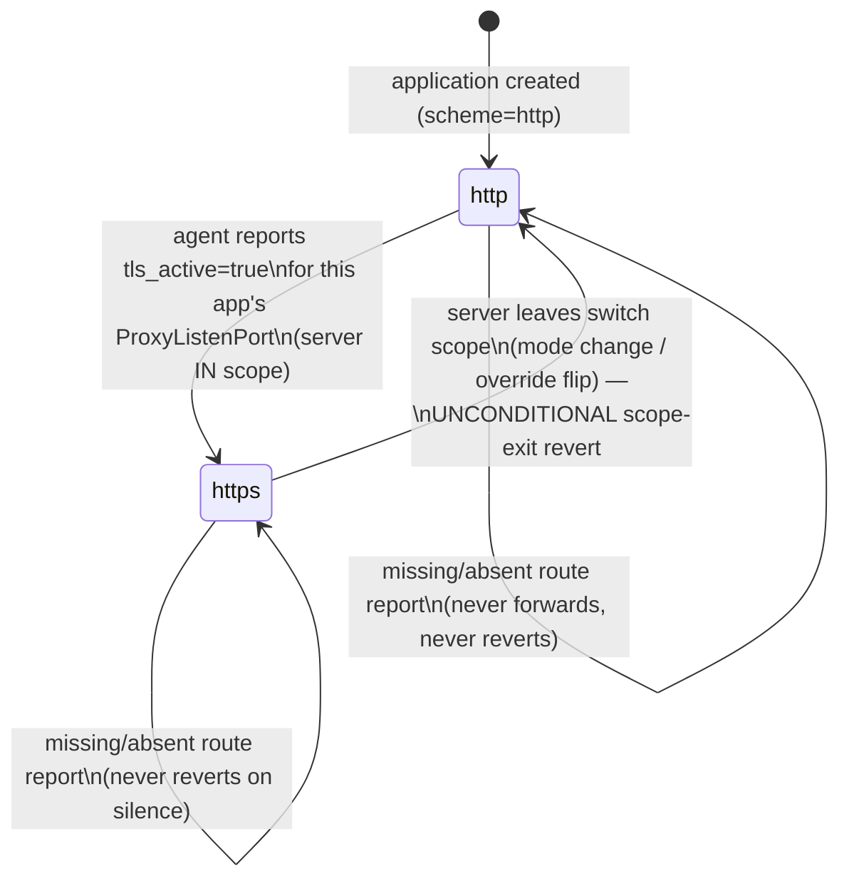
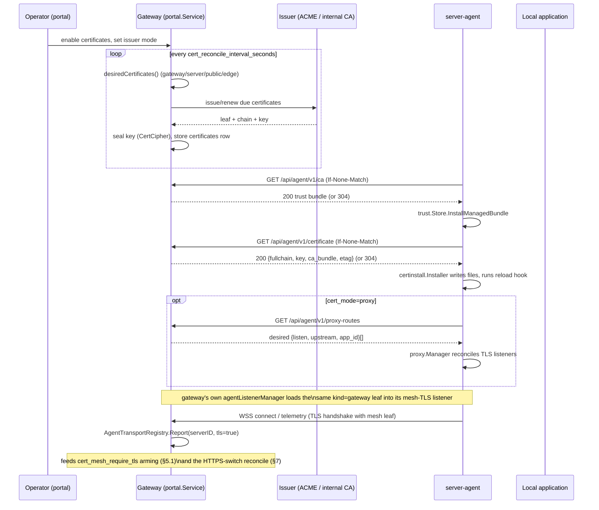

# Certificates & TLS

How the gateway issues, rotates, and distributes X.509 certificates for two
**separate** trust/enforcement surfaces — the public-facing edge and the
internal NetBird mesh — and how a `server-agent` uses what it receives to
terminate TLS itself.

Everything here is optional and additive: with the certificate module off,
the gateway and every server behave exactly as they did before it existed
(plain HTTP on the mesh, whatever TLS the operator's own fronting proxy
provides at the edge).

## 1. Two separate enforcement surfaces

The **public listener** (what nginx/a fronting proxy terminates for
browsers and API clients) and the **mesh listener** (the gateway's own
`http.Server` bound to its NetBird IP, see
[Networking & Mesh](networking-mesh.md) §8) are independently configured,
independently gated, and independently observed. Nothing about arming one
plaintext-refusal gate affects the other — a deployment can require HTTPS at
the edge while still running an unencrypted mesh (not recommended), or vice
versa.

`internal/portal/service_certificates.go`'s `desiredCertificates` computes
one `certificates` row per **kind**:

| Kind | Domain | Issued for | Consumed by |
|---|---|---|---|
| `gateway` | the gateway's own mesh FQDN (or its NetBird peer IP as an extra SAN, self-signed mode) | the gateway's own mesh listener | `cmd/gateway`'s `agentListenerManager` (§5) |
| `server` | each NetBird-enabled server's domain | that server's `server-agent` | `GET /api/agent/v1/certificate` (§4) |
| `edge` | the operator-configured public-facing name(s) | the fronting reverse proxy (nginx) | `DeliverEdgeCertificate` writing `edge-fullchain.pem`/`edge-key.pem` (§2) |
| `public` | operator-opted-in public domains | external clients of a server reached directly (not through the gateway) | `GET /api/system/certificates/public/{domain}/bundle\|key` |

A `server` row is only wanted when the server actually has an agent token
(`serverHasAgentToken`) — otherwise nothing could ever fetch it — and a
missing token *keeps* a still-valid certificate alive with the reason
recorded, rather than silently dropping the row.

## 2. Issuers

Every kind resolves its **own** issuer mode independently
(`CertSettings.modeFor(kind)`): the internal names follow the global
`cert_issuer_mode`; the `edge` and `public` rows have their own
(`cert_edge_issuer_mode` / `cert_public_issuer_mode`), defaulting to the
global mode until an operator sets them explicitly (byte-neutral migration).

| Issuer | Package | Notes |
|---|---|---|
| `acme` | `internal/certissue/acme.go` (`golang.org/x/crypto/acme`, HTTP-01) | Needs a reachable port 80 and a real DNS name. `RetryBackoff` reproduces the library's own exponential-backoff-with-jitter for every retriable status **except** 429, which fails fast instead of blocking the reconcile pass on the CA's cooldown. |
| `self_signed` | `internal/certissue/selfsigned.go` | The gateway's own internal CA (ECDSA P-256, 10-year root validity). A leaf's validity is clamped to never outlive its issuing root. |

Each issuance context can also run its **own** ACME account
(`cert_edge_acme_shared` / `cert_public_acme_shared`, each `false` pointing
at its own directory URL, email, and weekly-order limit) instead of the
global one — the mechanism that unifies public-domain issuance with the
internal/edge accounts without forcing them to share a rate-limit budget or
an operator identity.

`ReconcileCertificates` (`cmd/gateway/cert_reconcile.go` drives it on
`cert_reconcile_interval_seconds`, floored at 60s, plus an immediate extra
pass whenever certificate settings change) places at most **5** new ACME
orders per pass — a hard code constant, not a setting, so a misconfiguration
can never burn Let's Encrypt's weekly duplicate-certificate limit in one
tick — under a 10-minute pass deadline (capped, never below 2 minutes, so a
successful order is never abandoned between the CA issuing it and the
gateway persisting it).

## 3. The public edge

The gateway does not terminate the public listener's TLS itself in the
compose/nginx deployment — it **feeds** nginx the material and observes what
scheme actually reached it.

- **Delivery.** `DeliverEdgeCertificate` writes `edge-fullchain.pem` /
  `edge-key.pem` into the shared volume
  (`OP_AI_GATEWAY_CERT_EDGE_OUTPUT_DIR`); `deploy/nginx-cert-entrypoint.sh`
  polls the chain's fingerprint and reloads nginx. On a fresh deploy (module
  off, or before the first reconcile pass) the frontend image's entrypoint
  writes a throwaway bootstrap pair so nginx has something loadable — a
  verifying upstream proxy correctly rejects that placeholder.
- **Operator endpoints** (`internal/gateway/edge_certificates.go`, all
  system-scope):

  | Endpoint | Purpose |
  |---|---|
  | `GET /api/system/certificates/edge` | Status + timing + `require_https`/`https_observed` live gate state (§3.1). |
  | `GET .../edge/bundle` | The full chain (public material only — always allowed). |
  | `GET .../edge/key` | The private key — see the access-control note below. |
  | `POST .../edge/probe` | A synthetic TLS-only self-probe against the gateway's own edge listener, reporting the cause on failure (unreachable / still-bootstrap / name-mismatch / untrusted-chain / expired) rather than a bare pass/fail. |
  | `GET .../edge/proxy-config` | The generated nginx config text for the fronting proxy. |
  | `POST .../edge/reissue` | Marks only the edge row due for the next pass. |
  | `POST .../reissue-all` / `.../renew` | Fleet-wide re-issue-now / clear-backoff-now, for an issuer-mode switch or a stuck domain. |

  `GET .../edge/key` is the **one** endpoint in the gateway that hands out a
  private key over the network at all: gated to an elevated `system` scope
  no API token can ever hold, refused with `409` whenever the gateway can
  already write the key to its own nginx (the key travels only when there is
  no safer local path), and every successful call emits one audit
  `slog.Warn` naming the caller — never the key.

### 3.1 The require-https gate (`edge_scheme.go`)

`cert_edge_require_https` is a runtime switch that refuses plaintext on the
public listener — but only while there is *live evidence* the fronting proxy
actually speaks TLS, so the gate cannot brick the gateway on its own:

- Nginx sets `X-OP-Edge-Scheme` from `$scheme` in **every** header-setting
  block (overwriting any client-supplied value), which is what makes it
  trustworthy — unlike `X-Forwarded-Proto`, which a client can set and nginx
  merely passes through.
- **Arming precondition** (`ArmEdgeRequireHTTPS`, checked only when turning
  the switch *on*): an encrypted request must have been observed within the
  last 5 minutes, **and** the very request doing the arming must itself have
  arrived encrypted — closing the "arm on a stranger's traffic, get refused
  by your own next request" failure mode.
- **Enforcement**: refuses only while *all* of — the switch is on, the
  request is plaintext, the path is not `/healthz` / the ACME challenge /
  `/api/agent/v1/*` / an internal loopback caller, **and** an encrypted
  request was seen within the same 5-minute window. If the fronting proxy's
  TLS listener dies, the window lapses and the gate **extinguishes itself**
  back to serving plaintext rather than locking the operator out.
- `GET`/`HEAD` get a `307` redirect to the `https://` form (method-preserving,
  `Cache-Control: no-store` — never a `301`, which a browser would cache past
  a later disarm); every other method gets `403 certificate.https_required`.
- An `OP_AI_GATEWAY_CERT_EDGE_REQUIRE_HTTPS_DISABLE` env kill switch bypasses
  the gate unconditionally, for the one scenario the gate itself cannot fix.

## 4. The internal CA and agent certificate issuance

In `self_signed` mode the gateway runs an internal CA that signs every
`gateway`/`server` leaf:

- **Rotation.** `POST /api/system/certificates/ca/rotate` (`RotateCertificateCA`)
  generates a fresh root; leaves are re-signed by the *following* reconcile
  passes (an issuer-fingerprint mismatch), so the new root is published and
  propagated **before** anything is ever signed with it. A running reconcile
  pass holds the same lock via `TryLock` — a conflicting rotate request gets
  an immediate `409`, never a multi-minute hang.
- **Overlap.** `CertificateCABundlePEM` keeps serving the *previous* root
  alongside the current one for as long as it remains unexpired, so a client
  that has not yet refreshed its trust bundle keeps validating already-issued
  leaves.
- **Propagation gate.** `GatewayCARotationPendingServers` /
  `MeshTLSPendingServers` name every server whose reported trust state (or
  latest mesh hop) has not caught up yet, feeding the confirm dialogs before
  an operator forces a reissue or arms the mesh require-tls gate.

**Agent-facing endpoints** (`internal/gateway/agent_ca.go`,
`agent_certificates.go` — agent-token authenticated, on *both* the public
mux (`netbird_only`-gated) and the mesh agent mux):

| Endpoint | Serves |
|---|---|
| `GET /api/agent/v1/ca` | The public trust bundle only (validated: every PEM block must be a CA certificate — never a leaf, never a key). |
| `GET /api/agent/v1/certificate` | This server's leaf chain, **private key**, and trust bundle. |

Both support conditional `GET` (`If-None-Match`); the certificate endpoint's
ETag covers **both halves** deliberately — a leaf-only validator would make
a CA rotation invisible, because rotation publishes the new root *before*
re-signing any leaf, so the leaf fingerprint alone would still 304. Both
responses are `Cache-Control: no-store`, and a successful certificate fetch
logs exactly one audit line (fingerprint, domain, expiry — never the key).
`ErrCertificateNotFound` on either path is a plain "nothing to install right
now" `404`; the agent's own installer treats that as "leave existing files
alone," never as a revocation signal.

## 5. The mesh-TLS listener

The gateway's second `http.Server` (§1 of
[Networking & Mesh](networking-mesh.md)) serves either a **combined**
sniffing socket or a **separate** dual-listener pair, selected by
`cert_mesh_tls_mode`:

- **Combined** (default): one socket; a connection's first byte decides
  plaintext vs. TLS (`0x16` upgrades in place). The TLS side is served from a
  `certHolder` — an `atomic.Pointer[tls.Certificate]` swapped by every
  successful `GatewayMeshCertificate` refresh, read lock-free by every
  handshake.
- **Separate** (`OP_AI_GATEWAY_AGENT_TLS_SEPARATE` / the runtime setting): a
  dedicated **plain-only** bind at `AGENT_ADDR`/`AGENT_PORT` and a dedicated
  **TLS-only** bind (`tls.NewListener` — structurally incapable of accepting
  plaintext) at `AGENT_TLS_ADDR`/`AGENT_TLS_PORT` (default `8443`), brought
  up only once mesh certificate material exists.

A cert-read failure never downgrades a live TLS bind to plaintext or drops
it — the last-good leaf keeps serving until a fresh one is available.

### 5.1 The mesh require-tls gate (`agent_mesh_gate.go`)

`cert_mesh_require_tls` is the mesh-listener analogue of the edge gate (§3.1),
with one deliberate asymmetry: **enforcement is not tied to a fresh
observation window.** Once armed, the gate refuses plaintext on
`/api/agent/v1/*` unconditionally until an operator disarms it — a mesh gate
that reopened the moment TLS observation lapsed would open exactly when
something is actively breaking TLS. Only *arming* requires evidence: at least
one server must have authenticated over TLS on the mesh listener within the
last 5 minutes (`AgentTransportRegistry.AnyTLSWithin`, populated only from
the mesh path — a public-listener request would misrepresent the true agent
hop). The accepted, documented cost: an armed gate plus an expired gateway
leaf can lock the whole fleet out, recoverable only by the operator (via the
kill switch `OP_AI_GATEWAY_CERT_MESH_REQUIRE_TLS_DISABLE` or the portal).

## 6. The agent-side TLS-terminating reverse proxy (`cert_mode=proxy`)

A `server-agent` configured with `cert_mode=proxy` does everything
`cert_mode=files` does — install the fetched material as files under
`cert_dir` and run `cert_reload_command` on a real change — **and**
additionally runs its own TLS-terminating reverse proxy
(`server-agent/internal/proxy`) in front of the local application.

- **Route derivation.** `Service.AgentProxyRoutes`
  (`GET /api/agent/v1/proxy-routes`) hands the agent a **data-only** list of
  `{listen, upstream, app_id}` — never a command. Only applications that are
  actual https-auto-switch candidates (§7) on an in-scope server get a
  listener; each gets a stable `ProxyListenPort` assigned once
  (`routing.AssignProxyListenPort`, lowest free port ≥
  `cert_proxy_listen_port_base`, default `8600`) and persisted so it never
  churns across polls.
- **The proxy itself** (`proxy.Manager`) binds a TLS listener **per route** on
  the address derived from the installed leaf's own SAN (never
  all-interfaces — a mesh-terminating proxy must bind exactly where mesh
  peers reach it) and reverse-proxies decrypted traffic to the plaintext
  upstream (`http://127.0.0.1:<app-port>`). Reconciliation mirrors the
  gateway's own listener-generation discipline: a route whose upstream
  changed, or that is no longer desired, drains off-lock (bounded 3s grace)
  while the accept loop for a replacement can rebind the just-freed port
  immediately.
- **The in-process upstream.** One upstream is *not* dialled: a route whose
  upstream is a **loopback** target (`http://127.0.0.1:<port>`, no path, no
  query) on the port the agent's **own runtime router** is currently published
  on is handed to that router's `http.Handler` **in process**
  (`proxy.Manager.SetLocalUpstream`, wired in `server-agent/main.go` to
  `runtime.Driver.LocalRouter`). For that one route the upstream string stops
  being an *address* and becomes a *route key* the agent resolves locally.
  This exists because the two ends disagreed: the gateway hard-wires every
  upstream to `http://127.0.0.1:<app.Port>`, while under `cert_mode=proxy` the
  runtime router binds the agent's **mesh identity** (§4.6 of
  [`agent-runtime-manager.md`](agent-runtime-manager.md)), so nothing listened
  on that loopback address and every proxied request to a `server_agent`
  application was a `502` — one that could never self-heal, because the proxy
  listener itself *was* up, so the agent kept reporting `tls_active=true` and
  the switch reconcile never reverted. The predicate
  (`proxy.loopbackUpstreamPort`) is a **security boundary** and is deliberately
  narrow — plaintext `http`, no opaque/userinfo/fragment, empty or `/` path, no
  query, host exactly `localhost` or a loopback IP literal, an explicit port in
  1..65535 — because a false positive diverts a request meant for another host
  into this agent's router, while a false negative merely dials, as before.
  The resolution happens **per request**, not once at listener start: the route
  set arrives on the certificate cadence and the router port on the runtime
  cadence, so a one-shot decision would freeze whichever won that race. No
  gateway change, no wire-format change, no feature negotiation.
- **Local override.** `cert_proxy_routes` + `cert_proxy_routes_mode`
  (`fallback`/`override`) let an operator add or override routes the gateway
  did not send, merged by listen port.
- **Observed status.** `Manager.Status()` feeds the agent's telemetry sample
  (`proxy_routes`), which the gateway's `AgentProxyStatusRegistry` records —
  the input the switch reconcile (§7) uses to decide whether it is safe to
  route traffic to the proxy port yet.

## 7. Automatic HTTPS switch of applications

`cert_https_switch_mode` decides, fleet-wide, whether the gateway may flip an
application between plain HTTP and gateway-guided proxied HTTPS on its own:

| Mode | Effect |
|---|---|
| `manual` (default) | Never forwards. (Still runs the fleet pass — see scope-exit below.) |
| `auto` | Every server is in scope **except** one explicitly overridden `exclude` (`HTTPSSwitchOverride`, opt-out). |
| `selected` | Only a server explicitly overridden `include` is in scope (opt-in). |

A server's `HTTPSSwitchOverride` is a single three-valued column
(`""`/`include`/`exclude`) rather than two booleans — deliberately, so a
mode flip can never resurrect a stale flag from the opposite mode.

`ReconcileHTTPSSwitch` (`internal/portal/service_https_switch.go`, riding the
same cadence as the certificate pass, own short deadline) implements this
per server:

- **In scope**: forward `http → https` only on an **explicit** reported
  `tls_active:true` for the app's exact `ProxyListenPort`. An explicit
  `tls_active:false` is **declined, never reverted** (§7.1). A *missing* route
  in the snapshot (the agent never reported, or reported an empty set) is
  neither — an agent that merely went quiet must never have its already-working
  switch torn down.
- **Out of scope** (an excluded/non-included server, or the whole fleet
  under `manual`): every proxy-switched `https` application is reverted to
  `http` **unconditionally**, without consulting the proxy-status snapshot at
  all. This is deliberate and load-bearing: leaving scope makes
  `AgentProxyRoutes` return an **empty** route set for that server, so the
  agent drains and closes its TLS listeners — a teardown that is otherwise
  *indistinguishable* from an agent that merely went silent (both look like
  "missing route" to the status-driven pass above). Without the unconditional
  scope-exit revert, a single `auto → manual` toggle would strand every
  already-switched application pointing at a now-dead proxy port — refused by
  both real traffic and the health probe, dropping it from routing
  fleet-wide with no auto-recovery. Because the gateway itself tore the route
  down, reverting is a deliberate gateway decision, not a guess about a
  silent agent.
- This is why `manual` mode still enumerates the whole fleet each pass: it
  can never forward, but it must still be able to revert a switch a prior
  `auto`/`selected` run left standing.

An application is only ever a **candidate** for this machinery when it is
enabled and either plain `http`, or already proxy-switched `https` with a
non-zero `ProxyListenPort` — an application manually set to `https` with no
proxy port runs its own TLS and is left alone by both the route derivation
(§6) and this reconcile.

### 7.1 No automatic downgrade to plaintext

**The gateway never switches an application to unencrypted `http` because TLS
broke.** An explicit `tls_active:false` for a proxy-switched application's
`ProxyListenPort` leaves it on `https`. It becomes unreachable until TLS works
again or an operator changes it deliberately.

This reverses the original behaviour, which flipped the application back to
plaintext so a broken certificate degraded instead of outaging — and did it
with **no log line, no audit event and nothing in the portal**: the only
evidence was the scheme column. Operator decision, and the right one for a
system whose whole point is that inference traffic is encrypted: an automatic
switch to unencrypted is a security problem, not a mitigation.

The price is availability, and it is paid honestly. The failure is **not**
allowed to be silent either — swapping a silent downgrade for a silent outage
is the same defect facing the other way — so the declined revert is loud in two
independent places:

- a `Warn` on **every** pass that observes it, naming the server, the
  application, the port, the agent's own reason and the remedy. Every pass, not
  only the first: the reconcile cadence is 15 minutes by default, so this is a
  recurring reminder rather than one line that scrolls away, and it needs no
  transition state that could get stuck in "already reported".
- `Service.HTTPSSwitchUnreachableApps`, returned by `GET
  /api/system/certificates` under `https_switch.unreachable_apps` and rendered
  by the portal's certificate view as an **error** alert. It is *derived* from
  the same three inputs the reconcile reads (mode, applications, proxy-route
  status) rather than from a side table the reconcile writes — the same
  reasoning `GatewayCARotationPendingServers` gives for reusing
  `gatewayTrustPropagation`: a view and a reconcile with separate opinions of
  one condition eventually disagree, and the operator cannot tell which is
  lying.

The reason comes from the agent's own `RouteState` vocabulary
(`pending_leaf`, `bind_failed`, `pending_bind_host`, `invalid_upstream`),
relayed verbatim and never re-invented gateway-side. The agent had always sent
it in `proxy_routes[].state`; the gateway decoded only `listen` + `tls_active`
and dropped it. It is decoded now, because once the gateway refuses to
downgrade, *why* the listener is down is the whole content of the alert it
raises instead. Each state maps to an instruction
(`httpsSwitchUnreachableAction`) so the message says what to do, not only what
happened; an unrecognised or absent state falls back to a generic remedy rather
than to silence.

Recovery needs no action: the application was never moved, so when the agent's
listener returns it simply works again. There is no forward switch to re-run
and no window in which it is briefly plaintext.

**The scope-exit revert (§7, out of scope) is the one automatic move to
plaintext that survives this, and it is kept on purpose.** The difference is
the operator. On a `tls_active:false` report nobody asked for anything — a leaf
expired, a port got taken — and answering an environment failure by turning
encryption off is exactly what the policy forbids. A scope exit is an explicit
portal action whose documented and only effect is "this server no longer runs
the gateway-guided TLS proxy": the gateway itself then withdrew the routes and
the agent tore the listeners down, so the revert completes the operator's own
instruction. And the alternative is strictly worse here — left on `https` the
application points at a port that is genuinely gone, with **no path back** (the
status-driven pass does not run for an out-of-scope server, a torn-down route
is *missing* rather than an explicit false, and there is no `proxy_listen_port`
field in the portal UI, so the rescue is API-only). That is a permanent outage
from a routine narrowing action, not a recoverable one. It is no longer silent
either: it logs a `Warn` naming the application and saying that its traffic is
now unencrypted.

## 8. CA-trusting outbound transport (server-agent)

Every outbound call the `server-agent` makes to the gateway — telemetry
POST/WS, certificate/CA fetch, proxy-routes poll — goes through
`server-agent/internal/trust.Store`, which combines the OS root pool with
every configured trust source (an operator-supplied CA file, `cert_dir`'s own
`ca.pem`, an inline PEM, and the gateway-managed cache installed by
`trust.Refresher` polling `GET /api/agent/v1/ca`) into one live
`x509.CertPool`, rebuilt on any source change and swapped into a fresh
`*http.Transport` (separate HTTP/2 and HTTP/1.1-only-for-WebSocket variants)
behind a generation counter — so a CA rotation (§4) takes effect for every
in-flight client without a restart.

`InsecureSkipVerify` is wired to exactly one place: the explicit
`OP_AGENT_TLS_INSECURE` escape hatch, off by default. Nothing in the normal
CA-trust or certificate-fetch path ever sets it — the trust store is the only
sanctioned way to make an agent accept the gateway's certificate.

## 9. Certificate encryption at rest

Every certificate **private key** the gateway persists — a `server`/`gateway`
leaf key, the internal CA's own key, and the ACME account key — is sealed
with the same certificate cipher (`OP_AI_GATEWAY_CERT_ENCRYPTION_KEY`, a
64-character hex AES-256 key; distinct from the capture-payload cipher). A
disk-backed store (SQLite/PostgreSQL) with no key configured **refuses** to
seal anything (`ErrCertKeyRequired`), surfaced as an actionable `400
system.cert_key_required` rather than an opaque `500` at every write site
that would otherwise need one (CA rotation, edge-key read, agent-certificate
read). A volatile in-memory store has no such restriction — there is nothing
to protect at rest. The public half of every certificate is never sealed and
never needs to be; only the DTOs are guaranteed key-material-free by
construction (pinned by a regression test), independent of this seal.

## 10. Certificate issuance and mesh-TLS handshake (sequence)

## 11. Configuration reference

| Env var | Default | Governs |
|---|---|---|
| `OP_AI_GATEWAY_CERT_ENCRYPTION_KEY` | unset | Seals every certificate private key at rest (§9); required on a disk-backed store. |
| `OP_AI_GATEWAY_CERT_EDGE_OUTPUT_DIR` | unset | Where the gateway writes `edge-fullchain.pem`/`edge-key.pem` for nginx (§3). |
| `OP_AI_GATEWAY_CERT_EDGE_PROBE_TARGET` | unset | Address the edge self-probe (§3) dials; unset ⇒ `409`, not `500`. |
| `OP_AI_GATEWAY_CERT_EDGE_REQUIRE_HTTPS_DISABLE` | `false` | Kill switch for the edge require-https gate (§3.1). |
| `OP_AI_GATEWAY_CERT_MESH_REQUIRE_TLS_DISABLE` | `false` | Kill switch for the mesh require-tls gate (§5.1). |
| `OP_AI_GATEWAY_CERT_RECONCILE_INTERVAL_SECONDS` | `900` (floor 60) | Certificate + HTTPS-switch reconcile cadence. |
| `OP_AI_GATEWAY_AGENT_TLS_SEPARATE` / `_ADDR` / `_PORT` | `false` / unset / `8443` | Mesh-TLS listener topology (§5). |
| `OP_AGENT_CERT_MODE` | `off` | `off` \| `files` \| `proxy` (§6) — agent-side installer/proxy behavior. |
| `OP_AGENT_CERT_DIR` / `_CERT_POLL_INTERVAL` / `_CERT_RELOAD_COMMAND` | — | Where/how often/what to run on install (agent side). |
| `OP_AGENT_CA_FILE` / `_CA_CACHE_FILE` / `_CA_PEM` / `_TLS_INSECURE` | — | Additive trust sources + the explicit insecure escape hatch (§8). |

See [Configuration](configuration.md) for the full variable list.

## Related chapters

- [Networking & Mesh (NetBird)](networking-mesh.md) — the mesh transport and
  the gateway's own agent listener this chapter's mesh certificates serve.
- [Security, Authentication & Authorization](security-auth-rbac.md) — the
  `system` scope guarding key-bearing endpoints, and agent-token
  authentication.
- [Routing & Model Selection](routing-and-model-selection.md) — how a
  proxy-switched application's `ProxyListenPort` becomes the routed origin
  (`ApplicationEndpoint`).
- [Deployment View](../07-deployment-view.md) — the nginx/compose/Kubernetes
  topologies the edge-certificate delivery mechanism assumes.
