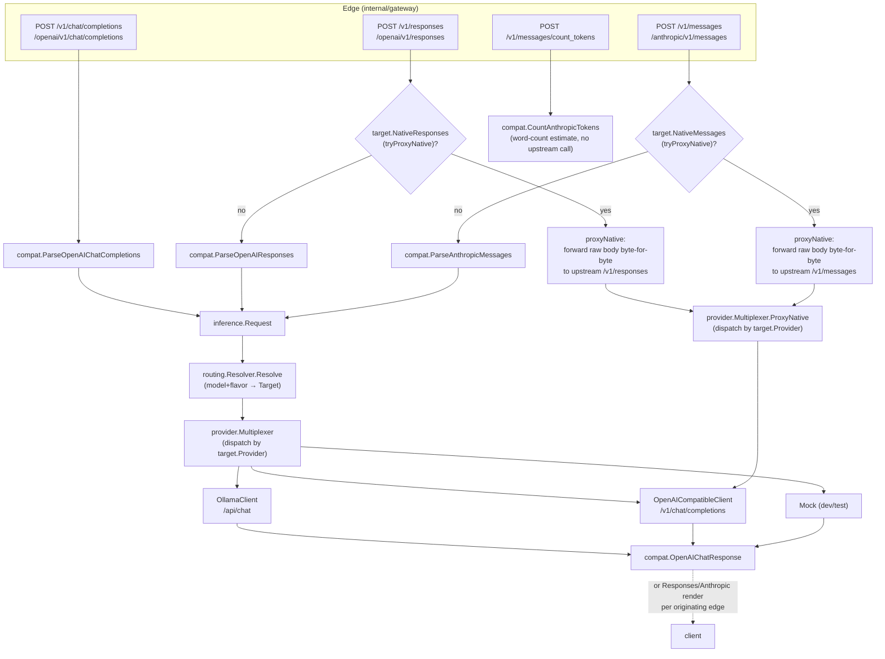
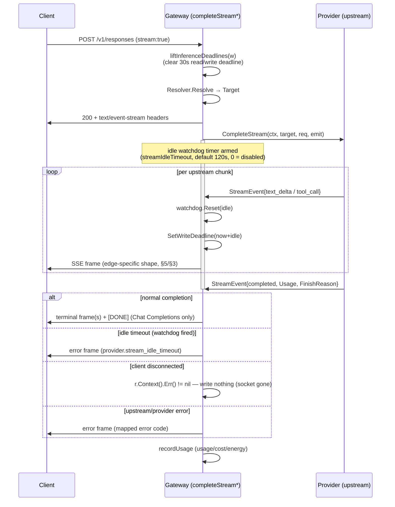

# API Compatibility & Inference

How OnPrem AI Gateway speaks three client protocols (OpenAI, OpenAI Responses,
Anthropic Messages) and two upstream dialects (Ollama, OpenAI-compatible) through
one provider-neutral internal model, and how streaming, tool-calling, multimodal
bodies, and model discovery are kept consistent across all of them.

## 1. The provider-neutral inference model

Every client request — regardless of which wire protocol it arrived on — is
parsed into one Go type before anything else happens: `inference.Request`
(`internal/inference/types.go`). It is the sole boundary between "edge" code
(protocol parsing/rendering) and "provider" code (upstream HTTP dialects); no
provider client ever sees a raw client body, and no edge handler ever builds an
upstream HTTP request directly.

| Field | Purpose |
|---|---|
| `APIFlavor` | fine-grained source protocol: `openai_chat_completions`, `openai_responses`, `anthropic_messages` |
| `Model` | the gateway model name (post model-override) |
| `RequestedModel` | the client's original model name, pre-override; recorded on the usage event |
| `Messages []Message` | role + `[]ContentPart` (text/image/tool_result) + optional `ToolCalls`/`ToolCallID`/`Reasoning` |
| `Tools []Tool`, `ToolChoice any` | tool definitions; `ToolChoice` is forwarded upstream verbatim |
| `Stream`, `IncludeUsage` | streaming flag; OpenAI `stream_options.include_usage` |
| `MaxTokens`, `Temperature`, `Stop`, `ReasoningEffort` | sampling parameters, forwarded when set |
| `ClientSessionID`, `SessionSource`, `AgentID` | best-effort session continuity signal (§4) |
| `ServerOverrideID`, `ServerOverrideForceUnreachable` | pins routing to one AI-server (re-authorized per request; see [Routing & Model Selection](routing-and-model-selection.md)) |

`Message.Content` is `[]ContentPart{Type: text|tool_result|image, ...}` — a
message can carry text, one or more images, and (on a tool-result message) is
keyed by `ToolCallID`. `ToolCall.Arguments` is always the **raw JSON string**
exactly as produced by the model or sent by the client — every edge round-trips
it as a string rather than re-parsing, so no argument payload is ever mangled by
re-serialization.

The response side is the mirror: `provider.Response{Text, Usage, ToolCalls,
Reasoning, FinishReason}` (`internal/provider/mock.go`) for a buffered call, or a
sequence of `inference.StreamEvent{Type: text_delta|tool_call|completed|error,
...}` for a streamed one. `inference.Usage` normalizes token accounting to
OpenAI semantics: `InputTokens` **includes** the cached subset;
`CachedTokens`/`CacheWriteTokens` break out the Anthropic-only cache read/write
counts as a subset — `compat.AnthropicInputTokens` (`internal/compat/anthropic.go`)
is the one place that inverts this back to Anthropic's own (cache-exclusive)
convention.

## 2. Edge → translate/native → provider dispatch



Each of the three POST inference edges (chat completions, Responses, Messages)
funnels into exactly one `inference.Request`, one `Resolver.Resolve` call, and
one `provider.Multiplexer` dispatch — the multiplexing is entirely by
`target.Provider` (`internal/provider/multiplexer.go`), never by the client's
`APIFlavor`. That is what makes every upstream (Ollama, vLLM, llama.cpp,
llama-swap, LiteLLM) reachable from every client protocol: a Claude Code session
can be served by an Ollama-backed mapping, and a Codex session by a vLLM one,
with no special-casing.

`routing.NormalizeAPIFlavor` (`internal/routing/resolver.go`) reduces the three
fine-grained `APIFlavor` strings to the two coarse buckets (`openai`,
`anthropic`) that a `model_mapping`'s application declares support for — see
[Routing & Model Selection](routing-and-model-selection.md) for how a mapping is
selected. **The Codex/generic-OpenAI split is by ENDPOINT, not by flavor**:
`/v1/chat/completions` and `/v1/responses` both normalize to `openai`, but they
are two distinct handlers (`handleOpenAIChat` / `handleOpenAIResponses`,
`internal/gateway/inference_handlers.go`) reachable at two distinct paths, and the session
extractor (§4) discriminates them by `sessionEndpoint`
(`internal/gateway/session_extract.go`) for exactly this reason.

## 3. Endpoints

| Client protocol | Endpoint(s) | Handler | Auth | Native passthrough |
|---|---|---|---|---|
| OpenAI Chat Completions | `/v1/chat/completions`, `/openai/v1/chat/completions` | `handleOpenAIChat` | `requireWebAnyScope` (session cookie **or** bearer) | none — always translated |
| OpenAI Responses (Codex) | `/v1/responses`, `/openai/v1/responses` | `handleOpenAIResponses` | `requireAnyScope` (bearer only) | `Application.NativeResponses` |
| Anthropic Messages (Claude Code) | `/v1/messages`, `/anthropic/v1/messages` | `handleAnthropicMessages` | `requireAnyScope` (bearer only) | `Application.NativeMessages` |
| Anthropic token count | `/v1/messages/count_tokens`, `/anthropic/v1/messages/count_tokens` | `handleAnthropicCountTokens` | `requireAnyScope` (bearer only) | n/a — never calls an upstream |
| OpenAI model discovery | `/v1/models`, `/openai/v1/models` | `handleOpenAIModels` | `requireAnyScope` | n/a |
| Anthropic model discovery | `/anthropic/v1/models` | `handleAnthropicModels` | `requireScope("gateway:use")` | n/a |
| LM Studio-shaped discovery | `/api/v0/models` | `handleLMStudioModels` | `requireScope("gateway:use")` | n/a |

`requireAnyScope` accepts **either** a normal `gateway:use` principal **or** a
service token's sole `llm:invoke` scope (service accounts); `requireWebAnyScope`
additionally accepts the portal session cookie (+ CSRF header on state-changing
methods) — `/v1/chat/completions` is deliberately the one inference endpoint
reachable that way (§9). All bodies are read with `readRawJSONUnlimited`
(§7); all four POST endpoints call `liftInferenceDeadlines` before reading the
body (§6).

### 3.1 OpenAI Chat Completions

`compat.ParseOpenAIChatCompletions` (`internal/compat/openai.go`) handles the
standard `messages` array (string or typed-block content, `image_url` blocks)
plus the **tool-call replay shape** a coding agent (e.g. opencode) sends on
turn 2+: an assistant message with `content: null` and a `tool_calls` array,
followed by a `role:"tool"` result message keyed by `tool_call_id`. Content is
required on every message *except* such a tool-call turn or a tool-result
message (`parseChatMessageContent`'s `contentOptional`).

### 3.2 OpenAI Responses — Codex continuity

`compat.ParseOpenAIResponses` accepts both the simple string `input` and the
full Responses `input` array: `message`, `function_call`,
`function_call_output`, and `reasoning` items, tolerantly skipping item types it
does not model (built-in tool items, images inside message content, …) rather
than rejecting the request. Two behaviors are specific to Codex continuity:

- **Reasoning replay.** A replayed `reasoning` item (Codex echoing the model's
  prior chain-of-thought) is buffered and attached to the assistant output it
  precedes (`function_call` or `message`) as `Message.Reasoning`, which the
  OpenAI-compatible provider client threads to the upstream as
  `reasoning_content` — this is how a reasoning model (llama.cpp / harmony)
  keeps continuity across a multi-turn agent loop.
- **Parallel tool calls.** Consecutive `function_call` items are merged into
  one assistant message with a `ToolCalls` array (not one message per call), so
  the upstream chat history is always the strict
  `assistant(tool_calls…) → tool… → user` shape a Chat Completions upstream
  expects.

Rendering the non-stream reply (`compat.OpenAIResponsesResponse`) emits, in
order: a `reasoning` output item (if the model reasoned), then a `message`
item (if there is text, or always when there are no tool calls), then one
`function_call` item per tool call.

### 3.3 Anthropic Messages — Claude Code thinking, stop_reason, cache

`compat.ParseAnthropicMessages` (`internal/compat/anthropic.go`) handles
Claude Code's full multi-turn shape: string-or-array `system`, `text` /
`image` / `tool_use` / `tool_result` / `thinking` content blocks, flat `tools`
(`input_schema`, not `parameters`), and `tool_choice`
(`auto`→`"auto"`, `any`→`"required"`, `none`→`"none"`,
`tool`→`{"type":"function","function":{"name":…}}`). A `tool_result` block
(which Anthropic nests inside a `user` message) is split out into its own
`tool`-role message emitted *before* the parent message, matching the
Chat-Completions-canonical `assistant(tool_calls) → tool(result) → user(text)`
ordering. An image block's `source` becomes a `data:<mime>;base64,…` URI (or is
passed through for a `url` source).

**Thinking.** A replayed `thinking` block's text becomes `Message.Reasoning`
(the same field Codex reasoning replay uses) — the Anthropic analog of the
Responses reasoning path. `thinking.signature` is read but never validated on
this path (the gateway never mints a real signature; only `api.anthropic.com`
does, and it is never reached here).

**stop_reason.** `compat.AnthropicStopReason` maps the upstream OpenAI
`finish_reason`: any tool call present (or `finish_reason:"tool_calls"`) →
`tool_use`; `"length"` → `max_tokens`; everything else → `end_turn`.
Anthropic's `stop_sequence` reason is **never produced** on the translate path
— over a generic Chat Completions upstream a stop-sequence match is
indistinguishable from a natural stop (`finish_reason:"stop"`); recovering it
requires native passthrough.

**Cache usage.** `AnthropicUsage.CacheReadInputTokens` is populated from
`inference.Usage.CachedTokens`; `AnthropicInputTokens(usage)` subtracts that
subset from the OpenAI-canonical `InputTokens` so the two numbers never
double-count.

Rendering (`compat.AnthropicMessageResponse`) emits content blocks in
Anthropic's required order: `thinking` (if any) → `text` (if any, or always
when there are no tool calls) → one `tool_use` block per tool call, each with
`input` reconstructed as a JSON **object** from the internal string arguments.

## 4. Session / continuity signals

`extractClientSession` (`internal/gateway/session_extract.go`) derives a
best-effort session id per request, gated by `sessionEndpoint` — **the
endpoint, not the `APIFlavor`**, since Codex (`/v1/responses`) and generic
OpenAI (`/v1/chat/completions`) share the flavor `openai`:

| Priority | Signal | Endpoint(s) |
|---|---|---|
| 1 | `X-OP-AI-Gateway-Session-ID` header (explicit override; portal chat loopback sets it to the chat id) | all |
| 2 | `session_id` header | `/v1/responses` (Codex) |
| 2 | `x-claude-code-session-id` header | `/v1/messages` (Claude Code) |
| 3 | `prompt_cache_key` body field | `/v1/responses` |
| 3 | `prompt_cache_key`, then `user`, body field | `/v1/chat/completions` |
| 3 | `metadata.user_id` body field | `/v1/messages` |
| — | `x-claude-code-agent-id` header → `AgentID` | `/v1/messages` only |

The result populates `ClientSessionID`/`SessionSource` (`header`, `chat`,
`codex`, `claude-code`, `openai`, or `anthropic`) on `inference.Request`,
which drives `client_session`-mode route affinity (see [Routing & Model
Selection §4](routing-and-model-selection.md)) and is shown in Activity/live
requests. `AgentID` is the Claude Code **subagent** id, carried separately
because one Claude Code session can fan out into several subagents sharing the
same `ClientSessionID`.

## 5. Tool-calling across edges

| Edge | Non-stream | Stream | Native passthrough |
|---|---|---|---|
| Chat Completions | `tool_calls` array on the assistant message | incremental `tool_calls` deltas (opening id/name delta, then a full-arguments delta) per OpenAI SDK accumulation shape | n/a (never native) |
| Responses (Codex) | `function_call` output item(s) | `response.output_item.added` → `response.function_call_arguments.delta`/`.done` → `response.output_item.done` per call | raw upstream `/v1/responses` body forwarded byte-for-byte |
| Anthropic Messages (Claude Code) | `tool_use` content block(s), `input` as a JSON object | `content_block_start` (type `tool_use`) → one `input_json_delta` (whole-argument fragment) → `content_block_stop` | raw upstream `/v1/messages` body forwarded byte-for-byte |

**Replay** (turn 2+ of a multi-turn tool loop) is handled per-edge: Chat
Completions replays the OpenAI shape (§3.1); Responses replays
`function_call`/`function_call_output` items, merging consecutive calls into
one assistant message (§3.2); Anthropic replays `tool_use`/`tool_result`
blocks split into separate messages (§3.3). Argument JSON is never re-parsed
or re-serialized on the way through — `ToolCall.Arguments` stays the original
string end to end, so a client's exact formatting (key order, whitespace)
survives a round trip.

**opencode.** As an OpenAI-compatible coding agent, opencode drives the plain
Chat Completions edge and is the primary tested case for the null-content
tool-call-replay shape (§3.1) and for context-window reporting: it auto-detects
a model's context window via the LM-Studio-shaped `GET /api/v0/models`
(`handleLMStudioModels`, `internal/gateway/server.go`), which reports each
gateway model's `max_context_length` (and, when currently loaded,
`loaded_context_length`) alongside an LM-Studio `state` (`loaded`/`not-loaded`)
— metadata only; chat still flows over `/v1/chat/completions`.

## 6. Native passthrough

For Codex and Claude Code, translation is inherently lossy (it can represent
only text + simple tool calls) — an application can instead be flagged
`NativeResponses`/`NativeMessages` (per-application, `internal/routing/store.go`),
in which case the gateway proxies the **raw client body** to the upstream's own
native endpoint and streams the raw response back unmodified.
`tryProxyNative` (`internal/gateway/native_passthrough.go`) makes the decision:

1. Peek `model`/`stream` from the raw body (tolerant of a malformed body — falls
   through to the translate path, which produces the proper parse error).
2. Apply the token's model override, the service-account allowlist gate, and
   the principal admission gate — at the **same** pre-`Resolve` point the
   translate path applies them, so a rejected request never resolves twice.
3. `Resolver.Resolve` the model. An admission-queue rejection here is
   **terminal** (surfaced immediately, never falls through — otherwise the
   translate path would re-queue and wait a second time).
4. If the resolved application is native-flagged for this flavor, `proxyNative`
   forwards the body (with only its `model` field rewritten to the upstream's
   mapped name — `rewriteModelField`, value-lossless but not byte-identical
   JSON); otherwise `tryProxyNative` returns `false` and the caller's translate
   handler parses and resolves again (an accepted, idempotent double-resolve —
   the one place in the gateway that happens).

The client's own bearer token is **never** forwarded upstream; only
`Content-Type` and — via `provider.WithUpstreamAuth` — the resolved
application's own per-app upstream credential (if configured) are set on the
outbound request. Usage accounting on this path is best-effort:
`parsePassthroughUsage` (`internal/gateway/native_passthrough.go`) scrapes
token counts out of the (possibly truncated, capped at `captureMaxBytes`) tee'd
response body, per-flavor (`response.usage`/`input_tokens_details.cached_tokens`
for Responses; `message.usage`/`cache_read_input_tokens`/
`cache_creation_input_tokens` for Anthropic, folded back into the
OpenAI-canonical `InputTokens`).

## 7. Streaming lifecycle



`completeStream` / `completeStreamResponses` / `completeStreamAnthropic`
(`internal/gateway/inference_complete.go`) share this machinery — the common
per-stream session (`beginStream`/`streamSession`) lives in
`internal/gateway/stream_session.go`; only the SSE frame shapes
differ:

| Edge | Frame shape | Terminal |
|---|---|---|
| Chat Completions | `data: {"object":"chat.completion.chunk",...}` | `data: [DONE]` |
| Responses | named events (`response.created`, `.output_item.added`, `.output_text.delta`, `.reasoning_text.delta`, `.function_call_arguments.delta/.done`, `.output_item.done`, `.completed`/`.failed`), each with an incrementing `sequence_number` | connection close after `response.completed`/`.failed` — **no** `[DONE]` |
| Anthropic Messages | named events (`message_start`, `content_block_start/_delta/_stop`, `message_delta`, `message_stop`) | connection close after `message_stop` — **no** `[DONE]` |

**Idle watchdog vs. total deadline.** `OP_AI_GATEWAY_STREAM_IDLE_TIMEOUT`
(default `120s`; an explicit `0`/negative value disables it — unbounded, ended
only by client disconnect) bounds *inactivity*, not total stream duration: the
watchdog timer is reset on every event the provider emits, so an arbitrarily
long but continuously-producing stream never times out. `http.ResponseController`
(`SetReadDeadline`/`SetWriteDeadline`) is used for two distinct purposes:
`liftInferenceDeadlines` clears the connection's default 30s read/write
deadline entirely for the four inference endpoints at request start (an
uncapped multimodal upload can take longer than 30s to arrive), and the streaming
handlers then re-arm just the write deadline to `now + idle` before every SSE
write — so a stalled real socket (as opposed to an idle *upstream*) is still
caught, without needing a second timer. **No provider `CompleteStream`
implementation applies a total deadline of its own** (`internal/provider/ollama.go`,
`internal/provider/openai_compatible.go`): only `Complete` (the non-streaming
path) wraps `ctx` in `context.WithTimeout(target.Timeout)`; a stream's only
cancellation source is the caller's idle watchdog or the client's own
disconnect.

The control plane (every `/api/portal/*`, `/api/admin/*`, `/api/system/*`
handler) keeps the server's default 30s `ReadTimeout`/`WriteTimeout` (60s
`IdleTimeout`) unmodified — only the inference/streaming paths, and a handful
of other genuinely long-lived responses (log/usage/benchmark SSE), lift them.

## 8. Provider clients

| Client | `internal/provider/*.go` | `Complete` | `CompleteStream` | `NativeProxyClient` | `ModelLister` |
|---|---|---|---|---|---|
| Mock | `mock.go` | echoes the request text | word-by-word chunks | canned Responses-shaped SSE | 2 fixed names |
| Ollama | `ollama.go` | `POST /api/chat` | `POST /api/chat` (stream:true, NDJSON) | — | `GET /api/tags` |
| OpenAI-compatible (vLLM, llama.cpp, llama-swap, LiteLLM) | `openai_compatible.go` | `POST /v1/chat/completions` | `POST /v1/chat/completions` (stream:true, SSE) | forwards raw body to `path` | `GET /v1/models` |

All three also implement `Prober` (reachability probe) and, where applicable,
`LoadedModelLister`/`ModelInfoProber`/`MemoryProber`/`ModelUnloader` for the
routing/capacity subsystems — out of this chapter's scope; see [Routing & Model
Selection](routing-and-model-selection.md). One `OpenAICompatibleClient`
instance is shared across vLLM, llama.cpp, llama-swap, and LiteLLM
(`cmd/gateway/main.go`) since they all speak the same OpenAI HTTP dialect; only
Ollama gets its own client for its distinct `/api/chat` NDJSON shape.

`provider.Multiplexer` (`internal/provider/multiplexer.go`) dispatches every
call by `target.Provider` (never by `APIFlavor`), with **capability-dependent
fallback semantics**:

- `Complete`/`ListModels`/`Probe`/`LoadedModels` fall back to a configured
  `fallback` client (the mock, in practice) when the provider is unknown or the
  matched client lacks that optional interface.
- `CompleteStream`/`ProxyNative` **do not** fall back on a capability mismatch
  — a resolved target that can't stream or can't proxy natively is a hard
  `provider.unavailable` error, since silently downgrading a streaming/native
  request to a different provider's behavior would be surprising.

## 9. Model discovery

| Endpoint | Shape | Filtering |
|---|---|---|
| `GET /v1/models`, `/openai/v1/models` | OpenAI `{"object":"list","data":[{"id","object":"model","owned_by":"op-ai-gateway"}]}` | `Portal.ModelsForFlavor(token, "openai")` |
| `GET /anthropic/v1/models` | Anthropic `{"data":[{"id","type":"model","display_name","created_at"}]}` | `Portal.ModelsForFlavor(token, "anthropic")` |
| `GET /api/v0/models` | LM Studio `{"object":"list","data":[{"id","object":"model","type":"llm","state","max_context_length","loaded_context_length"}]}` | `Portal.Models(token)`, unfiltered by flavor |

`ModelsForFlavor` (`internal/portal/service.go`) returns the sorted gateway
model names that have at least one **active** mapping whose application
declares that flavor, filtered to what the calling principal may see under
resource-group provisioning visibility — the list is intentionally **not**
filtered by a service token's model allowlist (discovery is unrestricted;
invocation is gated separately, §3/§6). With no routing store configured, all
three fall back to two fixed seed model names so a fresh/dev instance always
answers something.

The portal's own **Models** view (`ModelList.tsx`) is the cross-flavor
counterpart: each row's "APIs" column lists every flavor (`openai`,
`anthropic`) the model is currently routable under, alongside its loaded state,
offering servers, context size, and vision capability — one place to see, per
gateway model name, everything §1–§9 of this chapter routes around.

## 10. Request bodies and size limits

| Scope | Reader | Cap |
|---|---|---|
| The four inference endpoints (`/v1/chat/completions`, `/v1/responses`, `/v1/messages`, `/v1/messages/count_tokens`) | `readRawJSONUnlimited` | none — a large base64-encoded multimodal payload is read in full |
| Everything else (control plane: `/api/portal/*`, `/api/admin/*`, `/api/system/*`) | `readRawJSON` | `maxJSONBodyBytes` = 1 MiB (`http.MaxBytesReader`) |

This mirrors llama-swap's own behavior of proxying request bodies without a
size limit. A handful of portal endpoints that accept large-but-bounded opaque
content (chat transcripts) read uncapped too, with their own service-level cap
— unrelated to the inference size policy documented here.

## 11. Multimodal images

On the wire, an image is always a `ContentImage` `ContentPart` carrying either
a `data:<mime>;base64,...` URI or a plain URL:

- **OpenAI Chat Completions** accepts `image_url` content blocks
  (`{"type":"image_url","image_url":{"url":...}}`); the same shape is what the
  OpenAI-compatible provider client sends upstream.
- **Anthropic Messages** accepts `image` blocks with a `base64` or `url`
  `source`; `anthropicImageURL` (`internal/compat/anthropic.go`) converts a
  `base64` source into the same `data:` URI form used internally, so images
  cross flavors transparently (an Anthropic-uploaded screenshot can be served
  by a vision-capable OpenAI-compatible upstream).
- **Ollama** takes raw base64 (no `data:` prefix) in an `images` array;
  `stripDataURLPrefix` (`internal/provider/ollama.go`) strips it back out.
- The **Responses** parser is tolerant of image content inside a `message`
  item's `content` array (it is simply skipped — Codex does not send images
  today).

**Frontend capture** (`gateway/frontend/src/components/shared/imageAttach.ts`,
used by the portal chat playground's image attach control): accepts
JPG/PNG/GIF/WEBP directly (`ALLOWED_TYPES`), plus HEIC/HEIF (detected by MIME
type or a `.heic`/`.heif` filename fallback, since browsers often report an
empty type for these) via client-side conversion to JPEG using the `heic-to`
library **before** the normal validation/size checks. `heic-to` inlines the
libheif WASM decoder (~3 MB minified), so it is loaded via dynamic import on
the first HEIC upload and stays out of the eagerly loaded portal bundle. Every accepted image is
downscaled (longest edge ≤ 1568px, canvas re-encode) to keep a chat transcript
under the browser's `localStorage` quota; a 20 MB cap applies to the original
file before conversion.

## 12. In-portal chat playground

The persistent chat feature (`gateway/frontend/src/components/chat/ChatStore.tsx`,
backend `internal/gateway/chat_runs.go`) does not call `/v1/chat/completions`
from the browser. Instead:

1. The frontend `POST`s to `/api/portal/chats/{id}` (portal session, cookie +
   `X-OP-CSRF`) to start/edit a run, then opens an `EventSource` on
   `/api/portal/chats/{id}/runs/{runId}/events` for live deltas.
2. The gateway's own background run executor (`executeRun`,
   `internal/gateway/chat_runs.go`) makes a **loopback** `POST` to its own
   `/v1/chat/completions`, authenticating via the internal trusted-loopback
   header pair (`X-OP-Internal-Auth` + `X-OP-Internal-User` — checked *first* in
   `authenticateWeb`, `internal/gateway/auth.go`, and blanked by nginx at the
   public edge so an external client can never inject them), plus the same
   `X-OP-CSRF` header a direct browser call would need.
3. `/v1/chat/completions` is the one inference endpoint reachable through this
   session-authenticated path at all (`requireWebAnyScope` →
   `authenticateWeb`) — `/v1/responses` and `/v1/messages` are bearer-only
   (`requireAnyScope`) precisely because they carry `server_override` and
   run-as headers that only the gateway's own loopback caller is trusted to
   set (`applyServerOverride`'s doc comment, `internal/gateway/inference_handlers.go`).
4. The executor relays the resulting SSE deltas into the chat's own live-run
   state, which the browser's `EventSource` streams to the UI — the browser
   itself never opens a fetch stream.

## 13. Errors

Every inference error response uses the gateway-wide envelope
(`apierror.Response`, `internal/apierror/`):

```json
{"error": {"code": "provider.unavailable", "message": "...", "request_id": "req_..."}}
```

| Error code | HTTP status | Source |
|---|---|---|
| `request.*` (e.g. `request.model_required`, `openai.content_required`, `anthropic.content_unsupported`) | 400 | body failed `compat.Parse*`/`inference.Request.Validate` |
| `model.not_allowed` | 403 | service-token allowlist (§6 step 2) |
| `limit.rate_limited` / `.request_quota_exceeded` / `.token_quota_exceeded` | 429 | `PrincipalLimiter` admission gate |
| `limit.cost_budget_exceeded` | 402 | `PrincipalLimiter` admission gate |
| `server_override.forbidden` | 403 | re-authorization failure (§6) |
| `routing.no_model_route` / `routing.no_healthy_host` | 502 | no mapping / every candidate gated |
| `routing.admission_queue_timeout` / `_full` | 503 | admission queue (see [Routing & Model Selection §6.3](routing-and-model-selection.md)) |
| `provider.timeout` / `.invalid_response` / `.unavailable` | 502 | upstream call failed or returned something unparseable |
| `provider.stream_idle_timeout` | mid-stream error frame | idle watchdog fired (§7) |
| `provider.client_disconnected` | (no frame written) | client gone before/during the stream |

A rejection at any pre-`Resolve` gate (invalid body, model not allowed,
admission denied, server-override forbidden) never reaches an upstream and is
still recorded as a usage event with `status:"error"` — see [Telemetry, Usage
Analytics & Observability](telemetry-usage-observability.md).

## 14. Configuration reference

| Env var | Default | Governs |
|---|---|---|
| `OP_AI_GATEWAY_STREAM_IDLE_TIMEOUT` | `120s` | idle-inactivity watchdog for all streaming/native-passthrough responses (§7); `0`/negative disables it |

See [Configuration](configuration.md) for the full variable list.

## Related chapters

- [Routing & Model Selection](routing-and-model-selection.md) — how
  `Resolver.Resolve` turns `(model, api_flavor)` into the `routing.Target` this
  chapter dispatches on, and how model groups/affinity/capacity interact with
  an inference request.
- [Security, Authentication & Authorization](security-auth-rbac.md) — bearer
  tokens, service accounts, the portal session/CSRF model, and the
  `PrincipalLimiter` admission gate referenced in §3 and §13.
- [Telemetry, Usage Analytics & Observability](telemetry-usage-observability.md) —
  how every completed/failed/streamed request in this chapter becomes a usage
  event, and the optional encrypted payload capture threaded through
  `complete`/`completeStream*`.
