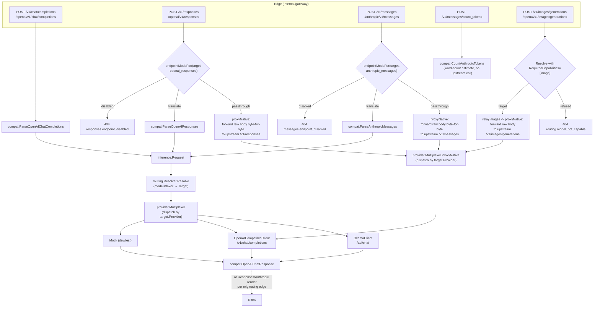
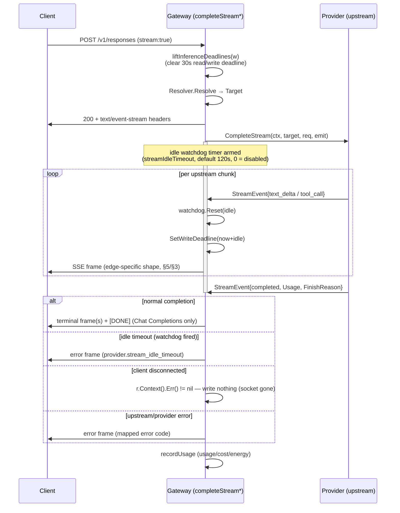

# API Compatibility & Inference

How OnPrem AI Gateway speaks three client protocols (OpenAI, OpenAI Responses,
Anthropic Messages) and two upstream dialects (Ollama, OpenAI-compatible) through
one provider-neutral internal model, and how streaming, tool-calling, multimodal
bodies, and model discovery are kept consistent across all of them.

## 1. The provider-neutral inference model

Every client request — regardless of which wire protocol it arrived on — is
parsed into one Go type before anything else happens: `inference.Request`
(`internal/inference/types.go`). It is the sole boundary between "edge" code
(protocol parsing/rendering) and "provider" code (upstream HTTP dialects); no
provider client ever sees a raw client body, and no edge handler ever builds an
upstream HTTP request directly.

| Field | Purpose |
|---|---|
| `APIFlavor` | fine-grained source protocol: `openai_chat_completions`, `openai_responses`, `anthropic_messages` |
| `Model` | the gateway model name the request is actually routed under — after the token's model-override rules, catch-all, and unknown-model redirect (see [Routing & Model Selection §2.1](routing-and-model-selection.md)) |
| `RequestedModel` | the client's original model name, before any of that; recorded on the usage event |
| `Messages []Message` | role + `[]ContentPart` (text/image/tool_result) + optional `ToolCalls`/`ToolCallID`/`Reasoning` |
| `Tools []Tool`, `ToolChoice any` | tool definitions; `ToolChoice` is forwarded upstream verbatim |
| `Stream`, `IncludeUsage` | streaming flag; OpenAI `stream_options.include_usage` |
| `MaxTokens`, `Temperature`, `Stop`, `ReasoningEffort` | sampling parameters, forwarded when set |
| `ClientSessionID`, `SessionSource`, `AgentID` | best-effort session continuity signal (§4) |
| `ServerOverrideID`, `ServerOverrideForceUnreachable` | pins routing to one AI-server (re-authorized per request; see [Routing & Model Selection](routing-and-model-selection.md)) |

`Message.Content` is `[]ContentPart{Type: text|tool_result|image, ...}` — a
message can carry text, one or more images, and (on a tool-result message) is
keyed by `ToolCallID`. `ToolCall.Arguments` is always the **raw JSON string**
exactly as produced by the model or sent by the client — every edge round-trips
it as a string rather than re-parsing, so no argument payload is ever mangled by
re-serialization.

The response side is the mirror: `provider.Response{Text, Usage, ToolCalls,
Reasoning, FinishReason}` (`internal/provider/mock.go`) for a buffered call, or a
sequence of `inference.StreamEvent{Type: text_delta|tool_call|completed|error,
...}` for a streamed one. `inference.Usage` normalizes token accounting to
OpenAI semantics: `InputTokens` **includes** the cached subset;
`CachedTokens`/`CacheWriteTokens` break out the Anthropic-only cache read/write
counts as a subset — `compat.AnthropicInputTokens` (`internal/compat/anthropic.go`)
is the one place that inverts this back to Anthropic's own (cache-exclusive)
convention.

## 2. Edge → translate/native → provider dispatch



Each of the three POST inference edges (chat completions, Responses, Messages)
funnels into exactly one `inference.Request`, one `Resolver.Resolve` call, and
one `provider.Multiplexer` dispatch — the multiplexing is entirely by
`target.Provider` (`internal/provider/multiplexer.go`), never by the client's
`APIFlavor`. That is what makes every upstream (Ollama, vLLM, llama.cpp,
llama-swap, LiteLLM) reachable from every client protocol: a Claude Code session
can be served by an Ollama-backed mapping, and a Codex session by a vLLM one,
with no special-casing.

`routing.NormalizeAPIFlavor` (`internal/routing/resolver.go`) reduces the three
fine-grained `APIFlavor` strings to the two coarse buckets (`openai`,
`anthropic`) that a `model_mapping`'s application declares support for — see
[Routing & Model Selection](routing-and-model-selection.md) for how a mapping is
selected. **The Codex/generic-OpenAI split is by ENDPOINT, not by flavor**:
`/v1/chat/completions` and `/v1/responses` both normalize to `openai`, but they
are two distinct handlers (`handleOpenAIChat` / `handleOpenAIResponses`,
`internal/gateway/inference_handlers.go`) reachable at two distinct paths, and the session
extractor (§4) discriminates them by `sessionEndpoint`
(`internal/gateway/session_extract.go`) for exactly this reason.

## 3. Endpoints

| Client protocol | Endpoint(s) | Handler | Auth | Native passthrough |
|---|---|---|---|---|
| OpenAI Chat Completions | `/v1/chat/completions`, `/openai/v1/chat/completions` | `handleOpenAIChat` | `requireWebAnyScope` (session cookie **or** bearer) | none — always translated |
| OpenAI Responses (Codex) | `/v1/responses`, `/openai/v1/responses` | `handleOpenAIResponses` | `requireAnyScope` (bearer only) | `Target.ResponsesMode` (§6) |
| Anthropic Messages (Claude Code) | `/v1/messages`, `/anthropic/v1/messages` | `handleAnthropicMessages` | `requireAnyScope` (bearer only) | `Target.MessagesMode` (§6) |
| OpenAI Images generations | `/v1/images/generations`, `/openai/v1/images/generations` | `handleOpenAIImages` | `requireInternalOrBearerAnyScope` (bearer or internal loopback — never a session cookie) | **always** — there is no translate path (§3.4) |
| Anthropic token count | `/v1/messages/count_tokens`, `/anthropic/v1/messages/count_tokens` | `handleAnthropicCountTokens` | `requireAnyScope` (bearer only) | n/a — never calls an upstream |
| OpenAI model discovery | `/v1/models`, `/openai/v1/models` | `handleOpenAIModels` | `requireAnyScope` | n/a |
| Anthropic model discovery | `/anthropic/v1/models` | `handleAnthropicModels` | `requireScope("gateway:use")` | n/a |
| LM Studio-shaped discovery | `/api/v0/models` | `handleLMStudioModels` | `requireScope("gateway:use")` | n/a |

`requireAnyScope` accepts **either** a normal `gateway:use` principal **or** a
service token's sole `llm:invoke` scope (service accounts); `requireWebAnyScope`
additionally accepts the portal session cookie (+ CSRF header on state-changing
methods) — `/v1/chat/completions` is deliberately the one inference endpoint
reachable that way (§9). All bodies are read with `readRawJSONUnlimited`
(§7); all five POST endpoints call `liftInferenceDeadlines` before reading the
body (§6).

### 3.1 OpenAI Chat Completions

`compat.ParseOpenAIChatCompletions` (`internal/compat/openai.go`) handles the
standard `messages` array (string or typed-block content, `image_url` blocks)
plus the **tool-call replay shape** a coding agent (e.g. opencode) sends on
turn 2+: an assistant message with `content: null` and a `tool_calls` array,
followed by a `role:"tool"` result message keyed by `tool_call_id`. Content is
required on every message *except* such a tool-call turn or a tool-result
message (`parseChatMessageContent`'s `contentOptional`).

### 3.2 OpenAI Responses — Codex continuity

`compat.ParseOpenAIResponses` accepts both the simple string `input` and the
full Responses `input` array: `message`, `function_call`,
`function_call_output`, and `reasoning` items, tolerantly skipping item types it
does not model (built-in tool items, images inside message content, …) rather
than rejecting the request. Two behaviors are specific to Codex continuity:

- **Reasoning replay.** A replayed `reasoning` item (Codex echoing the model's
  prior chain-of-thought) is buffered and attached to the assistant output it
  precedes (`function_call` or `message`) as `Message.Reasoning`, which the
  OpenAI-compatible provider client threads to the upstream as
  `reasoning_content` — this is how a reasoning model (llama.cpp / harmony)
  keeps continuity across a multi-turn agent loop.
- **Parallel tool calls.** Consecutive `function_call` items are merged into
  one assistant message with a `ToolCalls` array (not one message per call), so
  the upstream chat history is always the strict
  `assistant(tool_calls…) → tool… → user` shape a Chat Completions upstream
  expects.

Rendering the non-stream reply (`compat.OpenAIResponsesResponse`) emits, in
order: a `reasoning` output item (if the model reasoned), then a `message`
item (if there is text, or always when there are no tool calls), then one
`function_call` item per tool call.

### 3.3 Anthropic Messages — Claude Code thinking, stop_reason, cache

`compat.ParseAnthropicMessages` (`internal/compat/anthropic.go`) handles
Claude Code's full multi-turn shape: string-or-array `system`, `text` /
`image` / `tool_use` / `tool_result` / `thinking` content blocks, flat `tools`
(`input_schema`, not `parameters`), and `tool_choice`
(`auto`→`"auto"`, `any`→`"required"`, `none`→`"none"`,
`tool`→`{"type":"function","function":{"name":…}}`). A `tool_result` block
(which Anthropic nests inside a `user` message) is split out into its own
`tool`-role message emitted *before* the parent message, matching the
Chat-Completions-canonical `assistant(tool_calls) → tool(result) → user(text)`
ordering. An image block's `source` becomes a `data:<mime>;base64,…` URI (or is
passed through for a `url` source).

**Thinking.** A replayed `thinking` block's text becomes `Message.Reasoning`
(the same field Codex reasoning replay uses) — the Anthropic analog of the
Responses reasoning path. `thinking.signature` is read but never validated on
this path (the gateway never mints a real signature; only `api.anthropic.com`
does, and it is never reached here).

**stop_reason.** `compat.AnthropicStopReason` maps the upstream OpenAI
`finish_reason`: any tool call present (or `finish_reason:"tool_calls"`) →
`tool_use`; `"length"` → `max_tokens`; everything else → `end_turn`.
Anthropic's `stop_sequence` reason is **never produced** on the translate path
— over a generic Chat Completions upstream a stop-sequence match is
indistinguishable from a natural stop (`finish_reason:"stop"`); recovering it
requires native passthrough.

**Cache usage.** `AnthropicUsage.CacheReadInputTokens` is populated from
`inference.Usage.CachedTokens`; `AnthropicInputTokens(usage)` subtracts that
subset from the OpenAI-canonical `InputTokens` so the two numbers never
double-count.

Rendering (`compat.AnthropicMessageResponse`) emits content blocks in
Anthropic's required order: `thinking` (if any) → `text` (if any, or always
when there are no tool calls) → one `tool_use` block per tool call, each with
`input` reconstructed as a JSON **object** from the internal string arguments.

### 3.4 OpenAI Images generations

`POST /v1/images/generations` (`handleOpenAIImages`,
`internal/gateway/images_handler.go`) relays to a natively OpenAI-shaped image
backend — `sd-server` from `leejet/stable-diffusion.cpp`, launched under the
agent's existing `custom` runtime kind ([Agent-Managed Model Runtime
§3.4](agent-runtime-manager.md#a-worked-sd-server-launch-under-custom)). Four
things separate it from every other endpoint in §3.

**1. There is NO translate path, and the capability gate is what makes that
honest.** The gateway proxies image requests; it does not synthesize them. So
unlike `/v1/responses` and `/v1/messages` — where `translate` is the safe
fallback for a backend that cannot speak the native shape (§6) — an application
that does not serve this shape must simply not be a candidate. The request
therefore declares `RequiredCapabilities = ["image"]`, and `Resolver.Resolve`
refuses a model that carries no `yes` verdict for it: 404
`routing.model_not_capable` ([Routing & Model Selection
§2.3](routing-and-model-selection.md#23-the-capability-gate)). The refusal
needs no new gate of its own — the handler consumes the shared
`inferencePreflight` like every other endpoint, and adds **no** second
`admitPrincipal` call site (there is exactly one in the package, deliberately).
Consequently
`endpointModeFor` has **no case** for this flavor — there is no `images_mode`
column to read — and `upstreamPath` answers `/v1/images/generations` directly,
before the mode lookup and provider fallbacks that only chat, Responses and
Messages need.

**2. It validates its own shape and never calls
`inference.Request.Validate()`.** That validator requires `len(Messages) > 0`,
and an images request has no messages at all, so calling it would reject every
one of them. `validateImagesRequest` requires a non-empty `prompt`
(`images.prompt_required`) and a non-empty `model`
(`images.model_required`, resolved by the same tolerant `sniffRoutingModel`
probe the other native endpoints use — `sd-server` itself **ignores** the
`model` field, since one process serves one model, so the value is purely the
gateway's routing input). Every other field is the client's own business and
reaches the upstream unexamined, with two exceptions — and both are type-checked
rather than decoded straight into a Go string/bool, because a struct decode that
discards its type error (which this validator does, deliberately, being as
tolerant as `sniffRoutingModel` about everything it does not own) would leave a
non-string `response_format` such as `["url"]` at its zero value and walk past
the very check below.

**3. `response_format` accepts only `b64_json` or an absent value; anything
else is 400 `images.response_format_unsupported`.** The reason is what happens
*after* the relay, not OpenAI conformance: `sd-server` cannot host a URL for
output it generates in-process, and the billable-quantity counter is built
against the `b64_json` key (§13, and [Telemetry, Usage Analytics &
Observability §8.4.1](telemetry-usage-observability.md#841-the-usage-event)),
so a `url`-format request could only ever relay a shape this path does not
expect while billing every image in it as zero produced. Rejecting up front
turns that into a 400 the client can act on instead of a usage row that quietly
under-bills a response that streamed just fine.

**The compatibility cost is real and is stated here rather than discovered.**
`b64_json` is **not** OpenAI's default: the OpenAI Images API defaults
`response_format` to `url` for `dall-e-2`/`dall-e-3`, and `gpt-image-1` does
not accept the parameter at all. So a strict OpenAI client that explicitly
sends the documented OpenAI default now receives a 400 rather than an image.
That is the accepted trade — relaying a base64 body to a client that asked for
URLs is a silent wire-contract violation, and a 400 is the only answer that is
neither wrong nor silent — but a client-side `response_format` of `b64_json`
(or its omission) is a **precondition** for using this endpoint, not a
preference.

**`stream` is the second exception, refused by the same argument: `stream: true`
is 400 `images.stream_unsupported`.** The gateway has pinned this endpoint to
the buffered path — `Stream` is `false` in the request `proxyNative` builds, with
the deadline consequence spelled out below — so relaying the flag unexamined
sends the upstream a `"stream": true` the gateway then ignores and hands the
client a single `application/json` body where it asked for a stream. That is the
same silent wire-contract violation the `response_format` rule exists to
prevent, so it gets the same non-silent answer and its own code. `stream: false`
and an absent `stream` describe what the endpoint already does and are accepted,
which is what makes this a refusal of the *value* rather than of the field. The
case is reachable rather than theoretical: OpenAI's `gpt-image-1` accepts
`stream`/`partial_images`, so a real client has a reason to send it.

**4. A non-2xx upstream response is normalised, and the classification is the
gateway's own.** `sd-server` answers `{"error": "<plain string>"}`; OpenAI
clients expect `{"error": {message, type, code}}`.
`normalizeImagesUpstreamError` converts the first into the second with
`type: "upstream_error"` and `code: "images.upstream_error"` — **ours, not the
backend's**, because `sd-server` states neither and nothing downstream may read
them as an upstream statement. Three branches, and the fall-through matters: a
body that is *already* OpenAI-shaped passes through untouched (re-normalising
would overwrite an attested type/code with a gateway-authored one), a
plain-string body is converted, and a body matching **neither** shape is
relayed byte-unchanged rather than guessed at. The two fixed values are
deliberately independent of the upstream's HTTP status, since a plain string
carries no more information than itself. This normalisation is gated strictly
to this flavor: a non-2xx `/v1/responses` or `/v1/messages` passthrough body
still reaches the client byte-for-byte as before. The error body is read
bounded by `captureMaxBytes`, not by a wider cap.

**Two consequences of the relay's shape, both load-bearing.**

- **`Stream` is pinned `false` (and a client asking otherwise is refused up
  front, above), so this endpoint always takes `proxyNative`'s
  buffered-deadline branch — a *total* timeout, with no idle watchdog.** That
  total is `target.Timeout`, i.e. the serving application's `timeout_ms`, a
  value almost certainly tuned for chat. **An operator must raise it on an
  image application**: a diffusion request producing several images at high
  step counts can exceed a chat-shaped timeout while working perfectly, and
  because there are no frames, `OP_AI_GATEWAY_STREAM_IDLE_TIMEOUT` (§7) does
  not apply and cannot rescue it. The pinning is correct for a single-JSON
  backend — there is nothing to stream, and a buffered response gets no live
  TTFT or tokens/sec row either (§6) — but it means the whole generation is
  governed by one number, and that number is the application's.
- **Resolving an image request writes the token's last-used-model marker.**
  `relayImages` goes through the shared `resolveTarget`, so an image model can
  become the redirect target of a **later chat request** on the same token
  under `UnknownModelRedirect` ([Routing & Model Selection
  §2.1](routing-and-model-selection.md#21-per-token-model-resolution)). That
  chat request then answers 404 `routing.model_not_capable` — legible, but
  surprising unless expected, and it is one more reason the models-list gap in
  [ADR-042](../09-architecture-decisions.md#adr-042--the-images-gate-keys-on-a-required-capability-and-an-absent-verdict-refuses)
  (d) is worth closing.

**Session and affinity.** The endpoint has its own `sessionEndpoint` case and
that case is deliberately empty: an OpenAI images request carries no
`prompt_cache_key`, no `user` and no `metadata`, so there is no session signal
to extract. Image requests also take **no** affinity pin at all, by an explicit
write guard — see [Routing & Model Selection
§4](routing-and-model-selection.md#4-route-affinity) for why the coarse
affinity key makes that necessary.

**Payload capture is clipped in practice on this endpoint.** A base64 image
inflates its raw bytes by roughly a third, so a single modest PNG already
occupies hundreds of KB and an `n > 1` response is a multiple of that —
routinely past `OP_AI_GATEWAY_CAPTURE_MAX_BYTES` (default 1 MiB), which stores
the body truncated with its `truncated` flag set ([Security, Authentication &
Authorization §14](security-auth-rbac.md#14-capture-redaction-of-sensitive-headers)).
The cap was **not** widened for this endpoint. The billable image count is
unaffected, because it is scanned off the full byte stream rather than read
back off the capped capture buffer — that independence is the whole reason the
counter exists, and it is documented with the usage event
([§8.4.1](telemetry-usage-observability.md#841-the-usage-event)).

## 4. Session / continuity signals

`extractClientSession` (`internal/gateway/session_extract.go`) derives a
best-effort session id per request, gated by `sessionEndpoint` — **the
endpoint, not the `APIFlavor`**, since Codex (`/v1/responses`) and generic
OpenAI (`/v1/chat/completions`) share the flavor `openai`:

| Priority | Signal | Endpoint(s) |
|---|---|---|
| 1 | `X-OP-AI-Gateway-Session-ID` header (explicit override; portal chat loopback sets it to the chat id) | all |
| 2 | `session_id` header | `/v1/responses` (Codex) |
| 2 | `x-claude-code-session-id` header | `/v1/messages` (Claude Code) |
| 3 | `prompt_cache_key` body field | `/v1/responses` |
| 3 | `prompt_cache_key`, then `user`, body field | `/v1/chat/completions` |
| 3 | `metadata.user_id` body field | `/v1/messages` |
| — | `x-claude-code-agent-id` header → `AgentID` | `/v1/messages` only |

The result populates `ClientSessionID`/`SessionSource` (`header`, `chat`,
`codex`, `claude-code`, `openai`, or `anthropic`) on `inference.Request`,
which drives `client_session`-mode route affinity (see [Routing & Model
Selection §4](routing-and-model-selection.md)) and is shown in Activity/live
requests. `AgentID` is the Claude Code **subagent** id, carried separately
because one Claude Code session can fan out into several subagents sharing the
same `ClientSessionID`.

## 5. Tool-calling across edges

| Edge | Non-stream | Stream | Native passthrough |
|---|---|---|---|
| Chat Completions | `tool_calls` array on the assistant message | incremental `tool_calls` deltas (opening id/name delta, then a full-arguments delta) per OpenAI SDK accumulation shape | n/a (never native) |
| Responses (Codex) | `function_call` output item(s) | `response.output_item.added` → `response.function_call_arguments.delta`/`.done` → `response.output_item.done` per call | raw upstream `/v1/responses` body forwarded byte-for-byte |
| Anthropic Messages (Claude Code) | `tool_use` content block(s), `input` as a JSON object | `content_block_start` (type `tool_use`) → one `input_json_delta` (whole-argument fragment) → `content_block_stop` | raw upstream `/v1/messages` body forwarded byte-for-byte |

**Replay** (turn 2+ of a multi-turn tool loop) is handled per-edge: Chat
Completions replays the OpenAI shape (§3.1); Responses replays
`function_call`/`function_call_output` items, merging consecutive calls into
one assistant message (§3.2); Anthropic replays `tool_use`/`tool_result`
blocks split into separate messages (§3.3). Argument JSON is never re-parsed
or re-serialized on the way through — `ToolCall.Arguments` stays the original
string end to end, so a client's exact formatting (key order, whitespace)
survives a round trip.

**opencode.** As an OpenAI-compatible coding agent, opencode drives the plain
Chat Completions edge and is the primary tested case for the null-content
tool-call-replay shape (§3.1) and for context-window reporting: it auto-detects
a model's context window via the LM-Studio-shaped `GET /api/v0/models`
(`handleLMStudioModels`, `internal/gateway/server.go`), which reports each
gateway model's `max_context_length` (and, when currently loaded,
`loaded_context_length`) alongside an LM-Studio `state` (`loaded`/`not-loaded`)
— metadata only; chat still flows over `/v1/chat/completions`.

## 6. Endpoint modes and native passthrough

For Codex and Claude Code, translation is inherently lossy (it can represent
only text + simple tool calls). Each of these two coding-agent endpoints is
governed by a three-state `routing.EndpointMode`
(`internal/routing/endpoint_mode.go`), replacing the two booleans
`Application.NativeResponses`/`NativeMessages` this design superseded
(`true`→`passthrough`, `false`→`translate`, per the migration backfill in
[Data Model §4](../reference/data-model.md)):

| Mode | Meaning |
|---|---|
| `disabled` | the endpoint is not served — a client gets a stable 404 (below) |
| `translate` | the client body is translated to `/v1/chat/completions`, exactly the lossy compat path described in §1–§5 |
| `passthrough` | the gateway proxies the **raw client body** to the upstream's own native endpoint and streams the raw response back unmodified |

An absent or blank mode defaults to `passthrough` (`DefaultEndpointMode`) —
substituted at write time by the portal service for both the application and
runtime-spec create paths — for every application type, because every
supported upstream now serves both native endpoints (see [Agent-Managed Model
Runtime](agent-runtime-manager.md) for the researched matrix and rationale).

**Where the effective mode lives.** An ordinary application carries
`ResponsesMode`/`MessagesMode` directly on `routing.Application`
(`internal/routing/store.go`). A `server_agent` application's **resolved
runtime spec** is instead the sole authority for its model:
`RuntimeSpec.APIFlavors`/`ResponsesMode`/`MessagesMode` are a per-spec
snapshot — independent of the parent application once created — documented in
[Agent-Managed Model Runtime §11.5](agent-runtime-manager.md#115-what-each-remaining-tab-shows).
`Resolver.targetFrom` (`internal/routing/resolver.go`) surfaces whichever is
authoritative onto the routing `Target` (the spec's values when the mapping
has one, the application's otherwise), so every downstream reader —
candidacy and dispatch alike — consumes one uniform
`Target.{APIFlavors,ResponsesMode,MessagesMode}`.

**The effective-served rule** is the single source of truth for both
eligibility and the pass-through decision:

```
responsesServed = ("openai"    ∈ APIFlavors) && ResponsesMode != disabled
messagesServed  = ("anthropic" ∈ APIFlavors) && MessagesMode  != disabled
```

**There is deliberately no third line for images.** `/v1/images/generations` has
no `EndpointMode` column and no `imagesServed` rule: what admits an application
to it is a **capability verdict on the mapping**, not a mode on the
application, so `endpointModeFor` has no case for that flavor and never sees
one (§3.4). That is not "falls through and is treated as translate" — there is
no translate path for images at all.

So an endpoint can be off two independent ways: the coarse `openai`/`anthropic`
flavor is unchecked, or the flavor stays checked and the mode is set to
`disabled` — the latter is what lets an application serve plain
`/v1/chat/completions` while refusing Codex's `/v1/responses` specifically.
Unchecking a flavor does not force its stored mode to `disabled`; the
effective rule already treats it as off, so re-checking the flavor restores
whatever mode was last set.

**Two-tier enforcement**, because a `server_agent` application's authority
only resolves per-model, after a candidate has already been picked:

1. **Candidate eligibility** — `applicationServesEndpoint`
   (`internal/routing/store.go`), consulted wherever the resolver builds its
   candidate list. For an `openai_responses` request, an **ordinary**
   application is a candidate only when `responsesServed` is true; a
   `server_agent` application is gated on the coarse `openai` flavor alone
   here, because its authoritative per-model mode isn't knowable until a
   model has actually been picked — candidacy must not exclude it on the
   (possibly stale) application-level fallback. `anthropic_messages` is the
   `anthropic`/`MessagesMode` analogue. A plain `openai_chat_completions`
   request is unaffected by either mode — only the coarse flavor gates it —
   so a disabled Codex endpoint never removes an application's
   chat-completions eligibility.
2. **Dispatch-time rejection** — `endpointModeFor`/`tryProxyNative`
   (`internal/gateway/native_passthrough.go`), described below. Once a
   `server_agent` mapping's runtime spec has been resolved, a per-model
   `disabled` mode is enforced right there, with a stable error code — the
   only point in the request lifecycle where it is knowable.

`tryProxyNative` (`internal/gateway/native_passthrough.go`) makes the
dispatch-time decision:

1. Peek `model`/`stream` from the raw body (tolerant of a malformed body — falls
   through to the translate path, which produces the proper parse error).
2. Consume the **shared preflight** (`inferencePreflight`) the caller already
   ran: the token's model-override chain and unknown-model redirect
   ([Routing & Model Selection §2.1](routing-and-model-selection.md)), the
   server-override re-authorization, the service-account allowlist gate, and
   the principal admission gate. It is computed exactly once per client
   request — this path used to run its own copy of the same steps in a
   different order — so a rejected request never resolves twice and admission
   budget is never consumed twice.
3. `Resolver.Resolve` the model. An admission-queue rejection here is
   **terminal** (surfaced immediately, never falls through — otherwise the
   translate path would re-queue and wait a second time).
4. Read `endpointModeFor(target, apiFlavor)` — the resolved `Target`'s
   effective mode for this flavor — and switch three ways:
   - `passthrough` → `proxyNative` forwards the body (with only its `model`
     field rewritten to the upstream's mapped name — `rewriteModelField`,
     value-lossless but not byte-identical JSON) and `tryProxyNative` returns
     `true` (handled).
   - `disabled` → reject immediately: a stable error code + HTTP 404
     (`responses.endpoint_disabled` / `messages.endpoint_disabled`, written
     inline like `model.not_allowed` — see §13) and return `true`. This never
     falls through to translate — falling through would silently downgrade an
     operator's explicit "not served" into a lossy best-effort answer.
   - anything else (`translate`, or an unpopulated `""` — treated as the safe
     translate fallback) → return `false`, and the caller's translate handler
     parses and resolves again (an accepted, idempotent double-resolve — the
     one place in the gateway that happens).

The client's own bearer token is **never** forwarded upstream; only
`Content-Type` and — via `provider.WithUpstreamAuth` — the resolved
application's own per-app upstream credential (if configured) are set on the
outbound request. Usage accounting on this path is best-effort: a
`usageScanner` (`internal/gateway/passthrough_usage_scan.go`) merges token
counts out of the response's bytes as they are copied to the client, per-flavor
(`response.usage`/`input_tokens_details.cached_tokens` for Responses;
`message.usage`/`cache_read_input_tokens`/`cache_creation_input_tokens` for
Anthropic, folded back into the OpenAI-canonical `InputTokens`). That is its own
incremental scan rather than a single pass over the capture tee's capped buffer,
which used to drop even the terminal count on a response longer than
`captureMaxBytes`. The scan splits a line-delimited SSE stream into frames (so
counts max-merge across `message_start`/`message_delta` and the live column is
fed per frame) but treats a **buffered** body as one JSON value — held whole and
scanned once at end-of-copy — because its interior newlines are formatting, not
frame boundaries. The two shapes are told apart by the body's first
non-whitespace byte (`{`/`[` for a buffered value; an SSE frame opens with a
field name or `:` comment, never a brace). A buffered body's usage is therefore
recovered regardless of whitespace formatting — compact, or pretty-printed with
interior newlines, with or without a trailing newline; splitting such a body at
an interior newline previously handed the parser a truncated fragment and lost
**all** of its usage, zeroing both the persisted row and the token budget the
request consumed while the request itself still succeeded.

**The panel's live figures are no longer part of the trade-off — except where
the wire cannot honestly supply them.** Choosing `passthrough` used to cost the
running-connections panel's live TTFT and tokens/sec entirely: the per-request
counter was allocated only on the translate path, so every in-flight
`/v1/responses` and `/v1/messages` row read "not measured". A **streaming**
passthrough request now carries that counter, fed from the frames the usage
scanner is already parsing, so what `passthrough` costs is only what its own
wire cannot supply — and on the Responses shape what the wire supplies now
depends on one operator opt-in. Without `timings_per_token` on the outgoing body
there is **no** mid-stream token count and **no** mid-stream rate: the `*.delta`
partials carry no usage object, and the terminal `response.completed` frame is
what finally lands one. With it, those same partials carry llama.cpp's own
`timings`, and the row gets both an upstream-reported rate and an
upstream-reported count while the request is still running — the count on a
column that ships **hidden**, which an operator who has never changed that
panel's columns reveals from its column menu. The flag reaches the body either
because the **client** set it, in which case it is relayed untouched, or because
the application's (or runtime spec's) `responses_live_timings_enabled` opt-in is
on and the request is a streaming `/v1/responses` passthrough to a `llama_cpp`
upstream. A **buffered** response still gets nothing at all, having no frames to
time. The per-flavor detail, the five conditions that gate the injection plus the sixth ANDed at its call site, and
the two rules that keep it honest — a relayed body is augmented only where the
operator asked and never over a value the client set itself, and no in-flight
figure ever becomes a routing input — are in [Telemetry, Usage Analytics &
Observability
§8.4.3](telemetry-usage-observability.md#843-running-connections-active-requests).

## 7. Streaming lifecycle



`completeStream` / `completeStreamResponses` / `completeStreamAnthropic`
(`internal/gateway/inference_complete.go`) share this machinery — the common
per-stream session (`beginStream`/`streamSession`) lives in
`internal/gateway/stream_session.go`; only the SSE frame shapes
differ:

| Edge | Frame shape | Terminal |
|---|---|---|
| Chat Completions | `data: {"object":"chat.completion.chunk",...}` | `data: [DONE]` |
| Responses | named events (`response.created`, `.output_item.added`, `.output_text.delta`, `.reasoning_text.delta`, `.function_call_arguments.delta/.done`, `.output_item.done`, `.completed`/`.failed`), each with an incrementing `sequence_number` | connection close after `response.completed`/`.failed` — **no** `[DONE]` |
| Anthropic Messages | named events (`message_start`, `content_block_start/_delta/_stop`, `message_delta`, `message_stop`) | connection close after `message_stop` — **no** `[DONE]` |

**Idle watchdog vs. total deadline.** `OP_AI_GATEWAY_STREAM_IDLE_TIMEOUT`
(default `120s`; an explicit `0`/negative value disables it — unbounded, ended
only by client disconnect) bounds *inactivity*, not total stream duration: the
watchdog timer is reset on every event the provider emits, so an arbitrarily
long but continuously-producing stream never times out. `http.ResponseController`
(`SetReadDeadline`/`SetWriteDeadline`) is used for two distinct purposes:
`liftInferenceDeadlines` clears the connection's default 30s read/write
deadline entirely for all five inference endpoints at request start (an
uncapped multimodal upload can take longer than 30s to arrive), and the streaming
handlers then re-arm just the write deadline to `now + idle` before every SSE
write — so a stalled real socket (as opposed to an idle *upstream*) is still
caught, without needing a second timer. **No provider `CompleteStream`
implementation applies a total deadline of its own** (`internal/provider/ollama.go`,
`internal/provider/openai_compatible.go`): only `Complete` (the non-streaming
path) wraps `ctx` in `context.WithTimeout(target.Timeout)`; a stream's only
cancellation source is the caller's idle watchdog or the client's own
disconnect.

`/v1/images/generations` sits entirely on the *other* side of that split: it
pins `Stream` to `false`, so it always takes the buffered branch and is bounded
by `target.Timeout` alone, with no idle watchdog at all. Because a diffusion
request can legitimately occupy that whole budget without emitting anything,
the application's `timeout_ms` is the only thing standing between a working
long generation and a cancelled one — see §3.4.

The control plane (every `/api/portal/*`, `/api/admin/*`, `/api/system/*`
handler) keeps the server's default 30s `ReadTimeout`/`WriteTimeout` (60s
`IdleTimeout`) unmodified — only the inference/streaming paths, and a handful
of other genuinely long-lived responses (log/usage/benchmark SSE), lift them.

### 7.1 Cold loads and long prefills are the same failure class

A model that is not yet loaded, and a warm model with a very long prefill, both
produce the same thing on the wire: **a silent window with no bytes.** Which
timer bounds that window — and whether raising it helps at all — depends on the
path, and the distinctions below are the reason the
[agent-managed model runtime](agent-runtime-manager.md) exists at all.

- **Non-streaming requests of every upstream type are bounded by
  `Target.Timeout` = the application's `timeout_ms`, a TOTAL deadline that
  upstream activity never resets** (`openai_compatible.go`, `ollama.go`, and the
  buffered `native_passthrough.go`). At the stock 30 s default, the client gets
  `502 provider.timeout` on **every** cold load longer than 30 s. Treating
  `timeout_ms` as an idle timeout leads to the wrong remedy for every cold-load
  report.
- **Streaming requests are bounded by the idle watchdog above.** On the
  *translate* path the client sees a 200 followed by a terminal
  `provider.stream_idle_timeout` frame; the *native* path failing before headers
  reports `502 provider.unavailable`, which is **mislabelled** — a separate fix.

Four secondary traps on the same path are still live and explain field symptoms
whose causes are elsewhere than where they appear:

| Trap | Field symptom |
|---|---|
| The application health probe has a **3 s** timeout and flips a *blocking* application unreachable after **one** failed cycle. | A server drops out of routing entirely if that is its only application — and can then never warm up. |
| The benchmark's own **120 s** watchdog. | A model that loads in more than ~2 minutes never records a `load_time_ms`. |
| `warmCallTimeout` is hardcoded at **60 s**, defeating climb-up warming for large models (spun off as a separate fix). | Large models are never warmed. |
| Swap-protection routes a concurrent same-model request to a **second server**. | The same model is loaded twice. |

Because `timeout_ms` is a total deadline, the **`server_agent` application type
defaults it to 600000 ms (10 minutes)** instead of the stock 30000 — at 30000
every cold managed-model load fails reproducibly.
`normalizeApplicationTimeoutMS(appType, timeoutMS)` preserves any non-zero value
and maps zero to the type's default, so the default is re-applied on a retype and
when an update sends `timeout_ms: 0`; note the ordering dependency, that
`UpdateApplication` calls it **after** assigning the new type, so a single PATCH
that both retypes to `server_agent` and sets `timeout_ms: 0` gets the *new*
type's 600000. Normalising that value back to 30000 "for consistency" breaks
every cold load. The portal additionally warns when an application's `timeout_ms`
does not exceed the largest `startup_timeout_seconds` among its enabled
mappings — **the agent runtime alone does not heal the 30 s case**, because the
gateway's timer keeps running while the agent's router holds the request.

The agent's router emits SSE keepalive comments during a silent streaming window,
which re-arms the **native passthrough** watchdog (byte-based) and nginx's timer,
but **not** the translate path's watchdog (event-based, and its scanner skips SSE
comment lines) and **not** the non-streaming total deadline. The real gateway-side
fix — deadlines computed from measured `load_time_ms` and
`prompt_tokens_per_second` × a prompt estimate, using the authoritative
loaded-state the agent now provides, plus benchmark-watchdog decoupling and the
double-load vector — is deliberately deferred to a later routing-integration
sub-project.

**Immediate operator relief, independent of that work:** raise `timeout_ms` on
applications serving large models, and raise `OP_AI_GATEWAY_STREAM_IDLE_TIMEOUT`
— at the cost of detecting genuine hangs later.

## 8. Provider clients

| Client | `internal/provider/*.go` | `Complete` | `CompleteStream` | `NativeProxyClient` | `ModelLister` |
|---|---|---|---|---|---|
| Mock | `mock.go` | echoes the request text | word-by-word chunks | canned Responses-shaped SSE | 2 fixed names |
| Ollama | `ollama.go` | `POST /api/chat` | `POST /api/chat` (stream:true, NDJSON) | — | `GET /api/tags` |
| OpenAI-compatible (vLLM, llama.cpp, llama-swap, LiteLLM) | `openai_compatible.go` | `POST /v1/chat/completions` | `POST /v1/chat/completions` (stream:true, SSE) | forwards raw body to `path` | `GET /v1/models` |

All three also implement `Prober` (reachability probe) and, where applicable,
`LoadedModelLister`/`ModelInfoProber`/`MemoryProber`/`ModelUnloader` for the
routing/capacity subsystems — out of this chapter's scope; see [Routing & Model
Selection](routing-and-model-selection.md). One `OpenAICompatibleClient`
instance is shared across vLLM, llama.cpp, llama-swap, and LiteLLM
(`cmd/gateway/main.go`) since they all speak the same OpenAI HTTP dialect; only
Ollama gets its own client for its distinct `/api/chat` NDJSON shape.

`provider.Multiplexer` (`internal/provider/multiplexer.go`) dispatches every
call by `target.Provider` (never by `APIFlavor`), with **capability-dependent
fallback semantics**:

- `Complete`/`ListModels`/`Probe`/`LoadedModels` fall back to a configured
  `fallback` client (the mock, in practice) when the provider is unknown or the
  matched client lacks that optional interface.
- `CompleteStream`/`ProxyNative` **do not** fall back on a capability mismatch
  — a resolved target that can't stream or can't proxy natively is a hard
  `provider.unavailable` error, since silently downgrading a streaming/native
  request to a different provider's behavior would be surprising.

## 9. Model discovery

| Endpoint | Shape | Filtering |
|---|---|---|
| `GET /v1/models`, `/openai/v1/models` | OpenAI `{"object":"list","data":[{"id","object":"model","owned_by":"op-ai-gateway"}]}` | `Portal.ModelsForFlavor(token, "openai")` |
| `GET /anthropic/v1/models` | Anthropic `{"data":[{"id","type":"model","display_name","created_at"}]}` | `Portal.ModelsForFlavor(token, "anthropic")` |
| `GET /api/v0/models` | LM Studio `{"object":"list","data":[{"id","object":"model","type":"llm","state","max_context_length","loaded_context_length"}]}` | `Portal.Models(token)`, unfiltered by flavor |

`ModelsForFlavor` (`internal/portal/service.go`) returns the sorted gateway
model names that have at least one **active** mapping whose application
declares that flavor, filtered to what the calling principal may see under
resource-group provisioning visibility — the list is intentionally **not**
filtered by a service token's model allowlist (discovery is unrestricted;
invocation is gated separately, §3/§6). With no routing store configured, all
three fall back to two fixed seed model names so a fresh/dev instance always
answers something.

**Per-token override aliases.** A token's model-override rules
(`requested -> {to, offer, hide_target}`) are also a listing overlay
(`applyOverrideAliases`, `internal/portal/service_model_offering.go`), applied
last, over the finished listing:

- `offer` adds the **requested** name to this token's listing, inheriting its
  target's API flavors — and, in the richer portal/LM-Studio shape, the
  target's loaded state, offering servers, context size, vision flag, and
  whether the target is a model *group*, so the alias row looks exactly like
  its target's row filed under a different name. Flavors are read from the
  pre-suppression set, so an alias onto a hidden or locked target is still
  listed: the alias is a different name and does not reveal the target.
- `hide_target` drops the **target's** own name from this token's listing.
  With several rows onto one target, `hide_target` set on any of them hides
  it — a set switch is an instruction, an unset one merely its absence.

A rule whose target does not exist adds nothing (an alias would be a dead
name), and the catch-all `model_override` has no requested name of its own and
therefore no switches. The overlay reaches all three inference listings above
and the portal's own Models view; it is never applied to the admin management
surface (`ManageModels`), which shows the system's real models rather than one
token's aliases.

**This is a display, never an access control.** A target hidden by
`hide_target` stays fully callable under its real name — the three sets that
keep listing and reach apart are
[Routing & Model Selection §2.2](routing-and-model-selection.md).

The portal's own **Models** view (`ModelList.tsx`) is the cross-flavor
counterpart: each row's "APIs" column lists every flavor (`openai`,
`anthropic`) the model is currently routable under, alongside its loaded state,
offering servers, context size, and vision capability — one place to see, per
gateway model name, everything §1–§9 of this chapter routes around.

## 10. Request bodies and size limits

| Scope | Reader | Cap |
|---|---|---|
| The five inference endpoints (`/v1/chat/completions`, `/v1/responses`, `/v1/messages`, `/v1/messages/count_tokens`, `/v1/images/generations`) | `readRawJSONUnlimited` | none — a large base64-encoded multimodal payload is read in full |
| Everything else (control plane: `/api/portal/*`, `/api/admin/*`, `/api/system/*`) | `readRawJSON` | `maxJSONBodyBytes` = 1 MiB (`http.MaxBytesReader`) |

This mirrors llama-swap's own behavior of proxying request bodies without a
size limit. A handful of portal endpoints that accept large-but-bounded opaque
content (chat transcripts) read uncapped too, with their own service-level cap
— unrelated to the inference size policy documented here.

## 11. Multimodal images

**This section is about images as INPUT.** Image *generation* — a model that
produces images, served at `/v1/images/generations` — is §3.4, and the two are
orthogonal axes that must never be folded into one: the `vision` capability
means a model **accepts** images, the `image` capability means it **generates**
them, and a model can carry both, either or neither. Advertising a generator as
a consumer (or the reverse) fails far from its cause, which is why the two
capability names are kept distinct all the way down to the verdict rows
([ADR-038](../09-architecture-decisions.md#adr-038--capability-detection-one-props-read-three-states-an-open-vocabulary)).

On the wire, an input image is always a `ContentImage` `ContentPart` carrying
either a `data:<mime>;base64,...` URI or a plain URL:

- **OpenAI Chat Completions** accepts `image_url` content blocks
  (`{"type":"image_url","image_url":{"url":...}}`); the same shape is what the
  OpenAI-compatible provider client sends upstream.
- **Anthropic Messages** accepts `image` blocks with a `base64` or `url`
  `source`; `anthropicImageURL` (`internal/compat/anthropic.go`) converts a
  `base64` source into the same `data:` URI form used internally, so images
  cross flavors transparently (an Anthropic-uploaded screenshot can be served
  by a vision-capable OpenAI-compatible upstream).
- **Ollama** takes raw base64 (no `data:` prefix) in an `images` array;
  `stripDataURLPrefix` (`internal/provider/ollama.go`) strips it back out.
- The **Responses** parser is tolerant of image content inside a `message`
  item's `content` array (it is simply skipped — Codex does not send images
  today).

**Frontend capture** (`gateway/frontend/src/components/shared/imageAttach.ts`,
used by the portal chat playground's image attach control): accepts
JPG/PNG/GIF/WEBP directly (`ALLOWED_TYPES`), plus HEIC/HEIF (detected by MIME
type or a `.heic`/`.heif` filename fallback, since browsers often report an
empty type for these) via client-side conversion to JPEG using the `heic-to`
library **before** the normal validation/size checks. `heic-to` inlines the
libheif WASM decoder (~3 MB minified), so it is loaded via dynamic import on
the first HEIC upload and stays out of the eagerly loaded portal bundle. Every accepted image is
downscaled (longest edge ≤ 1568px, canvas re-encode) to keep a chat transcript
under the browser's `localStorage` quota; a 20 MB cap applies to the original
file before conversion.

## 12. In-portal chat playground

The persistent chat feature (`gateway/frontend/src/components/chat/ChatStore.tsx`,
backend `internal/gateway/chat_runs.go`) does not call `/v1/chat/completions`
from the browser. Instead:

1. The frontend `POST`s to `/api/portal/chats/{id}/runs` (portal session, cookie
   + `X-OP-CSRF`; handler `chat_run_endpoints.go`) to start a run, then opens an
   `EventSource` on `/api/portal/chats/{id}/runs/{runId}/events` for live deltas.
2. The gateway's own background run executor (`executeRun`,
   `internal/gateway/chat_runs.go`) makes a **loopback** `POST` to its own
   `/v1/chat/completions` — or to `/v1/images/generations`, when the run's kind
   is `image` (below) — authenticating via the internal trusted-loopback
   header pair (`X-OP-Internal-Auth` + `X-OP-Internal-User` — checked *first* in
   `authenticateWeb`, `internal/gateway/auth.go`, and blanked by nginx at the
   public edge so an external client can never inject them), plus the same
   `X-OP-CSRF` header a direct browser call would need.
3. `/v1/chat/completions` and `/v1/images/generations` are the only two
   inference endpoints reachable through a token-less, session-shaped
   principal — chat completions via `requireWebAnyScope` → `authenticateWeb`
   (session cookie, internal loopback, or bearer), images via
   `requireInternalOrBearerAnyScope` → `authenticateInternalOrBearer`
   (`auth_internal_or_bearer.go`, `authenticateWeb` minus its cookie branch:
   internal loopback or bearer, **never** a session cookie). `/v1/responses`
   and `/v1/messages` stay **bearer-only** (`requireAnyScope` →
   `authenticate` → `LookupBearer`, which always yields a populated token id).
   That populated-vs-empty token id — not the headers a request happens to
   carry — is what actually gates the run-as header (`X-OP-Run-As-Token`):
   `handleOpenAIChat` and `handleOpenAIImages` both honour it, guarded on
   `token.ID == ""`, so it can only ever act on a session-shaped principal
   from one of those two endpoints; it structurally cannot reach
   `/v1/responses` or `/v1/messages`, whose bearer-derived token id is never
   empty. `applyServerOverride` runs from `inferencePreflight`
   (`internal/gateway/inference_handlers.go`), which **all four** inference
   flavors call (chat, responses, messages, images), so `server_override` is
   not distinctive of any of them either.
4. The executor relays the resulting SSE deltas into the chat's own live-run
   state, which the browser's `EventSource` streams to the UI — the browser
   itself never opens a fetch stream.

**A run carries a KIND, and the kind chooses the target.**
`portal.ChatRunSettings.Kind` is pinned to the thread at its first send and
forced back on every later one, so what the executor posts to is a property of
the **thread** rather than of the model the picker currently shows
([ADR-043](../09-architecture-decisions.md#adr-043--the-portal-image-turn-the-model-is-the-affordance-the-kind-is-pinned-to-the-thread)).
`""` is text — the default, and every chat that predates the field — and
`image` posts to `/v1/images/generations` instead, with the prompt built from
the last user message and `response_format: "b64_json"` stated explicitly
rather than inherited from the endpoint's tolerance of an absent value (§3.4).
A run is registered before its kind is known (the reservation predates
`PrepareChatRun`), which is why that field is mutex-guarded rather than one of
the run's immutable identity fields.

**`kind` and a server-measured `elapsed_ms` ride on every run shape a client
reads**: the `201` from run start, each row of the active-runs listing, and the
`snapshot` and `done` SSE events — but deliberately **not** the deltas, which
describe an increment rather than the run. The `201` carries them because
between it and the first snapshot the sending tab knows nothing about the run
and would otherwise render the *text* pending state, character counter and all,
on the most common path of the very feature that exists to remove it. The age
is measured by the **server** because a reopened or second tab never witnessed
the moment of Send and must still show the same true number; the client
re-anchors on each snapshot and ticks locally in between. Once a run is
terminal the age **freezes at its duration** — a finished run lingers in the
registry for the eviction grace period, and a late subscriber needs to know how
long the run took, not how long ago it started.

The executor also derives the turn's display metrics (`consumeRunStream`):

- **TTFT** — request start to the first content delta.
- **chars/s** — the visible answer's character rate. Counted in **runes, not
  bytes** (`utf8.RuneCountInString`), over the **content window** (first content
  delta → completion; reasoning text is not in the answer buffer, so its window
  excludes the reasoning phase), and floored: a rate is only reported once that
  window reaches `minGatewayRateWindow` (the same 50 ms floor the passthrough
  surfaces use), so the first delta's microsecond divisor can no longer
  fabricate an absurd rate.
- **tokens/s** — the real output tokens per second. The loopback body sets
  `stream_options.include_usage`, so `/v1/chat/completions` emits a terminal
  usage chunk carrying the exact `completion_tokens`; the executor divides that
  by the **full generation window** (first token of any kind → completion, also
  floored). The window deliberately differs from chars/s: `completion_tokens`
  includes reasoning tokens, so anchoring it on the first *content* delta would
  divide a reasoning-inclusive count by a reasoning-excluding window and inflate
  the rate on reasoning turns. It exists only once a turn has completed, and is
  absent (not zero) mid-turn or when the upstream reported no usage.

  These reach the UI two ways, with deliberately different key casing:
  the live SSE metrics event is snake_case (`ttft_ms`, `reasoning_ms`, `tps`,
  `tokens_per_second`), while the persisted transcript message is camelCase
  (`ttftMs`, `reasoningMs`, `tps`, `tokensPerSecond`) so the portal reads it by
  a direct cast. In **both**, `tps` is the character rate (the key predates the
  tokens/s metric and is kept so old transcripts still render); the real
  tokens/s is always the separate `tokens_per_second`/`tokensPerSecond` key.

**Only an image run is bounded.** `runDeadlineFor` gives the image kind an
end-to-end deadline (`imageRunDeadline`, 10 minutes) and leaves the text kind
unbounded exactly as it is today: a text run streams deltas, so its liveness is
visible, while a process-wide ceiling would newly kill long generations from a
slow local model that complete perfectly well now — a behaviour change to the
text path arriving as a side effect rather than a simplification
([ADR-043](../09-architecture-decisions.md#adr-043--the-portal-image-turn-the-model-is-the-affordance-the-kind-is-pinned-to-the-thread) (e)).
The deadline is applied in `executeRun`, the first point at which the kind is
known, as a child of the reservation's context — so Stop still cancels it — and
it is released on every terminal path, the ordinary success one included.

**A timeout is its own terminal state, never a cancel.** A firing deadline ends
the run `error` with `gateway.chat_run_timeout`, on both branches it can land
on (before the upstream answers, and while the response body is being read),
rather than the empty-message `canceled` the user's Stop produces — which would
tell someone who pressed nothing that they pressed it. And the terminal commit
runs on a context stripped of cancellation (`context.WithoutCancel`), because
it is reached with the run's *own* context: without that, the very timeout that
ended the run would cancel the write recording why it ended.

**That stripped context carries a fresh bound of its own, and it is the one
deadline that applies to a TEXT run too.** `run.finish` and
`chatRunRegistry.retire` both sit *below* the commit, so an unbounded commit
that never returns leaves the run `running` with nothing to evict it, Stop
unable to reach it (the cancel does not reach a context stripped of
cancellation), and — with `PUT /api/portal/chats/{id}` refused during a run
(below) — the chat unsaveable and unrenameable until a restart. So the commit
context is `context.WithTimeout(context.WithoutCancel(ctx),
chatRunCommitTimeout)`: stripped first, so the run's expired deadline still
cannot reach it, then bounded independently at 30 s — two orders of magnitude
above a legitimate 4 MiB gzip+seal+`UPDATE`, 20x below `imageRunDeadline`, and
equal to `runEvictionDelay`. Unlike the run deadline above, this one is not
kind-specific: the terminal step is the single thing both halves of the
executor share, and a kilobyte text commit that has not returned in 30 s is
already pathological ([§11.1](../11-risks-and-technical-debt.md#111-operational-risks)).

**A failed terminal commit ends the run as an ERROR.** It used to be logged
while the run reported success — leaving the trailing assistant message stuck
at `pending`, which a later restart reads as a false `interrupted`, and telling
the browser a turn succeeded that was never durably saved. That was tolerable
while every turn was a few KB of text; an inline image routinely approaches
`portal.MaxChatContentBytes`, so a too-large image turn rendered in the browser
and then vanished on reload with only a log line behind it. A commit failure
now overrides whatever terminal the run was about to report:
`portal.chat_too_large` is surfaced **verbatim**, being a named and actionable
condition — nothing was stored for this turn, so the one thing that helps is a
new chat, which starts with the whole budget free. It deliberately does **not**
tell the user to download the image: the commit failed, so the terminal event
carries no content parts (below) and there is nothing on screen to save. Any
other store failure degrades to one stable `gateway.chat_run_commit_failed`
rather than reaching a portal bubble as a raw Go error string. **One
exception:** a
run already ending `canceled` whose chat is simply *gone* keeps its own status,
because `DELETE /chats/{id}` cancels that chat's run and removes its row in the
same request and there is nothing left to persist for. The `canceled` half of
that condition is load-bearing — a DELETE landing after the stream ended but
before the commit ran would otherwise let a **successful** run keep reporting
success with nothing stored.

**A non-200 on the loopback hop surfaces the upstream error code.** The
executor turned any non-200 into `"upstream status " + resp.Status` without
reading the body at all, discarding every code either endpoint was built to
return — the four `images.*` codes and every routing refusal in §13 — and
showing the chat a bare status line instead. It now reads the body bounded by
`OP_AI_GATEWAY_CAPTURE_MAX_BYTES` (an error body has no reason to exceed it,
and this is not the ordinary streamed 200) and lifts `error.code` out of the
gateway's own envelope, falling back to the status line only when there is no
code to find.

**The image half of the executor shares four things with the text half and
nothing else:** the reservation, the deadline, the loopback header set, and the
one terminal commit. The stream consumer is not among them and cannot be partly
reused — it scans a delta stream, drives the periodic checkpoint goroutine and
computes TTFT, chars/s and tokens/s, all of which assume deltas that do not
exist here, and a checkpoint alone would write a `pending` assistant turn with
empty content that the terminal commit then has to replace. Its four added
terminal codes each name a condition a user has to be able to tell apart from
an ordinary failure: `gateway.chat_run_image_dispatch_failed` (the loopback
request never went out — the body could not be marshalled, the request could
not be built, or the round trip failed outright; the Go transport error names
the gateway's own internal base URL, so it goes to the log and the user gets
the code); `gateway.chat_run_no_image` (a 2xx that produced no usable
image — an error, not an empty success, since a committed turn with no image
renders as a blank bubble indistinguishable from a bug);
`gateway.chat_run_image_format_unknown` (a 2xx whose `output_format` is absent
or is not a media subtype that can safely be named — the media type is the one
thing about the image that **must** come from the response, and a default would
stay stated in the transcript, in the download's file name, and in every later
request the part is carried into); and
`gateway.chat_run_image_response_unreadable` (a 2xx body that could not be read
or decoded, which previously reached the browser as Go's own decode message).

**The turn is committed as structured content.** `portal.AssistantTurn` carries
an optional `ContentParts`, written as the message's `content` when it is
non-empty and ignored otherwise, so a text turn's stored shape stays
byte-for-byte what it was. An image turn's parts are OpenAI-style `image_url`
parts carrying `data:` URLs — one per item of the upstream `data[]`, which is
plural by design because the billed quantity comes from the response rather
than from the request's `n` (§3.4). That is the same shape an *uploaded* vision
image already has (§11), so history construction feeds a generated image back
as a vision input on the next turn with no extra code, and the transcript
renderer already understood it.

**The run's terminal event carries what was committed, and only that.** The
SSE `snapshot`/`done` events carry a `content_parts` field alongside `content`.
`content` is the run's streamed **text** buffer, and an image run never writes
a byte into it, so without `content_parts` the terminal event of a perfectly
successful image run carries **no content at all** — the browser sets the
bubble to `""`, its own empty-tail prune (correctly, by its own rule) deletes
the turn, and only the post-`done` refetch of the whole multi-megabyte
document puts it back. That made a best-effort optimisation the single thing
standing between the user and a blank thread, and a failed refetch followed by
the portal's ordinary debounced save then wrote the pruned transcript over the
server's good one. The field is set **only when `CommitAssistant` succeeded**,
so the event can never claim a turn the store refused; it rides on
`snapshot` as well as `done`, because a late subscriber inside the eviction
grace is served the terminal state as a snapshot and never sees a `done`.

**And the portal never PUTs a transcript it cannot vouch for.** The
post-terminal canonical refetch marks the chat *unproven* before its request
and clears the mark only once it has adopted the server's answer. While the
mark stands, **no write may carry that chat's local transcript** — the
invariant, deliberately stated rather than a list of the functions that
currently honour it, because an enumeration goes stale the next time someone
adds a writer. A writer satisfies it one of two ways: by refusing outright
(the debounced PUT, the `pagehide` keepalive and the unmount flush all do,
and the user is told the tab has stopped persisting the chat), or by
re-deriving its document from the server (a rename must still be able to
change the title, so it sends the server's own stored content back with the
new one instead of the local buffer).

A refetch of an image document can easily outlast the 800 ms save debounce,
so cancelling a pending save on failure would be too late — the mark has to
be armed before the request, not after it. Once set it stands for the rest of
the session: the run stays in the client's registry as a terminal entry, so
re-activating the chat prefers its streamed buffer over the freshly loaded
document and does not re-prove anything. Only a reload, or deleting the chat,
clears it, which is what both locales of the notice say.

**`PUT /api/portal/chats/{id}` is refused while a run is active for that
chat** — 409 `portal.chat_run_active`, the same sentinel the run-start endpoint
returns. That PUT writes the **whole** document, so a save racing a live run
silently overwrites what the run has already checkpointed or is about to
commit. The frontend's own skip is per-tab with no cross-tab signal, so a
second already-open view never learns a run started; the exposure window is the
run's duration, which an image run stretches from seconds to minutes, and what
it clobbers is a just-committed image.

**A rename is the one writer that reaches that 409 with no client-side gate,
so it rolls its optimistic title back.** `renameChat` sets the new title in
the sidebar before the PUT and never consults `isRunning`, so a rename during
a run shows a failure toast next to a title that still looks applied — and
stays that way until a reload silently reverts it. The rollback restores the
previous title (and the active-title ref) on **every** failure code, not only
409: a rename refused with 404 because the chat was deleted in another tab
leaves exactly the same lie on screen, and "which codes revert" is a
distinction nothing downstream could act on.

**`GET /api/portal/chats` carries `max_content_bytes`.** The composer has to
state an image thread's remaining capacity *before* the user commits to a
multi-minute generation, and `portal.MaxChatContentBytes` is a Go constant that
no DTO previously carried. It is **served, not duplicated**: a second `4 MiB`
literal in TypeScript would drift from the Go one with nothing to catch it, and
the failure mode is a capacity line that confidently states the wrong number.
It is deliberately not `omitempty` — a missing field and a zero are the same
thing on the wire, and the portal reads zero as *capacity unknown* (no capacity
line, no refusal), so a gateway too old to send it degrades instead of
inventing a number.

## 13. Errors

Every inference error response uses the gateway-wide envelope
(`apierror.Response`, `internal/apierror/`):

```json
{"error": {"code": "provider.unavailable", "message": "...", "request_id": "req_..."}}
```

| Error code | HTTP status | Source |
|---|---|---|
| `request.*` (e.g. `request.model_required`, `openai.content_required`, `anthropic.content_unsupported`) | 400 | body failed `compat.Parse*`/`inference.Request.Validate` |
| `model.not_allowed` | 403 | service-token allowlist (§6 step 2) |
| `limit.rate_limited` / `.request_quota_exceeded` / `.token_quota_exceeded` | 429 | `PrincipalLimiter` admission gate |
| `limit.cost_budget_exceeded` | 402 | `PrincipalLimiter` admission gate |
| `server_override.forbidden` | 403 | re-authorization failure (§6) |
| `responses.endpoint_disabled` | 404 | the resolved application/spec's effective `ResponsesMode` is `disabled` (§6) |
| `messages.endpoint_disabled` | 404 | the resolved application/spec's effective `MessagesMode` is `disabled` (§6) |
| `images.model_required` / `images.prompt_required` | 400 | the images body failed `validateImagesRequest` (§3.4) |
| `images.response_format_unsupported` | 400 | a `response_format` other than `b64_json` or absent — including OpenAI's own documented default, `url`, and any non-string value (§3.4) |
| `images.stream_unsupported` | 400 | an images request asking for a streamed response (`stream: true`, or a non-boolean `stream`); this endpoint is pinned to the buffered path (§3.4) |
| `images.upstream_error` | the upstream's own status | a non-2xx `sd-server` body normalised into the OpenAI error object; `type` and `code` are the **gateway's**, never the backend's (§3.4) |
| `routing.no_model_route` | **404** | no mapping for the model/flavor — and what an all-chat model **group** answers a capability-carrying request |
| `routing.no_healthy_host` | **503** | mappings exist but every candidate is gated |
| `routing.model_not_capable` | 404 | candidates exist for the model but none carries a `yes` verdict for a capability the endpoint requires ([Routing & Model Selection §2.3](routing-and-model-selection.md#23-the-capability-gate)) |
| `routing.admission_queue_timeout` / `_full` | 503 | admission queue (see [Routing & Model Selection §6.3](routing-and-model-selection.md)) |
| `provider.timeout` / `.invalid_response` / `.unavailable` | 502 | upstream call failed or returned something unparseable |
| `provider.stream_idle_timeout` | mid-stream error frame | idle watchdog fired (§7) |
| `provider.client_disconnected` | (no frame written) | client gone before/during the stream |

**`routing.no_model_route` and `routing.no_healthy_host` were 502 until the
capability gate landed**, because neither had a case in `completionHTTPStatus`
and both fell through to the 502 default that genuine upstream failures use.
Remapping them was folded into the change that added
`routing.model_not_capable` rather than deferred: a refusal that is legible on
the new branch and illegible on the two next to it is not legible at all. **The
remap is global** — every endpoint in §3, prefixed aliases and streaming
variants included — and it is the one externally visible behavior change, so a
consumer whose retry policy distinguishes 502 (retryable) from 404 (terminal)
now gets the correct reading of a fact that used to be misreported
([ADR-042](../09-architecture-decisions.md#adr-042--the-images-gate-keys-on-a-required-capability-and-an-absent-verdict-refuses)).

**Not every rejection becomes a usage event, and the line is `Resolve`.**
`Server.recordUsage` is called only from the paths that have a resolved (or
attempted) `routing.Target`, so a request refused *before* `Resolve` leaves no
`usage_events` row at all:

- **Not recorded** — the four gates `inferencePreflight` and the body parse run
  first: `request.*` (the body failed `compat.Parse*`/`Validate`),
  `model.not_allowed`, every `limit.*` denial from the **principal limiter**,
  and `server_override.forbidden`. Each writes its response and returns; no
  upstream is contacted and nothing reaches `recordUsage`.
- **Recorded**, with `status:"error"` — everything from `Resolve` onward:
  `routing.no_model_route` / `routing.no_healthy_host` /
  `routing.model_not_capable`, both `routing.admission_queue_*` rejections,
  `responses.endpoint_disabled` / `messages.endpoint_disabled` (only knowable
  after model resolution, and recorded against the resolved target), and every
  `provider.*` outcome. The images codes fall on both sides of the line, as the
  rule predicts: the three `images.*` 400s are pre-`Resolve` body validation
  and are **not** recorded, while `images.upstream_error` is post-`Resolve` and
  **is** — carrying `billing_unit: "image"` with a zero quantity, because
  nothing was produced
  ([§8.4.1](telemetry-usage-observability.md#841-the-usage-event)).

So the honest answer to "is my 429'd request in Activity?" is *it depends which
429*: a principal-limiter denial is not, a 503 from the capacity queue is.

**Two different gates are called "admission" in this repository, and they fall
on opposite sides of that line.** (1) The **principal limiter**
(`PrincipalLimiter.Admit`) is the per-principal rate/quota/budget gate; it runs
pre-`Resolve`, answers 429/402, and is **not** recorded. (2) The **CP4 capacity
admission queue** (`routing.ErrAdmissionQueueTimeout` / `...Full`) is the
bounded FIFO wait for a serving slot; it runs *inside* `Resolve`, answers 503,
and **is** recorded. A third, unrelated sense — the agent-side co-residency and
VRAM admission for managed model *processes* — belongs to
[Agent-Managed Model Runtime](agent-runtime-manager.md) and never touches an
inference request's usage row. See [Telemetry, Usage Analytics &
Observability §8.4.1](telemetry-usage-observability.md#841-the-usage-event) for
the row itself and [§8.4.5](telemetry-usage-observability.md#845-cost-and-currency)
for what the limiter reads.

## 14. Configuration reference

| Env var | Default | Governs |
|---|---|---|
| `OP_AI_GATEWAY_STREAM_IDLE_TIMEOUT` | `120s` | idle-inactivity watchdog for all streaming/native-passthrough responses (§7); `0`/negative disables it |

See [Configuration](configuration.md) for the full variable list.

## Related chapters

- [Routing & Model Selection](routing-and-model-selection.md) — how
  `Resolver.Resolve` turns `(model, api_flavor)` into the `routing.Target` this
  chapter dispatches on, and how model groups/affinity/capacity interact with
  an inference request.
- [Security, Authentication & Authorization](security-auth-rbac.md) — bearer
  tokens, service accounts, the portal session/CSRF model, and the
  `PrincipalLimiter` admission gate referenced in §3 and §13.
- [Telemetry, Usage Analytics & Observability](telemetry-usage-observability.md) —
  how every completed/failed/streamed request in this chapter becomes a usage
  event, and the optional encrypted payload capture threaded through
  `complete`/`completeStream*`.
- [Agent-Managed Model Runtime](agent-runtime-manager.md) — the feature built
  around §7.1: on-demand model starts behind one router port, and the timeout
  budget that spans the gateway's deadlines and the agent's per-spec ones.
