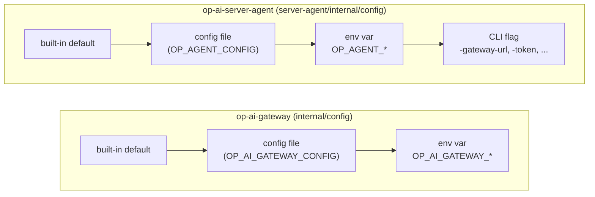

# Configuration

How the OP AI Gateway backend and the ServerAgent resolve their settings — precedence, defaults, database driver selection, bootstrap seeding, and dev conveniences. For the exhaustive variable-by-variable listing, see [Configuration & Environment Variables (Reference)](../reference/config-env.md).

## 1. Configuration model

Both binaries are env-first: every setting has a built-in default, can be overridden by an environment variable, and (for the backend) can also be set through an optional JSON config file. The ServerAgent adds a fourth, highest-priority layer: command-line flags.

Highest priority wins; each stage only fills in what the stage before it left unset.

### Backend: `internal/config/config.go`

- `Load()` reads an optional JSON file, then resolves every field through a `getenv` shim that checks the real environment first and falls back to the file's value for the same key.
- The config file uses **the same keys as the env vars** (e.g. `{"OP_AI_GATEWAY_ADDR": "127.0.0.1:8080"}`), so any documented variable can be set in the file; an environment variable of the same name always wins.
- File path: `OP_AI_GATEWAY_CONFIG` if set, else `gateway.json` next to the binary. A missing *default* file is fine (silently ignored); an explicitly configured file that cannot be read, or malformed JSON (including trailing content after the JSON object), is a **fatal startup error**.
- Values in the file may be JSON strings, booleans, or numbers — all are coerced to the string form the env-var loader expects.
- Typed parsing helpers apply per-field semantics: `boolean` accepts `1/true/yes/on`; `integer` falls back to the default on empty/unparseable/`<= 0`; `integerFloor` additionally clamps a too-small positive value up to a floor (protects against a misconfigured value hammering an external API); `integerAllowZero` treats an explicit `0` as a valid "off" value; `duration` parses a Go duration string; `floatRatio` clamps into `[0,1]`.

### ServerAgent: `server-agent/internal/config/config.go`

- `Load(args, getenv)` takes injected arguments and an env lookup function (never touches `os.Args`/`os.Getenv` directly), so precedence is explicit and testable: **flag (if explicitly passed) > environment variable > config file > built-in default.**
- File path: `-config` flag, else `OP_AGENT_CONFIG`, else `server-agent.json` next to the binary. Same fatal-vs-silent-missing rule as the backend.
- The JSON file supports whole-line `//` comments (a `//` inside a value such as an `https://` URL is left alone) — the portal's "download agent config" flow generates an annotated file.
- Flag defaults are all empty/zero, and `fs.Visit` distinguishes "flag explicitly passed" from "flag left at its zero value" — this also keeps the bearer token out of `-h` usage text (a non-empty flag default would otherwise leak it).
- Two path-valued settings (`ca-file`, `ca-cache-file`) are resolved relative to the **selected config file's directory** if given as a relative path, so a generated config bundle is portable regardless of the process's working directory.
- `Validate()` enforces the required fields (`gateway_url`, `token`, both non-empty; `gateway_url` must be an absolute `http(s)://host` URL) and the enumerated fields (`transport`, `cert_mode`, `cert_proxy_routes_mode`) before `Load` returns.

## 2. Sensible defaults

Both binaries are designed to start with **zero configuration** for local/dev use. Key backend defaults (see the [reference](../reference/config-env.md) for the complete list):

| Setting | Default |
|---|---|
| `OP_AI_GATEWAY_ADDR` | `127.0.0.1:8080` |
| `OP_AI_GATEWAY_PUBLIC_URL` | `http://localhost:8080` |
| `OP_AI_GATEWAY_DB_DRIVER` | `memory` |
| `OP_AI_GATEWAY_DEFAULT_LANGUAGE` | `de` |
| `OP_AI_GATEWAY_LOG_LEVEL` | `info` |
| `OP_AI_GATEWAY_AUTO_MIGRATE` | `true` |
| `OP_AI_GATEWAY_SESSION_COOKIE_SECURE` | unset → auto (see §6) |

The agent's most important default is its collection `interval` (1s, floor 250ms) and its telemetry `transport`, which resolves to **`websocket`** when nothing else sets it (the flag/env/file default is empty and `Load` fills in `TransportWebSocket` after resolution — not `post`, despite an older doc comment in the source suggesting otherwise).

## 3. Database driver selection

`OP_AI_GATEWAY_DB_DRIVER` selects one of three storage backends behind a single `internal/store` dialect seam (`cmd/gateway/main.go`, `buildGatewayServer`):

| Driver | Value | Persistence | Typical use |
|---|---|---|---|
| Memory | `memory` (default, or empty) | None — volatile, gone on process exit | Local development, quick demos, CI |
| SQLite | `sqlite` | Single file (`OP_AI_GATEWAY_SQLITE_PATH`) | Single-node bundled deployment |
| PostgreSQL | `postgres` | External Postgres (`OP_AI_GATEWAY_POSTGRES_DSN`) | Multi-replica / HA deployment |

An unrecognized driver value is a fatal startup error. SQLite and PostgreSQL run the **same forward-only migration set** through the dialect seam; `OP_AI_GATEWAY_AUTO_MIGRATE` (default `true`) applies any pending migrations transactionally at startup. The memory driver has no migrations — its schema is whatever the in-process seed code builds.

## 4. Bootstrap admin & token seeding

For the two persistent drivers (SQLite, PostgreSQL), an operator seeds the first administrator through environment variables rather than an interactive setup step (`cmd/gateway/main.go`, `bootstrapAdmin` — shared by both drivers via the common store interface):

- `OP_AI_GATEWAY_BOOTSTRAP_ADMIN_EMAIL` and `OP_AI_GATEWAY_BOOTSTRAP_API_TOKEN` must be set **together**; setting only one is a fatal startup error.
- This creates (idempotently, fixed IDs `usr_bootstrap_admin` / `tok_bootstrap_admin`) a `system_admin` user and an API token scoped `["gateway:use","admin"]`. Re-running with the same values on an existing install is a no-op (a conflicting existing token secret, or a different owning user, is a startup error).
- `OP_AI_GATEWAY_BOOTSTRAP_ADMIN_NAME` defaults to the email address when unset.
- `OP_AI_GATEWAY_BOOTSTRAP_ADMIN_PASSWORD` is optional and additive: if set, it seeds a **login-able** admin directly (useful for fully automated/container deploys); if the admin already exists without a password, a later redeploy that supplies this variable adopts it — an already-set password is never overwritten.
- If no bootstrap password is supplied, the gateway logs a one-time invite link (`<public_url>/set-password?token=...`) at startup instead, mirroring the normal invite-email flow.

The memory driver does **not** use any `BOOTSTRAP_*` variable — see §5.

## 5. Memory-mode dev conveniences

When `OP_AI_GATEWAY_DB_DRIVER` is `memory` (the default), `cmd/gateway/main.go`'s `memoryDeps` seeds a ready-to-use environment automatically:

| Seeded item | Identity | Controlling variable | Default |
|---|---|---|---|
| Dev user | `usr_dev` / `dev@example.test`, role `system_admin` | `OP_AI_GATEWAY_DEV_PASSWORD` | `dev-secret` |
| Dev API token | `tok_dev`, scopes `["gateway:use","admin"]` | `OP_AI_GATEWAY_DEV_TOKEN` | `dev-secret` |
| Dev agent secret | seeds a mock AI server's agent token | `OP_AI_GATEWAY_DEV_AGENT_TOKEN` | `dev-agent-secret` |
| Mock AI server + model mappings | `seedDefaultServer` | — | always seeded when the driver has no servers yet |

These three `DEV_*` variables are read directly via `os.Getenv` in `cmd/gateway/main.go` (they are **not** fields of `config.Config` and do not appear in the JSON config file schema). Their `dev-secret`/`dev-agent-secret` defaults only apply when `OP_AI_GATEWAY_ADDR` binds to a loopback address; binding to any non-loopback address without an explicit value is a **fatal startup error** — the gateway refuses to run a guessable credential on a reachable interface.

`seedDefaultServer` also runs for SQLite/PostgreSQL when the driver has no `ai_servers` rows yet (`seedDefaultServerIfEmpty`), so a fresh persistent install gets the same mock server + mappings to route against out of the box; it is skipped once any real server exists.

## 6. Sessions, cookies, and the agent's own auth

The session cookie (`op_ai_gateway_session`) is `HttpOnly` and its `Secure` flag is controlled by `OP_AI_GATEWAY_SESSION_COOKIE_SECURE`: an explicit `true/false` (accepting the same truthy/falsy strings as other booleans) wins; when unset, it is derived automatically as `!isLoopbackAddr(OP_AI_GATEWAY_ADDR)` — secure by default on any non-loopback bind, relaxed for local HTTP development. `OP_AI_GATEWAY_SESSION_IDLE_TTL` / `OP_AI_GATEWAY_SESSION_MAX_TTL` bound session lifetime; `OP_AI_GATEWAY_SYSTEM_ADMIN_MODE_TTL_SECONDS` bounds the System-Admin step-up elevation window. See [HTTP API Surface](../reference/api-surface.md) for how the cookie, the `X-OP-CSRF` header, and bearer tokens combine into the auth model, and the security/auth chapter for RBAC and step-up details.

## 7. Configuring the ServerAgent

The ServerAgent (`op-ai-server-agent`, one process per monitored AI server) is configured via `OP_AGENT_*` env vars, an optional JSON file, and CLI flags (§1). Required fields: `gateway_url` (absolute `http://`/`https://` URL) and `token` (the per-server agent bearer token, minted by the portal). Everything else is optional:

- **Transport** (`transport` / `OP_AGENT_TRANSPORT`): `post` (one HTTP POST per telemetry sample) or `websocket` (one persistent connection, the effective default — see §2).
- **Certificate mode** (`cert_mode` / `OP_AGENT_CERT_MODE`): `off` (default — never contacts the certificate endpoint), `files` (writes the mesh leaf certificate to `cert_dir` and runs `cert_reload_command` on a real change), or `proxy` (does everything `files` does, and additionally runs the agent-side TLS-terminating reverse proxy described in `server-agent/internal/proxy`). `cert_dir` is required unless the mode is `off`. `cert_reload_command` is a **local-only** shell command — it can never be delivered by the gateway, only configured on the agent's own file/env/flag.
- **Certificate poll cadence** (`cert_poll_interval` / `OP_AGENT_CERT_POLL_INTERVAL`): unset or `0` means *automatic* (the concrete cadence is derived from `transport`); an explicit positive value below the one-minute floor is clamped up rather than honored, because polling a certificate/key-serving endpoint too fast is a self-inflicted denial of service.
- **Proxy routes** (`cert_proxy_routes`, `cert_proxy_routes_mode`): configuration-file-only settings (no env-var form) that seed local TLS proxy routes used when `cert_mode` is `proxy`. `cert_proxy_routes_mode` is `fallback` (default — a local route only fills a listen port the gateway did not provide) or `override` (a local route wins over a gateway-provided one on the same listen port).
- **Telemetry sourcing**: `metrics_url` (optional inference `/metrics` scrape), `model_status_url` + `model_status_format` (poll a loaded-models endpoint in `openai`/`llama_swap`/`llama_cpp`/`litellm`/auto form), `lhm_url` (optional LibreHardwareMonitor `/data.json` URL for Windows CPU/system power).
- **TLS trust**: `ca_file` (operator-managed PEM the agent only reads), `ca_cache_file` (agent-managed cache written atomically), `ca_pem` (inline bootstrap CA from a generated config), `tls_insecure` (skip verification — development only).
- **Managed model runtime** (`runtime_source`, `runtime_config`, `runtime_allowed_binaries`, `runtime_allowed_dirs`, `runtime_cache`, `runtime_router_bind`): whether launch specifications come from the gateway or a local file, and the agent-operator boundary on what may actually execute. One of these has an *empty* value that is load-bearing rather than merely unset — an empty binary allowlist starts nothing. A non-empty directory allowlist confines any spec that sets a `work_dir` to the permitted subtrees; a spec that sets none runs beside its binary and is permitted regardless. See [Agent-Managed Model Runtime §3 and §14](agent-runtime-manager.md).

See [Configuration & Environment Variables (Reference)](../reference/config-env.md) for the full `OP_AGENT_*` table with every default and floor/clamp rule.

That reference **opens by claiming an exhaustive listing** of every environment
variable, which makes adding the row a required part of adding a setting — in the
same branch as the behaviour, per the repository's documentation rule. Its agent
section additionally asserts that every row has a matching CLI flag and JSON
config-file key with precedence flag > env > file > default, and that claim
carries its three real exceptions:
`OP_AGENT_RUNTIME_ALLOWED_BINARIES` and `OP_AGENT_RUNTIME_ALLOWED_DIRS` are
list-valued with **no flag form** (env, comma-separated, > file > default), and
`OP_AGENT_CONFIG` has a flag (`-config`) but **no config-file key** —
necessarily, since it names the file to read. An unqualified exhaustiveness or
parity claim silently becomes false with the next setting; stating that the claim
is load-bearing is what keeps it true.

## 8. The generated ServerAgent config document, and how its copies stay honest

The portal offers a ready-made annotated JSONC config for a new agent — the
easiest way to start one, and for most operators the *only* documentation they
read before the agent runs. That single document is produced or consumed by four
independent pieces of code, in two languages and two Go modules, none of which
can import another:

| Copy | Role |
|---|---|
| `internal/gateway/agent_binaries.go` (`buildAgentConfigJSON`) | Produces it, behind the `curl` endpoint. |
| `gateway/frontend/src/components/AgentTokenSection.tsx` (`buildServerAgentConfig`) | Produces it, behind the portal's **download button**. |
| `server-agent/internal/config/config.go` (`fileConfig`) | Defines what the agent will actually read. |
| `server-agent/README.md` | Documents the same keys for the operator. |

One checked-in golden, **`server-agent/testdata/server-agent.config.jsonc`**,
now joins them. It lives in the `server-agent` module because that module owns
the file format, and four checks hang off it:

- both **producers** must equal it byte for byte —
  `TestBuildAgentConfigJSONMatchesSharedGolden` on the Go side (which also
  regenerates it, behind an explicit `-update-agent-config-golden` flag) and the
  golden test in `AgentTokenSection.test.tsx` on the portal side. This is the
  only thing that compares the two copies **to each other**;
- its key set must match every `json` tag on `fileConfig`, **by reflection** — so
  a setting the agent can read fails the moment it exists without the template
  mentioning it, and a template key the agent would silently ignore fails too;
- it must **load** through the real `config.Load` to the documented default for
  every field, which is the only proof that a JSONC document the gateway
  generates actually parses and resolves in the agent;
- every key must appear in `server-agent/README.md`, which is what stops the
  operator-facing reference from falling behind the file it describes.

No hand-maintained key list survives in that chain. The previous arrangement had
one per producer and nothing between them, so the copies could disagree
indefinitely — and did. The generated template shipped **one** of the six
`runtime_*` settings, `runtime_router_bind`, while its comment referred the
operator to the README for the other five; it omitted `cert_proxy_routes` and
`cert_proxy_routes_mode` entirely; and it described `cert_mode: "proxy"` as not
yet implemented, which it has not been true of since the agent-side proxy
landed. The reflection and README checks found the last three of those the same
way they will find the next one.

The selection was the worst available. `runtime_router_bind` loads into a plain
string, so its absence and its empty value are indistinguishable — omitting it
was harmless. `runtime_allowed_binaries` is the opposite: an empty binary
allowlist is a deliberate **hard refusal**, so an operator filling in URL and
token from a runtime-aware-looking file got an agent that could not start
anything, with nothing in the file hinting that a setting was missing.

Which is why a generated template documents each key's **empty** value, not just
its meaning. Those semantics differ per key by design and cannot be conveyed by
the values, which must stay at their defaults in a document that cannot guess an
operator's paths: an empty `runtime_allowed_binaries` starts nothing, while an
empty `runtime_allowed_dirs` accepts *any* `work_dir` (an operator who does not
care should not have to enumerate a filesystem), and an empty `runtime_cache`
still resolves to a real default beside the binary. It is also this template's
empty `cert_dir` — not its `cert_mode: "off"`, which the derivation never reads
— that makes the runtime router's all-interfaces fallback the shipped default
(see [Agent-Managed Model Runtime §4.6](agent-runtime-manager.md)).

## See also

- [Configuration & Environment Variables (Reference)](../reference/config-env.md) — exhaustive variable tables.
- [HTTP API Surface (Reference)](../reference/api-surface.md) — how auth (session/CSRF/bearer/agent-token) is wired to each route group.
- [Agent-Managed Model Runtime](agent-runtime-manager.md) — the `runtime_*` agent settings in context, and the two configuration *sources* (gateway document vs local file) they select between.
