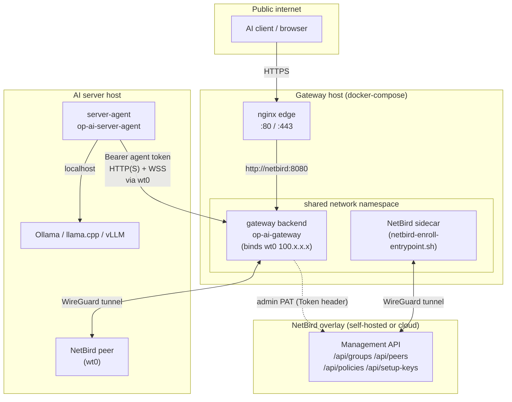

# Networking & Mesh (NetBird)

How the gateway integrates with [NetBird](https://netbird.io) as an optional
WireGuard-based overlay mesh, manages its own admin-API credential, keeps
fleet peers/groups/policies in sync, can restrict itself to mesh-only
transport, and how the agent↔gateway WebSocket rides on top of it.

NetBird is entirely optional: every mechanism in this chapter is a no-op when
the module is off (no URL/token configured), and every reconcile pass fails
open rather than tearing down a working deployment on a transient NetBird
outage.

## 1. Overview

- **Gateway side** (`internal/netbird`, `internal/gateway`, `cmd/gateway`): a
  minimal admin-API client, the per-server linkage/settings, two background
  reconcile loops, and a second `http.Server` bound to the gateway's own mesh
  IP.
- **AI-server side** (`server-agent`): each server runs its own NetBird peer
  (managed by the operator or auto-enrolled) plus a `server-agent` process
  that authenticates to the gateway with a bearer *agent token* over the mesh.
- **Everything is additive.** With NetBird off, servers are reached by their
  configured domain/IP exactly as before; NetBird only adds an overlay
  identity, optional access policies, and an optional isolation boundary.

## 2. The NetBird admin-API client

`internal/netbird/netbird.go` is a small, dependency-free (`net/http` +
stdlib only) client for the NetBird management API. It is used exclusively by
the gateway's reconcile logic — never imported by anything that could leak
the token.

- **Auth.** `Authorization: Token <token>` (NetBird's own scheme, not
  `Bearer`). The token never appears in a log line or error message
  (`tolerantMessage` clips and sanitizes response bodies; every error string
  is built from the method/path/status only).
- **Timeouts.** Every call gets an explicit `context.WithTimeout` via a
  per-call `*http.Client` — `netbird.Config` is never used with
  `http.DefaultClient`, which has none.
- **Errors.** `ErrAuth` is returned uniformly for 401/403 and is
  `errors.Is`-checkable; delete operations (`DeleteGroup`, `DeletePeer`,
  `DeleteSetupKey`, `DeleteToken`) treat a 404 as success (idempotent).
- **Surface:** setup keys, groups (`ListGroups`/`CreateGroup`/`GetGroup`/
  `UpdateGroupPeers`/`DeleteGroup`), peers (`ListPeers`/`GetPeer`/
  `UpdatePeerName`/`DeletePeer`), access-control policies (`ListPolicies`/
  `CreatePolicy`/`UpdatePolicy`/`DeletePolicy`), the account (`GetAccount`/
  `UpdateAccountSettings` — read-modify-write over a raw `map[string]any` so
  unmanaged settings keys are preserved), and personal access tokens
  (`ListUsers`/`ResolveCurrentUserID`/`ListTokens`/`CreateToken`/
  `DeleteToken`).
- `CanonicalGroupsJSON` sorts and marshals a peer's policy-group refs into the
  exact byte form the gateway stores in `ai_servers.netbird_group_ids`, so the
  sync mirror and the interactive editor never oscillate against each other.

## 3. The admin PAT token lifecycle

The gateway's own NetBird credential is a personal access token (PAT) it
manages end-to-end (`internal/portal/service_netbird_token.go`).

| Concern | Behavior |
|---|---|
| Naming | Every gateway-minted PAT is named `op-gateway`, valid 365 days. |
| Manual rotation | `POST /api/system/netbird/rotate-token` → `Service.RotateNetbirdToken`. |
| Auto-rotation | `MaybeRotateNetbirdToken`, called every reconcile-B tick. Rotates only a *gateway-managed* token (known id + expiry) within `netbird_token_rotate_before_days` (`OP_AI_GATEWAY_NETBIRD_TOKEN_ROTATE_BEFORE_DAYS`, default 14; `0` disables). |
| Cooldown | A package constant `netbirdTokenRotateCooldown` = 1 hour prevents a persistently failing auto-rotation from hammering NetBird every tick. |
| Sequence | Create a new PAT → **verify it** with a `Ping` using the new token → seal + persist (`netbird_token_id`, `_expires_at`, then the sealed token, in that order) → best-effort delete the old PAT. |
| Rollback | Any failure before the credential is switched deletes the orphan new token and leaves the old one active untouched — a rotation can never brick the module. |
| Never logged | The plaintext token is returned only once (create), never logged, and the read-only status endpoint (`NetbirdTokenStatus` / `GET /api/system/netbird/token-status`) reports only `name`/`expiration_date`/`days_remaining`/`last_used`. |

Writing metadata (`netbird_token_id`/`_expires_at`) **before** the sealed
credential means the last write is always the credential itself: if any write
in the sequence fails, `netbird_token` still points at the old, working
token, and the only residual is stale metadata that self-heals on the next
rotation or resolve.

## 4. Peers, groups, and policies

`Service.SetServerNetbird` (`internal/portal/service_netbird_peers.go`) is the system-admin
linkage editor behind `PUT /api/system/servers/{id}/netbird` — it sets a
server's `NetbirdEnabled` flag, its linked `NetbirdPeerID`, its desired
policy `NetbirdGroupIDs`, and three more flags described in §5. Linking a
peer runs a synchronous best-effort reconcile (rename the peer to the server
name, adopt its DNS label as the server domain, ensure the per-server
tracking group `op-gw-<server-id>` exists and contains the peer, push the
desired policy-group delta). Any NetBird error there leaves the stored
linkage untouched — the background loops below converge it later — and never
clears an already-good domain.

**Two background loops** (`cmd/gateway/netbird_sync.go`), both driven by
`portal.NetbirdPolicySettings` (floored at 10s, reconcile interval ≥ peer
interval):

| Loop | Cadence (default) | Does |
|---|---|---|
| **A — peer sync** | `netbird_sync_interval_seconds` (60s, floor 30s) | Per server: resolve its enrolled peer (by stored id, else the first peer of its tracking group), apply the **one-peer backstop** (below), rename it to match the server, and write domain/peer-id/connected on a real change only. Fires `onOnline(serverID)` on a `false→true` connection transition. |
| **B — group + policy reconcile** | same setting, ≥ Loop A | Mirrors every enabled server's NetBird groups, then (if `manage_policies` is on) diffs/creates/updates one managed access policy `op-gw-access-<id>` per server plus four fleet-wide policies (§6/§7), all under one lock (`netbirdPolicyMu`) so two concurrent passes never double-create a policy. Also runs `MaybeRotateNetbirdToken` (§3) and, if configured, enforces deny-by-default (disables NetBird's built-in `Default` catch-all policy). |

A send on the loop's `trigger` channel (used after a NetBird `dns_domain`
change) forces an extra Loop-A pass immediately, independent of the ticker.

**The one-peer backstop** (`dedupTrackingGroup`) keeps a server's own
tracking group down to a single peer: when it holds more than one (a
re-enrollment leaving a stale duplicate), it fetches every member, picks the
winner (connected/most-recently-seen, ties broken by peer id), best-effort
deletes every loser, and adopts the winner. It is conservative — any partial
read (a `GetPeer` failure on any member) skips the dedup for that tick rather
than deleting on incomplete information.

**Gateway-peer autoselect.** The gateway's *own* mesh identity is resolved
the same way: `Service.ReconcileGatewayPeer` picks the live winner peer of
the `op-gw-portal` group (connected beats disconnected, then latest
`last_seen`) whenever the stored `netbird_gateway_peer_id` is empty or no
longer a group member, and renames it to `netbird_gateway_peer_name` when
configured. `startGatewayPeerReconcileLoop` (`cmd/gateway/agent_listener.go`) runs this
on the same `netbird_sync_interval_seconds` cadence (floored at 30s) and then
rebinds the agent listener(s) — see §8 — so a freshly-enrolled sidecar
becomes the live agent listener within one interval, with no restart.

## 5. Per-server NetBird settings

`routing.AIServer` carries seven NetBird columns (migrations 18–19, 20, 21,
24–25):

| Field | Meaning |
|---|---|
| `NetbirdEnabled` | Server participates in NetBird at all. |
| `NetbirdGroupID` / `NetbirdPeerID` | The server's tracking group and resolved peer (state, not operator input). |
| `NetbirdGroupIDs` | The portal's canonical mirror (§2) of the peer's *policy* groups. |
| `NetbirdPeerManaged` | This peer's setup key/tracking group originated from the gateway (governs whether a key can be regenerated). |
| `NetbirdPolicyOverride` | Per-server opt-in/opt-out of the managed access policy, independent of the account-wide scope. |
| `NetbirdAllowPing` | The gateway may ICMP-ping this server (feeds the fleet `op-gw-ping-servers` policy, §7). |
| `NetbirdPingExclude` | Opt this server *out* of ping when the account-wide "ping everything" switch is on — mutually exclusive with `NetbirdAllowPing`. |

## 6. NetBird-only ("mesh-only") transport

The runtime toggle `netbird_only` (`Service.NetbirdOnly`) turns three
independent enforcement points on at once, all fail-open on any error:

1. **Inbound isolation on the public listener.** `Server.routes()`
   (`internal/gateway/server.go`) gates several `/api/portal/agent-*` and
   `/api/agent/v1/*` routes behind `AgentListenerActive() &&
   Portal.NetbirdOnly(ctx)` — reachable on the public mux only while *no*
   mesh agent listener exists at all (the fail-safe: losing the agent
   listener never silently locks agents out).
2. **Source verification on the agent listener.** `agentSourceRefused`
   (`internal/gateway/agent_netbird_gate.go`) refuses an agent request whose
   connection's *local* address does not equal the gateway's own resolved
   mesh peer IP — catching a host-published bind (someone exposed the agent
   port outside the mesh) that a mesh-bound listener's local address would
   never trigger. The resolved IP is cached for 5s (500ms on a resolve
   *error*, so a blip self-heals fast without hammering NetBird on every
   telemetry/stream request).
3. **Outbound "force server in network" restriction.** `probeServer`
   (`cmd/gateway/app_health.go`) computes `offMesh := netbirdOnly &&
   !server.NetbirdEnabled`: an off-mesh server's applications are forced
   unreachable (`netbird_only: off-mesh server excluded`) *before* any probe
   runs, and its loaded-model/context-size probes are skipped entirely — so
   with the switch on, routing and the offered-models list only ever consider
   servers that are actually NetBird peers. A server that *is* NetBird-enabled
   is unaffected; its reachability still comes from the real probe over the
   tunnel.

`GET /api/portal/netbird/enabled` exposes the module/only-mode flags (never
the URL/token/group) so the portal shell can show/hide NetBird actions for
any authenticated user; `GET /api/system/netbird/status` gives the
system-admin panel the fuller picture (agent-listener address, selected
gateway peer + live connected state, policy-management counts, and whether a
sidecar-enrollment key file is wired).

## 7. ICMP ping health

`internal/ping.PingHost` sends an **unprivileged** ICMP echo
(`golang.org/x/net/icmp`, UDP-style socket — no `CAP_NET_RAW` required,
subject to the host's `ping_group_range` sysctl on Linux) and returns
`ErrICMPUnavailable` when the environment forbids it, never a hard failure.

- `POST /api/portal/servers/{id}/ping` runs one ping from the gateway to the
  server's domain (owner-or-admin, always `200 {ok, latency_ms}` or `{ok:
  false, error}` — never blocks the panel).
- The fleet-wide managed policies `op-gw-ping-gateway` (servers → gateway)
  and `op-gw-ping-servers` (gateway → every `NetbirdAllowPing` server, unless
  individually `NetbirdPingExclude`d unless the account-wide "ping everyone"
  switch is off) are reconciled by Loop B (§4) so the mesh ACLs actually
  *permit* the ICMP the panel and the health checks rely on — a NetBird
  overlay defaults to allowing only what an explicit policy names.

## 8. The gateway's own agent listener

The gateway can bind a **second** `http.Server` directly to its NetBird IP,
serving only `/api/agent/v1/*` and `/healthz` (`s.agentMux`,
`internal/gateway/server.go`). `startAgentListener` /
`startGatewayPeerReconcileLoop` (`cmd/gateway/agent_listener.go`)
own its lifecycle via an `agentListenerManager` that reconciles
live, on every gateway-peer-reconcile tick, toward the desired topology —
never tearing down a working listener on a transient resolve error.

**Address resolution** (`resolveAgentAddr` / `resolveAgentTLSAddr`):
an explicit `OP_AI_GATEWAY_AGENT_ADDR` (or `_TLS_ADDR`) always wins; otherwise
the bind host is the **selected gateway peer's live NetBird IP** +
`OP_AI_GATEWAY_AGENT_PORT` (default `8081`) / `_AGENT_TLS_PORT` (default
`8443`) — so the listener address tracks peer autoselect (§4) automatically.
No peer selected ⇒ no listener; a resolve *error* leaves the current listener
untouched (fail-safe).

**Two topologies**, switched at runtime by `cert_mesh_tls_mode`
(`combined`/`separate`, env-fallback `OP_AI_GATEWAY_AGENT_TLS_SEPARATE`):

| Mode | Behavior |
|---|---|
| `combined` (default) | **One** socket at the plain address. A `sniffListener` (`cmd/gateway/agent_tls_listener.go`) peeks the first byte of every accepted connection: `0x16` (a TLS handshake) upgrades it in place via `tls.Server` with a hot-swappable certificate holder; anything else is served as plain HTTP. No half-open state — a peek timeout or read failure simply drops that one connection. |
| `separate` | **Two** dedicated sockets: a plain-only bind at the `AGENT_ADDR`/`AGENT_PORT` address, and a TLS-only bind (`tls.NewListener`, never accepts plaintext) at the `AGENT_TLS_ADDR`/`AGENT_TLS_PORT` address — brought up only once mesh certificate material actually exists. |

Every rebind follows a **listen-before-stop** discipline: the new socket is
acquired first, and the old one is only torn down on success, so a
misconfigured or momentarily-unreachable peer IP never drops a working
listener. A same-address TLS *promotion* (material appearing after a plain
listener is already up) is the one unavoidable stop-first case, softened by a
bounded `relistenWithRetry`. A certificate-read failure keeps serving the
**last-good** leaf rather than downgrading to plaintext or dropping the
listener. See [Certificates & TLS](certificates-tls.md) for how that leaf is
issued and rotated.

## 9. The NetBird sidecar (compose deployment)

The reference `docker-compose.yml` runs NetBird as a dedicated `netbird`
service that the `backend` container joins via `network_mode:
"service:netbird"` — the gateway process sees the sidecar's `wt0` interface
and 100.x IP as its own, which is what lets it bind the agent listener there.

> **Single point of failure, by construction.** Because `backend` shares the
> sidecar's network namespace, a crashing `netbird up` (inside the `netbird`
> container) takes the whole namespace down with it — the **public API,
> including `/api/auth/login`, 502s**, not just the mesh path. `nginx`
> `depends_on: netbird: condition: service_started`, but that dependency
> cannot protect against a *post-startup* sidecar crash.

That fragility drove one hard constraint on autonomous enrollment: NetBird's
CLI treats `--setup-key` (env `NB_SETUP_KEY`) and `--setup-key-file` (env
`NB_SETUP_KEY_FILE`) as **mutually exclusive** — if both env vars merely
*exist* (even `NB_SETUP_KEY=""`), every `netbird` command aborts, which would
crash-loop the shared namespace. `deploy/netbird-enroll-entrypoint.sh` is a
thin wrapper the sidecar image runs instead of NetBird's own entrypoint:

1. Reads the wrapper-only env var `NB_ENROLL_KEY_FILE` (NetBird itself never
   sees this name).
2. Unconditionally unsets `NB_SETUP_KEY_FILE` and any *empty* `NB_SETUP_KEY`,
   so NetBird is handed exactly one key source.
3. On a fresh peer (no local enrollment marker) with no direct
   `NB_SETUP_KEY` and a configured key-file path, blocks until the gateway
   writes a key there (`EnrollGatewaySidecar` / `CreateGatewaySetupKey` mint a
   one-off, single-use, 30-day setup key in the `op-gw-portal` auto-group and
   atomically write it — 0600, temp-file-then-rename — to the shared,
   `tmpfs`-backed volume), loads it into `NB_SETUP_KEY`, and picks up the
   companion management-URL file the gateway drops alongside it.
4. Persists an enrollment marker on the **persistent** `/var/lib/netbird`
   volume so a later restart (the transient key volume is empty again)
   reconnects via the already-established WireGuard identity instead of
   re-waiting.
5. `exec`s the stock NetBird entrypoint.

An operator who prefers a static `NB_SETUP_KEY` env var is unaffected — the
wrapper skips the wait entirely when one is present.

## 10. Agent↔gateway WebSocket transport

Telemetry, system reports, and the certificate/CA doorbells travel over one
persistent WebSocket (`coder/websocket`, `wss://…/api/agent/v1/stream`),
built by `server-agent/internal/client/ws.go`'s `WSSender` and served by
`handleAgentStream`.

- **Liveness.** A missed pong from the peer is the *only* reliable signal a
  UDP-based WireGuard tunnel that silently dropped can produce — the write
  path happily succeeds into the kernel send buffer regardless. `pingLoop`
  actively sends a WebSocket ping every 30s and **blocks** up to 10s for the
  matching pong; a plain read deadline would spuriously trip on a healthy but
  data-idle connection, since `coder/websocket` answers pings internally
  inside `Read` and never surfaces them to the caller.
- **Reconnect discipline.** A dial/IO error grows the backoff exponentially
  (base 500ms, cap 30s, plus jitter); a **clean** close (1000/1001) instead
  gets a short jittered delay (500ms–2s). **Reset-on-stable**: a connection
  that stayed up ≥ 10s resets the failure count on its next drop, so one bad
  connection after a long healthy run does not inherit an already-large
  backoff.
- **Graceful shutdown.** The gateway cancels its `baseCtx` on `SIGTERM`
  *before* draining the main listener; every open agent stream's watcher then
  sends WebSocket close code `1001` (`GoingAway`), which the agent's
  `isCleanClose` recognizes — so a rolling gateway restart reconnects agents
  via the fast, un-penalized clean-close path instead of exponential backoff.
- **Doorbells, not payloads.** `cert_update`/`ca_update` frames from the
  gateway (and every successful reconnect) wake a buffered(1), non-blocking
  channel the agent's certificate/CA sync loop watches — coalescing a burst
  of either into one pending "check again," never a queue.
- **nginx location requirements.** The WS route needs
  `proxy_http_version 1.1` plus `Upgrade`/`Connection: upgrade`, which the
  server-level `proxy_set_header Connection "";` would otherwise clear.
  Because setting *any* `proxy_set_header` inside a location discards the
  whole inherited set, `/api/agent/v1/stream`'s location block must
  re-declare **all six** `X-OP-*` directives (the five internal-header
  blankings plus `X-OP-Edge-Scheme`) verbatim — see
  `gateway/deploy/nginx/locations.conf`.

**One registration table, two muxes.** Every agent endpoint — including the
three the [agent-managed model runtime](agent-runtime-manager.md) adds
(`GET /api/agent/v1/features`, `GET /api/agent/v1/runtime-config`,
`POST /api/agent/v1/runtime-report`) — is declared in the gateway's single
`agentRoutes` table, which is what serves each of them on *both* listeners: on
the public mux behind the runtime `netbird_only` gate (§6.1), and on the
dedicated agent mux ungated. The dual-mux-plus-gate arrangement is invisible from
a handler's own file, so an endpoint registered directly on one mux is either
unreachable by agents or unexpectedly public.

That runtime feature also puts one *new* listening port on the AI-server side of
the mesh: the agent's model-runtime router. It **authenticates nothing**, the
gateway supplies only its port, and its shipped default binds all interfaces —
so on a mesh deployment `runtime_router_bind` / `OP_AGENT_RUNTIME_ROUTER_BIND`
should be set to the server's own mesh IP (or `127.0.0.1`). See
[Agent-Managed Model Runtime §4.6](agent-runtime-manager.md).

## 11. Configuration reference

| Env var | Default | Governs |
|---|---|---|
| `OP_AI_GATEWAY_AGENT_ADDR` | unset | Explicit agent-listener bind (overrides peer autoselect). |
| `OP_AI_GATEWAY_AGENT_PORT` | `8081` | Plain/combined agent-listener port. |
| `OP_AI_GATEWAY_AGENT_TLS_SEPARATE` | `false` | Env-fallback for `cert_mesh_tls_mode` when unset in settings. |
| `OP_AI_GATEWAY_AGENT_TLS_ADDR` / `_PORT` | unset / `8443` | Dedicated TLS agent-listener bind (separate mode). |
| `OP_AI_GATEWAY_NETBIRD_KEY_FILE` | unset | Shared setup-key file path — presence enables sidecar self-enrollment (§9). |
| `OP_AI_GATEWAY_NETBIRD_SYNC_INTERVAL_SECONDS` | `60` (floor 30) | Fallback/env cadence for both reconcile loops (§4). |
| `OP_AI_GATEWAY_NETBIRD_TOKEN_ROTATE_BEFORE_DAYS` | `14` | Auto-rotation threshold for the admin PAT (§3); `0` disables. |
| `NB_ENROLL_KEY_FILE` (sidecar) | `/shared/netbird-setup-key` | Must equal the backend's key-file path (§9). |

See [Configuration](configuration.md) for the full variable list.

## Related chapters

- [Certificates & TLS](certificates-tls.md) — the mesh-TLS listener's
  certificate material, the internal CA, and the agent-side TLS proxy that
  rides on top of this mesh.
- [Security, Authentication & Authorization](security-auth-rbac.md) — agent
  bearer tokens and the RBAC scopes guarding the NetBird settings endpoints.
- [Telemetry, Usage Analytics & Observability](telemetry-usage-observability.md) —
  the agent telemetry this transport carries and the presence/reachability
  registries it feeds.
- [Deployment View](../07-deployment-view.md) — the compose/Kubernetes
  topologies this chapter's sidecar section assumes.
