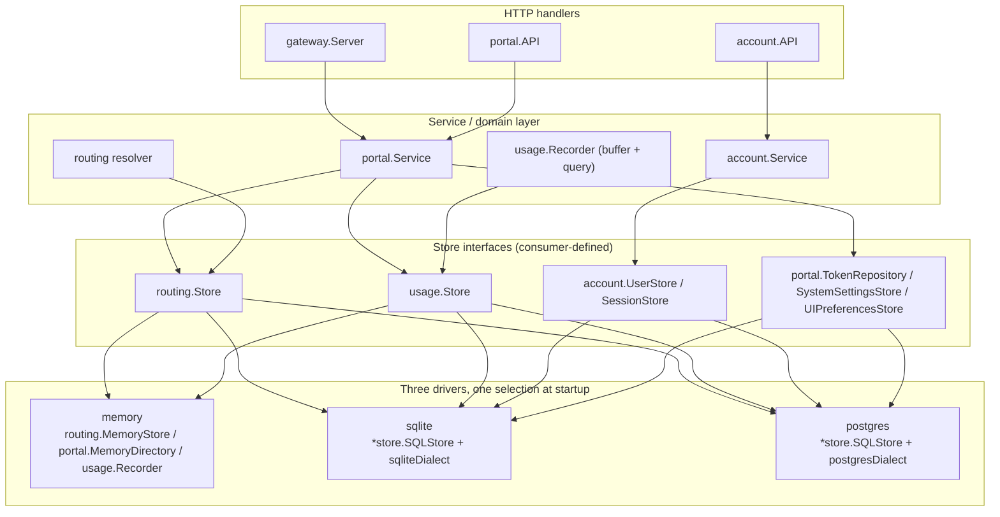

# Persistence

How OnPrem AI Gateway persists domain state: a store boundary of small,
consumer-defined repository interfaces, backed by three interchangeable
drivers behind one shared query set, migrated forward-only, with narrow-type
and secrecy rules enforced consistently across drivers.

## 1. The store boundary: repository interfaces, not one big store

There is no single monolithic `Store` interface. Each consuming package
declares its own narrow interface(s) for exactly the persistence it needs,
and one concrete backend satisfies all of them per driver:

| Package | Interface(s) | File |
|---|---|---|
| `internal/routing` | `Store` (servers, applications, model mappings, model groups, benchmarks, telemetry, availability, hardware, agent tokens, services, resource groups, principal limits, certificates) | `internal/routing/store.go` |
| `internal/usage` | `Store` (record/query/stats/time-series/energy) | `internal/usage/recorder.go` |
| `internal/account` | `UserStore`, `SessionStore`, `SetPasswordTokenStore` | `internal/account/service.go` |
| `internal/portal` | `UserReader`, `TokenRepository`, `SystemSettingsStore`, `UIPreferencesStore`, plus group/project store interfaces | `internal/portal/service.go`, `internal/portal/group_store.go`, `internal/portal/project_store.go` |
| `internal/auth` | `BearerStore` (token lookup for bearer auth) | `internal/auth` |

For the `sqlite` and `postgres` drivers, **one Go type** —
`*store.SQLStore` (aliased as `store.SQLiteStore` for compatibility) —
implements every one of these interfaces at once (`internal/store/sqlite_*.go`
files, one per concern: `sqlite_routes.go`, `sqlite_usage.go`,
`sqlite_token.go`, `sqlite_user.go`, `sqlite_session.go`,
`sqlite_certificates.go`, `sqlite_resource_groups.go`, …). For the `memory`
driver, each interface is satisfied by its own dedicated in-memory type:
`routing.MemoryStore`, `portal.MemoryDirectory`, and `usage.Recorder` itself
(the recorder *is* the in-memory `usage.Store`).

`gateway/backend/cmd/gateway/main.go` wires the concrete backend exactly
once, at startup, keyed off `OP_AI_GATEWAY_DB_DRIVER`:

```go
switch strings.ToLower(strings.TrimSpace(cfg.DBDriver)) {
case "", "memory":
    deps, cleanup, err = memoryDeps(cfg)
case "sqlite":
    deps, cleanup, err = sqliteDeps(cfg)
case "postgres":
    deps, cleanup, err = postgresDeps(cfg)
}
```

Every other package downstream (services, HTTP handlers) only ever sees its
own narrow interface — it has no way to know, and does not need to know,
whether it is talking to memory, SQLite, or PostgreSQL.

## 2. Three drivers, one query set (the dialect seam)

`OP_AI_GATEWAY_DB_DRIVER` selects one of:

- **`memory`** (default) — plain Go maps/slices behind mutexes, nothing
  survives a restart. Used for local dev, unit tests, and the Playwright e2e
  default profile.
- **`sqlite`** — a single file opened via `store.OpenSQLite` (driver
  `modernc.org/sqlite`, pure Go, no cgo), with `foreign_keys(1)` and
  `busy_timeout(5000)` pragmas set on the DSN.
- **`postgres`** — opened via `store.OpenPostgres` (driver
  `github.com/jackc/pgx/v5/stdlib`), a bounded pool (20 max open, 4 max idle,
  5-minute idle timeout) and a bounded ping-retry loop so the gateway
  tolerates a database that is still starting up alongside it.

`sqlite` and `postgres` are not two separate implementations: they are the
**same `*store.SQLStore` type running the same SQL text**, wrapped one seam
away from the driver-specific bits — the `dialect` interface
(`internal/store/dialect.go`):

```go
type dialect interface {
    name() string           // "sqlite" | "postgres"
    rebind(query string) string
    blobType() string       // "blob"      | "bytea"
    timestampType() string  // "timestamp" | "timestamptz"
    ilike() string          // "like"      | "ilike"
    isUniqueViolation(err error) bool
    isForeignKeyViolation(err error) bool
}
```

- `rebind` rewrites the store's native `?`-style placeholders to Postgres's
  `$1, $2, …` form; SQLite accepts `?` natively and rebinds to a no-op.
- `blobType()` / `timestampType()` parameterize the two BLOB columns
  (`captures.blob`, `chats.blob`) and every timestamp column across the
  schema so the same `CREATE TABLE` text produces `blob`/`timestamp` on
  SQLite and `bytea`/`timestamptz` on Postgres.
- `isUniqueViolation` / `isForeignKeyViolation` classify a driver error into
  the two `storeerr` sentinels (`ErrNotFound`, `ErrConflict`) — by
  message-text sniffing on SQLite (`modernc.org/sqlite` has no typed error),
  by Postgres SQLSTATE code on the pgx side (`23505` unique, `23503` FK).
- A single conversion seam, `sanitizeArgs` (`internal/store/sqlite.go`),
  turns every Go `bool` argument into `int64(0)`/`int64(1)` before the query
  runs: every boolean flag in the schema is a plain integer column on both
  dialects, and while `modernc.org/sqlite` silently coerces a Go `bool` into
  an integer column, pgx's stdlib driver refuses to encode a bare `bool`
  into an `int4` column at all — a real dialect divergence the conformance
  suite caught.



## 3. The migration runner

`internal/store/migrate.go` holds an append-only, ordered slice `migrations`
of 68 entries (see [Data Model (Reference)](../reference/data-model.md) for
the full list). `(*SQLStore).Migrate(ctx)`:

1. Creates `schema_migrations (version integer primary key, name text, applied_at timestamp)`
   if it does not already exist.
2. Reads every already-applied `version` into a set.
3. Sorts `migrations` by version and applies **only the pending ones**, in
   order.
4. For a normal migration: begins a transaction, runs `m.up(ctx, tx, dl)`,
   inserts the `schema_migrations` row for that version in the **same**
   transaction, then commits. A failure at any point rolls the transaction
   back — the database is left at exactly its last successfully-applied
   version, never half-migrated.
5. A migration may instead set `rawUp` — an escape hatch for the one case
   (`migration40`, the `service_accounts` SQLite rebuild) that needs to
   toggle SQLite's `foreign_keys` pragma *outside* any transaction (SQLite
   treats that toggle as a silent no-op once `BEGIN` has run) on the same
   physical connection that then performs the table rebuild. `rawUp` manages
   its own transaction and records its own `schema_migrations` row so the
   DDL and the bookkeeping still commit atomically.

Rules that keep this safe over time:

- **Forward-only, append-only.** New entries are appended with the next
  version number; an already-shipped migration is never edited or reordered.
- **Only-pending.** A fresh install runs all 68 migrations in order, same as
  an upgrade from any earlier version — there is no separate "fresh schema"
  path that could drift from the migration history. `baselineUp` (version 1)
  is a frozen v1 snapshot; every table introduced later (`user_groups`,
  `projects`, `resource_groups`, `certificates`, …) is created **solely** by
  its own migration, never backported into the baseline.
- **Dialect-aware, not dialect-duplicated.** `baselineCreateStatements(dl)`
  builds the same `CREATE TABLE`/`CREATE INDEX` text for both dialects,
  substituting only `dl.blobType()`/`dl.timestampType()`. On SQLite,
  `baselineUp` additionally replays historical renames (`model_hosts` →
  `ai_servers`, `host_telemetry` → `server_telemetry`, dropping the legacy
  `route_affinity`/`model_routes` shapes) and swallows benign
  already-applied errors, because SQLite does not abort a transaction on a
  failed statement; Postgres databases are always created fresh, so its path
  is pure `CREATE TABLE`/`INDEX`.
- **Transactional per migration** (the `rawUp` case still commits its DDL
  and bookkeeping atomically).
- **Split a feature's DDL along rollback lines, not for tidiness.** The
  agent-managed runtime arrived as three migrations —
  65 `agent_runtime_manager` (specs, spec GPUs, co-residency),
  66 `server_runtime_limits` (GPU budgets plus two `ai_servers` columns),
  67 `server_runtime_reports` — specifically so a binary rollback survives each
  half independently. Collapsing them into one for neatness removes exactly the
  property they were split to provide.

### A constraint added over possibly-dirty live data skips, it does not abort

A migration failure refuses to start the gateway. So when a migration adds a
constraint that is **defence in depth** behind an enforcement layer that already
exists, and live data might already violate it, the migration pre-checks and
**skips** rather than failing — while `Migrate` still records the version, so the
skip is never retried.

Migration 68 (`application_single_server_agent`) is the worked example: it
pre-checks for duplicate `server_agent` applications on one server and, if any
exist, returns without creating its partial unique index. The trade is explicit:
bricking startup over a redundant guard would swap a silent misconfiguration for
a hard outage, and the primary enforcement (the portal service gate) is
unaffected. Two facts make the skip safe in practice: `'server_agent'` is not a
value any *released* deployment can hold — the type is only writable through
`portal.normalizeApplicationType`, which first accepted it on the unreleased
branch that introduced migrations 65–68 — so every database migrated from a
shipped version has zero rows matching the index's `WHERE` clause; the pre-check
exists only for a pre-invariant *development* database of that branch. Both
dialects support partial and `IF NOT EXISTS` indexes (SQLite ≥ 3.8.0,
PostgreSQL ≥ 9.5), so no dialect branch is needed.

The consequence a reader needs: **a database can legitimately be at version 68
without the index**, and such a database keeps the service gate only. The skip is
not an incomplete migration.

### Startup gating

Migrations run automatically on startup only when `OP_AI_GATEWAY_AUTO_MIGRATE`
is true (default `true`; `internal/config/config.go`). `cmd/gateway/main.go`
calls `sqliteStore.Migrate` / `pgStore.Migrate` right after opening the store
and before seeding any default data:

```go
if cfg.AutoMigrate {
    if err := sqliteStore.Migrate(context.Background()); err != nil { ... }
}
```

Setting it to `false` lets an operator apply migrations out-of-band (e.g. a
separate migration job ahead of a rolling deploy) instead of on every process
start.

## 4. The Postgres narrow-type rule

SQLite's `INTEGER` is already a full 64-bit value and its `REAL` is already
an 8-byte IEEE-754 double — and SQLite has no `ALTER COLUMN TYPE` at all — so
a too-narrow column type on SQLite is invisible. Postgres has real `int4`
(`integer`, ~2.1 billion max) and `real` (`float4`, ~7 significant digits)
types that will silently truncate a wider Go value. Two migrations exist
specifically because this bit in production:

- **`bigint`, not `integer`, for any column backing an `int64` Go field or a
  byte count.** The v1 baseline declared `server_telemetry`'s
  `ram_used_bytes`/`ram_total_bytes`/`vram_used_bytes`/`vram_total_bytes` as
  `integer`; a host with more than ~2 GB of RAM/VRAM made every agent
  telemetry POST fail on Postgres (`pgx`: *"greater than maximum value for
  int4"*). `migration4Up` (`server_telemetry_bigint_bytes`) widens them to
  `bigint`; `principal_limits.token_quota_tokens` (migration 41) is `bigint`
  from day one for the same reason (a monthly token quota can exceed int32).
- **`double precision`, not `real`, for any column backing a `float64` Go
  field.** The v1 baseline declared several metric/energy columns as `real`
  (`float4`); summing them (e.g. `SUM(energy_wh)` behind
  `/api/portal/usage/groups`) accumulated visible drift (`0.1 + 1.0` read
  back as `1.1000000014901161`, not `1.1`). `migration43Up`
  (`float_columns_double_precision`) widens every such column to
  `double precision`, unconditionally, across the whole schema.

Both fixes are no-ops on SQLite (already wide enough, and `ALTER COLUMN
TYPE` is unsupported there) and are baked directly into
`baselineCreateStatements` for fresh installs, so only an upgrading database
actually runs the `ALTER TABLE`. **The rule going forward:** any new column
backing an `int64` or a byte-count field must be declared `bigint`; any new
column backing a `float64` field must be declared `double precision`. Never
`integer`/`real` for such columns, even though SQLite would silently accept
either.

## 5. The shared conformance test suite

`internal/store/conformance_test.go` (~40 `TestConformance*` functions) is
the proof that the unified store behaves identically on both SQL dialects.
Every subtest runs through `forEachDialect`:

```go
func forEachDialect(t *testing.T, run func(t *testing.T, s *SQLStore)) {
    t.Run("sqlite", func(t *testing.T) {
        // fresh temp-file DB, migrated, always runs
    })
    t.Run("postgres", func(t *testing.T) {
        dsn := os.Getenv("OP_AI_GATEWAY_TEST_POSTGRES_DSN")
        if dsn == "" {
            t.Skip(...) // never fails when no DSN is configured
        }
        // schema dropped + freshly migrated, then the same test body runs
    })
}
```

SQLite subtests always run (a fresh temp file per subtest, no setup
required). Postgres subtests run only when `OP_AI_GATEWAY_TEST_POSTGRES_DSN`
is set — CI/dev without a Postgres instance simply skips them rather than
failing. Coverage spans user/session/token CRUD and FK cascades, the full
server/application/model-mapping graph, NetBird columns, energy config,
telemetry/availability samples, benchmarks, usage record/query/stats/groups,
captures/chats, system settings and UI preferences — plus two dedicated
regression tests, `TestMigration4UpgradesInt4ToBigint` and
`TestMigration43WidensRealToDoublePrecision`, that specifically assert the
narrow-type rule above survives an *upgrade* path (not just a fresh
install). Any new store method is expected to gain a conformance subtest
here, not a dialect-specific one-off test.

### 5.1 Two axes — and choosing the wrong one hides the divergence

There are **two** harnesses, they look interchangeable at the call site, and they
answer different questions:

| Harness | Runs | Can never see |
|---|---|---|
| `forEachDialect` (`conformance_test.go`) | sqlite + postgres | a memory-vs-SQL disagreement |
| `forEachRoutingStore` (`routing_store_conformance_test.go`) | memory + sqlite | a sqlite-vs-postgres disagreement |

**The rule: when the property under test is "this constraint is enforced", assert
it on the driver axis; use the dialect axis for SQL-generation and
dialect-semantics questions.** A new constraint backed by a migration was once
pinned with `forEachDialect` only, and the memory driver's missing guard
therefore passed for a whole batch — `forEachRoutingStore` would have failed it
immediately.

`forEachRoutingStoreSeeded` is a third variant, and the runtime tables
deliberately use the plain one: all of their FK parents (`AIServer`,
`Application`, `ModelMapping`) are creatable through `routing.Store` itself. The
seeded variant exists only for tables whose FKs reference auth concepts
`routing.Store` has no method for — `route_affinity.api_token_id` / `user_id`,
for instance. Copying the seeded variant by reflex, or falling back to an
SQL-only skip, loses the memory-vs-SQL coverage that is the whole point.

Four test **shapes** in this suite have each been written in a form that could
not fail against the thing it named, so they are worth stating as rules:

1. **An ordered-read assertion needs more than one row.** With one row it cannot
   fail against a broken `ORDER BY` or a broken comparator — use at least two
   inserted in the wrong order, and **three fully reversed** where the query has
   a secondary sort key (co-residency's `mapping_b_id` tie-break, which a two-row
   case never exercises).
2. **A column-parity fixture must give every field a genuinely distinct value.**
   A fixture that set all six `ai_servers` booleans to `true` and both
   three-state override strings to the same literal left 8 of 32 fields
   interchangeable by value, so swapping a same-typed pair in one reader's select
   list stayed green. Booleans cannot all be pairwise distinct, so covering
   non-adjacent swaps needs a second row seeded with the complementary pattern.
3. **A cascade test cannot establish completeness**, because it can only
   enumerate the maps it actually reads — "the run reports exactly these and
   nothing else" proves nothing about a map nobody looked at. And a deletion line
   can be load-bearing yet **masked by a lower hop**, so the case must construct
   the state only that line can clean up (a *cross-application* co-residency
   pair, legal in both stores because the table has three independent FKs and the
   setter only checks that the mappings exist).
4. **An "exactly once" assertion that waits for a counter to reach 1 proves only
   *at least* once**, because it stops looking the instant it succeeds. Proving
   an absence needs a settle window after the count is reached.

Two operational rules for the PostgreSQL leg, both of which look like something
else when they bite:

- **The postgres legs skip silently** when `OP_AI_GATEWAY_TEST_POSTGRES_DSN` is
  unset — which is exactly how a sqlite-only pass masquerades as full coverage.
  A run that *claims* postgres coverage should be evidenced by counting subtest
  outcomes, not by an `ok` line. The one legitimate skip is
  `TestConformanceMigration40ServiceAccountsRebuild/postgres`: migration 40 is a
  SQLite table rebuild and postgres never had the legacy shape.
- **`internal/store`'s tests serialize *within* the package**, so two concurrent
  `go test` processes must not run it against one database. Doing so produces
  spurious, misleading migration failures such as
  `migration 12 … relation "applications" does not exist`.

## 6. Adding to the schema: the recurring traps

Six defect classes recurred often enough on this schema to be worth stating as
rules rather than rediscovering.

**A reserved-word or otherwise dialect-specific DDL defect is invisible on the
SQLite leg.** Migration 65's original `binary` column passed SQLite and failed
only against a real PostgreSQL (`syntax error at or near "binary"`, SQLSTATE
42601), which is why the column is named `binary_path` while the Go field stays
`RuntimeSpec.Binary` and the wire field stays `binary`. **Do not rename it to
match.** Any migration introducing new identifiers must be run once with
`OP_AI_GATEWAY_TEST_POSTGRES_DSN` set; the SQLite-only default run is not
evidence.

**Adding a column to `ai_servers` requires seven edit sites in
`internal/store/sqlite_routes.go`, not four:** `CreateAIServer` (columns,
placeholders, args), `UpdateAIServer` (set-list, args), `AIServerByID`,
`AIServers`, `ServersByOwner`, `ServersByAdminGroups`, and `scanAIServer` —
because each read path inlines its own copy of the column list instead of sharing
a constant, and all four selects feed the same scanner. New columns are appended
in the same trailing order at every site. Migration 66 needed two sites its brief
did not name, and `ServersByAdminGroups` has no conformance coverage for additive
columns, so a miss there is caught only by inspection.

**In that reader family an omitted column fails loudly but a reordered pair of
same-typed columns fails silently — and the silent case is the real exposure.**
An omission trips `database/sql`'s "expected N destination arguments in Scan"; a
swapped pair produces wrong values with no error, on exactly the
owner/admin-group read paths the common admin path does not exercise. The
coverage that catches both, and any future additive column, is one fixture with a
distinct non-zero value in every field, checked field-by-field against one reader
and then required to be **identical** across the other three. (The loud-failure
argument was once used to justify skipping coverage for one of the four readers;
it addresses only half the failure mode.)

**Store reads must return non-nil empty slices**, because a nil slice marshals to
JSON `null` instead of `[]` and breaks API clients. Two shapes produce nil where
the author expected empty, and both need explicit guards: `append([]T(nil),
src...)` returns **nil** whenever there is nothing to append, even if the source
was an allocated empty slice — use `make` + `copy` instead; and
`json.Unmarshal([]byte("null"), &m)` leaves the target **nil**, so every DTO
builder needs an `if m == nil { m = … }` guard after unmarshalling a stored
opaque-JSON column. Conformance tests must assert `x == nil` explicitly, not
merely `len(x) == 0`, or they cannot see either bug.

**Classify a per-row insert error `isForeignKeyViolation` *before*
`isUniqueViolation`.** SQLite's FK-violation error text also matches the
unique-violation substring, so the reverse order reports a foreign-key failure as
`ErrConflict`. The ordering looks arbitrary when copy-pasting the transaction
shape, and getting it backwards produces a wrong error code that no happy-path
test notices. (Sentinels are returned bare and unwrapped so callers' `err !=
ErrNotFound` comparisons work.)

**"The parent FK is already checked, so no per-row classification is needed"
covers only the FK axis and misses the composite primary key.** A duplicate key
*inside a single `Set*` call's own slice* must surface as `ErrConflict` on both
backends. Four instances on the runtime tables: a duplicate `gpu_index` for one
spec, a duplicate `gpu_index` for one server, a duplicate
`(mapping_a_id, mapping_b_id)` pair, and an `id` already owned by a different
mapping. The first two originally returned a raw wrapped driver error on SQL and
**silently stored two rows in memory**.

**Classify a write conflict by re-reading, not by parsing driver error text.**
SQLite, PostgreSQL and the memory store all surface the same bare `ErrConflict`
with no constraint name, so when a table has more than one uniqueness constraint
the service cannot tell which one fired. `classifyApplicationWriteConflict` is
the pattern to copy: on the already-failed request it re-reads the server's
applications **once** and decides, in this order — (1) another application
(excluding the updated one's own id) holds the requested port →
`application.port_conflict`; (2) else the request carries `type=server_agent` and
another such application exists → `application.server_agent_exists`; (3) else
(duplicate id, or the re-read itself failed) → `application.port_conflict`, the
pre-existing behaviour. **Port-first is deliberate and load-bearing:** the memory
store checks its port guard before its `server_agent` guard, SQL leaves the order
undefined when both constraints are violated, and a pre-invariant SQL database
can legitimately fail a *port* edit on one of two `server_agent` rows — so
reversing the order produces a second misleading code. Only the create and update
service methods map `ErrConflict` onto an operator-visible code; the narrow
single-purpose writers cannot reach it by construction.

**A removal operation must never be gated by the same check that guards
creation.** `PutRuntimeSpec` refuses a mapping whose owning application is not
`server_agent`; `GetRuntimeSpec` is deliberately permissive; and
`DeleteRuntimeSpec` is deliberately **not** gated. Delete must stay ungated
because `UpdateApplication` can retype an application away from `server_agent`
through the ordinary path and `DeleteApplication` does not cascade-clean specs —
with a gate on delete, a spec becomes permanently unremovable and the only escape
is deleting the whole mapping, destroying its name, metrics and history. The
asymmetry looks like an oversight and invites a "consistency" patch that recreates
the stuck-row trap.

## 7. What the memory driver must match by hand

The memory driver has no schema, so every guarantee the SQL stores get from the
database is a hand-written obligation there. Three of them, and the practical
consequence of each.

**Every uniqueness constraint the SQL stores enforce needs an explicit
`MemoryStore` guard returning the same `ErrConflict`.** Without one it returns
`nil` where SQL returns a conflict — a behavioural divergence between two
supported drivers. Five were closed on the runtime tables: a runtime-spec id
reused across mappings, an exact-duplicate co-residency pair within one
`SetCoResidencyRules` call, duplicate GPU indexes in `SetRuntimeSpecGPUs` and in
`SetServerGPUBudgets`, and a second `server_agent` application on one server. A
related decision, pinned so nobody "fixes" it: a **reversed** co-residency pair
`(b, a)` stays a distinct row in *both* backends — canonical ordering is
portal-level validation, not store-level canonicalization.

**All runtime `Set*` methods are atomic full replaces, and the memory
implementations validate the entire input before touching any stored map** —
mirroring the SQL transaction's rollback-on-error, so a rejected call leaves the
previous set byte-identical on both backends. `SetCoResidencyRules`,
`SetRuntimeSpecGPUs` and `SetServerGPUBudgets` all follow existence-check /
delete / insert-loop / commit in one transaction. Optimising the memory path to
mutate as it validates introduces a partial-apply divergence no existing test
asserts against.

**`MemoryStore` deletes must cascade the FK graph by hand, one hop at a time,
through shared helpers.** It did not, at three levels: `DeleteAIServer` left
**eleven** per-server maps populated (`server_telemetry`, `server_hardware`,
`server_telemetry_samples`, `server_availability_samples`,
`model_mapping_benchmarks`, `route_affinity`, `agent_runtime_specs`,
`agent_runtime_spec_gpus`, `agent_coresidency_rules`, `ai_server_gpu_budgets`,
`server_runtime_reports`); `DeleteApplication` stopped at `mappings`; and
`DeleteMapping` removed only the mapping row. The cascade is now three shared
helpers mirroring the FK graph hop by hop (server → applications → application →
mappings → mapping), so the server-delete path and the direct deletes cannot
drift apart again. The mapping hop removes co-residency pairs **selectively** —
only those naming the deleted mapping — which is what distinguishes it from the
application hop's whole-set delete, and is easy to flatten by accident.

> **This is a privilege/visibility property, not tidiness.** Dev and Playwright
> fixtures reuse **fixed** server ids, so a per-server map that `DeleteAIServer`
> fails to clear means deleting a server and re-creating one under the same id
> makes the new server silently inherit the old one's admin-group grant and
> resource-group membership. That is why the cascade must also cover
> `serverAdminGroups`, `resourceGroupServers` and `certificates`, not only the
> data maps — and why a cascade test whose readers omit those three cannot see
> the leak.

**Four tables deliberately do *not* cascade with their apparent owner, in either
store, and the memory driver correctly matches SQL here:** `principal_limits`
(`principal_type`/`principal_id` is an opaque pair with **no** FK on
`server_id`/`application_id`, despite sitting in a migration block that looks
like it has one), `resource_group_provisions` (`target_kind`/`target_id`, no FK
on the target), and `model_settings` and `model_group_members` (both keyed on the
gateway model **name**, not a mapping id). The consequence worth knowing:
**principal limits do not cascade with their principal**, in either driver.
"Completing" the memory cascade here would be a divergence *from* SQL.

One nuance to the general note that FK violations are invisible in the memory
driver: **for the runtime tables they are not.** The memory store hand-rolls the
parent-existence checks (application, mapping, spec, server), so the conformance
suite runs the identical orphan-parent `ErrNotFound` assertions unmodified on both
backends. The parity is deliberate; a reader trusting the blanket statement would
delete those checks as redundant, or skip the memory leg of new FK tests.

## 8. Secrets are never written unencrypted to disk

Three independent call sites — `internal/capture/secret.go`
(`SealSecret`/`OpenSecret`, for capture blobs), `portal.Service`
(`sealSecret`/`openSecret`, for the SMTP password, the NetBird token, and
certificate/CA keys), and `account.Service` (`sealSecret`/`openSecret`, for
TOTP secrets) — all implement the exact same envelope convention:

| Situation | Stored value |
|---|---|
| A cipher is configured (`OP_AI_GATEWAY_CAPTURE_ENCRYPTION_KEY` / `OP_AI_GATEWAY_CERT_ENCRYPTION_KEY`) | `"enc:" + base64(cipher.Seal(plaintext))` |
| No cipher, but the store is **volatile** (in-memory driver) | `"plain:" + plaintext` — acceptable because it never reaches disk and is gone on process exit |
| No cipher, and the store is **durable** (SQLite/Postgres) | Rejected: `SealSecret` returns `ErrKeyRequired` — plaintext is never persisted to a durable store |

Opening is the strict inverse: an empty value opens to `""`, a `"plain:"`
value returns the raw text, an `"enc:"` value is decrypted (returning
`ErrKeyRequired` if no cipher is configured to open it), and anything else —
an unrecognized prefix, a corrupted envelope — also returns `ErrKeyRequired`
rather than risk leaking a malformed value. Every place that surfaces one of
these secrets over the API exposes only a boolean `*_set`/presence flag
(e.g. whether an SMTP password is configured); the sealed or plaintext value
itself is never returned to a client.

## See also

- [Data Model (Reference)](../reference/data-model.md) — the concrete
  tables, the domain types they back, and the full 68-migration history.
