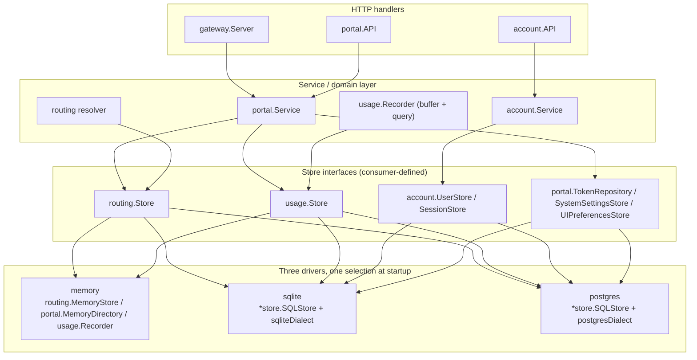

# Persistence

How OnPrem AI Gateway persists domain state: a store boundary of small,
consumer-defined repository interfaces, backed by three interchangeable
drivers behind one shared query set, migrated forward-only, with narrow-type
and secrecy rules enforced consistently across drivers.

## 1. The store boundary: repository interfaces, not one big store

There is no single monolithic `Store` interface. Each consuming package
declares its own narrow interface(s) for exactly the persistence it needs,
and one concrete backend satisfies all of them per driver:

| Package | Interface(s) | File |
|---|---|---|
| `internal/routing` | `Store` (servers, applications, model mappings, model groups, benchmarks, telemetry, availability, hardware, agent tokens, services, resource groups, principal limits, certificates) | `internal/routing/store.go` |
| `internal/usage` | `Store` (record/query/stats/time-series/energy) | `internal/usage/recorder.go` |
| `internal/account` | `UserStore`, `SessionStore`, `SetPasswordTokenStore` | `internal/account/service.go` |
| `internal/portal` | `UserReader`, `TokenRepository`, `SystemSettingsStore`, `UIPreferencesStore`, plus group/project store interfaces | `internal/portal/service.go`, `internal/portal/group_store.go`, `internal/portal/project_store.go` |
| `internal/auth` | `BearerStore` (token lookup for bearer auth) | `internal/auth` |

For the `sqlite` and `postgres` drivers, **one Go type** —
`*store.SQLStore` (aliased as `store.SQLiteStore` for compatibility) —
implements every one of these interfaces at once (`internal/store/sqlite_*.go`
files, one per concern: `sqlite_routes.go`, `sqlite_usage.go`,
`sqlite_token.go`, `sqlite_user.go`, `sqlite_session.go`,
`sqlite_certificates.go`, `sqlite_resource_groups.go`, …). For the `memory`
driver, each interface is satisfied by its own dedicated in-memory type:
`routing.MemoryStore`, `portal.MemoryDirectory`, and `usage.Recorder` itself
(the recorder *is* the in-memory `usage.Store`).

`gateway/backend/cmd/gateway/main.go` wires the concrete backend exactly
once, at startup, keyed off `OP_AI_GATEWAY_DB_DRIVER`:

```go
switch strings.ToLower(strings.TrimSpace(cfg.DBDriver)) {
case "", "memory":
    deps, cleanup, err = memoryDeps(cfg)
case "sqlite":
    deps, cleanup, err = sqliteDeps(cfg)
case "postgres":
    deps, cleanup, err = postgresDeps(cfg)
}
```

Every other package downstream (services, HTTP handlers) only ever sees its
own narrow interface — it has no way to know, and does not need to know,
whether it is talking to memory, SQLite, or PostgreSQL.

## 2. Three drivers, one query set (the dialect seam)

`OP_AI_GATEWAY_DB_DRIVER` selects one of:

- **`memory`** (default) — plain Go maps/slices behind mutexes, nothing
  survives a restart. Used for local dev, unit tests, and the Playwright e2e
  default profile.
- **`sqlite`** — a single file opened via `store.OpenSQLite` (driver
  `modernc.org/sqlite`, pure Go, no cgo), with `foreign_keys(1)` and
  `busy_timeout(5000)` pragmas set on the DSN.
- **`postgres`** — opened via `store.OpenPostgres` (driver
  `github.com/jackc/pgx/v5/stdlib`), a bounded pool (20 max open, 4 max idle,
  5-minute idle timeout) and a bounded ping-retry loop so the gateway
  tolerates a database that is still starting up alongside it.

`sqlite` and `postgres` are not two separate implementations: they are the
**same `*store.SQLStore` type running the same SQL text**, wrapped one seam
away from the driver-specific bits — the `dialect` interface
(`internal/store/dialect.go`):

```go
type dialect interface {
    name() string           // "sqlite" | "postgres"
    rebind(query string) string
    blobType() string       // "blob"      | "bytea"
    timestampType() string  // "timestamp" | "timestamptz"
    ilike() string          // "like"      | "ilike"
    isUniqueViolation(err error) bool
    isForeignKeyViolation(err error) bool
}
```

- `rebind` rewrites the store's native `?`-style placeholders to Postgres's
  `$1, $2, …` form; SQLite accepts `?` natively and rebinds to a no-op.
- `blobType()` / `timestampType()` parameterize the two BLOB columns
  (`captures.blob`, `chats.blob`) and every timestamp column across the
  schema so the same `CREATE TABLE` text produces `blob`/`timestamp` on
  SQLite and `bytea`/`timestamptz` on Postgres.
- `isUniqueViolation` / `isForeignKeyViolation` classify a driver error into
  the two `storeerr` sentinels (`ErrNotFound`, `ErrConflict`) — by
  message-text sniffing on SQLite (`modernc.org/sqlite` has no typed error),
  by Postgres SQLSTATE code on the pgx side (`23505` unique, `23503` FK).
- A single conversion seam, `sanitizeArgs` (`internal/store/sqlite.go`),
  turns every Go `bool` argument into `int64(0)`/`int64(1)` before the query
  runs: every boolean flag in the schema is a plain integer column on both
  dialects, and while `modernc.org/sqlite` silently coerces a Go `bool` into
  an integer column, pgx's stdlib driver refuses to encode a bare `bool`
  into an `int4` column at all — a real dialect divergence the conformance
  suite caught.



## 3. The migration runner

`internal/store/migrate.go` holds an append-only, ordered slice `migrations`
of 60 entries (see [Data Model (Reference)](../reference/data-model.md) for
the full list). `(*SQLStore).Migrate(ctx)`:

1. Creates `schema_migrations (version integer primary key, name text, applied_at timestamp)`
   if it does not already exist.
2. Reads every already-applied `version` into a set.
3. Sorts `migrations` by version and applies **only the pending ones**, in
   order.
4. For a normal migration: begins a transaction, runs `m.up(ctx, tx, dl)`,
   inserts the `schema_migrations` row for that version in the **same**
   transaction, then commits. A failure at any point rolls the transaction
   back — the database is left at exactly its last successfully-applied
   version, never half-migrated.
5. A migration may instead set `rawUp` — an escape hatch for the one case
   (`migration40`, the `service_accounts` SQLite rebuild) that needs to
   toggle SQLite's `foreign_keys` pragma *outside* any transaction (SQLite
   treats that toggle as a silent no-op once `BEGIN` has run) on the same
   physical connection that then performs the table rebuild. `rawUp` manages
   its own transaction and records its own `schema_migrations` row so the
   DDL and the bookkeeping still commit atomically.

Rules that keep this safe over time:

- **Forward-only, append-only.** New entries are appended with the next
  version number; an already-shipped migration is never edited or reordered.
- **Only-pending.** A fresh install runs all 60 migrations in order, same as
  an upgrade from any earlier version — there is no separate "fresh schema"
  path that could drift from the migration history. `baselineUp` (version 1)
  is a frozen v1 snapshot; every table introduced later (`user_groups`,
  `projects`, `resource_groups`, `certificates`, …) is created **solely** by
  its own migration, never backported into the baseline.
- **Dialect-aware, not dialect-duplicated.** `baselineCreateStatements(dl)`
  builds the same `CREATE TABLE`/`CREATE INDEX` text for both dialects,
  substituting only `dl.blobType()`/`dl.timestampType()`. On SQLite,
  `baselineUp` additionally replays historical renames (`model_hosts` →
  `ai_servers`, `host_telemetry` → `server_telemetry`, dropping the legacy
  `route_affinity`/`model_routes` shapes) and swallows benign
  already-applied errors, because SQLite does not abort a transaction on a
  failed statement; Postgres databases are always created fresh, so its path
  is pure `CREATE TABLE`/`INDEX`.
- **Transactional per migration** (the `rawUp` case still commits its DDL
  and bookkeeping atomically).

### Startup gating

Migrations run automatically on startup only when `OP_AI_GATEWAY_AUTO_MIGRATE`
is true (default `true`; `internal/config/config.go`). `cmd/gateway/main.go`
calls `sqliteStore.Migrate` / `pgStore.Migrate` right after opening the store
and before seeding any default data:

```go
if cfg.AutoMigrate {
    if err := sqliteStore.Migrate(context.Background()); err != nil { ... }
}
```

Setting it to `false` lets an operator apply migrations out-of-band (e.g. a
separate migration job ahead of a rolling deploy) instead of on every process
start.

## 4. The Postgres narrow-type rule

SQLite's `INTEGER` is already a full 64-bit value and its `REAL` is already
an 8-byte IEEE-754 double — and SQLite has no `ALTER COLUMN TYPE` at all — so
a too-narrow column type on SQLite is invisible. Postgres has real `int4`
(`integer`, ~2.1 billion max) and `real` (`float4`, ~7 significant digits)
types that will silently truncate a wider Go value. Two migrations exist
specifically because this bit in production:

- **`bigint`, not `integer`, for any column backing an `int64` Go field or a
  byte count.** The v1 baseline declared `server_telemetry`'s
  `ram_used_bytes`/`ram_total_bytes`/`vram_used_bytes`/`vram_total_bytes` as
  `integer`; a host with more than ~2 GB of RAM/VRAM made every agent
  telemetry POST fail on Postgres (`pgx`: *"greater than maximum value for
  int4"*). `migration4Up` (`server_telemetry_bigint_bytes`) widens them to
  `bigint`; `principal_limits.token_quota_tokens` (migration 41) is `bigint`
  from day one for the same reason (a monthly token quota can exceed int32).
- **`double precision`, not `real`, for any column backing a `float64` Go
  field.** The v1 baseline declared several metric/energy columns as `real`
  (`float4`); summing them (e.g. `SUM(energy_wh)` behind
  `/api/portal/usage/groups`) accumulated visible drift (`0.1 + 1.0` read
  back as `1.1000000014901161`, not `1.1`). `migration43Up`
  (`float_columns_double_precision`) widens every such column to
  `double precision`, unconditionally, across the whole schema.

Both fixes are no-ops on SQLite (already wide enough, and `ALTER COLUMN
TYPE` is unsupported there) and are baked directly into
`baselineCreateStatements` for fresh installs, so only an upgrading database
actually runs the `ALTER TABLE`. **The rule going forward:** any new column
backing an `int64` or a byte-count field must be declared `bigint`; any new
column backing a `float64` field must be declared `double precision`. Never
`integer`/`real` for such columns, even though SQLite would silently accept
either.

## 5. The shared conformance test suite

`internal/store/conformance_test.go` (~40 `TestConformance*` functions) is
the proof that the unified store behaves identically on both SQL dialects.
Every subtest runs through `forEachDialect`:

```go
func forEachDialect(t *testing.T, run func(t *testing.T, s *SQLStore)) {
    t.Run("sqlite", func(t *testing.T) {
        // fresh temp-file DB, migrated, always runs
    })
    t.Run("postgres", func(t *testing.T) {
        dsn := os.Getenv("OP_AI_GATEWAY_TEST_POSTGRES_DSN")
        if dsn == "" {
            t.Skip(...) // never fails when no DSN is configured
        }
        // schema dropped + freshly migrated, then the same test body runs
    })
}
```

SQLite subtests always run (a fresh temp file per subtest, no setup
required). Postgres subtests run only when `OP_AI_GATEWAY_TEST_POSTGRES_DSN`
is set — CI/dev without a Postgres instance simply skips them rather than
failing. Coverage spans user/session/token CRUD and FK cascades, the full
server/application/model-mapping graph, NetBird columns, energy config,
telemetry/availability samples, benchmarks, usage record/query/stats/groups,
captures/chats, system settings and UI preferences — plus two dedicated
regression tests, `TestMigration4UpgradesInt4ToBigint` and
`TestMigration43WidensRealToDoublePrecision`, that specifically assert the
narrow-type rule above survives an *upgrade* path (not just a fresh
install). Any new store method is expected to gain a conformance subtest
here, not a dialect-specific one-off test.

## 6. Secrets are never written unencrypted to disk

Three independent call sites — `internal/capture/secret.go`
(`SealSecret`/`OpenSecret`, for capture blobs), `portal.Service`
(`sealSecret`/`openSecret`, for the SMTP password, the NetBird token, and
certificate/CA keys), and `account.Service` (`sealSecret`/`openSecret`, for
TOTP secrets) — all implement the exact same envelope convention:

| Situation | Stored value |
|---|---|
| A cipher is configured (`OP_AI_GATEWAY_CAPTURE_ENCRYPTION_KEY` / `OP_AI_GATEWAY_CERT_ENCRYPTION_KEY`) | `"enc:" + base64(cipher.Seal(plaintext))` |
| No cipher, but the store is **volatile** (in-memory driver) | `"plain:" + plaintext` — acceptable because it never reaches disk and is gone on process exit |
| No cipher, and the store is **durable** (SQLite/Postgres) | Rejected: `SealSecret` returns `ErrKeyRequired` — plaintext is never persisted to a durable store |

Opening is the strict inverse: an empty value opens to `""`, a `"plain:"`
value returns the raw text, an `"enc:"` value is decrypted (returning
`ErrKeyRequired` if no cipher is configured to open it), and anything else —
an unrecognized prefix, a corrupted envelope — also returns `ErrKeyRequired`
rather than risk leaking a malformed value. Every place that surfaces one of
these secrets over the API exposes only a boolean `*_set`/presence flag
(e.g. whether an SMTP password is configured); the sealed or plaintext value
itself is never returned to a client.

## See also

- [Data Model (Reference)](../reference/data-model.md) — the concrete
  tables, the domain types they back, and the full 60-migration history.
