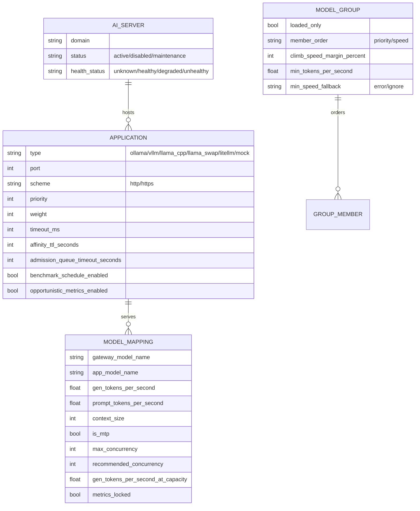
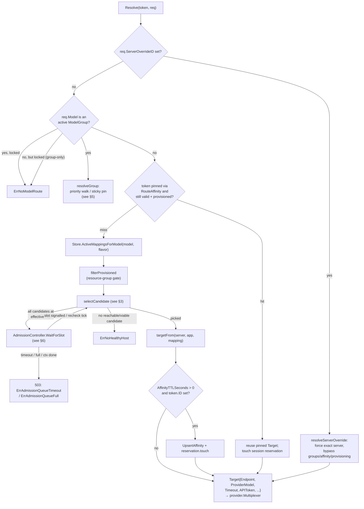
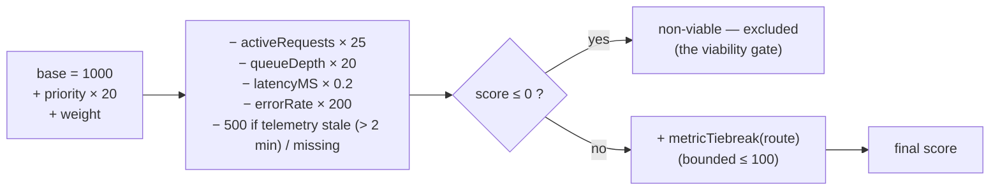
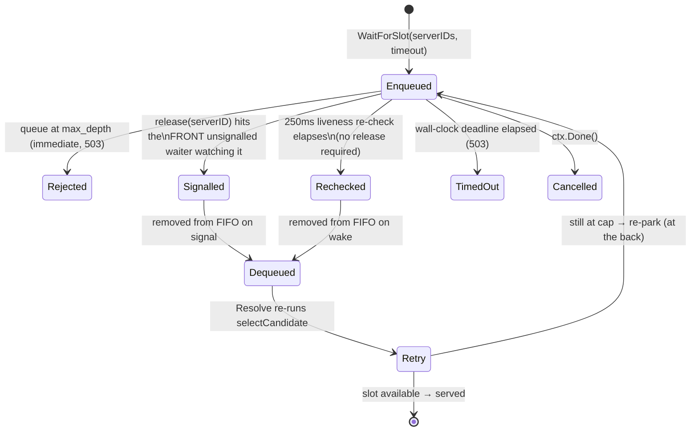

# Routing & Model Selection

How a client's `(model, api_flavor)` request turns into a concrete
`scheme://domain:port` call to an Ollama, llama.cpp, or vLLM application, how
candidates are scored, and how the system learns each mapping's speed and safe
concurrency over time.

## 1. Data model

Routing is entirely data-driven: three store-backed types compose into the
candidate a request can be served from.

A **`MappingCandidate`** (`internal/routing/store.go`) is the join of the three:
one routable path for a public *gateway model name*. `Store.ActiveMappingsForModel(ctx,
gatewayModel, apiFlavor)` returns every candidate whose mapping is
`status=active`, whose application serves `apiFlavor`, and (implicitly) whose
server exists — health/enablement are filtered later, in the resolver, not the
store query.

`ApplicationEndpoint(server, app)` (`internal/routing/store.go`) composes the
reachable base URL: `scheme://domain:port` plus the server's and application's
optional path suffixes. One exception — the P4 gateway-guided HTTPS switch: when
an application is flipped to proxied HTTPS (`Scheme=="https"` and
`ProxyListenPort != 0`), the reachable origin becomes the agent's local
TLS-terminating proxy listener instead of the plain upstream `Port`; this is
transparent to routing (`Target.Endpoint` is already resolved) and detailed in
[Certificates & TLS](certificates-tls.md).

Applications also carry the routing-tuning fields used below: `Priority` and
`Weight` (scoring), `TimeoutMS` (per-request upstream timeout), a routing
tuning validation rejects negative values for all of them at write time. The
provider dispatch mapping (`cmd/gateway/main.go: providerClients`):

| `AIServer.Provider` / `Application.Type` | `provider.Client` implementation |
|---|---|
| `mock` | `provider.NewMockWithDelay` (dev/test) |
| `ollama` | `provider.NewOllamaClient` |
| `vllm`, `llama_cpp`, `llama_swap`, `litellm` | `provider.NewOpenAICompatibleClient` (shared — all four speak the OpenAI HTTP dialect) |

`ModelGroup` also carries five selection-setting columns, added append-only by
migration `62`: `loaded_only`, `member_order`, `climb_speed_margin_percent`,
`min_tokens_per_second`, `min_speed_fallback` — all defaulting to today's
behavior. §5 documents what each one does and how they combine.

## 2. Resolution pipeline

`Resolver.Resolve` (`internal/routing/resolver.go`) is the single entry point,
invoked once per inference request with the caller's `auth.Token` and the
translated `inference.Request`.

Four branches are mutually exclusive and checked in this order: **server
override** (an explicit, pre-authorized escape hatch used by the portal's
"route to this server" action — it still requires the target to actually offer
the model and be enabled/reachable, unless the caller also forces through an
unreachable one), **model group** dispatch (§5), **route affinity** reuse, and
finally fresh candidate selection.

`filterProvisioned` drops candidates whose server the principal is not
authorized to use under resource-group provisioning (a nil `ProvisioningGate`,
the default, is a no-op — every candidate passes). This is the only place
authorization intersects routing; see
[Security, Authentication & Authorization](security-auth-rbac.md) for the gate
itself.

## 3. Candidate scoring

`selectCandidate` (`internal/routing/resolver.go`) narrows the candidate pool
through a fixed chain of filters, **each of which fails open**: if a filter
would empty the pool (or leave only non-viable survivors), routing falls back
to the pre-filter pool rather than refuse a request a degraded server could
still serve. Order matters — later filters see only what survived earlier ones:

| # | Filter | Rule | Fail-open behavior |
|---|---|---|---|
| 1 | Reachable/selectable | `server.Status==active`, `HealthStatus!=unhealthy`, application reachable (health-check probe), not `ServerBusy` (a benchmark is running on it) | hard — an empty result here is `ErrNoHealthyHost` |
| 2 | Context-fit | estimated prompt tokens (word count × 1.3) + `MaxTokens` must fit the mapping's known `ContextSize` (unknown/0 always fits) | on empty, route without the filter (warn) |
| 3 | Capacity cap (CP3) | keep candidates whose server is below its *effective cap* = `MaxConcurrency − reservedSessions(server)`; unknown `MaxConcurrency` (0) never caps | on empty **and** an admission controller is wired → queue (§6) instead of falling open; otherwise fail-open (warn) |
| 4 | Swap-protection | drop a **not-already-loaded** candidate whose server is actively serving (a request in flight, or completed within `swap_protect_window_seconds`) — loading it now would evict a resident model | on empty, or no viable survivor, fail-open (warn) |
| 5 | Prefer-loaded (dominant, not a filter) | if any survivor already has the requested model resident, that partition is preferred over the rest — but only if it yields a Score-viable pick | fails open to the full pool otherwise |
| 6 | `argmaxByScore` | pick the highest `Score()` (below) among what remains | `ok=false` → `ErrNoHealthyHost` |

Filters 3–5 are all gated on optional collaborators (`ServerActivityChecker`,
`LoadedModelChecker`) being wired; with none wired, resolution is exactly the
filter-1 → filter-6 path (the pre-capacity, pre-swap-protection behavior),
which is the intentional no-op invariant these features were added under.

### 3.1 The score function

`Score()` (`internal/routing/scorer.go`) combines live telemetry, static
priority/weight, and a bounded per-model metric tiebreak:

The viability gate runs **before** the tiebreak: a candidate whose live
health/load penalties already sank it to ≤0 is excluded outright, so a fast
benchmark score can never rescue a degraded server. `validTelemetry` also
rejects negative counters or an out-of-range/`NaN`/`Inf` error rate outright.

`metricTiebreak` (capped at `genThroughputBonusCap(50) +
promptThroughputBonusCap(20) + mtpBonus(30) = 100`, well under the 200-point
error-rate penalty and 500-point stale-telemetry penalty):

| Term | Formula | Cap |
|---|---|---|
| Generation throughput | `effectiveGenTPS(route) × 0.25` | 50 (at 200 tok/s) |
| Prompt (prefill) throughput | `PromptTokensPerSecond × 0.01` | 20 (at 2000 tok/s) |
| MTP flat bonus | `+30` if `IsMTP` | — |

`effectiveGenTPS` is the **load-aware effective-speed** term: it linearly
interpolates a mapping's single-request `GenTokensPerSecond` (at concurrency 1)
toward its measured `GenTokensPerSecondAtCapacity` (at
`RecommendedConcurrency`), using the route's *current* in-flight load
(`CurrentLoad`), and extrapolates beyond `RecommendedConcurrency` with the same
slope (clamped ≥ 0). A mapping with no capacity curve, or an idle server
(`CurrentLoad ≤ 1`), collapses to the flat `GenTokensPerSecond` — byte-identical
to the pre-capacity scoring. All-zero metrics contribute exactly 0 (an
unmeasured mapping scores exactly as it did before any metrics existed).

`routing.ScoreModelServers` (`internal/routing/score_servers.go`) reuses the
same `Score()` path to produce a read-only, session-independent ranking shown
in the portal (`GET /api/portal/model-servers`, its `/events` SSE sibling, and
`GET /api/portal/model-group-servers`) — it never mutates resolver state and
does not apply per-session swap-protection/reservation, since it represents the
*general* live order, not one request's pinned outcome.

## 4. Route affinity

`RouteAffinity` (`internal/routing/store.go`) pins one `(APITokenID, Model,
APIFlavor, SessionID)` key to a concrete `(ApplicationID, ServerID)` so a
conversation keeps talking to the same server while a model is resident there.

- **Key.** `AffinityKey{APITokenID, Model, APIFlavor, SessionID}`, hashed to an
  opaque `aff_<12 bytes of SHA-256>` id. `SessionID` defaults to the
  best-effort **extracted client session** (`ClientSessionID` — Codex
  `session_id`/`prompt_cache_key`, Claude Code
  `x-claude-code-session-id`, portal chat id, or a generic
  `prompt_cache_key`/`user`); `SetAffinitySessionMode(legacy=true)` reverts to
  keying on the explicit `X-OP-AI-Gateway-Session-ID` header only.
- **TTL.** Set only when the serving application's `AffinityTTLSeconds > 0`;
  each hit extends `ExpiresAt` by the same window from *now* (sliding, not
  fixed). An expired, deleted, or now-invalid pin (application
  disabled/re-flavored, server unhealthy/unselectable, benchmark-busy, or the
  mapping gone) is deleted and resolution falls through to fresh selection.
- **Reservation.** Every affinity hit or fresh pin also `touch`es an in-memory,
  per-server `sessionReservation` (window = `session_reservation_window_seconds`,
  default 60s) recording that session as "live" there. The capacity cap (§3,
  filter 3) subtracts this count from `MaxConcurrency` so unpinned traffic
  cannot fill the slots active pinned conversations will return to.

## 5. Model groups

A **`ModelGroup`** (migration `22`) is offered to clients as a synthetic
gateway model name; requesting it walks its members in priority order instead
of resolving a single mapping.

- **Traversal strategies** (`FlattenGroup`, `internal/routing/group_flatten.go`)
  flatten nested subgroups (a member name that is itself a group) into one
  ordered, de-duplicated leaf-model list, each subgroup expanded by **its own**
  strategy:
  - `depth` (default/unknown) — expand each subgroup fully in place before the
    next member.
  - `breadth` — all direct leaf models first, then every subgroup's expansion.
  - `round_robin` — interleave one item per stream (direct models emit once on
    pass 1; each subgroup contributes its next item per pass) — deep pagination
    across sibling groups. A cyclic back-edge or an inactive subgroup
    contributes nothing.
- **Failover modes** (`resolveGroup`, `internal/routing/resolver.go`):
  - `sticky` — prefer the pinned member while it is available (`memberOK`); if
    it is down or every candidate is at capacity, fall through to a fresh
    priority walk and re-pin — never climbs back to a higher-priority member on
    its own.
  - `climb_up` — like sticky, but when the pin is available **and** a
    strictly higher-priority member is too, it switches now if that member is
    already loaded (a free climb — never trades a working pin for a cold
    start), otherwise fires a non-blocking, deduplicated `ModelWarmer.Warm`
    (`internal/gateway/model_warmer.go`, 60s in-flight/cooldown dedup, 60s
    absolute call timeout) and keeps serving the pin this turn; a later turn
    climbs once the target is loaded. Falling **down** when the pin is
    unavailable is always immediate, even to a cold member. Under `loaded_only`
    the warm call is skipped entirely — warming a cold member is exactly what
    the flag avoids. Under `member_order=speed` the free-climb rule gains one
    more gate: see `climb_speed_margin_percent` below.
- **Selection settings** (`ModelGroup`, migration `62`) — four independent,
  combinable settings, all defaulting to today's behavior:
  - `loaded_only` — restricts availability to members with an already-loaded
    candidate. If nothing is loaded for the request, the restriction is
    dropped rather than dead-ending a request (see the relaxation ladder
    below).
  - `member_order` (`priority` default | `speed`) — `speed` ranks each member
    by its fastest *eligible* candidate's `effectiveGenTPS` (§3.1's load-aware
    speed), descending; an unmeasured member sorts last, and ties keep the
    manual order (`sort.SliceStable`), so a group with no measurements
    anywhere behaves exactly as it did before speed ordering existed. Ranking
    runs once per relaxation attempt, not once per request, because a
    member's eligible candidates — and therefore its rank — depend on which
    filters that attempt still has active.
  - `climb_speed_margin_percent` (default 20) — for a speed-ordered group,
    `climb_up` climbs only to a member whose speed exceeds the pin's by more
    than this margin; `0` is a legitimate "no margin" value (any strictly
    faster candidate then wins), and only a negative value is clamped to 0.
    A priority-ordered group ignores this setting entirely.
  - `min_tokens_per_second` (0 = off) + `min_speed_fallback` (`error` |
    `ignore`) — a floor on the same load-aware `effectiveGenTPS`, applied per
    **candidate**, not per member, so a member with one fast and one slow
    candidate can never be served on the slow one. An unmeasured candidate
    (0 tok/s) never satisfies a nonzero floor. When no candidate anywhere
    reaches it, `error` surfaces `ErrNoHealthyHost` (503); `ignore` re-resolves
    the group without the floor.
- **Evaluation order and relaxation.** `min_tokens_per_second` and
  `loaded_only` are both candidate-level filters inside `eligibleCandidates`
  (`internal/routing/resolver.go`), and both the pin check (`selectMember`)
  and the priority/speed walk (`firstAvailable`) go through that same
  function — so a pinned candidate that drops below the floor, or a pinned
  member that is no longer loaded, simply stops counting as "available" and
  falls through to the walk, exactly like a down or at-capacity pin already
  does. Per attempt the order is **pin check → speed floor → loaded-only →
  member ordering → walk** (`resolveGroupOnce`); `resolveGroup` re-attempts
  the whole thing under a **cumulative, monotone relaxation ladder** whenever
  an attempt finds nothing eligible (never on a store error or an
  admission-queue timeout — those propagate immediately):
  1. floor and `loaded_only` both applied, as configured;
  2. `loaded_only` dropped, floor still applied;
  3. neither applied — reached only when `min_speed_fallback=ignore`.

  The loaded-only filter is always dropped before the speed floor, and a
  filter already dropped never reappears in a later attempt. Three
  consequences follow directly from this design:
  - The floor reads the *load-aware* effective speed, so a member can drop
    below it purely because it is currently busy — nothing about the member
    itself needs to change.
  - A session loses its pin when its model is evicted under `loaded_only`,
    and likewise when a pinned candidate falls below the floor — the honest
    outcome in both cases, since continuing to serve the pin would mean
    loading a cold model or serving below the configured floor.
  - A speed-ordered group reads every member's mappings and telemetry on
    every request (`orderMembersBySpeed`), additively to whatever the walk
    itself reads, and the relaxation ladder can repeat that pass once per
    attempt — where a priority-ordered walk stops at the first available
    member. Only a group that opts into `member_order=speed` pays this cost.
- **Error mapping** (§3g of the design): zero members, or no member with any
  live mapping → `ErrNoModelRoute` (unknown model); members exist but all are
  gated (down/non-viable/at-capacity with no admission controller, **or every
  candidate removed by the speed floor or the loaded-only filter**) →
  `ErrNoHealthyHost` — a member that is live but gated by policy is never
  reported as an unknown model.
- **Live priority.** `GroupRegistry` (`internal/gateway/group_registry.go`) is
  the resolver's `GroupResolver`: a pull-fed, in-memory snapshot rebuilt by
  `RefreshGroups` after every group/member/model-setting write (create, update,
  reorder, delete) and swapped in atomically under a lock, so a priority reorder
  or an added/removed member takes effect on the very next request — no
  restart, no cache TTL. A model's `ModelSetting.Visibility=="locked"` makes it
  reachable only via a group (`DirectAllowed` returns false for a direct
  request). The portal's "is this group loaded" rule (`internal/portal/service.go`)
  differs for a `loaded_only` group: normally a group is loaded iff its
  highest-priority *offerable* member is loaded, but for `loaded_only` **any**
  offerable member being loaded makes the group loaded, and `LoadedOn` is the
  union of those members' servers — because for such a group, any of them is
  what would actually be served.

## 6. Concurrency capacity (CP1–CP4)

Four cooperating pieces turn "the model is registered" into "the gateway knows
how many concurrent requests it can safely take and queues the rest instead of
overloading it."

### 6.1 CP1/CP2 — the capacity benchmark engine

`measureMappingCapacity` (`internal/gateway/benchmark_capacity.go`) runs an
OOM-safe concurrency ramp: after a warm pass (ensuring the model is resident),
it fires `n = 1, 2, 4, 8, …` concurrent streaming requests per level (capped at
`capacity_max_concurrency`, default 64) and evaluates **every** applicable stop
signal after each level — never escalating past a tripped one:

| Signal | Trip condition | Meaning |
|---|---|---|
| `error` | any request in the level failed | server can't sustain this level |
| `memory` | VRAM or RAM free fraction < `capacity_vram_safety_margin_percent` (default 10%) on a *fresh* telemetry sample (waited for via a settle interval, default 5s) | the hard OOM guard |
| `queue` | the app's capacity-probe path reported `requests_deferred > 0` **at the peak** while the burst was in flight | this level is over capacity |
| `latency` | mean latency > 4× the level-1 latency | latency collapse — the only ceiling on a target with no probe and flat (pre-allocated) VRAM |
| `slot_ceiling` | all probed slots busy but nothing queued (`processing ≥ total_slots`, `deferred ≤ 0`) | this level **is** the ceiling and served fine — counted as good, then stop escalating |

The memory mode (agent telemetry vs. upstream probe vs. latency-only fallback)
is decided once per run. Every attempted level is recorded as a
`routing.CapacityLevel` (aggregate/per-request tok/s, mean latency, successes/
errors, VRAM/RAM free %, deferred/processing/total slots, `StopReason`) —
persisted as one `BenchmarkRun{Kind:"capacity"}` history row with the full
curve JSON-encoded in `CapacityCurve`, and distilled into:

- **`MaxConcurrency`** — the highest level that passed every check (0 ⇒ not
  even one concurrent request worked; nothing is persisted).
- **`RecommendedConcurrency`** — the highest level whose mean latency stayed
  within 1.5× the level-1 latency (the "no visible slowdown" knee).
- **`GenTokensPerSecondAtCapacity`** — the mean per-request generation rate at
  `RecommendedConcurrency` — feeds `effectiveGenTPS` (§3.1).

`UpdateMappingCapacityMetrics` persists the three distilled scalars atomically,
only when `metrics_locked` is false.

### 6.2 CP3 — the routing capacity cap

Filter 3 of `selectCandidate` (§3): `effectiveCap = MaxConcurrency −
reservedSessions(server)`, compared against the live in-flight count from
`ServerActivityChecker`. `MaxConcurrency == 0` (unmeasured) never caps —
capacity-aware routing is opt-in per mapping, driven purely by whether a
capacity benchmark has ever run.

### 6.3 CP4 — the admission queue

When every candidate is at its effective cap **and** an `AdmissionController`
is wired, `Resolve` parks instead of failing open, via `admissionQueue`
(`internal/gateway/admission_queue.go`) — a bounded, FIFO, cancellable wait
queue, lost-wakeup-safe by construction:

Key properties:

- **Dequeue-on-signal.** `release(serverID)` signals *and* removes the front
  waiter watching that server in one locked step, so two queued waiters can
  never claim the same freed slot and N distinct frees wake N distinct
  waiters — this is what makes the hand-off race-safe.
- **Bounded liveness re-check** (`admissionRecheckInterval`, 250ms). A backstop
  independent of the release signal: it guarantees a slot that frees in the
  window between the resolver's cap-check and the waiter's enqueue (or a
  release that raced/coalesced) is never missed for longer than one interval.
  Without it, an unbounded wait could hang on a lost wakeup with a free slot
  sitting idle.
- **Wall-clock deadline, not a per-wait budget.** The timeout passed to
  `Resolve`'s retry loop is `admission_queue_timeout_seconds` (max across the
  candidate applications; 0 = unbounded) resolved to an **absolute deadline**
  once, at the first park. Each subsequent `WaitForSlot` call gets only the
  *remaining* time — otherwise the 250ms re-check would silently re-arm the
  full budget every iteration and a request under sustained saturation would
  never actually hit its configured 503.
- **Bounded depth** (`admission_queue_max_depth`, default 128) rejects
  immediately (`ErrAdmissionQueueFull`, no wait) once full, rather than piling
  up unbounded parked goroutines.

The model-group path (§5) queues on the **union** of every at-capacity
member's candidate servers, using the same absolute-deadline discipline, and
never silently promotes an established finite deadline back to unbounded even
if the at-capacity set later becomes all-unbounded mid-wait.

## 7. Model-selection metrics

Metrics that feed §3.1's scoring come from three independent sources, all
gated by `metrics_locked` (a manually-pinned mapping never auto-overwrites):

| Source | `metrics_source` | What it measures | Trigger |
|---|---|---|---|
| **Benchmark run** | `"benchmark"` | cold-minus-warm load time, generation/prompt tok/s (`measureMapping` / `measureSpeedTarget`) | manual or scheduled (below) |
| **Opportunistic EWMA** | `"opportunistic"` | gen/prompt tok/s, blended (α=0.2) from every successful **real** inference on an app with `OpportunisticMetricsEnabled` | every live request, no explicit run |
| **Context probe** | (context-size fields only) | usable context window, via the app's `context_probe_path` (e.g. llama.cpp `/props`) | during a benchmark's warm pass, or standalone (`startContextProbe`) |

**Benchmark trigger modes:**

| Mode | How it starts | Notes |
|---|---|---|
| Manual | `POST` on a server/application/mapping scope (`startBenchmark`, `internal/gateway/benchmark_endpoints.go`) | 202 + status; 409 if a run is already in flight on that server, or the server has live in-flight traffic (idle-gated) |
| Scheduled | `Application.BenchmarkScheduleEnabled` + `BenchmarkScheduleIntervalSeconds` (floored at 60s), driven by `StartBenchmarkScheduler`'s 1-minute tick (`internal/gateway/benchmark_scheduler.go`) | speed-only, per-app cadence, idle-gated exactly like manual, skips `metrics_locked` mappings |
| Opportunistic | no run at all — an ambient side effect of `OpportunisticMetricsEnabled` on served traffic | see table above |

A benchmark **measurement kind** (`runBenchmark`'s `mode` argument — distinct
from the trigger modes above) selects what a run does per mapping: `"speed"`
(load time + throughput, the default), `"capacity"` (the CP1/CP2 ramp, §6.1),
`"both"` (speed then capacity, so `metrics_source` ends `"capacity"`), or
`"vision"` (an image-acceptance probe, out of this chapter's scope). Exactly
one benchmark runs per server at a time (`BenchmarkRegistry.TryStart`); the
server is excluded from routing (`ServerBusy`) for its duration.

`IsMTPModelName` (`internal/routing/mtp.go`) is the **MTP heuristic**: a
best-effort, conservative name-substring/token match (a known model family
like `deepseek-v3`/`glm-4.5`, or a standalone `mtp` token) that seeds a new
mapping's `IsMTP` default at creation time — always operator-overridable, and
itself protected by `metrics_locked` once set. It deliberately favors false
negatives over false positives, since a wrong `+30` MTP bonus would bias
selection toward a model that is not actually faster.

**Hybrid swap protection** combines two independent, fail-open signals before a
candidate is allowed to evict a resident model: the *loaded-state* partition
(§3, filter 5 — dominant when it yields a viable pick) and the *activity*
window (§3, filter 4 — in-flight requests, or a completion within
`swap_protect_window_seconds`, default 30s). Either signal alone can protect a
busy server; neither is consulted for a candidate that already has the
requested model resident (serving it is never a swap).

**Live SSE benchmark progress.** `BenchmarkRegistry` (`internal/gateway/benchmark.go`)
holds at most one run per server and fans out every `snapshot`/`progress` frame
to subscribers over `GET /api/portal/servers/{id}/benchmark/events`
(`handleBenchmarkEvents`, `internal/gateway/perf_endpoints.go`): a `snapshot`
frame on connect, then a `progress` frame after each measured mapping and the
terminal finish (including the live `current_concurrency` level during a
capacity ramp), with a 25s heartbeat. A slow subscriber simply drops frames
(each is a full status, not a delta) and recovers on the next one.
`GET /api/portal/benchmarks/active` lists every currently-running benchmark the
caller may see, for a dashboard-style overview without subscribing per server.

## 8. Errors and HTTP mapping

| Routing error | HTTP status | When |
|---|---|---|
| `ErrNoModelRoute` | 502 | no active mapping exists at all for the model/flavor (or the model is a locked group-only name requested directly) |
| `ErrNoHealthyHost` | 502 | mappings exist but every candidate is gated (unhealthy/unreachable/busy/non-viable) |
| `ErrAdmissionQueueTimeout` | 503 | an admission-queued request's deadline elapsed before a slot freed |
| `ErrAdmissionQueueFull` | 503 | the admission queue was already at `admission_queue_max_depth` |
| `ErrServerOverrideModelUnavailable` | 404 | a server-override request named a server that does not offer the model via a live mapping |
| `ErrServerOverrideServerUnavailable` | 502 | a server-override request named a disabled/unreachable server and did not force through it |

## 9. Configuration reference

| Env var | Default | Governs |
|---|---|---|
| `OP_AI_GATEWAY_SWAP_PROTECT_WINDOW_SECONDS` | 30 | §3 filter 4 recency window |
| `OP_AI_GATEWAY_SESSION_RESERVATION_WINDOW_SECONDS` | 60 | §4 reservation liveness window |
| `OP_AI_GATEWAY_CAPACITY_VRAM_SAFETY_MARGIN_PERCENT` | 10 | §6.1 hard OOM guard |
| `OP_AI_GATEWAY_CAPACITY_MAX_CONCURRENCY` | 64 | §6.1 ramp ceiling |
| `OP_AI_GATEWAY_CAPACITY_SETTLE_SECONDS` | 5 | §6.1 inter-level telemetry settle wait |
| `OP_AI_GATEWAY_ADMISSION_QUEUE_MAX_DEPTH` | 128 | §6.3 queue bound |
| `OP_AI_GATEWAY_BENCHMARK_SCHEDULE_DEFAULT_SECONDS` | 86400 | §7 scheduled-mode default cadence |

See [Configuration](configuration.md) for the full variable list.

## Related chapters

- [API Compatibility & Inference](compatibility-and-inference.md) — how a
  client request becomes the `inference.Request` this chapter routes.
- [Security, Authentication & Authorization](security-auth-rbac.md) — the
  `ProvisioningGate` and per-token/service authorization consulted before a
  candidate is offered.
- [Telemetry, Usage Analytics & Observability](telemetry-usage-observability.md) —
  the `ServerTelemetry` this chapter scores against, and how it is produced.
- [Persistence](persistence.md) — the `Store` interface and its SQLite/
  PostgreSQL/memory implementations.
