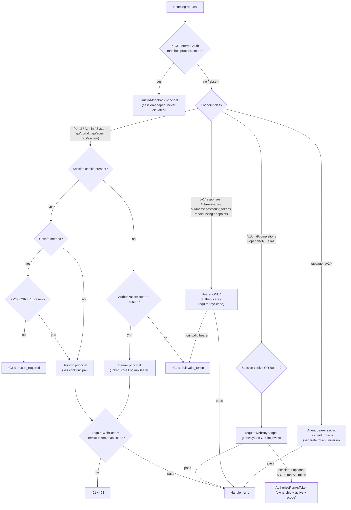
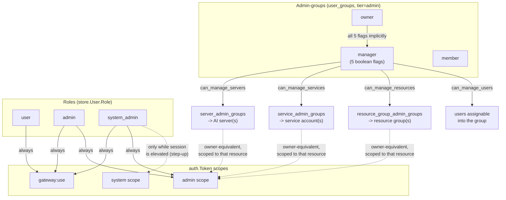
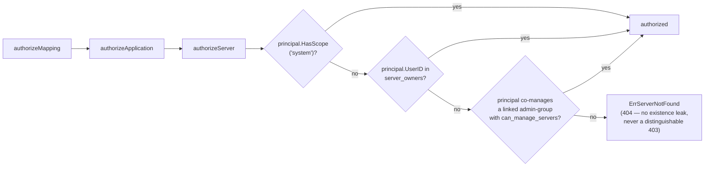

# Security, Authentication & Authorization

How OnPrem AI Gateway identifies a caller, decides what that caller may do, and
keeps secrets, headers, and request bodies safe at rest and in transit.

## 1. Overview: authentication surfaces at a glance

The gateway exposes four distinct authentication surfaces, each with a
different trust boundary:

| Surface | Who uses it | Credential | Handled by |
|---|---|---|---|
| Portal session | The browser SPA | `op_ai_gateway_session` cookie + `X-OP-CSRF` header on unsafe methods | `internal/gateway/auth.go` (`authenticateWeb`) |
| Bearer API token | External OpenAI/Anthropic-compatible clients, Codex, Claude Code, service integrations | `Authorization: Bearer <secret>` | `internal/auth.TokenStore`, `internal/gateway/server.go` (`authenticate`) |
| Internal trusted loopback | The gateway's own background chat-run executor calling itself | `X-OP-Internal-Auth` + `X-OP-Internal-User`, guarded by a per-process secret | `internal/gateway/auth.go` (`authenticateWeb`) |
| Agent token | The `op-ai-server-agent` reporting/proxy process on each AI server | `Authorization: Bearer <agent-secret>` against a separate token universe | `internal/gateway/agent_auth.go` |

`/v1/chat/completions` (and its `/openai/v1/` alias) is the one inference
endpoint that accepts **either** a portal session (+ CSRF) **or** a bearer
token — see [§7](#7-request-authentication-decision-flow). Every other
inference endpoint (`/v1/responses`, `/v1/messages`,
`/v1/messages/count_tokens`, and the `/v0/models`, `/openai/v1/models`,
`/anthropic/v1/models` model-listing endpoints) is **bearer-only**: no session
cookie is accepted there at all.

## 2. Local password authentication

Users authenticate with an email + password pair (`POST /api/auth/login`,
`internal/gateway/auth.go`). There is no separate password-hashing package per
role — every credential, from the first bootstrap admin to a self-service
password change, flows through `internal/auth/password.go`:

- **Policy**: `ValidatePasswordPolicy` enforces a plaintext length of
  10–200 characters. There are no complexity rules (character classes) —
  length is the only enforced dimension.
- **Hashing**: `HashPassword`/`VerifyPassword` use bcrypt at cost 12. Because
  bcrypt only examines the first 72 bytes of its input, the plaintext is first
  reduced to a fixed-size, ASCII, NUL-free digest — `SHA-256(plaintext)`,
  base64-encoded — before being handed to bcrypt. This lets the 200-character
  policy ceiling be enforced without bcrypt silently truncating (and thus
  ignoring) the tail of a long password.
- Password verification, change (`ChangePassword`), and reset (via the
  set-password token flow, [§6](#6-invite--set-password-one-time-tokens)) all
  call the same two functions — there is exactly one password code path in
  the system.

## 3. Portal sessions and CSRF

A successful login issues a **server-side session**, not a signed/stateless
token: `account.Service.IssueSession` generates a random secret, stores only
`SHA-256(secret)` in the `sessions` table (`internal/auth.HashSecret` — the
same hash function bearer tokens use, see [§4](#4-bearer-api-tokens)), and the
raw secret becomes the cookie value.

**Cookie**: name `op_ai_gateway_session`, `HttpOnly`, `SameSite=Lax`,
`Path=/`. `Secure` is controlled by `OP_AI_GATEWAY_SESSION_COOKIE_SECURE`:
`true`/`false` pins it explicitly; left unset, the gateway defaults it to
`Secure=true` unless the bind address (`OP_AI_GATEWAY_ADDR`) is a loopback
address — i.e. "secure by default, permissive only for local development."

**Two independent expiry clocks**, both re-checked on every
`ResolveSessionDetail` call:

- **Idle TTL** (`OP_AI_GATEWAY_SESSION_IDLE_TTL`, default 12h) — **sliding**.
  Every successful resolution touches `LastSeenAt`; the session dies once it
  has been unused for longer than the idle window, regardless of how much
  total time has passed.
- **Max TTL** (`OP_AI_GATEWAY_SESSION_MAX_TTL`, default 168h / 7 days) — a
  **hard cutoff** fixed at `ExpiresAt = issued_at + maxTTL` at issuance time.
  Activity never extends it; the session dies at that wall-clock instant no
  matter how active it was.

A session is also invalidated immediately if the owning user's status is no
longer `active` (disabling a user calls `DeleteSessionsByUser`, revoking every
outstanding session at once) or if the row simply cannot be found (already
logged out, expired-and-swept, etc.). Any invalid session clears the cookie
and returns `401 auth.session_invalid`.

**CSRF**: `authenticateWeb` accepts a session cookie for any method, but for
every *unsafe* method (anything but `GET`/`HEAD`) it additionally requires the
`X-OP-CSRF: 1` header (`csrfOK`), else `403 auth.csrf_required`. Because the
header is not a cookie, it cannot be attached by a cross-site form submission
or ``-style request — only same-origin JavaScript that reads the header
value can set it. Bearer-token requests never need this header (there is no
ambient cookie for a third-party site to ride on).

`GET /api/auth/session` is deliberately public and always returns `200`
(never `401`) — the SPA calls it on every mount to learn its own
authentication state without generating a wall of 401s in the logged-out
case.

## 4. Bearer API tokens

An `auth.Token` (`internal/auth/token_store.go`) is the gateway's single
principal representation — it is what a session, a bearer token, an agent
principal, or the internal loopback all eventually resolve into. Key fields:

| Field | Meaning |
|---|---|
| `Scopes` | see [§10](#10-role-based-access-control) |
| `Kind` | `""`/`"user"` for a normal token, `"service"` for a service-account token (see [§12](#12-delegated--resource-scoped-authorization)) |
| `ModelOverride` / `ModelOverrideRules` | catch-all / per-requested-name rewrite applied before routing; a rule is `{to, offer, hide_target}`, the two switches shaping only this token's model *listing* |
| `UnknownModelRedirect` / `UnknownModelRedirectBlocked` / `UnknownModelFallback` / `LastUsedModel` | the opt-in unknown-model redirect and the marker it aims at — see [Routing & Model Selection §2.1](routing-and-model-selection.md) |
| `AllowedModels` | non-empty only on a service token; a per-model allowlist (empty = every model) |
| `LogCommunication`, `Secret` | this principal's opt-in/secret-visibility flags for [payload capture](#14-capture-redaction-of-sensitive-headers) |
| `ProjectID` | usage-attribution project, user tokens only |
| `ServerOverride`, `ServerOverrideForceUnreachable` | pins every request from this token onto one AI server, bypassing normal routing |

**At rest, a token's secret is never stored** — only
`SHA-256(secret)` (hex-encoded, `auth.HashSecret`) is persisted, and lookup
(`TokenStore.LookupBearer`) re-hashes the presented `Authorization: Bearer
<secret>` value and looks it up by hash. There is no reversible encryption
here because there is nothing to reverse: an active, non-expired match is a
valid token, a miss is not, and the plaintext secret is shown to the operator
exactly once, at creation time.

A user creates their own tokens with `CreateToken`
(`internal/portal/service.go`); requested scopes are validated against what
the creating principal itself already holds
(`gateway:use` requires the owner to already have `gateway:use` or `admin`;
`admin` requires the owner to already have `admin`) — a token can never grant
its creator more than the creator already has. Service tokens
(`CreateServiceTokenResponse`, `internal/portal/service_services.go`) are
different: they are always minted with the single, hardcoded scope
`llm:invoke` — there is no "requested scopes" step for a service token at
all.

## 5. Run-as token (`X-OP-Run-As-Token`)

Portal chat runs as the logged-in **session** principal, but the operator may
want a chat run to inherit a *specific stored API token's* limits, model
overrides, project attribution, or server pin instead of the session's
defaults. `X-OP-Run-As-Token` carries that token's **ID** (not its secret —
the caller is already a CSRF-protected authenticated session, so this header
is a capability *selector*, not a credential) on requests to
`/openai/v1/chat/completions`.

`portal.Service.AuthorizeRunAsToken(ctx, principal, tokenID)` is the sole
authorization point:

1. The token record must belong to `principal.UserID` and be
   `store.TokenStatusActive` — one user can never run as another user's
   token.
2. The token must not be expired.
3. The resulting principal must itself carry `gateway:use`.

On success, the request proceeds as that token's `auth.Token` — its scopes,
`ModelOverride`/`ModelOverrideRules` and redirect settings, capture flags,
project, and server override, not the session's. This is the mechanism the gateway's own
background chat-run executor uses when it calls back into itself over the
internal trusted-loopback path (`X-OP-Internal-Auth`): it optionally attaches
`X-OP-Run-As-Token` to run the executed chat step under a specific token's
identity. If the run-as token itself carries a `ServerOverride`, that takes
precedence over any separately-configured chat server override — the
run-as token's own settings always win.

## 6. Invite & set-password one-time tokens

New users are never given a password directly. An admin (`POST
/api/admin/users`, `admin` scope) creates the user in `invited` status and
the gateway issues a one-time **set-password token**
(`internal/account/service.go`, `set_password_tokens` table):

- Only `SHA-256(secret)` is stored (`SecretHash`) — identical pattern to
  sessions and bearer tokens.
- Expiry: `OP_AI_GATEWAY_...` — the invite TTL defaults to 72h from issuance.
- **Single-use**: redemption does not delete the row, it sets `UsedAt`; a
  second redemption attempt with the same secret is rejected because
  `UsedAt != nil`, exactly as if the token had expired.
- Creating a `system_admin` user through this flow requires the *inviting*
  actor to already hold the `system` scope — an `admin` cannot invite a peer
  `system_admin` into existence.
- `ReissueInvite` (used for both "resend invite" and "admin-triggered password
  reset") first invalidates every other outstanding set-password token for
  that user, then issues a fresh one — only the most recently issued link is
  ever valid.
- Disabling a user invalidates all of that user's outstanding set-password
  tokens in the same step that revokes their sessions.

Redemption (`POST /api/auth/set-password`) validates the new password against
the same policy as any other password change, flips the user's status from
`invited` to `active`, and — unless TOTP is in `required` mode (in which case
enrollment happens first, see [§9](#9-totp-two-factor-authentication)) —
immediately issues a session, so accepting an invite logs the user straight
in.

## 7. Request-authentication decision flow



Two authorization helpers sit behind the session/bearer resolution and are
worth naming explicitly because they differ in an easy-to-miss way:

- `requireWebScope`/`requireWebAnyScope` (`internal/gateway/auth.go`) accept
  **either** a session+CSRF **or** a bearer token, and `requireWebScope`
  additionally rejects a service token outright (`Kind=="service"` may never
  reach a Portal/Admin/System route, regardless of what scope it happens to
  carry) — a defense-in-depth measure against a future handler mistakenly
  granting a service token a scope that opens a Portal route.
- `requireScope`/`requireAnyScope` (`internal/gateway/server.go`) accept
  **only** a bearer token (no session fallback) — this is what backs the
  bearer-only inference endpoints in [§1](#1-overview-authentication-surfaces-at-a-glance).

## 8. Agent authentication

Each AI server runs `op-ai-server-agent`, which authenticates to
`/api/agent/v1/*` with its own bearer secret
(`internal/gateway/agent_auth.go`) against `agent_tokens` — a **separate**
lookup and a separate token universe from user/service bearer tokens; an
agent secret cannot be used against `/v1/chat/completions` and vice versa.

The ten agent endpoints (`telemetry`, `stream` (WebSocket), `system-report`,
`ca`, `certificate`, `proxy-routes`, `features`, `runtime-config`,
`runtime-report`, `download/`) are registered on **both**
the public mux and a dedicated agent mux, so an agent can reach the gateway
either over the public listener or over the NetBird mesh listener. Because
the handler functions are shared, the gateway threads *which listener* served
the request through `r.Context()` (`withAgentListenerContext` /
`isAgentListenerRequest`) rather than relying on anything visible in the
handler itself — this is what lets mesh-only behavior (e.g. gating
`/proxy-routes` to mesh traffic, or only recording a telemetry-transport
"seen over TLS" signal when the mesh listener served the request) stay
correct without duplicating handler code per listener.

### 8.1 The structural rule: an agent endpoint's target comes only from the token

**Any resource id that arrives inside an agent payload must be re-resolved back
to the token's own server before it is used for a write.** The token gives the
server id for free, so trusting an id in the body looks harmless — and it is the
shape the whole agent surface must be reviewed against, because it will recur in
the next agent endpoint that accepts an id.

The worked example is the GPU VRAM write-back on the telemetry path. It
originally took its target from the agent-supplied `spec_id` and checked only
whether that spec's numbers were locked, so **an agent authenticated for server A
could name server B's spec and overwrite B's measured VRAM** — and because the
runtime-config document the gateway assembles prefers a measured value over the
operator's estimate, that changed the figure B's *own* agent did its admission
arithmetic against. The fix resolves spec → mapping → application and requires
`application.ServerID == tokenServerID`; the ownership check runs
**unconditionally and before** the lock check, so a cross-server attempt is
logged at Warn even when the spec happens to be locked.

The same write-back also bounds its store fan-out, because it sits on an endpoint
agents hit every second: the agent-supplied array is truncated (256 entries, 64
GPUs each — clamp, never reject, mirroring the hardware-report clamps) *before*
any resolution is attempted, and the resolve outcome is memoized per distinct
spec id **including failures**. A memo that caches only successes looks correct
and reintroduces the unbounded path: without both, a single 1 MiB telemetry POST
could drive roughly 19,000 store reads.

### 8.2 Free-form text from an agent is redacted safe-by-default

A file-mode agent's runtime report carries the effective configuration with
**env values already masked agent-side**, where the plaintext is; the gateway's
structural re-masking on ingest is defence in depth, not a substitute. (The
redaction *test* correspondingly lives agent-side — a gateway-side test would
assert on values that arrive already masked, looking like coverage while proving
nothing.)

`parse_error` is the second, non-obvious leak path into that table, and it needs
its own rule: **a configuration-loader error routinely quotes the offending
line**, so an unparsed secret-bearing line could reach the report even though
`env` values are masked. The rule is an **allow-list over a closed set of
codes**: the field may only ever be one of the classification codes the agent's
wire contract defines (`json_syntax`, `duplicate_spec_id`, `file_missing`,
`read_failed` — see
[the runtime chapter](agent-runtime-manager.md)), anything else is replaced by
a fixed generic constant, and an **empty** value stays empty, because "this
agent reported no parse failure" is not a redaction case at all. Free text has
no path in, whatever the agent sends.

Two earlier rules were tried and both failed, each a reasonable answer to the
half of the problem it could see, and the pair is worth keeping because a
future reader will otherwise re-derive them:

1. **Keep everything before the first `:`, pass a colon-less string through.**
   Leaked in two shapes: a colon-less message survived verbatim (nothing to
   cut), and a secret sitting *before* the first colon survived too — the split
   kept precisely the wrong half.
2. **Keep that prefix only when it looks like a bare classification token**
   (non-empty, bounded length, no whitespace/quote/`=`). That closed the leak
   and broke the field. The actual producer's every error begins `"runtime: "`,
   so the one reachable non-generic output, for every malformed file an
   operator could write, was the single word `runtime` — a token that looks
   like a meaningful subsystem tag and carries no information at all. Worse, it
   had no empty-input case, and `""` is exactly what a *healthy* agent sends
   (the field is `omitempty`), so it rewrote the healthy case into
   `"config parse error"`: every file-mode agent whose config parsed perfectly
   was stored, and shown in the portal, as one that had failed to parse — with
   the portal suppressing the config view on exactly that field.

The lesson generalises past this field: a redaction heuristic negotiates
between hiding content and reporting a diagnosis, and loses both. Stating what
the field **may contain** ends that negotiation instead of picking a winner,
and it makes both sides readable against the same contract.

### 8.3 What a gateway-authored launch spec may not reach

The [agent-managed model runtime](agent-runtime-manager.md) lets the portal
author a command line that an agent then executes. Three guards make that
acceptable, each of which reads as an arbitrary restriction on a convenience
feature — and removing any one converts portal write access into agent-identity
theft or an allowlist bypass:

1. **`${AGENT_ENV:…}` refuses the agent's own `OP_AGENT_*` namespace**, before
   `getenv` is even consulted. Without it a portal-authored spec could read
   `OP_AGENT_TOKEN` — the bearer secret that authenticates the certificate
   endpoint which issues a **private key** — simply by referencing it in an
   argument or env value that a model process then echoes. The refusal names the
   variable but never a value, and applies identically to `args` and `env`.
2. **The child's environment is built from scratch**: only the spec's expanded
   env plus a small OS-appropriate base — `PATH`, `HOME`, `USERPROFILE`,
   `LOCALAPPDATA`, `SYSTEMROOT`, `WINDIR` — copied from the agent's own
   environment *where present*. Never the agent's full environment, which holds
   that bearer token and every other model's secrets.
3. **A spec `env` key naming one of those base variables is refused outright**,
   in any capitalisation. Permitting the override would reopen the
   relative-binary resolution path the absolute-path allowlist closes, by
   steering a permitted binary's dynamic linker, its Windows DLL search
   (`SystemRoot`) or any helper it shells out to. The reservation set *is* the
   base set — one list in the code, so a name can never be copied into the base
   while remaining spec-overridable.

The hard boundary on *what may execute at all* is the agent-local allowlist, not
the portal's RBAC: `LocalPolicy.Permit` refuses every spec when the binary
allowlist is empty, then matches the binary **exactly** against it, then checks
`work_dir` containment with `filepath.Clean` on both sides plus a
**separator-boundary** comparison — which rejects both `../` traversal and the
sibling-prefix case (`/srv/models-evil` must not pass a `/srv/models` rule; a
naive `strings.HasPrefix` does). Containment is lexical and does **not** resolve
symlinks, deliberately: see
[§11.1 Operational risks](../11-risks-and-technical-debt.md) for why
`EvalSymlinks` would be strictly worse. One operational consequence worth
documenting: **once permitted directories are configured, a spec with an empty
`work_dir` is refused outright**, so configuring them makes `work_dir` mandatory
on every spec — otherwise every spec fails with an inexplicable
`not_permitted`.

Authorization for runtime *writes* introduces no new RBAC rule: it is exactly the
model-mapping write rule — `system` scope, membership in the server's owner list,
or admin-group delegation carrying `can_manage_servers`. **Plain `admin` is not
sufficient.** The portal deliberately gets no new top-level view (no `views.tsx`
entry) so no new RBAC surface appears at all. Every runtime portal method
authorizes **inside `portal.Service`**, never in the gateway handler:
runtime-spec CRUD via `authorizeMapping` (mapping → application → server, with
all failures collapsed to a 404), co-residency and warnings via
`authorizeApplication`, and GPU budgets and the report/SSE views via
`authorizeServer`. The gateway handlers do nothing beyond the web-scope check
and, for the SSE stream, an ownership check **before the first stream byte**. A
new runtime endpoint added at the gateway layer on the assumption that "authz is
handled upstream" would be unauthenticated for resource ownership.

Certificate issuance and mTLS between the gateway and its agents is covered in
[Certificates & TLS](certificates-tls.md); the mesh listener itself in
[Networking & Mesh](networking-mesh.md).

## 9. TOTP two-factor authentication

`internal/totp` implements RFC 6238 (HMAC-SHA1, 6 digits, 30-second step, ±1
step / 30s clock-skew tolerance) using only the standard library for the
algorithm, plus the MIT-licensed `github.com/skip2/go-qrcode` to render the
enrollment QR code. Verification (`Verify`) uses a constant-time comparison
across every candidate step so response timing cannot reveal which step (if
any) matched, and it never panics or returns an error — a malformed secret or
code simply verifies to `false`.

**Pending vs. live secret.** A user has up to two TOTP secrets in play at
once: `TOTPPendingSecret` (freshly generated, unconfirmed) and `TOTPSecret`
(the live secret actually checked at login). `SetPendingTOTP` only ever
writes the pending slot; `ConfirmTOTP` is the *only* path that can promote a
pending secret into the live one (and set `TOTPEnabled=true`). This
separation means a hijacked session cookie alone — which carries no proof of
possessing the physical authenticator — can never rebind or downgrade an
already-enrolled account's 2FA: re-enrolling while already enabled
(`handleTOTPEnroll`) demands a valid **current** TOTP code as step-up proof
before a new pending secret is even generated.

**Sealed at rest.** Both TOTP secret columns are sealed with the same
`enc:`/`plain:` envelope convention described in
[§13](#13-secrets-at-rest), keyed by the capture encryption key — never
stored as plaintext on a disk-backed store.

**Org-wide mode** (`totp_mode`, a system setting: `off` / `optional` /
`required`, default `off`) governs login gating in
`handleAuthLogin` (`internal/gateway/auth.go`):

| Situation | Behavior |
|---|---|
| User already `TOTPEnabled`, mode ≠ `off` | Always challenged for a code — enrollment "sticks" even if the org later relaxes the mode |
| Mode = `required`, user not yet enrolled | Login and first-time enrollment happen in the same round trip: an empty code returns a QR/secret (`totp_enrollment_required`); submitting a valid code confirms enrollment **and** issues the session in one step |
| Mode = `optional`/`off`, user not enrolled | Password alone is sufficient |

Self-service disable (`DELETE /api/portal/totp`) is blocked with `409
auth.totp_disable_forbidden` only while mode is `required`; it is always
allowed under `optional`/`off` — including removing a now-stale enrollment
after an org turns TOTP off entirely. An admin can also force-clear a user's
TOTP (`ResetTOTP`) without knowing any code, which — like disabling a user —
revokes all of that user's sessions in the same step.

## 10. Role-based access control

**Roles** are a flat, informal hierarchy — `user` < `admin` < `system_admin`
— expressed only as scope grants and a handful of role-string comparisons;
there is no numeric rank function anywhere in the codebase. Every session
resolves to an `auth.Token` via `sessionPrincipal`
(`internal/gateway/auth.go`):

| Role | Base scope | `admin` scope | `system` scope |
|---|---|---|---|
| `user` | `gateway:use` | — | — |
| `admin` | `gateway:use` | ✓ | — |
| `system_admin` (not elevated) | `gateway:use` | ✓ | — |
| `system_admin` (elevated — [step-up mode](#system-admin-step-up-mode)) | `gateway:use` | ✓ | ✓ |

The `system` scope is the load-bearing distinction: a `system_admin` who has
not stepped up is, for authorization purposes, indistinguishable from a plain
`admin` on every scope check. Only an active step-up elevates them to
`system`.

**Who may create/promote/demote a `system_admin`**: enforced inline in
`account.Service.UpdateUser`/`InviteUser` — if the *current* role is
`system_admin`, or the update would *make* it one, the acting principal must
itself carry the `system` scope, else `ErrForbiddenRole`. An `admin` can
create or manage other `admin`/`user` accounts freely, but can never touch a
`system_admin` account's role, and can never promote anyone into that role.

**Last-active-admin / last-active-system_admin guards**: any role or status
change that would leave zero other *active* admin-capable users
(`admin` **or** `system_admin` — both count) is rejected with `ErrLastAdmin`;
any change that would leave zero other active `system_admin` users is
rejected with `ErrLastSystemAdmin`. Both guards fire on demotion (role change
away from the protected set) and on deactivation alike — you cannot lock
yourself, or anyone else, out of the last administrative account by either
route.

**Self-service vs. admin update** share one `UserUpdate` struct but are
enforced through two different entry points:

- `UpdateUser` (admin-facing) honors `Role`/`Status` in addition to profile
  fields, and runs every guard above.
- `UpdateOwnProfile` (self-service — language, chat-capture flags) **never
  reads** `Role`/`Status` off the same struct at all, even when the caller
  happens to be a `system_admin` editing their own profile — there is nothing
  to guard because those fields are structurally inert on this path.

### System-Admin step-up mode

A `system_admin` does not carry the `system` scope by default — they must
explicitly elevate (`POST /api/portal/system-admin-mode`), optionally proving
their password again (gated by the `system_admin_mode_require_password`
system setting), before scope checks against `system` start passing. The
elevation is stored per-session as `sessions.elevated_until`
(`SetSessionElevation`) — a **hard** expiry (no sliding renewal on activity),
sized by `OP_AI_GATEWAY_SYSTEM_ADMIN_MODE_TTL_SECONDS` (default 900s / 15
minutes). `DELETE /api/portal/system-admin-mode` (or simply letting the TTL
lapse) drops back to unelevated `admin`-only behavior. Because elevation is a
per-*session* property, opening a second browser/tab with the same user does
not inherit it — each session must step up independently.

### Admin-groups and delegated management

Beyond the three roles, `user_groups` forms a three-tier hierarchy —
`system` → `admin` → `user` — with each group having exactly one **owner**,
any number of **managers**, and any number of plain **members**:

- The **owner** (or a `system`-scope caller) is the only one who may promote/
  demote managers, transfer ownership, or change a manager's permission
  flags.
- A **manager** (`user_group_managers` row) carries five independent boolean
  permission flags — `can_manage_users`, `can_manage_group`,
  `can_manage_servers`, `can_manage_services`, `can_manage_resources` — not a
  bitmask, five separate columns, each defaulting to `true` for a new
  manager row.
- A plain **member** has no management capability at all.

An `admin`-tier group can then be **linked** to a specific resource — an AI
server (`server_admin_groups`), a service account
(`service_admin_groups`), or a resource group
(`resource_group_admin_groups`) — and any owner/manager of that group with
the matching `can_manage_*` flag gets owner-equivalent rights **on that one
resource**, without needing the `admin` scope at all. This is deliberately
narrower than a global admin bypass: see the comparison table in
[§12](#12-delegated--resource-scoped-authorization).

## 11. RBAC structure



## 12. Delegated & resource-scoped authorization

Server/application/model-mapping management deliberately does **not** grant
a bare `admin` scope blanket access. The single choke point is
`portal.Service.authorizeServer`, and application/mapping authorization
delegate straight up to it:



A plain `admin` scope with no ownership and no delegated group reach gets the
exact same 404 as an anonymous stranger — this replaced an earlier "any admin
manages every server" bypass. The same no-existence-leak collapsing pattern
(a missing/forbidden target both surface as "not found") is reused for user
management (`ManageableUserIDs`) and every resource type below.

Authorization reach differs meaningfully by resource type — the following
table is the load-bearing reference for "who can actually touch this":

| Resource | `system` scope | Direct owner list | Admin-group delegation | Plain `admin` scope alone |
|---|---|---|---|---|
| AI server / application / model mapping | always authorized | `server_owners` | `server_admin_groups` + `can_manage_servers` | **not sufficient** |
| Service account | always authorized | — (no owner list; see delegates) | `service_admin_groups` + `can_manage_services` (grant is Full, equivalent to a Full-Delegate) | **not sufficient** (Full-Delegate or the above required) |
| Resource group | always authorized | — (no owner list at all) | `resource_group_admin_groups` + `can_manage_resources` | **not sufficient** |
| User group (any tier) | always authorized (bypasses group-scoping) | group's own `owner_user_id` | manager flags within the group itself | **not sufficient** for a `system`-tier group |
| Project | — (no distinct check found) | `owner_user_id` (or the coupled group's *current* owner) | not narrowed by admin-groups | **sufficient** — any `admin`-scope caller may manage any project |

Projects are the one deliberate asymmetry: unlike servers, services,
resource groups, and user-groups (all narrowed to admin-group delegation),
project management was never restricted beyond the plain `admin` scope.

**Service accounts** (`services` table) are non-human principals: a bearer
token with `Kind=="service"` carries no `UserID`, only `ServiceID` and an
optional `AllowedModels` allowlist. `service_delegates` rows grant humans
rights over a service at two levels — a plain delegate (**Token-Delegate**)
can view the service and manage its API tokens; a delegate with
`can_manage_settings` (**Full-Delegate**) can additionally change its name,
status, delegate list, model allowlist, and admin-group links.
`AllowedModels` enforcement (`internal/gateway/inference_handlers.go`,
`modelAllowed`) is real, not just documentary: an empty allowlist means every
model is permitted (the default, and the only state a *user* token is ever
in — the check is skipped entirely for `Kind != "service"`), while a
non-empty allowlist is checked **after** the whole per-token model-name
resolution — override rules, catch-all, and unknown-model redirect alike — so
neither an override nor a redirect can ever be used to route around it. That
is the general invariant of
[Routing & Model Selection §2.1](routing-and-model-selection.md): those
settings change *which* name is requested, never *what* a token may reach.
It is also why a service token's redirect fallback is validated against the
callable models of the principal **issuing** it (a delegate or an authorized
admin-group manager) rather than against the service's own allowlist — the
write-time check is a usability guard, and the allowlist still refuses the
request at inference time if the two disagree. A service token has no update
endpoint, so those settings are fixed when it is created.

**Projects** attribute usage, not access. A project has plain members
(`project_members`), assigned groups (`project_groups` — any tier, and every
active member of an assigned group counts toward project membership), or, for
a **coupled** project (`coupled_group_id`), no membership of its own at all —
its effective owner and member count are read live off the linked group on
every access, and direct membership edits are rejected
(`ErrProjectCoupled`) in favor of managing the linked group instead. The only
thing project membership gates is whether a user may attribute *their own
token* to that project (`ErrProjectNotMember` on `CreateToken`/`UpdateToken`)
— it has no effect on routing or model access.

**Resource groups** bundle AI servers (`resource_group_servers`) under one
containment root, and their `resource_group_provisions` table controls
**routing eligibility**, not deployment — which principals (user, service,
user-tier group, or admin-tier group) may be *routed to* servers in that
group. This is gated by the `resource_provisioning_enforce` system setting
(default `false`):

- **Opt-in** (`enforce=false`): a server outside every resource group remains
  usable by anyone; a server that *is* in a provisioned resource group is
  usable only by a principal provisioned into (one of) that group.
- **Deny-by-default** (`enforce=true`): a server is usable only if the
  principal is explicitly provisioned into a resource group containing it —
  everything else is denied.

Notably, this check currently has **no role bypass** — even a `system`-scope
principal is subject to the same allow/deny evaluation as anyone else; the
code marks a bypass as a deliberate future extension point, not present
behavior today.

**Principal limits** (`principal_limits`; rate limit, request quota, token
quota, cost budget — each an independent threshold/period pair) apply to
exactly two principal types, `user` and `service`; there is no project- or
token-level limit row. Setting them is admin-only wiring at the HTTP layer —
the portal service functions themselves take no `auth.Token` and enforce
nothing internally.

## 13. Secrets at rest

Every secret the gateway must be able to *read back* (as opposed to a
password or token secret, which is only ever hashed) — the application
upstream API token, the SMTP password, the NetBird admin token, and TOTP
secrets — is sealed with the same envelope convention
(`internal/capture/secret.go`, reimplemented locally in a couple of packages
against their own cipher field but byte-for-byte identical):

```
SealSecret(cipher, volatile, plaintext):
    "" if plaintext == ""
    "enc:" + base64(AES-256-GCM seal)   if a cipher is configured
    "plain:" + plaintext                if no cipher AND the store is volatile (in-memory)
    ErrKeyRequired                      if no cipher AND the store is disk-backed
```

The `plain:` fallback exists purely for the in-memory driver used in
development/tests/e2e — it is never written to disk, and disappears when the
process exits. The important fail-closed property is the third case: a
**disk**-backed store with no encryption key configured refuses to persist
the secret at all, rather than silently writing plaintext to a file that
outlives the process. Reading (`OpenSecret`) mirrors this — an unrecognized
prefix is treated as "key required," never as a chance to leak a possibly
corrupt raw value.

**Two independent keys, deliberately not shared.**
`OP_AI_GATEWAY_CAPTURE_ENCRYPTION_KEY` seals payload captures, chat
transcripts, the SMTP password, the NetBird admin token, and TOTP secrets.
`OP_AI_GATEWAY_CERT_ENCRYPTION_KEY` seals every certificate private key (leaf
keys, the ACME account key, the internal CA key — see
[Certificates & TLS](certificates-tls.md)) and *only* those — there is
deliberately no fallback from the certificate cipher to the capture cipher.
Both are built into an identical AES-256-GCM `capture.Cipher` via
`capture.New`, but the gateway logs a startup warning (never a hard failure)
if the two are ever set to the same value, since that silently defeats the
whole point of scoping and rotating certificate keys independently from
captures.

**Never round-tripped to the client.** Once a secret is sealed, the read-back
API for its owning resource exposes only a boolean presence flag, never the
value (nor even a masked form of it) — e.g. `smtp_password_set`,
`netbird_token_set`, `api_token_set` (an application's upstream API token),
`otlp_endpoint_set`. A settings PATCH/PUT either omits the field (leave
unchanged) or supplies a fresh plaintext value to reseal; there is no read-
modify-write of an existing secret through the API.

Bearer secrets and password credentials follow the *other* pattern described
in [§3](#3-portal-sessions-and-csrf)/[§4](#4-bearer-api-tokens): they are
one-way hashed (`SHA-256` for token/session secrets, bcrypt for passwords),
never sealed for later retrieval, because the gateway never needs to read
them back — only to compare a freshly hashed presented value.

## 14. Capture redaction of sensitive headers

Payload capture (opt-in per token via `LogCommunication`, or forced globally
by the `capture_override` system setting) stores the request/response
exchange for later review in the portal. Before anything is persisted,
`internal/gateway/capture.go` redacts the **request** headers most likely to
carry a live credential — matched case-insensitively since `net/http`
canonicalizes header casing:

| Header | Why it is redacted |
|---|---|
| `Authorization` | bearer token secret |
| `Cookie` | session secret |
| `X-OP-CSRF` | CSRF token |
| `X-OP-Run-As-Token` | run-as token selector |

Each matched header's value is replaced with the literal marker
`[redacted]`; the header *name* is kept so the capture viewer can still show
that the header was present. Response headers are stored verbatim (a
response never carries an inbound credential). On the **translate** path —
where the gateway rewrites a client request into a different upstream
protocol (e.g. Anthropic-shaped in, Chat-Completions-shaped out) — the
translated *upstream* request headers are redacted with the exact same list,
so an upstream API key injected by the gateway itself never leaks into a
capture either; native passthrough has no separate translated headers to
redact because the client bytes already equal the upstream bytes.

Bodies are independently size-capped: `OP_AI_GATEWAY_CAPTURE_MAX_BYTES`
(default 1 MiB) truncates each individual captured request/response body
(a `truncated` flag is stored alongside), while
`OP_AI_GATEWAY_CAPTURE_MEMORY_MAX_BYTES` (default 64 MiB) is a separate,
unrelated ceiling on the *total* size of the in-memory capture/chat store
used only by the `memory` storage driver.

The resulting envelope is gzip-compressed, then — following the scheme in
[§13](#13-secrets-at-rest) — sealed with the capture cipher when one is
configured (`KeyVersion` 1), or stored as plain gzip bytes when running the
volatile in-memory fallback with no cipher configured (`KeyVersion` 0, RAM
only, never written to disk in that mode either).

## 15. Security-relevant request limits

**Control-plane body cap.** Every Portal/Admin/System JSON body is read
through `http.MaxBytesReader` capped at exactly 1 MiB
(`maxJSONBodyBytes = 1 << 20`, `internal/gateway/server.go`) — an oversized
body gets `413` before JSON decoding is even attempted.

**Inference bodies are intentionally uncapped.** `/v1/chat/completions`,
`/v1/responses`, `/v1/messages`, and `/v1/messages/count_tokens` read their
body with no `MaxBytesReader` limit at all, matching the reality that a
chat/completions request can legitimately carry large base64-encoded image
data. The body is still fully buffered into memory — "uncapped" means no
*size* ceiling, not streamed processing.

**Streaming idle watchdog.** A streamed inference response
(`OP_AI_GATEWAY_STREAM_IDLE_TIMEOUT`, default 120s; `0` disables it and
leaves the stream bounded only by client disconnect) is guarded by a
`time.AfterFunc` timer that is reset on every event received from upstream.
If upstream stalls for longer than the idle window with no new event, the
timer fires, cancels the request context, and unwinds the stream cleanly.
Independently, before every SSE chunk is written to the client, the gateway
arms a matching per-write deadline via `http.NewResponseController`, so a
dead/slow *client* connection is caught even between idle-timer resets.

**Lifted deadlines.** Because inference bodies and streams are meant to run
far longer than a typical control-plane request, every inference handler
first clears the HTTP server's own connection-level `ReadTimeout`/
`WriteTimeout` (both 30s by default) for that response
(`liftInferenceDeadlines`), before the stream-specific idle watchdog above
re-imposes its own, purpose-built bound on top. A non-streaming inference
response is left with no write deadline at all — it is bounded only by the
upstream call's own timeout.

## 16. OIDC readiness

The gateway's only implemented authentication method today is local
email+password (optionally gated by TOTP, [§9](#9-totp-two-factor-authentication)).
There is no OIDC/SSO integration, interface, or stub anywhere in the current
codebase — a deployment that needs federated identity must front the gateway
with its own identity-aware proxy for now. The session and scope model
(cookie-carried opaque session ID, resolved server-side to an `auth.Token`)
places no protocol-specific assumption in the request path, which keeps the
door open for an OIDC login method to be added as an additional way to reach
`IssueSession` without touching how sessions, CSRF, or scopes work once
issued.

---

Related: [Certificates & TLS](certificates-tls.md) ·
[Networking & Mesh (NetBird)](networking-mesh.md) ·
[Persistence](persistence.md) · [Configuration](configuration.md) ·
[Configuration & Environment Variables reference](../reference/config-env.md) ·
[HTTP API Surface reference](../reference/api-surface.md)
