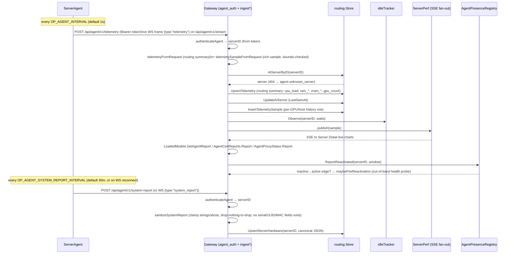
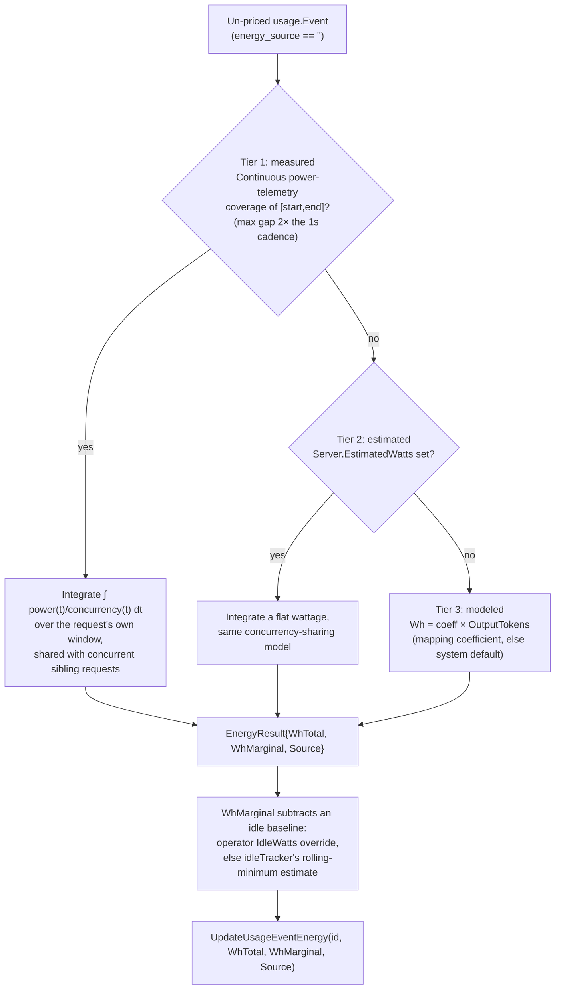
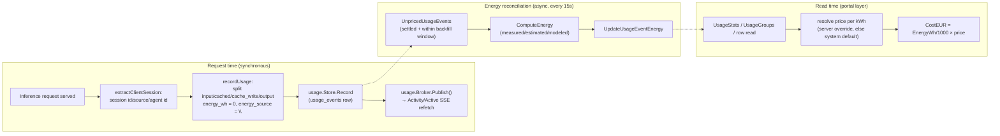

# 8. Telemetry, Usage Analytics & Observability

How OP AI Gateway measures its serving fleet (host, GPU, power, temperature, hardware
inventory), attributes every inference request to a user/token/service/project with
cost and energy, and exposes both as live views plus operator-facing traces and logs.

## 8.1 Overview

Three largely independent data paths feed the portal's analytics surface:

| Path | Producer | Ingest | Storage | Live view |
|---|---|---|---|---|
| Server telemetry | `op-ai-server-agent` (`server-agent/internal/collector`) | `/api/agent/v1/telemetry`, `/api/agent/v1/system-report`, `/api/agent/v1/stream` | `server_telemetry`, `server_telemetry_samples`, `server_hardware`, `server_availability_samples` | Server Detail live charts (SSE), availability timeline |
| Usage & activity | The gateway's own request path (`internal/gateway`) | in-process (`usage.Recorder`/SQL store `Record`) | `usage_events` | Activity table + stats (SSE via `usage.Broker`) |
| Observability | `internal/tracing`, `internal/logbuffer` | in-process (slog + OTel SDK) | in-memory ring (+ optional OTLP export) | Logs view (SSE), OTLP backend |

All three are opt-in or self-limiting by design: tracing defaults to fully disabled
(every span dropped before it is built), payload capture is a separate explicit
opt-in (see the capture chapter), and the ServerAgent never reports anything that
identifies the physical machine (no serials, board/chassis UUIDs, or MAC
addresses).

## 8.2 Server-Agent telemetry collection

`op-ai-server-agent` is a small, CGO-free, cross-platform binary
(`server-agent/main.go`) that runs next to an inference server (Ollama, llama.cpp,
vLLM) and reports what it observes. All collection lives behind narrow interfaces in
`server-agent/internal/collector` (`collector.go`): `HostCollector`, `GPUCollector`,
`PowerCollector`, `TempCollector`, `Scraper`. Composite collectors
(`multiPowerCollector`, `multiTempCollector`) chain an OS-native source with an
optional LibreHardwareMonitor (LHM) HTTP source, taking the first non-nil reading
per metric — CPU and system watts are resolved independently, so a native CPU
reading can coexist with an LHM-sourced system reading.

### 8.2.1 Host metrics

`server-agent/internal/collector/host.go` reads gopsutil (`cpu`, `load`, `mem`,
`net`) once per tick: per-core CPU utilization (`cpu.PercentWithContext`, one call
seeded at startup so the first real tick is not a zero reading), memory/swap
used+total, 1/5/15 load averages (0 on platforms without load-average support), and
one aggregated network-interface counter. Every sub-metric degrades independently to
its zero value on error — a missing subsystem never fails the whole `Collect`.

### 8.2.2 GPU metrics

`DetectGPUCollectors` (`collector.go`) probes, in order, `NewNvidia`, `NewAMD`,
`NewApple` and keeps every one whose `Available()` is true (a host can have more
than one GPU vendor active, e.g. none in practice, but the composition allows it):

| Vendor | File | Tool | Notes |
|---|---|---|---|
| NVIDIA | `nvidia.go` | `nvidia-smi --query-gpu=... --format=csv,noheader,nounits` | Index, name, UUID, util%, mem used/total (MiB→bytes), temp, power draw, fan%, driver version, PCI bus id; `[N/A]`-style sentinels map to 0 |
| AMD | `amd.go` | `rocm-smi --json` (`--showid --showuse --showmemuse --showtemp --showpower --showdriverversion`) | Parses the `cardN`-keyed JSON object; a `"system"` entry supplies the driver version for every card |
| Apple | `apple.go` | `ioreg -r -c IOAccelerator -d 1` | Regex-scrapes the integrated-GPU text dump; always exactly one GPU (`Index 0`); memory is in-use/allocated **system** memory (Apple unified memory has no separate VRAM total) |

### 8.2.3 Power draw (watts)

`DetectPowerCollector(lhmURL)` composes the OS-native collector with an optional LHM
source:

| Source | File | Platform | Mechanism |
|---|---|---|---|
| RAPL | `rapl.go` | Linux | Reads `/sys/class/powercap/intel-rapl:*/energy_uj` and derives watts from the energy delta between consecutive ticks (wraparound-corrected via `max_energy_range_uj`); sums `package*` domains for CPU watts, prefers a `psys` domain for system watts, else falls back to the first readable `hwmon` `power*_input`. `energy_uj` is root-only since CVE-2020-8694, so a non-root agent gets no CPU-watt reading (best-effort, degrades to nil, never an error) |
| powermetrics | `power_darwin.go` | macOS | Runs `powermetrics --samplers cpu_power -n 1` (needs root); CPU package watts only — total system watts is not obtainable CGO-free (SMC PSTR) and stays nil |
| LHM | `lhm_power.go` | Windows (only native CPU-watt path) + Linux fallback | GETs a LibreHardwareMonitor Remote Web Server `/data.json` tree and matches a `"Power"` sensor named `"CPU Package"` (Intel) or bare `"Package"` under a CPU `SensorId` (AMD `/amdcpu/…`), excluding the Intel "System Agent" sub-rail from the system-rail match |

### 8.2.4 CPU temperature

`DetectTempCollector(lhmURL)` mirrors the power composition:

| Source | File | Platform | Mechanism |
|---|---|---|---|
| gopsutil/hwmon | `temp_linux.go` + `temp_pick.go` | Linux | `sensors.TemperaturesWithContext` (no root — hwmon `temp*_input` is world-readable), then `pickCPUTemp` picks a coretemp `package`, else k10temp `tctl`/`tdie`, else a generic `cpu`+`thermal`/`package` sensor |
| LHM | `lhm_temp.go` | Windows (only CPU-temp path) + Linux fallback | Matches a `"Temperature"` sensor named `"CPU Package"`, or `"package"`/`"tctl"`/`"tdie"`/`"die"` under a CPU `SensorId`; explicitly excludes Intel's "Distance to TjMax" countdown sensor |
| — | `temp_other.go` | macOS | No native source; nil unless LHM-equivalent is wired |

### 8.2.5 Static hardware inventory

`CollectHardware` (`hwinfo.go`) builds a one-shot `sample.SystemReport`: CPU
model/vendor/physical-cores/logical-threads and total RAM from gopsutil, OS/kernel
from `host.InfoWithContext`, and per-OS mainboard/BIOS/DIMM detail via
`platformHardware`:

- **Linux** (`hwinfo_linux.go`): mainboard/BIOS from `/sys/class/dmi/id` (`dmi.go`,
  all `0444` world-readable files); per-DIMM detail via `dmidecode -t memory` **only
  when running as root** (else RAM total only).
- **Windows** (`hwinfo_windows.go`): WMI queries (`Win32_BaseBoard`, `Win32_BIOS`,
  `Win32_PhysicalMemory`) needing no admin rights; no serial/UUID column is ever
  selected.
- **macOS** (`system_profiler.go`): `system_profiler` output for mainboard/BIOS
  identity.

Per GPU the report carries `index`, `name`, `uuid`, `driver_version`,
`memory_total_bytes` and `pci_bus_id` — the last three `omitempty`, so a
consumer can tell "not reported" from "reported blank".

**`pci_bus_id` is a display and disambiguation aid, and deliberately not an
identity.** It comes from `nvidia-smi --query-gpu=pci.bus_id` and is therefore
NVIDIA-only: `rocm-smi` and `ioreg` report nothing of this form and leave it
empty rather than inventing an equivalent, so every consumer must render
without it. It exists because 4×/8× identical cards is the normal AI-server
build, and of the handles telemetry actually offers — an `index` that can
renumber across reboots (which is exactly what the GPU-budget rows'
`expected_uuid`/`expected_name` drift detection exists to catch), an opaque
`uuid`, and live utilisation, which is not identity at all — the bus id is the
only one that maps to a physical slot and survives renumbering. Nothing in the
system matches or keys on it: spec GPU rows, budgets and the whole admission
arithmetic key on `index`, and making the bus id a second identity would be a
separate design, not a field addition.

Privacy is a schema-level guarantee, documented on `sample.SystemReport`
(`server-agent/internal/sample/system_report.go`): the struct has **no** serial,
board/chassis UUID, or MAC-address field at all — there is nothing to strip. GPU
`UUID` and `pci_bus_id` are the identifier-like exceptions (device and slot
addresses, not personal or host identity).

### 8.2.6 Optional inference-server scraping

Two more collectors run only when configured: `NewScraper` (`scrape.go`) GETs a
vLLM-style Prometheus `/metrics` endpoint and sums `vllm:num_requests_running`/
`vllm:num_requests_waiting` into the sample's `ActiveRequests`/`QueueDepth`; a
model-status collector (`loaded.go`) polls an OpenAI/llama-swap/llama.cpp/LiteLLM
-shaped endpoint to learn which models are currently loaded, feeding
`LoadedModels`.

### 8.2.7 Unprivileged ICMP ping

`internal/ping` (gateway-side, `gateway/backend/internal/ping/ping.go`) implements a
raw-socket-free ICMP echo over a UDP-datagram ICMP socket
(`golang.org/x/net/icmp`), gated by the kernel's `net.ipv4`/`net.ipv6`
`ping_group_range` including the process GID (`ErrICMPUnavailable` otherwise). On
Linux, an unprivileged `SOCK_DGRAM` ICMP socket rewrites the Echo ID to the socket's
source port for demultiplexing, so a reply's ID never matches what was sent; `PingHost`
therefore matches replies by **Echo `Seq` + the echoed payload bytes**
(`pingPayload = "op-gw-ping"`) instead, which round-trip unchanged on every
platform. This is used for on-demand reachability probes (e.g. NetBird peer checks),
independent of the ServerAgent telemetry stream.

## 8.3 Telemetry ingest: agent → gateway

### 8.3.1 Transports

The agent's main loop (`server-agent/internal/agent/agent.go`) runs a
`select` over independent tickers, each defaulted and clamped in
`server-agent/internal/config/config.go`:

| Env var | Default | Floor | Purpose |
|---|---|---|---|
| `OP_AGENT_INTERVAL` | 1s | 250ms | Telemetry collect+send cadence |
| `OP_AGENT_SYSTEM_REPORT_INTERVAL` | 30m | 1m | Hardware-inventory re-send cadence (POST self-heal; WS re-sends on every reconnect, so this is only a backstop there) |
| `OP_AGENT_TRANSPORT` | `websocket` | — | `post` (one HTTP POST per sample) or `websocket` (one persistent connection) |

On startup the agent collects the hardware inventory once (`collectHardware`),
sends it, then ticks: each cycle runs the composed host/power/temp/GPU collectors
and the optional scraper/model-status poller (each independently best-effort —
one failing source never drops the rest of the sample), builds a `sample.Sample`,
and calls `poster.Post`. The transport is an interface satisfied by either:

- **POST** (`client.Client`): `Authorization: Bearer <OP_AGENT_TOKEN>` on every
  request; up to 3 attempts with exponential backoff, retrying only transport
  errors and 5xx (a 4xx returns immediately).
- **WebSocket** (`client.WSSender`): one persistent connection to
  `/api/agent/v1/stream`, bearer token passed via the dial's HTTP headers; an
  active `pingLoop` (30s interval, 10s timeout) detects a dead connection, and a
  reconnect uses jittered backoff (capped at 30s) or a short jittered delay after a
  clean close/stable session. Both `telemetry` and `system_report` are sent as typed
  JSON frames (`{"type": "...", "data": ...}`) over the same connection.

### 8.3.2 Shared ingest core

Both transports funnel into the **same** transport-agnostic functions on the
gateway side (`gateway/backend/internal/gateway/agent_ingest.go`), so behavior never
diverges between POST and WS:

- `ingestTelemetrySample(ctx, serverID, req, raw)` — per-tick telemetry.
- `ingestSystemReport(ctx, serverID, raw)` — hardware inventory.

Authentication is identical for every agent route
(`gateway/backend/internal/gateway/agent_auth.go`, `authenticateAgent`): extract the
bearer secret, hash it, and resolve it to a `server_id` via
`Routes.LookupAgentToken` — there is no separate "agent identity" field in the
payload; the **token is the server's identity**. A request on the mesh
(NetBird) listener additionally feeds `AgentTransport.Report(serverID, r.TLS !=
nil)` so the mesh-vs-public transport gate never arms on a proxied observation (see
[Security, Auth & RBAC](security-auth-rbac.md) for token issuance and scoping).



A telemetry frame produces **two** persisted representations from one payload: a
compact routing summary (`server_telemetry`, columns `cpu_load`/`ram_*`/`vram_*`/
`gpu_count` — derived from the wire's `host`+`gpus`, per
`server-agent/internal/sample/sample.go`'s wire-contract comment) used by the
scorer, and a rich per-GPU/host history row (`server_telemetry_samples`,
migrations 3/4/28/30) used by the Server Detail charts and the energy engine.
Every numeric field is bounds-checked (`telemetrySampleFromRequest`): non-finite or
negative values are rejected outright for required scalars, and silently coerced to
`nil`/clamped for optional nullable metrics (`CPUPowerW`, `SystemPowerW`,
`CPUTempC`) — a single bad sensor reading degrades gracefully rather than
poisoning the persisted series.

The sample also carries two **additive** keys for the
[agent-managed model runtime](agent-runtime-manager.md), both recorded only
*after* every store write in the ingest has succeeded — a report is evidence, and
evidence is not stamped on a failed write:

- **`capabilities`** — parsed tolerantly as `{"features":[…]}`. Anything
  malformed, wrongly shaped or absent yields an empty feature set and never
  rejects the sample; every other key is ignored, so a new capability key is a
  backward-compatible addition. `AgentFeatures.Set` is a **full-snapshot
  replace**, never a merge. Do not add a version here: the agent version rides on
  the sample's top-level `agent_version`, which is what is persisted and
  rendered.
- **`runtimes`** — one entry per managed spec: `spec_id`, `model`, `state`,
  `since`, `pid`/`port` (omitted when there is no live process), `in_flight`,
  `restarts`, `gpus[]` of `{index, vram_measured_mb}` (omitted when nothing was
  measured this cycle, and explicitly sorted by index because it is built from a
  Go map), and `last_error` of `{message, at, exit_code, failures, stderr_tail}`.
  When a runtime driver is active it **also overrides `loaded_models`** to
  contain only specs in state `running` — `starting` deliberately does not count,
  because prefer-loaded routing must never send traffic to a model that cannot
  answer yet.

Two absent-vs-empty rules on `runtimes` are contracts, not incidental:

1. With **no** runtime driver the sample is byte-identical to the pre-feature
   shape — the key is absent entirely, not `null` and not `[]`. That is the
   compatibility guarantee for every agent that never negotiates the feature, and
   it is pinned by a test asserting the marshalled JSON never contains the
   substring `"runtimes"`.
2. For an agent that *does* support the feature, **every sample must carry the
   full current snapshot.** Omitting the key is additive at the schema level but
   *replaces* the gateway's per-server status snapshot with empty at the
   behaviour level — there is no "leave it as it was" option, which is why the SSE
   `snapshot` and `update` frames carry the identical shape. A bandwidth
   optimisation that sends `runtimes` "only when changed" makes the portal's live
   runtime table visibly flicker empty between ~1 s samples, and looks like a
   portal bug.

The gateway-side runtime status this feeds is held in a **volatile in-RAM
registry and never persisted** (a stderr tail can carry prompt fragments, which
the payload-capture policy forbids at rest); `last_error.stderr_tail` is clamped
on ingest.

**`gpus[]` has two independent consumers, and they answer different
questions.** The write-back below persists it onto the spec's GPU row — the
durable value admission reads — while the status stream republishes it with
`measured_at`, the **gateway's** arrival time for the frame that carried it
(never the sample's own `reported_at`, which is a claim rather than an
observation). Only the stream can answer "how old is this number?": the stored
row carries no timestamp and the write-back skips an unchanged value, so a
store poll reads an arbitrarily old measurement as a fresh one. A measured `0`
reaches neither consumer — it means *unknown* — and a frame that measured
nothing carries neither `gpus[]` nor `measured_at`, so no timestamp is ever
published with nothing to be fresh about. See [Agent-Managed Model
Runtime](agent-runtime-manager.md) §10.

**The write-back skips an unchanged value, and the skip lives on the gateway,
not on the agent.** Rule 2 above forbids the obvious agent-side saving — a spec
whose measurement has not moved must still be *reported*, or the portal's live
table flickers — but nothing obliges the gateway to *rewrite* what it already
holds. It used to: the `UPDATE` was unconditional and every sample is a full
snapshot, so a spec whose measurement was merely stable cost one write per
second per `(spec, gpu)` indefinitely, which on an idle overnight server with a
handful of measured specs is of the order of a million identical `UPDATE`s a day
against a table with a dozen rows. `writeBackRuntimeVRAM` now reads the stored
rows once per distinct writable `spec_id` and writes only what differs.
Comparing against the **store** rather than against what the agent last sent is
what makes it converge: the stored value can change out from under a
long-running agent (deleting and re-adding a GPU row resets it to `0`), and an
agent that had suppressed its own unchanged report would never resend. A failed
read degrades to writing unconditionally — a missed comparison costs one
redundant write, a wrong one would silently drop a real measurement.

> **A recurring wire-shape trap, worth stating once.** A nil Go collection and a
> nil `json.RawMessage` marshal as `null`, not `{}`/`[]`, and the TypeScript
> portal treats `null` as a crash-class value. The countermeasures are structural
> and must be preserved: one canonical `sample.EmptyCapabilities()` shared by
> both `Sample.Normalize()` and the agent's `capabilitiesJSON()` so both
> producers emit identical bytes; the runtime config parser normalising every
> collection; the report builder re-applying that normalisation so a zero-value
> config (the parse-error case) still marshals `[]`/`{}`; and a custom marshaller
> mapping a nil measured-VRAM map to `{}`. Anything handing out a
> `json.RawMessage` must return a **fresh copy per call** — it is a `[]byte`, so a
> package-level literal shared by reference lets any future write through one
> sample's field corrupt the value for every other sample. Any path that builds a
> wire struct without going through the normaliser can reintroduce `null`.

### 8.3.3 Hardware inventory sanitization

`sanitizeSystemReport` (`agent_ingest.go`) enforces `maxHardwareGPUs=64`,
`maxHardwareModules=128`, `maxHardwareStringLen=256`: every free-text field is
truncated via `clampHardwareString`, every numeric field clamped non-negative, and
both slices capped and forced non-nil. The report is then **re-marshaled to a
canonical JSON blob** — since `agentSystemReport` is a fixed Go struct with no
serial/UUID/MAC field, decoding into it and re-encoding intrinsically drops any
extra field a hostile or buggy agent might send; there is no separate deny-list to
maintain. The result is stored verbatim as `routing.ServerHardware.ReportJSON`
(`server_hardware` table, migration 29).

### 8.3.4 Agent presence and reactivation

`AgentPresenceRegistry` (`agent_presence.go`) is an in-memory `map[serverID]lastSeen`
stamped by every successful `ingestTelemetrySample`. `Reporting`/`ReportingWithin`
answer "did this server report within its freshness window", where the *effective*
window is per-server-override-else-system-default
(`routing.EffectiveAgentPresenceTimeoutSeconds`; system default
`OP_AI_GATEWAY_AGENT_PRESENCE_TIMEOUT_SECONDS`, config default **15s**, overridable
live via System Settings). This backs the portal's "Agent" status column
(unconfigured / inactive / active). `ReportReactivated` atomically stamps *and*
reports an inactive→active edge; `maybeFireReactivation` uses that edge to trigger
an immediate out-of-band health/availability probe for just that server instead of
waiting for the fleet-wide health ticker.

### 8.3.5 Server availability history

Availability is sampled by a periodic health loop (`gateway/backend/cmd/gateway`),
independent of the telemetry tick: it derives a server's health from its
reachable/active application counts, and writes one
`routing.ServerAvailabilitySample` (`server_availability_samples`, migrations 23/24/
25/27) whenever `(health, agent_reporting, netbird_connected)` **changes**, or every
5 minutes regardless (a heartbeat anchor so a long unchanged run is still visible).

Because the writer only inserts on change-or-heartbeat, a period where the gateway
itself was not running (or not sampling) leaves a real gap in the raw series that
looks structurally identical to "nothing changed." The read-side reducer
(`routing.ReduceAvailabilitySamples`, `internal/routing/sample_reduce.go`,
called from both the SQLite and in-memory stores) makes this gap explicit rather than letting the
frontend re-infer it: a pre-pass flags `GapBefore = true` on any sample whose raw
predecessor is more than a 10-minute floor away, and the collapsing pass that folds
contiguous same-state runs always preserves state transitions and gap boundaries.
`GET /api/portal/servers/{id}/availability` surfaces this as `gap_before` in
`availabilityPointDTO`; the frontend paints the interval leading into a
`gap_before=true` point as *unknown* rather than incorrectly holding the prior
state forward.

> **`reachable` alone cannot distinguish "confirmed up" from "never checked".**
> The portal's application DTO defaults to `reachable: true` with
> `last_checked_at: null` for a never-probed application — and whenever the
> health-registry reader is nil — because the cold-start default is deliberately
> lenient; only a real probe stamps the timestamp (`enrichReachability`). So any
> alert, UI signal or test assertion that means "a probe has confirmed this" must
> require a **non-null `last_checked_at`**. Without that check, an assertion on
> `reachable: true` cannot fail.

## 8.4 Usage & activity analytics

### 8.4.1 The usage event

Every served request (success or failure) produces exactly one `usage.Event`
(`gateway/backend/internal/usage/query.go`), recorded once at the single accounting
choke point, `Server.recordUsage` (`inference_complete.go`). Its fields cover full attribution:
user/token/service/project id+name, session id/source/agent id, API flavor, model
(requested + effective provider model), route/provider/host, token counts, latency,
HTTP status/error code, content type, and (additively) energy/cost.

The model name is carried through three stages, each its own column: `requested_model`
(the client's original name, before any per-token resolution) → `model` (the
effective gateway model, after the token's override rules, catch-all, and
unknown-model redirect — see
[Routing & Model Selection §2.1](routing-and-model-selection.md)) →
`provider_model` (the upstream application's own model name, after
model-mapping). Keeping the first column is what makes a redirected request
traceable: the pair says both what the client asked for and what it actually
got.

**Token accounting split**: `resp.Usage.InputTokens` is the OpenAI-canonical figure
(includes both cache subsets), kept that way so client-facing responses stay
wire-correct per protocol. `recordUsage` splits it into three **disjoint** stored
buckets so they map cleanly onto Anthropic-style read/write pricing:

```
input_tokens (fresh)  = InputTokens − CachedTokens − CacheWriteTokens   (floored at 0)
cached_tokens          = cache READ tokens
cache_write_tokens     = cache WRITE/creation tokens (0 for OpenAI/Responses)
input + cached + write + output == total_tokens
```

**Cross-protocol session-id signals** (`session_extract.go`): the gateway derives a
per-request `SessionID`/`SessionSource`/`AgentID` from the endpoint-appropriate
natural signal, in priority order — an explicit `X-OP-AI-Gateway-Session-ID`
override header (used by the portal's own chat loopback, source `"chat"`) beats a
per-endpoint header, which beats a per-endpoint request-body field:

| Endpoint | Header signal | Body fallback | Source label |
|---|---|---|---|
| `/v1/responses` (Codex) | `session_id` | `prompt_cache_key` | `codex` |
| `/v1/chat/completions` (generic OpenAI) | — | `prompt_cache_key`, else `user` | `openai` |
| `/v1/messages` (Claude Code / Anthropic) | `x-claude-code-session-id` (+ `x-claude-code-agent-id` for subagents) | `metadata.user_id` | `claude-code` / `anthropic` |

Because Codex and generic OpenAI traffic share `api_flavor="openai"`, the
discriminator is the **endpoint**, not the flavor — `sessionEndpoint` distinguishes
them explicitly.

### 8.4.2 Query, stats, groups, time-series

`usage.Store` (implemented by `usage.Recorder` in-memory and a SQL store behind the
same `dialect` seam) exposes:

- **`Query`** — filtered/sorted/paginated rows (`/api/portal/usage/events`): free-text,
  per-column filters (model/server/session/content-type/provider-path/...),
  numeric range filters over a whitelisted column set (`UsageNumericColumns`), exact
  drill-down pins (`ServerExact`/`SessionIDExact`/`ModelExact`/`ProjectIDExact`) used
  to expand a folded group back into its member rows.
- **`Stats`** — tile totals (`total_requests`, `error_count`, token sums,
  `total_energy_wh`) plus Sturges-binned histograms (`ComputeHistogram`, 5–20 bins,
  P50/P95/P99) of prompt/completion tokens-per-second over the **non-zero** values
  only (`/api/portal/usage/stats`).
- **`UsageGroups`** — folds the filtered set by `session|server|user|token|model|
  service|project` into `(key, host)` buckets (`/api/portal/usage/groups`); the
  portal layer (`service_usage_groups.go`) folds by key across hosts and
  cost-weights each host's energy by that server's resolved price.
- **`TimeSeries`** — buckets events into `[connections, concurrency,
  prompt/completion tokens-per-second, energy_wh]` per bucket
  (`/api/portal/usage/timeseries`); `Connections` attributes to the bucket
  containing `CreatedAt`, while `Concurrency` counts every event whose own
  `[CreatedAt−LatencyMS, CreatedAt]` window overlaps the bucket — the same
  request-window model the energy engine uses (§8.4.4). A pathological
  window/bucket combination is defensively **coarsened** (never truncated) to stay
  under 5000 buckets, so the reported `bucket_seconds` may exceed what was asked
  for but the full requested window is still covered.
- A `usage.Broker` (`broker.go`) is a payload-free fan-out: any write calls
  `Publish()`, and every SSE subscriber (`/api/portal/usage/events`) just re-fetches
  its own scope — no data crosses a user boundary through the broker itself.

### 8.4.3 Running connections (active requests)

`activeRegistry` (`active_requests.go`) is a separate, purely volatile, in-memory
set of in-flight requests (`ActiveRequest`) — the "running connections" live view.
Every `Add`/`Remove` pokes the same `usage.Broker`, so the Activity view's SSE
stream refreshes on both request start and completion, without ever exposing a
payload.

An `ActiveRequest` mirrors the usage event's model-name fields, so the same
three-stage trace described in §8.4.1 (`requested_model` → `model` →
`provider_model`) is readable *while* a request is still running, not only after
it completes. In the running-connections table `requested_model` and `model` are
visible by default — matching the completed-requests table — and
`provider_model` is an opt-in column.

### 8.4.4 Energy attribution

Energy is **not** computed at request time — `recordUsage` always inserts
`energy_wh=0, energy_source=""`, and a separate ticker,
`Server.StartEnergyReconciler` (`energy_reconciler.go`, default interval 15s, env
`OP_AI_GATEWAY_ENERGY_RECONCILE_INTERVAL_SECONDS`), drains events whose
`energy_source==""` and whose request window has *settled* (finished at least
`OP_AI_GATEWAY_ENERGY_SETTLE_SECONDS` ago, default 10s — long enough for
telemetry/sibling events to land) but is still inside a bounded backfill horizon,
so a persistently un-priceable event is retried rather than forever. Idempotency
comes from that same `energy_source==""` selector: every event the reconciler
touches is stamped (even a zero-Wh "modeled" fallback), so a re-run never
reprocesses it.

`ComputeEnergy` (`energy_engine.go`) is a pure, tiered hybrid — it always produces a
result:



Concurrency sharing (`concurrencyBreakpoints`) divides power among every other
event on the same server whose own `[CreatedAt−latency, CreatedAt]` window
overlaps the target's, so N simultaneous requests split one server's draw N ways
rather than each claiming the full reading. `WhMarginal` additionally subtracts an
idle-power baseline — either an operator-configured `AIServer.IdleWatts`, or,
absent that, the emergent estimate from `idleTracker` (`energy_idle.go`): an O(1)
per-server rolling **minimum** of observed watts over a trailing window (default 1h,
env `OP_AI_GATEWAY_ENERGY_IDLE_WINDOW_SECONDS`), fed by `ingestTelemetrySample`
right after every persisted telemetry sample. A measured Tier-1 event also
EWMA-calibrates its mapping's `energy_wh_per_token` coefficient (alpha 0.2), so
Tier-3 estimates for that mapping improve over time from real Tier-1 observations.
A system-wide Power Usage Effectiveness (PUE) multiplier (`effectivePue`) is applied
on top of every tier's raw server-watts figure: the server's own configured value,
else a system default, else 1.0.

### 8.4.5 Cost and currency

Cost is a **transient, read-time** figure — never a DB column, never touched by any
store scanner. The portal layer (`portal/service.go`) resolves each server's price
per kWh (`AIServer.PricePerKwh` when set, else the system-wide
`energy_default_price_per_kwh` setting) and derives `CostEUR = EnergyWh / 1000 ×
price` on `UsageStats`/`UsageGroups`/per-row reads. Each AI server also carries a
display-only `PriceUnit` (migration 37) so the operator's configured currency/unit
label round-trips even though the underlying figure is always computed in the same
base unit.



## 8.5 Observability: tracing and logs

### 8.5.1 OpenTelemetry tracing

`internal/tracing` (`tracing.go`) owns the gateway's opt-in `TracerProvider`. It is
**off by default**: a `dynamicSampler` (`sampler.go`) wraps a
`ParentBased(TraceIDRatioBased(ratio))` sampler behind a live on/off switch, and
disabled means every span is dropped before it does any work (no attributes, no
processor, no export) — the default-fast posture. `Setup` installs the provider as
the OTel global and adds an OTLP-HTTP exporter only when
`OP_AI_GATEWAY_OTLP_ENDPOINT` is set; `OP_AI_GATEWAY_TRACING_ENABLED` (default
false) and `OP_AI_GATEWAY_TRACING_SAMPLE_RATIO` (default 1.0) control the runtime
state, and `/api/system/tracing` (GET/PUT, system scope) flips the master switch
live, no restart. `Start` resolves the tracer via a single atomic-pointer load
(rather than a package-global `otel.Tracer` lookup per span) to keep the disabled
hot path cheap.

Every sampled span is **also** mirrored into the shared log ring
(`logprocessor.go`, `newLogSpanProcessor`) at a custom level, `LevelTrace`
(`slog.LevelDebug - 4`), so an operator can see per-method span lines in the same
portal Logs view without a separate trace backend — gated by the live log level, so
setting it to anything above trace makes the mirror a no-op.

Per-method tracing decorators are **generated**, not hand-written
(`generate.go`, `go generate ./internal/tracing/...`, using
[gowrap](https://github.com/hexdigest/gowrap), a dev-time-only MIT tool):
`internal/routing.Store` is decorated via the package-local OTel template
(`routingstore_gen.go`); `account.API` and `portal.API` are decorated via a
separate **OTel-global** template so the generated file lives inside the
`account`/`portal` package itself and calls `otel.Tracer(...)` directly — avoiding
an import cycle, since `portal` already imports `provider`, which imports
`internal/tracing`.

### 8.5.2 Structured logs

`internal/logbuffer` (`logbuffer.go`) is a bounded in-memory ring
(`OP_AI_GATEWAY_LOG_BUFFER_SIZE`, default 5000) plus an SSE-style fan-out and a
live, runtime-adjustable `slog.LevelVar` (`OP_AI_GATEWAY_LOG_LEVEL`, default
`info`; the live level is also changeable via `PUT /api/system/logs/level` without a
restart). One `*Buffer` backs three sinks simultaneously:

- The process's default `slog` handler (`Buffer.Handler`) — tees every record to
  stderr **and** appends it to the ring.
- A `log.SetOutput` bridge (`NewLogWriter`) that captures legacy `log.Printf` call
  sites as Info-level ring records.
- `GET /api/system/logs` (ring snapshot) and `GET /api/system/logs/events` (SSE:
  a `snapshot` frame on connect, a `record` frame per live append, a 25s
  heartbeat) — the portal's Logs view.

A hard invariant, enforced by construction rather than by filtering: the bearer/
agent token is **never** placed into a log `Record` — call sites only ever attach
attributes that are already known token-free, so the buffer itself has nothing to
redact. Records also carry the active OTel trace/span id when one is present, so a
log line and its mirrored trace span can be correlated.

## 8.6 Configuration reference

| Env var | Default | Effect |
|---|---|---|
| `OP_AGENT_INTERVAL` | `1s` (floor 250ms) | ServerAgent telemetry cadence |
| `OP_AGENT_SYSTEM_REPORT_INTERVAL` | `30m` (floor 1m) | ServerAgent hardware-inventory re-send cadence |
| `OP_AGENT_TRANSPORT` | `websocket` | `post` or `websocket` |
| `OP_AGENT_METRICS_URL` | unset | Optional inference `/metrics` scrape target |
| `OP_AGENT_MODEL_STATUS_URL` / `_FORMAT` | unset / `auto` | Optional loaded-model poll target + response shape |
| `OP_AGENT_LHM_URL` | unset | LibreHardwareMonitor `/data.json` URL (Windows power/temp; Linux fallback) |
| `OP_AI_GATEWAY_TELEMETRY_RETENTION_HOURS` | 168 (7d) | `server_telemetry_samples` retention |
| `OP_AI_GATEWAY_AVAILABILITY_RETENTION_HOURS` | 720 (30d) | `server_availability_samples` retention |
| `OP_AI_GATEWAY_AGENT_PRESENCE_TIMEOUT_SECONDS` | 15 | System-wide default agent-presence freshness window (per-server override possible) |
| `OP_AI_GATEWAY_ENERGY_RECONCILE_INTERVAL_SECONDS` | 15 | Energy-reconciler tick period |
| `OP_AI_GATEWAY_ENERGY_SETTLE_SECONDS` | 10 | How long a request window must have finished before it is eligible for pricing |
| `OP_AI_GATEWAY_ENERGY_IDLE_WINDOW_SECONDS` | 3600 | `idleTracker` rolling-minimum window |
| `OP_AI_GATEWAY_TRACING_ENABLED` | false | Master tracing on/off (also runtime-toggleable) |
| `OP_AI_GATEWAY_TRACING_SAMPLE_RATIO` | 1.0 | `TraceIDRatioBased` sample ratio when enabled |
| `OP_AI_GATEWAY_OTLP_ENDPOINT` | unset | OTLP-HTTP exporter target; unset = logbuffer mirror only |
| `OP_AI_GATEWAY_LOG_LEVEL` | `info` | Initial live log level (`trace`\|`debug`\|`info`\|`warn`\|`error`) |
| `OP_AI_GATEWAY_LOG_BUFFER_SIZE` | 5000 | Log ring capacity |

## 8.7 Cross-references

- Agent-token issuance, scoping, and the mesh-vs-public transport gate:
  [Security, Auth & RBAC](security-auth-rbac.md).
- Live-routing use of the telemetry-derived scoring inputs (`cpu_load`, `ram_*`,
  `vram_*`, benchmarked throughput): the routing & scoring chapter.
- Opt-in encrypted request/response payload capture (a separate consent gate from
  everything in this chapter): the capture chapter.
- TLS certificate distribution fields carried alongside telemetry
  (`CertFingerprint`/`CertMode`/`ProxyRoutes`): the certificates & mTLS chapter.
- The `capabilities` and `runtimes` sample keys in context — what fills them,
  the volatile status registry they feed, and the live SSE stream on top:
  [Agent-Managed Model Runtime](agent-runtime-manager.md).
