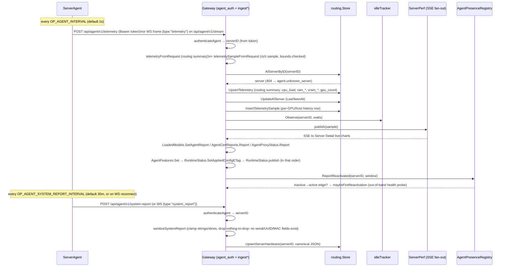
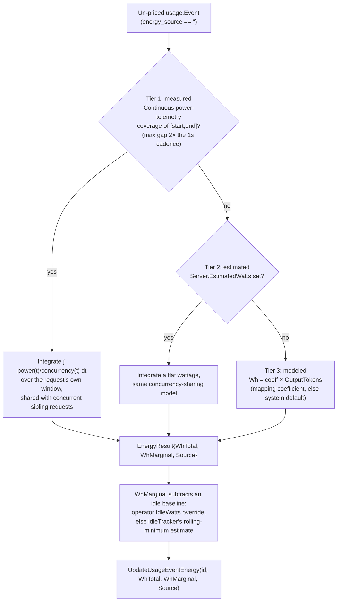
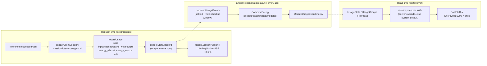

# 8. Telemetry, Usage Analytics & Observability

How OP AI Gateway measures its serving fleet (host, GPU, power, temperature, hardware
inventory), attributes every inference request to a user/token/service/project with
cost and energy, and exposes both as live views plus operator-facing traces and logs.

## 8.1 Overview

Three largely independent data paths feed the portal's analytics surface:

| Path | Producer | Ingest | Storage | Live view |
|---|---|---|---|---|
| Server telemetry | `op-ai-server-agent` (`server-agent/internal/collector`) | `/api/agent/v1/telemetry`, `/api/agent/v1/system-report`, `/api/agent/v1/stream` | `server_telemetry`, `server_telemetry_samples`, `server_hardware`, `server_availability_samples` | Server Detail live charts (SSE), availability timeline |
| Usage & activity | The gateway's own request path (`internal/gateway`) | in-process (`usage.Recorder`/SQL store `Record`) | `usage_events` | Activity table + stats (SSE via `usage.Broker`) |
| Observability | `internal/tracing`, `internal/logbuffer` | in-process (slog + OTel SDK) | in-memory ring (+ optional OTLP export) | Logs view (SSE), OTLP backend |

All three are opt-in or self-limiting by design: tracing defaults to fully disabled
(every span dropped before it is built), payload capture is a separate explicit
opt-in (see the capture chapter), and the ServerAgent never reports anything that
identifies the physical machine (no serials, board/chassis UUIDs, or MAC
addresses).

## 8.2 Server-Agent telemetry collection

`op-ai-server-agent` is a small, CGO-free, cross-platform binary
(`server-agent/main.go`) that runs next to an inference server (Ollama, llama.cpp,
vLLM) and reports what it observes. All collection lives behind narrow interfaces in
`server-agent/internal/collector` (`collector.go`): `HostCollector`, `GPUCollector`,
`PowerCollector`, `TempCollector`, `Scraper`. Composite collectors
(`multiPowerCollector`, `multiTempCollector`) chain an OS-native source with an
optional LibreHardwareMonitor (LHM) HTTP source, taking the first non-nil reading
per metric — CPU and system watts are resolved independently, so a native CPU
reading can coexist with an LHM-sourced system reading.

### 8.2.1 Host metrics

`server-agent/internal/collector/host.go` reads gopsutil (`cpu`, `load`, `mem`,
`net`) once per tick: per-core CPU utilization (`cpu.PercentWithContext`, one call
seeded at startup so the first real tick is not a zero reading), memory/swap
used+total, 1/5/15 load averages (0 on platforms without load-average support), and
one aggregated network-interface counter. Every sub-metric degrades independently to
its zero value on error — a missing subsystem never fails the whole `Collect`.

### 8.2.2 GPU metrics

`DetectGPUCollectors` (`collector.go`) probes, in order, `NewNvidia`, `NewAMD`,
`NewApple` and keeps every one whose `Available()` is true (a host can have more
than one GPU vendor active, e.g. none in practice, but the composition allows it):

| Vendor | File | Tool | Notes |
|---|---|---|---|
| NVIDIA | `nvidia.go` | `nvidia-smi --query-gpu=... --format=csv,noheader,nounits` | Index, name, UUID, util%, mem used/total (MiB→bytes), temp, power draw, fan%, driver version, PCI bus id; `[N/A]`-style sentinels map to 0 |
| AMD | `amd.go` | `rocm-smi --json` (`--showid --showuse --showmemuse --showtemp --showpower --showdriverversion`) | Parses the `cardN`-keyed JSON object; a `"system"` entry supplies the driver version for every card |
| Apple | `apple.go` | `ioreg -r -c IOAccelerator -d 1` | Regex-scrapes the integrated-GPU text dump; always exactly one GPU (`Index 0`); memory is in-use/allocated **system** memory (Apple unified memory has no separate VRAM total) |

### 8.2.3 Power draw (watts)

`DetectPowerCollector(lhmURL)` composes the OS-native collector with an optional LHM
source:

| Source | File | Platform | Mechanism |
|---|---|---|---|
| RAPL | `rapl.go` | Linux | Reads `/sys/class/powercap/intel-rapl:*/energy_uj` and derives watts from the energy delta between consecutive ticks (wraparound-corrected via `max_energy_range_uj`); sums `package*` domains for CPU watts, prefers a `psys` domain for system watts, else falls back to the first readable `hwmon` `power*_input`. `energy_uj` is root-only since CVE-2020-8694, so a non-root agent gets no CPU-watt reading (best-effort, degrades to nil, never an error) |
| powermetrics | `power_darwin.go` | macOS | Runs `powermetrics --samplers cpu_power -n 1` (needs root); CPU package watts only — total system watts is not obtainable CGO-free (SMC PSTR) and stays nil |
| LHM | `lhm_power.go` | Windows (only native CPU-watt path) + Linux fallback | GETs a LibreHardwareMonitor Remote Web Server `/data.json` tree and matches a `"Power"` sensor named `"CPU Package"` (Intel) or bare `"Package"` under a CPU `SensorId` (AMD `/amdcpu/…`), excluding the Intel "System Agent" sub-rail from the system-rail match |

### 8.2.4 CPU temperature

`DetectTempCollector(lhmURL)` mirrors the power composition:

| Source | File | Platform | Mechanism |
|---|---|---|---|
| gopsutil/hwmon | `temp_linux.go` + `temp_pick.go` | Linux | `sensors.TemperaturesWithContext` (no root — hwmon `temp*_input` is world-readable), then `pickCPUTemp` picks a coretemp `package`, else k10temp `tctl`/`tdie`, else a generic `cpu`+`thermal`/`package` sensor |
| LHM | `lhm_temp.go` | Windows (only CPU-temp path) + Linux fallback | Matches a `"Temperature"` sensor named `"CPU Package"`, or `"package"`/`"tctl"`/`"tdie"`/`"die"` under a CPU `SensorId`; explicitly excludes Intel's "Distance to TjMax" countdown sensor |
| — | `temp_other.go` | macOS | No native source; nil unless LHM-equivalent is wired |

### 8.2.5 Static hardware inventory

`CollectHardware` (`hwinfo.go`) builds a one-shot `sample.SystemReport`: CPU
model/vendor/physical-cores/logical-threads and total RAM from gopsutil, OS/kernel
from `host.InfoWithContext`, and per-OS mainboard/BIOS/DIMM detail via
`platformHardware`:

- **Linux** (`hwinfo_linux.go`): mainboard/BIOS from `/sys/class/dmi/id` (`dmi.go`,
  all `0444` world-readable files); per-DIMM detail via `dmidecode -t memory` **only
  when running as root** (else RAM total only).
- **Windows** (`hwinfo_windows.go`): WMI queries (`Win32_BaseBoard`, `Win32_BIOS`,
  `Win32_PhysicalMemory`) needing no admin rights; no serial/UUID column is ever
  selected.
- **macOS** (`system_profiler.go`): `system_profiler` output for mainboard/BIOS
  identity.

Per GPU the report carries `index`, `name`, `uuid`, `driver_version`,
`memory_total_bytes` and `pci_bus_id` — the last three `omitempty`, so a
consumer can tell "not reported" from "reported blank".

**`pci_bus_id` is a display and disambiguation aid, and deliberately not an
identity.** It comes from `nvidia-smi --query-gpu=pci.bus_id` and is therefore
NVIDIA-only: `rocm-smi` and `ioreg` report nothing of this form and leave it
empty rather than inventing an equivalent, so every consumer must render
without it. It exists because 4×/8× identical cards is the normal AI-server
build, and of the handles telemetry actually offers — an `index` that can
renumber across reboots (which is exactly what the GPU-budget rows'
`expected_uuid`/`expected_name` drift detection exists to catch), an opaque
`uuid`, and live utilisation, which is not identity at all — the bus id is the
only one that maps to a physical slot and survives renumbering. Nothing in the
system matches or keys on it: spec GPU rows, budgets and the whole admission
arithmetic key on `index`, and making the bus id a second identity would be a
separate design, not a field addition.

Privacy is a schema-level guarantee, documented on `sample.SystemReport`
(`server-agent/internal/sample/system_report.go`): the struct has **no** serial,
board/chassis UUID, or MAC-address field at all — there is nothing to strip. GPU
`UUID` and `pci_bus_id` are the identifier-like exceptions (device and slot
addresses, not personal or host identity).

### 8.2.6 Optional inference-server scraping

Two more collectors run only when configured: `NewScraper` (`scrape.go`) GETs a
Prometheus `/metrics` endpoint and sums the running/waiting request counters into
the sample's `ActiveRequests`/`QueueDepth`, auto-detecting the server family per
counter — vLLM (`vllm:num_requests_running`/`vllm:num_requests_waiting`),
llama.cpp (`llamacpp:requests_processing`/`llamacpp:requests_deferred`), or TGI
(`tgi_batch_current_size`/`tgi_queue_size`; added alongside the per-child probe
below, since TGI has no `_running`/`_waiting`-shaped names of its own); a
model-status collector (`loaded.go`) polls an OpenAI/llama-swap/llama.cpp/LiteLLM
-shaped endpoint to learn which models are currently loaded, feeding
`LoadedModels`.

**This scraper targets one external endpoint, agent-wide** — the
`OP_AGENT_METRICS_URL`-configured case for a *classic*, non-managed
application. A `server_agent` mapping's own per-child metrics use the
**same** `NewScraper` type, but pointed at each managed child's own loopback
port and its own resolved `MetricsPath`, and land on the corresponding
`runtimes[]` entry rather than the sample's top-level fields — a
structurally separate, multi-model path that coexists with this one on the
same agent process without conflict. See [Agent-Managed Model
Runtime §3.4](agent-runtime-manager.md#34-runtime-server-kind-and-per-kind-probe-path-derivation)
and [§10](agent-runtime-manager.md#10-runtime-status-volatile-and-a-full-snapshot-every-time).

### 8.2.7 Unprivileged ICMP ping

`internal/ping` (gateway-side, `gateway/backend/internal/ping/ping.go`) implements a
raw-socket-free ICMP echo over a UDP-datagram ICMP socket
(`golang.org/x/net/icmp`), gated by the kernel's `net.ipv4`/`net.ipv6`
`ping_group_range` including the process GID (`ErrICMPUnavailable` otherwise). On
Linux, an unprivileged `SOCK_DGRAM` ICMP socket rewrites the Echo ID to the socket's
source port for demultiplexing, so a reply's ID never matches what was sent; `PingHost`
therefore matches replies by **Echo `Seq` + the echoed payload bytes**
(`pingPayload = "op-gw-ping"`) instead, which round-trip unchanged on every
platform. This is used for on-demand reachability probes (e.g. NetBird peer checks),
independent of the ServerAgent telemetry stream.

## 8.3 Telemetry ingest: agent → gateway

### 8.3.1 Transports

The agent's main loop (`server-agent/internal/agent/agent.go`) runs a
`select` over independent tickers, each defaulted and clamped in
`server-agent/internal/config/config.go`:

| Env var | Default | Floor | Purpose |
|---|---|---|---|
| `OP_AGENT_INTERVAL` | 1s | 250ms | Telemetry collect+send cadence |
| `OP_AGENT_SYSTEM_REPORT_INTERVAL` | 30m | 1m | Hardware-inventory re-send cadence (POST self-heal; WS re-sends on every reconnect, so this is only a backstop there) |
| `OP_AGENT_TRANSPORT` | `websocket` | — | `post` (one HTTP POST per sample) or `websocket` (one persistent connection) |

On startup the agent collects the hardware inventory once (`collectHardware`),
sends it, then ticks: each cycle runs the composed host/power/temp/GPU collectors
and the optional scraper/model-status poller (each independently best-effort —
one failing source never drops the rest of the sample), builds a `sample.Sample`,
and calls `poster.Post`. The transport is an interface satisfied by either:

- **POST** (`client.Client`): `Authorization: Bearer <OP_AGENT_TOKEN>` on every
  request; up to 3 attempts with exponential backoff, retrying only transport
  errors and 5xx (a 4xx returns immediately).
- **WebSocket** (`client.WSSender`): one persistent connection to
  `/api/agent/v1/stream`, bearer token passed via the dial's HTTP headers; an
  active `pingLoop` (30s interval, 10s timeout) detects a dead connection, and a
  reconnect uses jittered backoff (capped at 30s) or a short jittered delay after a
  clean close/stable session. Both `telemetry` and `system_report` are sent as typed
  JSON frames (`{"type": "...", "data": ...}`) over the same connection.

### 8.3.2 Shared ingest core

Both transports funnel into the **same** transport-agnostic functions on the
gateway side (`gateway/backend/internal/gateway/agent_ingest.go`), so behavior never
diverges between POST and WS:

- `ingestTelemetrySample(ctx, serverID, req, raw)` — per-tick telemetry.
- `ingestSystemReport(ctx, serverID, raw)` — hardware inventory.

Authentication is identical for every agent route
(`gateway/backend/internal/gateway/agent_auth.go`, `authenticateAgent`): extract the
bearer secret, hash it, and resolve it to a `server_id` via
`Routes.LookupAgentToken` — there is no separate "agent identity" field in the
payload; the **token is the server's identity**. A request on the mesh
(NetBird) listener additionally feeds `AgentTransport.Report(serverID, r.TLS !=
nil)` so the mesh-vs-public transport gate never arms on a proxied observation (see
[Security, Auth & RBAC](security-auth-rbac.md) for token issuance and scoping).



A telemetry frame produces **two** persisted representations from one payload: a
compact routing summary (`server_telemetry`, columns `cpu_load`/`ram_*`/`vram_*`/
`gpu_count` — derived from the wire's `host`+`gpus`, per
`server-agent/internal/sample/sample.go`'s wire-contract comment) used by the
scorer, and a rich per-GPU/host history row (`server_telemetry_samples`,
migrations 3/4/28/30) used by the Server Detail charts and the energy engine.
Every numeric field is bounds-checked (`telemetrySampleFromRequest`): non-finite or
negative values are rejected outright for required scalars, and silently coerced to
`nil`/clamped for optional nullable metrics (`CPUPowerW`, `SystemPowerW`,
`CPUTempC`) — a single bad sensor reading degrades gracefully rather than
poisoning the persisted series.

The sample also carries three **additive** keys for the
[agent-managed model runtime](agent-runtime-manager.md), recorded only
*after* every store write in the ingest has succeeded — a report is evidence, and
evidence is not stamped on a failed write:

- **`capabilities`** — parsed tolerantly as `{"features":[…]}`. Anything
  malformed, wrongly shaped or absent yields an empty feature set and never
  rejects the sample; every other key is ignored, so a new capability key is a
  backward-compatible addition. `AgentFeatures.Set` is a **full-snapshot
  replace**, never a merge. Do not add a version here: the agent version rides on
  the sample's top-level `agent_version`, which is what is persisted and
  rendered.
- **`runtimes`** — one entry per managed spec: `spec_id`, `model`, `state`,
  `since`, `pid`/`port` (omitted when there is no live process), `in_flight`,
  `restarts`, `context_size`/`active_requests`/`queue_depth` (the per-child
  probe result — not `omitempty`, so an agent that never probes a given field
  reports it as an explicit `0` rather than omitting the key; see
  [Agent-Managed Model Runtime
  §10](agent-runtime-manager.md#10-runtime-status-volatile-and-a-full-snapshot-every-time)
  for when each is filled), `metrics_probe`/`context_probe` (each a `string`,
  exactly one of `ok`/`unreachable`/`na`, or `""` when not reported — the
  reachability of the endpoint each numeric field above came from, so a
  forgotten `--metrics` flag or a genuinely unsupported endpoint is no longer
  indistinguishable from a real, measured `0`; see [Agent-Managed Model
  Runtime §10](agent-runtime-manager.md#10-runtime-status-volatile-and-a-full-snapshot-every-time)
  for the exact rules), `gpus[]` of `{index, vram_measured_mb}` (omitted when
  nothing was measured this cycle, and explicitly sorted by index because it is
  built from a Go map), and `last_error` of `{message, at, exit_code, failures,
  stderr_tail}`. When a runtime driver is active it **also overrides
  `loaded_models`** to
  contain only specs in state `running` — `starting` deliberately does not count,
  because prefer-loaded routing must never send traffic to a model that cannot
  answer yet.
- **`runtime_config_applied_etag`** — the ETag of the runtime-config document the agent
  has **applied**: the acknowledgement that turns "the gateway pushed an
  override" into "the override is in force". Top-level, beside `agent_version`,
  because it is a property of the one document and not of any spec — and because
  `runtimes` is omitted entirely for a document with no specs, which is a
  legitimate desired state whose application a caller may well be waiting to
  hear about. Omitted when there is nothing to acknowledge, and the absence is
  the contract a consumer's fallback keys on: an older agent, a `file`-mode
  agent (which discards the gateway's document, so it has none of the gateway's
  to acknowledge), or one whose `runtime_manager` negotiation is not currently
  active. Declared as the agent feature `runtime_config_ack`, because a caller
  cannot otherwise tell "still working on it" from "will never answer".
  What it means precisely, and the boundary that makes it safe to trust, is
  [agent-runtime-manager §7.2](agent-runtime-manager.md#72-the-applied-document-acknowledgement).

**Two ingest-side ordering rules on those registry updates are contracts, not
tidiness.** All of them run **after every store write succeeded** — a report is
evidence about what the agent is doing *right now*, and stamping it while the
sample itself failed to persist would claim a freshness the gateway does not
have. And within them, `runtime_config_applied_etag` is recorded **before** the
runtime-status snapshot is published, because the two are read together by one
consumer: the VRAM benchmark's isolation wait is *woken* by a published frame and
then reads the acknowledgement registry
([agent-runtime-manager §11.6](agent-runtime-manager.md#116-the-vram-benchmark-load-one-model-alone-and-measure-what-it-costs)).
Recording first is what makes "the acknowledgement I can read is at least as
fresh as the frame that woke me" true; reversed, a frame reaches the subscriber
which then reads the *previous* acknowledgement, discards the frame as
inadmissible and waits for the next sample — a telemetry interval each time, and
on a run whose only remaining frame was that one, the whole bound. Both
statements are non-blocking and adjacent, so no deterministic runtime
observation can separate the two orders; the rule is pinned by a source-order
assertion instead (`TestIngestRecordsTheAcknowledgementBeforePublishingTheFrame`,
the technique `cmd/gateway`'s wiring tests already use), with the observable
half — that both facts reach the wait over the wire at all — driven end to end
through this very core.

Two absent-vs-empty rules on `runtimes` are contracts, not incidental:

1. With **no** runtime driver the sample is byte-identical to the pre-feature
   shape — the key is absent entirely, not `null` and not `[]`. That is the
   compatibility guarantee for every agent that never negotiates the feature, and
   it is pinned by a test asserting the marshalled JSON never contains the
   substring `"runtimes"`.
2. For an agent that *does* support the feature, **every sample must carry the
   full current snapshot.** Omitting the key is additive at the schema level but
   *replaces* the gateway's per-server status snapshot with empty at the
   behaviour level — there is no "leave it as it was" option, which is why the SSE
   `snapshot` and `update` frames carry the identical shape. A bandwidth
   optimisation that sends `runtimes` "only when changed" makes the portal's live
   runtime table visibly flicker empty between ~1 s samples, and looks like a
   portal bug.

The gateway-side runtime status this feeds is held in a **volatile in-RAM
registry and never persisted** (a stderr tail can carry prompt fragments, which
the payload-capture policy forbids at rest); `last_error.stderr_tail` is clamped
on ingest.

**`gpus[]` has two independent consumers, and they answer different
questions.** The write-back below persists it onto the spec's GPU row — the
durable value admission reads — while the status stream republishes it with
`measured_at`, the **gateway's** arrival time for the frame that carried it
(never the sample's own `reported_at`, which is a claim rather than an
observation). Only the stream can answer "how old is this number?": the stored
row carries no timestamp and the write-back skips an unchanged value, so a
store poll reads an arbitrarily old measurement as a fresh one. A measured `0`
reaches neither consumer — it means *unknown* — and a frame that measured
nothing carries neither `gpus[]` nor `measured_at`, so no timestamp is ever
published with nothing to be fresh about. See [Agent-Managed Model
Runtime](agent-runtime-manager.md) §10.

**`context_size`/`active_requests`/`queue_depth` split the same way `gpus[]`
does, but each field picks only one of the two homes — never both.**

- **`context_size` is durable, `gpus[]`-style.** `writeBackRuntimeContext`
  (`agent_ingest.go`, run right alongside `writeBackRuntimeVRAM` after every
  store write in the ingest has succeeded) resolves each reported spec id's
  owning mapping — through the **same** server-ownership chain
  (`RuntimeSpecByID` → `MappingByID` → `ApplicationByID` → `application.ServerID`)
  the VRAM write-back uses, so an agent authenticated for one server can never
  overwrite a mapping belonging to another — and, for a value that actually
  changed, calls the **pre-existing** `UpdateMappingContextProbe`: it sets
  `model_mappings.context_size`, `metrics_source = "probe"` (the existing
  provenance value an automated probe writes, alongside `"benchmark"` and
  `"opportunistic"` — see [Routing & Model Selection
  §7](routing-and-model-selection.md#7-model-selection-metrics) — there is no
  separate `"agent"` value), and `metrics_updated_at`. A `metrics_locked`
  mapping is left untouched, exactly like the VRAM write-back's own
  `vram_locked` gate. Comparing against the mapping's **currently stored**
  `context_size` — not against what this spec id reported last sample — is
  what keeps a stable context window from costing one write per second per
  mapping forever, the identical write-amplification argument
  `writeBackRuntimeVRAM` makes above.
- **Live `active_requests`/`queue_depth` are volatile, `measured_at`-style —
  and go one step further: they are never persisted onto a mapping at all.**
  There is no per-mapping active/queue column, and none was added for this
  feature: a number that changes every telemetry cycle is not a fact worth a
  row history, it is the *current* value, and it already has a channel built
  for exactly that — the same volatile in-RAM `RuntimeStatus` registry
  `gpus[]` publishes through, keyed the same way (`spec_id`). What **is**
  durable, and only when the reporting agent declares the `runtime_model_probe`
  capability, is the **per-server** telemetry aggregate:
  `ServerTelemetry.ActiveRequests`/`QueueDepth` are set to the **sum**, each
  runtime clamped to `>= 0` before summing, across every entry in that
  sample's `runtimes[]` —
  **replacing**, never adding to, whatever the legacy top-level scrape (§8.2.6)
  produced, since adding would double-count an agent that still runs both.
  This is what keeps a multi-model `server_agent`'s per-server load figure
  (the one the routing scorer's base telemetry read has always used)
  populated even though no single external `/metrics` target exists for a
  server running several independent children. Live per-model routing and the
  Models catalog read the volatile registry directly rather than the
  per-server aggregate — see [Agent-Managed Model Runtime
  §11.7](agent-runtime-manager.md#117-live-runtime-state-on-the-models-catalog)
  and [Routing & Model Selection
  §3](routing-and-model-selection.md#3-candidate-scoring).

**The reader that needed the watermark, and the discipline it added.** The
**VRAM benchmark**
([agent-runtime-manager §11.6](agent-runtime-manager.md#116-the-vram-benchmark-load-one-model-alone-and-measure-what-it-costs))
is the first consumer that must attribute an observation to something it just
did, and it reads **both** live streams for it: the per-server per-GPU sample
ring (`serverPerfRegistry`) for its before/after totals, and the runtime-status
stream for the drain confirmation *and* the agent's own per-process
measurement. Neither of the two facts it needs can be answered from the store —
a `stopped` row has no timestamp and neither does a measured VRAM value — so
the rule it follows is worth stating for any future reader of these streams:

> **Subscribe first, then act, and count only what the channel delivers.**
> `subscribe` registers its channel under the registry's own lock before it
> returns, and `publish` collects its targets under that same lock, so a frame
> delivered to a subscription was published *after* the registration completed.
> A run that subscribes after its own write therefore knows every frame it
> receives is newer than that write, with no comparison between the gateway's
> clock and the agent's — and it **discards the subscription's snapshot**, which
> is the one thing that may predate it.

That is why the benchmark never polls either registry's stored snapshot for
freshness, and why a pre-existing `stopped` state cannot be mistaken for the
effect of a write the run just made.

**The write-back skips an unchanged value, and the skip lives on the gateway,
not on the agent.** Rule 2 above forbids the obvious agent-side saving — a spec
whose measurement has not moved must still be *reported*, or the portal's live
table flickers — but nothing obliges the gateway to *rewrite* what it already
holds. It used to: the `UPDATE` was unconditional and every sample is a full
snapshot, so a spec whose measurement was merely stable cost one write per
second per `(spec, gpu)` indefinitely, which on an idle overnight server with a
handful of measured specs is of the order of a million identical `UPDATE`s a day
against a table with a dozen rows. `writeBackRuntimeVRAM` now reads the stored
rows once per distinct writable `spec_id` and writes only what differs.
Comparing against the **store** rather than against what the agent last sent is
what makes it converge: the stored value can change out from under a
long-running agent (deleting and re-adding a GPU row resets it to `0`), and an
agent that had suppressed its own unchanged report would never resend. A failed
read degrades to writing unconditionally — a missed comparison costs one
redundant write, a wrong one would silently drop a real measurement.

> **A recurring wire-shape trap, worth stating once.** A nil Go collection and
> a nil `json.RawMessage` marshal as `null`, not `{}`/`[]`, and the TypeScript
> portal treats `null` as a crash-class value. The countermeasures are
> structural and must be preserved: one canonical `sample.EmptyCapabilities()`
> shared by both `Sample.Normalize()` and the agent's `capabilitiesJSON()` so
> both producers emit identical bytes; the same normaliser forcing a non-nil
> `Verdicts` slice inside a per-runtime `Capabilities` wrapper that is itself
> present (a nil WRAPPER is a distinct, meaningful state — see §8.4.3); the
> runtime config parser normalising every collection; the report builder
> re-applying that normalisation so a zero-value config (the parse-error case)
> still marshals `[]`/`{}`; and a custom marshaller mapping a nil
> measured-VRAM map to `{}`. Anything handing out a `json.RawMessage` must
> return a **fresh copy per call** — it is a `[]byte`, so a package-level
> literal shared by reference lets any future write through one sample's field
> corrupt the value for every other sample. Any path that builds a wire struct
> without going through the normaliser can reintroduce `null`.

### 8.3.3 Hardware inventory sanitization

`sanitizeSystemReport` (`agent_ingest.go`) enforces `maxHardwareGPUs=64`,
`maxHardwareModules=128`, `maxHardwareStringLen=256`: every free-text field is
truncated via `clampHardwareString`, every numeric field clamped non-negative, and
both slices capped and forced non-nil. The report is then **re-marshaled to a
canonical JSON blob** — since `agentSystemReport` is a fixed Go struct with no
serial/UUID/MAC field, decoding into it and re-encoding intrinsically drops any
extra field a hostile or buggy agent might send; there is no separate deny-list to
maintain. The result is stored verbatim as `routing.ServerHardware.ReportJSON`
(`server_hardware` table, migration 29).

### 8.3.4 Agent presence and reactivation

`AgentPresenceRegistry` (`agent_presence.go`) is an in-memory `map[serverID]lastSeen`
stamped by every successful `ingestTelemetrySample`. `Reporting`/`ReportingWithin`
answer "did this server report within its freshness window", where the *effective*
window is per-server-override-else-system-default
(`routing.EffectiveAgentPresenceTimeoutSeconds`; system default
`OP_AI_GATEWAY_AGENT_PRESENCE_TIMEOUT_SECONDS`, config default **15s**, overridable
live via System Settings). This backs the portal's "Agent" status column
(unconfigured / inactive / active). `ReportReactivated` atomically stamps *and*
reports an inactive→active edge; `maybeFireReactivation` uses that edge to trigger
an immediate out-of-band health/availability probe for just that server instead of
waiting for the fleet-wide health ticker.

### 8.3.5 Server availability history

Availability is sampled by a periodic health loop (`gateway/backend/cmd/gateway`),
independent of the telemetry tick: it derives a server's health from its
reachable/active application counts, and writes one
`routing.ServerAvailabilitySample` (`server_availability_samples`, migrations 23/24/
25/27) whenever `(health, agent_reporting, netbird_connected)` **changes**, or every
5 minutes regardless (a heartbeat anchor so a long unchanged run is still visible).

Because the writer only inserts on change-or-heartbeat, a period where the gateway
itself was not running (or not sampling) leaves a real gap in the raw series that
looks structurally identical to "nothing changed." The read-side reducer
(`routing.ReduceAvailabilitySamples`, `internal/routing/sample_reduce.go`,
called from both the SQLite and in-memory stores) makes this gap explicit rather than letting the
frontend re-infer it: a pre-pass flags `GapBefore = true` on any sample whose raw
predecessor is more than a 10-minute floor away, and the collapsing pass that folds
contiguous same-state runs always preserves state transitions and gap boundaries.
`GET /api/portal/servers/{id}/availability` surfaces this as `gap_before` in
`availabilityPointDTO`; the frontend paints the interval leading into a
`gap_before=true` point as *unknown* rather than incorrectly holding the prior
state forward.

> **`reachable` alone cannot distinguish "confirmed up" from "never checked".**
> The portal's application DTO defaults to `reachable: true` with
> `last_checked_at: null` for a never-probed application — and whenever the
> health-registry reader is nil — because the cold-start default is deliberately
> lenient; only a real probe stamps the timestamp (`enrichReachability`). So any
> alert, UI signal or test assertion that means "a probe has confirmed this" must
> require a **non-null `last_checked_at`**. Without that check, an assertion on
> `reachable: true` cannot fail.

## 8.4 Usage & activity analytics

### 8.4.1 The usage event

Every served request (success or failure) produces exactly one `usage.Event`
(`gateway/backend/internal/usage/query.go`), recorded once at the single accounting
choke point, `Server.recordUsage` (`inference_complete.go`). Its fields cover full attribution:
user/token/service/project id+name, session id/source/agent id, API flavor, model
(requested + effective provider model), route/provider/host, token counts, latency,
HTTP status/error code, content type, and (additively) energy/cost.

The model name is carried through three stages, each its own column: `requested_model`
(the client's original name, before any per-token resolution) → `model` (the
effective gateway model, after the token's override rules, catch-all, and
unknown-model redirect — see
[Routing & Model Selection §2.1](routing-and-model-selection.md)) →
`provider_model` (the upstream application's own model name, after
model-mapping). Keeping the first column is what makes a redirected request
traceable: the pair says both what the client asked for and what it actually
got.

**Token accounting split**: `resp.Usage.InputTokens` is the OpenAI-canonical figure
(includes both cache subsets), kept that way so client-facing responses stay
wire-correct per protocol. `recordUsage` splits it into three **disjoint** stored
buckets so they map cleanly onto Anthropic-style read/write pricing:

```
input_tokens (fresh)  = InputTokens − CachedTokens − CacheWriteTokens   (floored at 0)
cached_tokens          = cache READ tokens
cache_write_tokens     = cache WRITE/creation tokens (0 for OpenAI/Responses)
input + cached + write + output == total_tokens
```

**Cross-protocol session-id signals** (`session_extract.go`): the gateway derives a
per-request `SessionID`/`SessionSource`/`AgentID` from the endpoint-appropriate
natural signal, in priority order — an explicit `X-OP-AI-Gateway-Session-ID`
override header (used by the portal's own chat loopback, source `"chat"`) beats a
per-endpoint header, which beats a per-endpoint request-body field:

| Endpoint | Header signal | Body fallback | Source label |
|---|---|---|---|
| `/v1/responses` (Codex) | `session_id` | `prompt_cache_key` | `codex` |
| `/v1/chat/completions` (generic OpenAI) | — | `prompt_cache_key`, else `user` | `openai` |
| `/v1/messages` (Claude Code / Anthropic) | `x-claude-code-session-id` (+ `x-claude-code-agent-id` for subagents) | `metadata.user_id` | `claude-code` / `anthropic` |

Because Codex and generic OpenAI traffic share `api_flavor="openai"`, the
discriminator is the **endpoint**, not the flavor — `sessionEndpoint` distinguishes
them explicitly.

### 8.4.2 Query, stats, groups, time-series

`usage.Store` (implemented by `usage.Recorder` in-memory and a SQL store behind the
same `dialect` seam) exposes:

- **`Query`** — filtered/sorted/paginated rows (`/api/portal/usage/events`): free-text,
  per-column filters (model/server/session/content-type/provider-path/...),
  numeric range filters over a whitelisted column set (`UsageNumericColumns`), exact
  drill-down pins (`ServerExact`/`SessionIDExact`/`ModelExact`/`ProjectIDExact`) used
  to expand a folded group back into its member rows.
- **`Stats`** — tile totals (`total_requests`, `error_count`, token sums,
  `total_energy_wh`) plus Sturges-binned histograms (`ComputeHistogram`, 5–20 bins,
  P50/P95/P99) of prompt/completion tokens-per-second over the **non-zero** values
  only (`/api/portal/usage/stats`).
- **`UsageGroups`** — folds the filtered set by `session|server|user|token|model|
  service|project` into `(key, host)` buckets (`/api/portal/usage/groups`); the
  portal layer (`service_usage_groups.go`) folds by key across hosts and
  cost-weights each host's energy by that server's resolved price.
- **`TimeSeries`** — buckets events into `[connections, concurrency,
  prompt/completion tokens-per-second, energy_wh]` per bucket
  (`/api/portal/usage/timeseries`); `Connections` attributes to the bucket
  containing `CreatedAt`, while `Concurrency` counts every event whose own
  `[CreatedAt−LatencyMS, CreatedAt]` window overlaps the bucket — the same
  request-window model the energy engine uses (§8.4.4). A pathological
  window/bucket combination is defensively **coarsened** (never truncated) to stay
  under 5000 buckets, so the reported `bucket_seconds` may exceed what was asked
  for but the full requested window is still covered.
- A `usage.Broker` (`broker.go`) is a payload-free fan-out: any write calls
  `Publish()`, and every SSE subscriber (`/api/portal/usage/events`) just re-fetches
  its own scope — no data crosses a user boundary through the broker itself.

### 8.4.3 Running connections (active requests)

`activeRegistry` (`active_requests.go`) is a separate, purely volatile, in-memory
set of in-flight requests (`ActiveRequest`) — the "running connections" live view.
Every `Add`/`Remove` pokes the same `usage.Broker`, so the Activity view's SSE
stream refreshes on both request start and completion, without ever exposing a
payload.

An `ActiveRequest` mirrors the usage event's model-name fields, so the same
three-stage trace described in §8.4.1 (`requested_model` → `model` →
`provider_model`) is readable *while* a request is still running, not only after
it completes. In the running-connections table `requested_model` and `model` are
visible by default — matching the completed-requests table — and
`provider_model` is an opt-in column.

**Live tokens/sec and TTFT.** Two more values ride the same `ActiveRequest`: a
per-request output-tokens/sec figure and a time-to-first-token (TTFT), both
resolved from a `requestProgress` (`request_progress.go`) — a small struct of
atomics reached by *pointer*, never a field of the value type `activeRegistry`
copies on every `Add`/`Snapshot`/`ServerActivity` call. It is written by the
single goroutine that owns the stream and read lock-free while the DTO is
built; keeping the counters off `ActiveRequest` itself is what lets the routing
hot path (`ServerActivity`, called repeatedly per candidate inside
`routing.Resolver`) go on copying the struct by value without a per-token
write lock.

The governing rule is structural, not merely a documentation promise:
`tokens_per_second` is only ever computed from an output-token count the
upstream itself reported *exactly* (`liveProgressDTO`, `request_progress.go`)
— there is no code path that derives one any other way. Counting streamed SSE
deltas as tokens was considered and rejected: an agent turn that is pure tool
calls emits no text delta at all (the provider's stream loop forwards a text
event only when the delta carries non-empty content or reasoning; tool-call
argument fragments accumulate silently and surface only once the stream ends),
so counting deltas would undercount such a turn by close to 100%; speculative
decoding lands several tokens per delta, which undercounts by an amount that
depends on the upstream model; and the Go backend has no tokenizer to count
correctly by any other means. When no exact
count has been seen, the row shows the same shared "never measured" em dash
(`formatMetric`, `shared/format.ts`) the rest of Activity uses for a metric
that was never measured, never a derived zero.

Every row also carries `tokens_per_second_source`, always sent (never
`omitempty`, so "not measured" is explicit on the wire rather than inferred
from an absent field) and exactly one of three values:

- `upstream` — the inference server reported the rate itself (llama.cpp's
  `timings.predicted_per_second`, attached to every chunk once mid-stream
  progress is requested).
- `gateway` — computed here, output tokens over elapsed seconds since the
  first content delta, and only ever over the upstream's own exact count
  (vLLM reports an exact running `completion_tokens` but no rate of its own).
  The window has a floor of 50 ms (`minGatewayRateWindow`,
  `request_progress.go`): a poll landing microseconds after the first
  delta would divide an exact count by ~0 and render an absurd figure for one
  poll, and the row simply keeps the em dash it was already showing. The same
  constant now floors two more sites that divide an exact output-token count
  by a wall-clock window: the native-passthrough Anthropic fallback below, and
  the benchmark runner, whose copy of this guard matters more than either —
  see "a recorded rate is a routing input" further down.
- `""` (empty) — not measured.

Because a *measured* value must never be mistakable for a measured zero, the
live rate cell renders `<0.1` for a positive rate below the column's
one-decimal resolution instead of `0.0` (a real 1-token/25s sample). That is a
rendering local to this column, not a change to the shared `formatMetric`
contract, whose fixed decimals other columns parse back as numbers to sort.

**Whether the two parameters are sent is a three-layer rule, ordered by the
quality of the evidence: observation beats prediction, prediction beats
guessing.** Getting an exact mid-stream count at all needs two extra
parameters on the *gateway-built* streaming request body: `timings_per_token`
and `stream_options.continuous_usage_stats` (`openai_compatible.go`'s
`CompleteStream`). `wantsLiveProgress` (`live_progress.go`) decides, per
request, in this order:

1. the mapping's PERSISTED verdict (`Target.LiveProgressSupport`, filled by
   `targetFrom` from `MappingCandidate.LiveProgressSupport` — the mapping's
   `live_progress` capability row, below) is `"unsupported"` — never send.
   This is either an observed upstream rejection or a verdict copied from one;
   no shape guess outranks it.
2. the persisted verdict is `"supported"` — always send, for the same reason
   in reverse.
3. the verdict has never been determined (`""`) — fall back to
   `liveProgressUpstreams`, the SHAPE clause: send only when the target's
   application type genuinely implies a tolerant upstream. That map is keyed
   on exactly two values today, `llama_cpp` and `vllm` — not the literal
   string `llama_swap`, and not the literal string `server_agent` either; see
   below for why. LiteLLM is deliberately not on it either, since it forwards
   unrecognized body keys straight to its own upstream (OpenAI/Azure), which
   answer 400 "Unrecognized request argument supplied".

The shape clause (layer 3) is a performance hint, never a correctness gate on
its own — layers 1 and 2 exist precisely because it cannot be one, and it
decides only who is *asked*, never what keeps an incompatible upstream safe.

It cannot be a correctness gate on its own, because an application **type
does not imply the upstream's request schema**. `server_agent` is not an
inference server at all: what actually serves is whatever
`routing.EffectiveRuntimeSpecType` resolves the child's launch spec to (`"" |
vllm | llama_cpp | tgi | ollama | custom`, auto-detected from the launched
binary's basename when the spec leaves `Type` at its pre-feature default
`""`). So the shape clause tests a `server_agent` target against *that*
resolved value (`Target.LiveProgressSpecType`, filled by `targetFrom` at no
extra store cost), never against `Target.Provider` — which for a
`server_agent` mapping is always the literal string `"server_agent"` and says
nothing about the child actually running behind it. `llama_swap` is a proxy,
kept off the shape clause entirely rather than merely excluded from a bigger
list: each model resolves either to a free-text `cmd` (any OpenAI-compatible
server) or to a `peer` at an arbitrary base URL with an injected bearer
token — llama-swap's own configuration example points at OpenRouter — so a
`llama_swap` model can terminate at `api.openai.com`, which is exactly the
case LiteLLM is excluded for; its type says nothing about what actually
answers, so shape alone must never opt it in (a per-mapping `"supported"`
verdict still can, same as any other type).

**The persisted verdict (layers 1–2) comes from parsing the one document that
can actually prove either answer, never from guessing at a value.** A
background pass — the gateway's own context-probe pass
(`cmd/gateway/app_health.go`, riding the SAME response its context-size probe
already fetches, and since issue #58 also reaching a `server_agent`
application's own children through the router's `/upstream/{model}/props`
passthrough below) or the server-agent's own probe of its managed children
(below) — parses a llama.cpp
`/props` response's `default_generation_settings.params` object
(`detectLiveProgressSupport`, `internal/provider/model_info.go`). The key
`timings_per_token` present there means `"supported"`; the `params` object
present but lacking that key means `"unsupported"` — a real verdict about a
real, older llama.cpp build. Only the key's PRESENCE is read; its value is
always `false` (the handler default-constructs the params struct before ever
setting it) and carries no information.

**A model NAME is not part of that evidence.** The verdict is a property of the
server BUILD; a context size is a property of a MODEL. So the gateway's parse
reports the verdict even for a `/props` body carrying no `model`/`model_path` at
all (a nameless `ModelInfo`, `parseModelInfo`) — dropping the whole entry there,
as it once did, discarded a real verdict for a real llama.cpp build. Such a
nameless entry deliberately carries NO context size: an unattributable size must
not be handed to whatever model happened to be probed, so the name matching the
context write needs stays exactly as strict as it was. The per-model
(`{model}`-template) pass attributes the verdict directly, because it GETted
that mapping's own expanded path; the single-probe pass attributes a NAMELESS
verdict to every mapping of the application — one application has one endpoint,
hence one build — while a NAMED one still reaches only the name-matched mapping.

Two shapes are refused as evidence even though they look right. `"role":
"router"` marks llama.cpp's **router-mode** dummy `/props` (issue #55): that
document is the *router's* own compiled schema, not that of the server serving
this model, so it yields `""` in both detector copies regardless of what its
`params` object contains. A wrong `"supported"` from it would be absorbed by the
retry below, but a wrong `"unsupported"` would be permanent and
self-reinforcing — every later probe returns the same dummy, and the no-rewrite
rule then keeps it. And a `default_generation_settings` that is not an object,
or a `params` that is `null`, is not an empty params object: both are `""`, never
`"unsupported"`.

Any other shape — or a fetch that fails outright — leaves the verdict
UNDETERMINED (`""`), and an undetermined verdict must never overwrite an
already-stored one. This is the trap the naive reading ("no key in the
response ⇒ unsupported") would fall into: a vLLM application's own context
probe fetches `/v1/models`, not `/props`, and `timings_per_token` is a
llama.cpp request-schema field vLLM's probe was never asking about. Under
that simplification every vLLM application would be marked `"unsupported"`
and then silently dropped from the live-progress figure by
`wantsLiveProgress` — even though vLLM's own equivalent parameter still
works and the shape clause already sends it the parameters today. So a TGI
`/info` body, an Ollama `/api/show` body, and a vLLM `/v1/models` body all
leave the stored verdict exactly as it was, indistinguishable from a probe
that never got a response at all. That holds for the Ollama document even now
that a probe reads it deliberately (below): `ProbeOllamaVerdicts` returns a
live-progress verdict of `""` on every path, because Ollama exposes no
`timings_per_token`-style surface to have an opinion about.

The verdict is persisted as the mapping's **`live_progress` capability row**
(`model_mapping_capabilities`, migration 78 — see [Data Model
§4](../reference/data-model.md#4-migration-history-79-migrations)), where the
`supported`/`unsupported` vocabulary above is the row's `yes`/`no` and the
undetermined `""` is the **absence of a row**. Both probe write paths
translate through the one function, `routing.LiveProgressCapabilityVerdict`,
rather than each re-spelling the switch, so they cannot disagree about what
"supported" means — and because "undetermined" is now expressed by writing
nothing at all, the no-overwrite rule above needs no writer to remember it.
The row sits deliberately OUTSIDE the `metrics_locked` group that guards every
automated METRIC writer on `model_mappings`. `metrics_locked` lets an operator
pin a NUMBER they are answering for — throughput, context size; a capability is
not that kind of number. Pinning it could only ever produce a WRONG answer,
and unlike a pinned throughput figure a wrong capability has a silent
operational cost: the live figure stays off, with no visible reason, until
someone thinks to unlock the mapping. What an operator gets instead is the
row's own `source` and the precedence rank built on it
([ADR-039](../09-architecture-decisions.md#adr-039--per-model-capabilities-are-child-rows-with-ranked-provenance-and-the-eleven-columns-are-dropped)):
a per-capability guarantee rather than a mapping-wide switch over numbers. No
capability writer restamps `metrics_source`/`metrics_updated_at` either —
writing one must not misattribute this mapping's throughput provenance to a
capability probe. The row's `checked_at` is operator diagnostics and the portal
tooltip only ([API Surface](../reference/api-surface.md#models-servers-applications-mappings));
no decision logic anywhere reads it.

**Two detectors, one rule, deliberately duplicated.** The evidence rule above
is implemented twice — once in the gateway (`internal/provider/model_info.go`),
once in the server-agent module
(`server-agent/internal/collector/probe.go`) — because the two are separate
Go modules sharing no code, the same constraint `memory_probe.go:111`'s
"line-parse is DUPLICATED locally on purpose" comment already documents for
an unrelated feature. Both copies carry a comment pointing at the other, so a
change to one is a deliberate prompt to change the other identically; a
reviewer finding them diverge is a real finding, finding them duplicated is
expected.

The agent's copy exists as the general-purpose path: the agent probes each of
its own children directly over loopback — the mechanics are [Agent-Managed
Model Runtime's per-child probing
section](agent-runtime-manager.md#10-runtime-status-volatile-and-a-full-snapshot-every-time) —
and reports the verdict back on the telemetry channel, where
`writeBackRuntimeCapabilities` (`internal/gateway/agent_ingest.go`) writes it
as the mapping's `live_progress` row — in the SAME row set as that sample's
other capability verdicts, since a row per capability makes them one write
rather than two writers — under the same `runtime_model_probe` capability gate
as the context write-back, and, like every capability writer here,
deliberately **without** a `mapping.MetricsLocked` check: the store's own
`UpsertMappingCapabilities` doc comment is the canonical statement of why.
That probe is `runtime.Status`-based and carries no credential, by design
([Agent-Managed Model Runtime
§10](agent-runtime-manager.md#10-runtime-status-volatile-and-a-full-snapshot-every-time)),
so an api-key-protected child still answers it with a conclusive, cached
`401`/`403` and this write path alone never resolves that child's verdict.

The gateway now has a second path to the same evidence (issue #58):
`GET /upstream/{model}/props`, the router's GET-only, allowlisted passthrough
([Agent-Managed Model Runtime §4.1](agent-runtime-manager.md#41-control-routes)) —
probed only for an agent that declares `runtime_upstream_props`
([§7](agent-runtime-manager.md#7-feature-negotiation)), since an older agent
would 404 `runtime.model_not_managed` on every such request, forever. Unlike
the loopback probe above, this one carries a credential: the gateway's
app-health pass resolves `routing.SpecUpstreamAuth` per mapping and attaches
it — the same per-mapping resolution [Agent-Managed Model Runtime
§3.2](agent-runtime-manager.md#32-placeholders-and-why-no-secret-enters-the-gateway)
describes for ordinary inference — which is how an api-key-protected child's
verdict becomes determinable at all.

**An unchanged verdict at an unchanged rank is never rewritten, on either write path.** Both the
gateway's own context-probe pass and the ingest write-back above hand their
freshly-observed verdicts, together with the mapping's CURRENTLY STORED rows,
to `routing.WritableCapabilityRows` — the one place that answers "which of
these may I write" — and call `UpsertMappingCapabilities` only for what comes
back. A verdict that already agrees, at a source of the same rank, is dropped
there (an agreeing verdict from a HIGHER-ranked writer still lands, because
the rank itself is new information). A capability is stable
by nature — the same upstream build reports the same verdict every single time
it is asked — so without that comparison either pass would drive one
unconditional write per capability per mapping per probe cycle, forever, for a
value that can only change if an operator swaps the upstream binary underneath
the mapping. The same function applies the precedence rank first, which is why
a probe cannot walk over an operator's verdict; the rule and its consequences
are [ADR-039](../09-architecture-decisions.md#adr-039--per-model-capabilities-are-child-rows-with-ranked-provenance-and-the-eleven-columns-are-dropped).

**A second detector rides the identical `/props` fetch: auto-detected
capabilities (#49 sub-project 2)** — the detector, its evidence rule and its
refusals are [ADR-038](../09-architecture-decisions.md#adr-038--capability-detection-one-props-read-three-states-an-open-vocabulary).
`detectCapabilities` (`internal/provider/model_info.go`, byte-for-byte
duplicated in `server-agent/internal/collector/probe.go` under the exact same
"two Go modules, no shared code" precedent as `detectLiveProgressSupport`
above) reads two objects out of the same document, and nothing else:

- `modalities.{vision,video,audio}` — the server's own per-modality input
  support. A key **present** as a bool is the verdict (`true` → `"yes"`,
  `false` → `"no"`); a key **absent** from an otherwise-present `modalities`
  object stays `""` — an older build simply predates it (audio landed
  2025-05-23, video 2026-06-08 upstream), and absence is not a denial. This is
  the same trap the naive "no key ⇒ unsupported" reading falls into above,
  applied to a second field: an older llama.cpp that reports `modalities`
  without `video` at all must never read as "video: no."
- `chat_template_caps.supports_tools` — whether the model's chat template
  *natively* supports tool calls. The whole object is absent on servers older
  than 2026-01-22, which is `""`, never `"no"`.

The identical `"role": "router"` gate applies, for the identical reason: a
llama.cpp router-mode dummy `/props` document yields the zero-value
`Capabilities{}` regardless of what it otherwise contains, rather than a wrong
verdict that the no-rewrite rule would then keep forever.

**Two caveats travel with these verdicts wherever they are shown**, because
both invite a stronger reading than the field actually supports:

- `modalities.video: true` means the **binary was built with video support
  AND the model has a vision encoder** (upstream's
  `mtmd_helper_support_video` returns `mtmd_support_vision` under `#ifdef
  MTMD_VIDEO`) — a build-plus-vision fact, not "this model understands
  video."
- `chat_template_caps.supports_tools: false` means the model has **no native
  tool-call template**, not that tool calls fail: with `--jinja` (llama.cpp's
  default since 2025-11-27) tools are accepted for every model through a
  generic handler, so `"no"` here means degraded prompt quality, never a
  rejected request.

**One fetch answers every verdict this document can yield.**
`ProbePropsVerdicts` (`server-agent/internal/collector/probe.go`, replacing
the narrower, single-verdict `ProbeLiveProgressSupport`) GETs `/props` exactly
once per cache miss and hands the identical bytes to both detectors, returning
`PropsVerdicts{LiveProgress, Caps}` together — the whole point being that a
`llama_cpp` child that used to be asked once per verdict kind is now asked
once, period, regardless of how many verdicts the one document yields. The
agent's own probe (`probeRuntimeChildProps`, [Agent-Managed Model Runtime
§10](agent-runtime-manager.md#10-runtime-status-volatile-and-a-full-snapshot-every-time))
caches that whole pair keyed by `(SpecID, PID, Model)` — once per process
generation, exactly like the context cache beside it, with the model in the
key since #54 because one `ollama serve` process serves many models and a
spec repointed at another one keeps its PID.

**A third document, read by a detector that can only ever answer `yes`:
Ollama's `POST /api/show` (issue #54).** `detectOllamaCapabilities`
(`server-agent/internal/collector/probe.go`) is a **sibling** of
`detectCapabilities`, not a branch inside it — `/props` and `/api/show` share
no field, so a single function over both would be two detectors sharing a
name and a signature. It reads exactly one thing — the response's
`capabilities` array — maps `vision`, `tools` and `audio` onto the structured
fields, and carries every other name into `Extra` (trimmed and lower-cased,
so `" Vision "` still matches the structured field and a publisher's
`" Weather.V2 "` arrives as `weather.v2`). Unlike the two detectors above it exists in the **agent module
only**, because only the agent probes `/api/show`: shipping an uncalled copy
in the gateway would be dead code. It becomes a twin, under the same drift
discipline, the day the gateway gains its own Ollama probe.

**Its evidence rule is asymmetric with the `/props` rule, and deliberately
so: this detector can never produce a `no`.** Ollama's capability array is
**not exhaustive** — absence means *unknown*, never *denied* — and five
independent facts in upstream's own Go source say so:

1. `Capabilities()` logs `slog.Warn("unknown capabilities for model")` when
   detection yields an empty result. Upstream's own word for it is *unknown*.
2. The JSON field is `omitempty`, so a model it cannot determine emits no key
   at all — byte-identical to a pre-v0.7.0 server that has no such field.
3. `ggufCapabilities` returns early with none when the model file cannot be
   opened (`slog.Error("couldn't open model file")`). A transient read
   failure silently shortens the list and nothing marks the response
   degraded.
4. Detection is **substring heuristics over the chat template**: a
   tool-capable model whose template lacks the literal `tools`/`tool_call`
   reports no tools. Non-GGUF and remote models get capabilities only from
   the manifest array.
5. `filterUnsupportedCapabilities` deliberately strips real vision/audio for
   some builds — the omission then describes the runner, not the model.

So every verdict this detector writes is `"yes"`, and the rows it produces
are only ever `yes` rows. Deriving a `no` from a missing name would encode
read failures, template heuristics and runner quirks as operator-visible
denials — permanent ones, since the no-rewrite rule would then keep them.

Two names get specific treatment, both for the same reason (a name must carry
evidence to become a row):

- **`completion` is dropped**, not filed under `Extra` as unknown noise:
  upstream *assumes* it whenever a model has no `pooling_type` rather than
  detecting it, so its presence or absence asserts nothing.
- **`image` is NOT vision and is never folded into it.** In Ollama's model
  this name is image *generation* — it was introduced as
  `CapabilityImageGeneration`, its error string reads "image generation", and
  the only code path that ever required it guards
  `/v1/images/generations`. It reaches `Extra` like any other unmapped name,
  where an operator sees the name Ollama actually used. Upstream's own test
  calls the pair `["image","vision"]` "image editing", which is exactly why
  reading one as the other would be wrong rather than merely imprecise.

Everything else — `insert`, `thinking`, `embedding`, `image`, and any string
a cloud publisher wrote into its manifest — is a real assertion and is kept
verbatim, which is what the open vocabulary exists for rather than an
exception to it.

**The open vocabulary is BOUNDED, because `/api/show` is the first document
in this system that puts third-party strings of unbounded count and length
onto the telemetry wire.** The detector clamps both: at most **64** names
reach `Extra`, and a name longer than **128 bytes** is dropped. Neither
number is a taste judgement — each is read off a ceiling this system
actually has.

- **The count answers the FRAME.** Every carried name becomes one wire entry
  inside the single agent↔gateway WebSocket frame, whose cap is 1 MiB
  (`gwapi.MaxWSFrameBytes` / the gateway's `maxAgentFrameBytes`), and a frame
  one byte over it fails the read and closes 1009 — taking down the one
  connection telemetry, the system and runtime reports, the
  `runtime_config` push and the certificate doorbell all share. Nothing on
  the write path sizes a telemetry frame against that cap. Measured before
  the bound existed: a 965,058-byte `/api/show` body — valid JSON, and under
  the probe's own 1 MiB read cap — declared 107,615 names and produced a
  3,655,456-byte `capabilities` object, 3.5× the frame cap; and since a
  stable verdict set is cached for the whole pid generation, every later
  cycle would have rebuilt the same oversized frame. Clamped, one child
  contributes at most ~10 KiB, so the frame's size follows the number of
  children an operator configured and never what a model manifest declares.
- **The length answers the INDEX.** A capability name is half of
  `model_mapping_capabilities`' primary key `(mapping_id, capability)`, a
  PostgreSQL btree index tuple may not exceed 2704 bytes, and
  `UpsertMappingCapabilities` is atomic — so ONE over-long name would fail
  the whole statement and drop **every** capability row for that mapping.

The pair `64`/`128 bytes` is the same pair the runtime-log subscribe path
already uses against the same frame ceiling
([Agent-Managed Model Runtime
§14.5](agent-runtime-manager.md#145-overflow-is-always-visible)),
which **rejects** where this one **clamps** — the difference being what the
caller can express: a rejected subscription hands back a window guaranteed
to stay empty, while a dropped capability simply leaves a row absent, and an
absent row is what this model already means by "unknown". Three properties
make the clamp safe rather than merely bounded. It stops **appending** but
keeps **scanning**, so a hostile tail of publisher strings can never
displace `vision`/`tools`/`audio`. An over-long name is **dropped, never
truncated**: a truncated name is a *different* capability, and it would be
stored as a confident `yes` under a name nothing upstream ever declared. And
every drop is reported **once, at `Warn`, with its count** — the agent's own
default level is info, and a clamp is otherwise silent by construction,
since a dropped verdict shows up only as a missing row.

**The INPUT is bounded too, not just the output.** A *complete* body over
**256 KiB** — a quarter of that same 1 MiB ceiling, and roughly fifty times
the largest real answer, since this probe sends no `verbose` flag and gets
the compact form — is reported as **no verdicts at all**, so every capability
stays unknown instead of being answered out of whichever 64 names the clamp
happened to keep. That refusal is *conclusive*, which is the existing rule
applied rather than a new one ("any other well-formed body that simply is not
that document" has always been conclusive here): it therefore costs one read
and one `Warn` per pid generation instead of re-reading a quarter-megabyte
document every collect cycle for the child's whole life, invisibly, since the
caller logs only a Debug retry. A body that is *not* complete keeps its own
answer — the truncated-JSON check runs first and still says "ask again".

**The probe NAMES itself, and its name ranks with the other probe.** The
agent reports `capabilities.source` on the wire — `llama_cpp_props` or
`ollama_api_show` (`routing.CapabilitySourceOllamaAPIShow`) — and the gateway
stamps its rows with what was reported instead of re-deriving the provenance
from the spec type it pushed itself. The sample carries a `spec_id` but no
runtime type, so the gateway cannot tell the two documents apart on its own;
two alternatives were refused, and for the same reason. Guessing the probe
from row CONTENT (Ollama never reports a `no`, never a live-progress verdict)
is a heuristic that an all-`yes` `/props` document defeats, and re-deriving
`routing.EffectiveRuntimeSpecType` from the spec the ingest already loads
would trade the reporter's report for an inference from configuration,
duplicating the agent's branch condition in a second module where the two can
drift. `ollama_api_show` ranks **1** through `capabilitySourceRank`'s default
branch, with no case of its own and no rank-table edit: it can never
overwrite `manual` (3) or `vision_benchmark` (2), and it repairs its own
drift at 1 against 1.

**The gateway's allowlist of claimable sources is a trust boundary, not a
typo filter.** `rowSource` (`internal/gateway/agent_ingest.go`) accepts
exactly the two PROBE names, plus an absent/empty field for an agent that
predates the field (which keeps the historical `llama_cpp_props` default —
safe rather than merely convenient, since such an agent probes `/props`, and
an Ollama child answers that with a `404`, hence no verdicts and no rows).
Anything else **voids the whole pass**, live-progress row included: an agent
claiming `manual` or `vision_benchmark` writes nothing at all. Clamping an
unrecognised name onto the default was rejected as worse than dropping —
it would print a provenance nobody reported on the one column whose job is to
say who said this — and dropping is the option that stays safe against the
rank, since an unrecognised source ranks 1 and a blind write would let
unknown provenance overwrite a real probe at equal rank. The drop is logged
at **`Warn`**, not `Debug`: the gateway's default level is `info`, so at
`Debug` a newer agent reporting a third source would lose every capability
row it ever sent with nothing anywhere to say why, and the rows' absence
reads as plain "unknown".

**One combination is refused outright rather than attributed: a live-progress
verdict sourced `ollama_api_show`.** Such a sample writes no `live_progress`
row at all. Ollama exposes no `timings_per_token`-style surface, so its
`/api/show` document cannot carry evidence about live progress in *either*
direction, and a row attributed to that probe would be a false provenance
whatever verdict it held — which is exactly the claim
`routing.CapabilityRow`'s own source documentation makes. No honest agent
sends the combination (`ProbeOllamaVerdicts` leaves the field `""` on every
return path), and that is *why* the ingest enforces it rather than
documenting it: an invariant a caller can violate is not an invariant. The
rest of the pass still lands — a `vision` or `tools` verdict is something
`/api/show` really can answer — and the dropped row is logged at `Warn`. One
consequence follows: a `live_progress` row can now only ever carry
`llama_cpp_props`.

**Two names are RESERVED and may not arrive from a probe at all: `mtp` and
`live_progress`.** The criterion is that this codebase *reasons about* both
and neither detector can *observe* either, so a probe reporting one is
reporting a publisher's string or a bug, never evidence. `mtp` is detected
nowhere today — the row comes from the portal's operator checkbox (`manual`)
or its model-name heuristic (`legacy`) — and it feeds the router's +30 MTP
bonus through `MappingCandidate.IsMTP`; `live_progress` has a dedicated wire
field of its own, and for an Ollama child that field is always `""`, so a
manifest string would not merely collide with the dedicated answer, it would
*be* the answer, and the router would then send `timings_per_token` to an
upstream that does not understand it. Both were unreachable before this
detector existed, because nothing produced the open `Extra` list at all.
`vision`/`video`/`audio`/`tools` are deliberately **not** reserved: those
four are exactly what the two detectors read out of their documents.

The rule is enforced at the **ingest**, because that is the boundary in the
path of a buggy or hostile agent putting the name straight into its verdict
list; the agent's own detector skips both as well, but that filter only ever
meets a publisher's string. The drop is logged at `Warn` and the rest of the
pass still lands. The day a real MTP detector exists it reports through a
field this codebase defined — the way live-progress support does — or the
reserved list changes on both sides; what it must not do is arrive on the
open list, whose whole purpose is carrying strings nobody here has vetted.

**What this does NOT cover, and why each is its own change.** A *directly
configured* Ollama application (no agent) still gets no capability
detection: detection is agent-side, over loopback, and the gateway's own
app-health probe issues `GET`s. Closing it needs a POST-capable
`fetchModelInfo` **and** a fan-out decision, because one Ollama endpoint
serves many models — a complete answer is one `/api/show` per mapping per
probe cycle, not one per application. `GET /api/tags`, which would cover a
whole server in one request, was rejected as the source: it needs Ollama
v0.30.0 and under-reports `tools`/`thinking` for models whose template lives
only in the GGUF. `/api/ps` is not read for the context size — its
`context_length` is the loaded runner's effective `num_ctx` (and `0` when
nothing is loaded), a different quantity from `/api/show`'s model maximum
([Agent-Managed Model Runtime
§3.4](agent-runtime-manager.md#34-runtime-server-kind-and-per-kind-probe-path-derivation)).
And the agent router's `GET`-only `/upstream/{model}/props` allowlist was
**not** widened: it is a security boundary, and the loopback probe reaches an
Ollama child without it.

**Persistence is one row per capability, with a provenance rank where the
columns had a lock.** Every verdict either capability detector yields is a
`model_mapping_capabilities` row keyed by `(mapping_id, capability)`
(migration 78; migration 79 then dropped the eleven `model_mappings` columns
that used to hold these verdicts — [Data Model
§4](../reference/data-model.md#4-migration-history-79-migrations)). The four
names the detector itself reads are `vision`/`video`/`audio`/`tools`; every
OTHER capability name an agent reports on the wire becomes its own row too,
carried verbatim even when this codebase has never heard of it, so the open
upstream vocabulary needs no `cap_extra` array beside four real columns any
more. A verdict of `""` produces **no row at
all**, and the absence of a row is what UNKNOWN means — which is why a partial
answer (an older llama.cpp reporting `modalities` but no
`chat_template_caps`) cannot clear a `tools` verdict a previous probe
established: there is no empty verdict for it to write. There is exactly
**one probe write path, and it is the agent's**: the ingest stamps the row's
`source` with whichever of `llama_cpp_props`/`ollama_api_show` the agent
reported (above), plus the observation time as `checked_at`. The gateway's
own `/props` read is **not** a second one — it produces
`provider.ModelInfo.Caps`, which no production code consumes
(`PickModelCapabilities` has no production caller at all), and it writes no
capability row anywhere. The only other writers of
`model_mapping_capabilities` are the portal (`manual` for an operator's
statement, `legacy` for the model-name MTP heuristic) and the vision
benchmark (`vision_benchmark`). None of the three consults `metrics_locked`
or touches `metrics_source`/`metrics_updated_at`.

**An operator's verdict is permanent, and no probe can move it.** Every writer
asks `routing.WritableCapabilityRows` before it writes, and that function
permits a write only when `rank(incoming) >= rank(current)`: `manual` 3 >
`vision_benchmark` 2 >
`llama_cpp_props`/`ollama_api_show`/`legacy`/any unrecognised source 1 >
no row 0. Three consequences matter operationally. The vision checkbox in
`MappingForm.tsx` writes a `manual` row that neither probe path nor the
benchmark can ever overwrite — with no `metrics_locked` in the story at all;
the form writes it **only when the submitted value differs from the stored
row**, because `MappingForm` submits every field on every save and an
untouched checkbox must not be laundered into a permanent manual verdict by a
save that only changed a throughput figure. The vision **benchmark** outranks
a probe and replaces its `vision` verdict, but loses to an operator: that
ordering is the point, since verify mode asks the model to name the two colors
in a known test image and writes a definitive `no` when the answer does not
contain them (`answerContainsTokens`, `benchmark_runner.go`) — an actual
measurement of comprehension, where `modalities.vision`, what this probe
reads, only ever answers acceptance. And a probe still overwrites its own
earlier verdict or a migrated `legacy` one (rank 1 against rank 1), which is
what lets a verdict re-establish itself after someone swaps the upstream
binary underneath the mapping. The full rule, including why an unrecognised
source ranks as a probe rather than as a human, is
[ADR-039](../09-architecture-decisions.md#adr-039--per-model-capabilities-are-child-rows-with-ranked-provenance-and-the-eleven-columns-are-dropped).

**Both write paths write ONE row set, and share what matters rather than a
guard list.** The runtimes cap and per-`spec_id`
ownership resolution with the same cross-server rejection exist ONLY on the
ingest path, because that path alone is handed a wire-supplied `spec_id`
with no other verification; `applyCapabilityWrite` needs neither guard,
since app-health resolves the mapping itself by iterating its own
applications rather than trusting a field an agent supplied. What the two
DO genuinely share: best-effort so a write failure never rejects the sample
(or, on the app-health side, the probe pass); the shared
`WritableCapabilityRows` gate — the rank first, then compare-to-stored — so an
outranked verdict, or one that already agrees **at the same rank**, issues no
write at all, while a higher-ranked writer's agreeing verdict still lands
because the rank is itself new information; one atomic
`UpsertMappingCapabilities` per mapping, so a multi-verdict answer is never
half-applied; and no `metrics_locked` guard and no restamping of
`metrics_source`/`metrics_updated_at`. The two writers are
the gateway's own ingest-side `writeBackRuntimeCapabilities`
(`internal/gateway/agent_ingest.go`), gated on the identical
`runtime_model_probe` capability as the context and live-progress
write-backs; and the gateway's own `applyCapabilityWrite`
(`cmd/gateway/app_health.go`), called from both of `probeServer`'s probe
passes — the `{model}`-template branch (which, since issue #58, also reaches
an api-key-protected child through the router's `GET
/upstream/{model}/props` passthrough) and the single-probe branch, which fans
a **nameless** verdict set (capability evidence with no `model`/`model_path`
in the body) out to every mapping of the one-endpoint application, mirroring
the live-progress nameless-entry rule above. A nil `Capabilities` on the wire
(an agent predating capability detection) and an all-empty one (detection
ran, determined nothing) are both "no write," but they are different facts a
pointer field can distinguish and a bare struct cannot — why
`sample.RuntimeSample.Capabilities` is `*Capabilities`.

**vLLM and TGI are not covered, and there is no HTTP surface left to probe
for either.** vLLM's `/v1/models` `ModelCard` carries no modality field, its
tool-call flags have been invisible over HTTP since v0.18.0, `/server_info`
needs `VLLM_SERVER_DEV_MODE=1` set on the server itself (an operator choice
this probe cannot make on their behalf), and `vllm:mm_cache_*` being
registered unconditionally in `/metrics` means its mere presence proves
nothing about the loaded model. TGI's `/info` has no modality or tools field
at all, and its `model_pipeline_tag` is nullable and hub-controlled rather
than a build fact. Both applications' only capability coverage stays the
pre-existing vision **benchmark** (an actual image request, not a document
read) — recorded here so the gap is not re-discovered and re-litigated by a
future reader.

**Correctness comes from a retry.** No live figure may fail, delay or alter a
request, so a schema rejection is made a *non-event* rather than predicted: an
upstream that refuses the two parameters is re-asked once without them, and
the stream proceeds minus one advisory number. Three guards, all of which must
hold, are what make that retry invisible to the client:

1. the parameters were actually sent — a request that never carried them is
   never retried, so an ordinary 400 keeps its meaning;
2. the failure is of the schema-rejection class: a 400 or 422 status, or an
   in-stream error frame (some OpenAI-compatible proxies report a refused body
   as an SSE error event after a 200). Never 503, which means
   `ErrUpstreamStarting` and is consumed by the load runner, and never any
   other status;
3. nothing has been emitted yet — an explicit boolean set on the first
   *successful* emit, so the invariant is checked rather than inferred from
   where the code sits.

Since the non-2xx check runs before the first emit, guard 3 holds for a
rejected status by construction: nothing has been written to the client and
nothing reported to the flavor handler, so the already-sent `200` +
`text/event-stream` headers stop being a liability — there is no failure to
report. Dropping the parameters restores `stream_options` to exactly
`{"include_usage": true}` rather than deleting the key, because `include_usage`
is what makes the terminal usage chunk arrive at all and every
completed-request figure depends on it.

**A negative-only memo** keeps the cost of a genuinely incompatible upstream at
one wasted round trip per serving mapping per TTL instead of one per request.
It is keyed by `RouteID` (the serving mapping id), bounded, concurrency-safe,
expires after 5 minutes — the house TTL for a volatile negative — and is
consulted before the parameters are added; an empty memo means "send them".
It records **only** that a target rejected the parameters, never that one
supports them, and that asymmetry is the safety property: a stale *negative*
costs at most a missing advisory number, which the row already renders as the
shared "never measured" em dash, and heals when the TTL expires, whereas a
stale *positive* would send the parameters to an upstream that answers 400 —
the dead stream this design exists to eliminate. There is therefore no
positive entry that could go stale.

**Native passthrough gets neither the parameter nor the live figures.**
`proxyNative` forwards the client's own body unmodified (only the `model`
field is ever rewritten, and losslessly) and never allocates a `Progress`
counter for that path's `ActiveRequest` — `liveProgressDTO` then resolves it
to "not measured" for every in-flight `/v1/responses` and `/v1/messages`
request, the same as a non-streaming call. Everything native passthrough
reports instead comes from reading the *response*: `mergePassthroughUsage` now
also reads llama.cpp's `timings` object off the Responses shape, and — for the
Anthropic shape, which carries no timings on any frame — `usageScanner`
derives a rate from the exact output-token count over the generation window
(first content frame → last observed byte), mirroring the benchmark runner's
own arithmetic — literally the same `minGatewayRateWindow` floor, not merely
a similar one: a window under 50 ms is suppressed rather than divided into,
for the same reason the live-progress cell above suppresses one (a warm pass
whose whole completion arrives microseconds after the first byte would divide
an exact count by ~0 and yield an implausible rate).

That derived rate requires an **authoritative terminal usage frame**
(`isTerminalUsageFrame`, defined per flavor beside the content-frame
definition it mirrors), not merely a non-zero output-token count.
`mergePassthroughUsage` max-merges every usage object it sees into one field,
so it cannot tell Anthropic's `message_start` snapshot — whose
`output_tokens` is a placeholder of 1 — from a real `message_delta` total;
`message_stop` does not qualify either, since it is terminal but carries no
count at all. Without that gate, a stream that closed cleanly but reported
only `message_start` would derive `1 / 20s` and present it as measured. This
is the same "only from an exact count" rule the rest of the feature applies,
aimed at *which* count is authoritative.

The gate is not cosmetic, because a **recorded rate is a routing input**. Where
the serving application has opportunistic metrics enabled, `recordUsage` feeds
a successful request's `TokensPerSecond`/`PromptPerSecond` into the mapping's
throughput EWMA (`UpdateMappingOpportunisticMetrics`) and stamps
`MetricsSource = "opportunistic"`, and those figures are read back by the
scorer and by a group's `MinTokensPerSecond` gate (§ routing). Before this
change `Usage.TokensPerSecond` was always 0 on the passthrough path, so that
feedback never fired for Codex/Claude-Code traffic; now that passthrough
reports a rate, it can contribute — which is why the rate it reports must come
from an exact, authoritative count and never from a placeholder. The window
floor above matters here for the same reason: an implausible passthrough
sample would blend into that EWMA and stay there until enough real samples
diluted it back out.

**The benchmark runner's own copy of this floor (`benchmark_runner.go`'s
`streamOnce`) matters MORE than either of the two above, because its result
is never blended.** `measureMapping` feeds `streamOnce`'s output straight into
`UpdateMappingBenchmarkMetrics`, which **hard-overwrites**
`mapping.GenTokensPerSecond` — not the EWMA blend
`UpdateMappingOpportunisticMetrics` applies to a live sample. A single
implausible benchmark sample (the same "completion arrives microseconds after
the first token" condition the other two sites suppress) would therefore
replace the routing value the scorer and a model group's `MinTokensPerSecond`
gate read outright, with nothing left to average it back out — worse than a
one-poll display glitch (the live cell) or one contribution among many to an
EWMA (the passthrough path), both of which self-correct on their own.

That scanning was deliberately moved off the response-capture
tee buffer (bounded at `captureMaxBytes`, ~1 MiB) onto its own incremental scan
fed directly from every chunk as it is copied to the client
(`passthrough_usage_scan.go`), because the capture cap was silently dropping
even the FINAL token count on any passthrough response that ran long — a
correctness bug independent of throughput, not merely a live-progress gap.

**Refresh cadence: a 2s poll, not an SSE push.** The rest of Activity refreshes
off the `usage.Broker`'s payload-free doorbell (§8.4.2): a write calls
`Publish()`, and every subscriber just re-fetches its own scope — no data
crosses a user boundary through the broker itself. That invariant is exactly
why the live counters cannot ride the same doorbell: putting a number on the
frame would give the broker a payload for the first time, which it is built
not to carry. Instead, while at least one request is in-flight, the portal
polls `GET /api/portal/usage/active` every 2 seconds (`ACTIVE_POLL_MS`,
`useActivityData.ts`) rather than the codebase's usual 3s polling interval,
because the same row's elapsed-time column ticks every second and a 3s data
poll would make the throughput cell visibly lag its own row. Polling more
often via extra broker pokes was rejected as the *most* expensive option, not
the cheapest: a pathological poke per streamed token would be a scope-blind,
server-wide fan-out costing several HTTP requests per open Activity tab, and
it would also corrupt the SSE-driven "N new requests" pill, which counts
*doorbells* rather than deltas — a single ten-second stream would then look
like dozens of new requests.

### 8.4.4 Energy attribution

Energy is **not** computed at request time — `recordUsage` always inserts
`energy_wh=0, energy_source=""`, and a separate ticker,
`Server.StartEnergyReconciler` (`energy_reconciler.go`, default interval 15s, env
`OP_AI_GATEWAY_ENERGY_RECONCILE_INTERVAL_SECONDS`), drains events whose
`energy_source==""` and whose request window has *settled* (finished at least
`OP_AI_GATEWAY_ENERGY_SETTLE_SECONDS` ago, default 10s — long enough for
telemetry/sibling events to land) but is still inside a bounded backfill horizon,
so a persistently un-priceable event is retried rather than forever. Idempotency
comes from that same `energy_source==""` selector: every event the reconciler
touches is stamped (even a zero-Wh "modeled" fallback), so a re-run never
reprocesses it.

`ComputeEnergy` (`energy_engine.go`) is a pure, tiered hybrid — it always produces a
result:



Concurrency sharing (`concurrencyBreakpoints`) divides power among every other
event on the same server whose own `[CreatedAt−latency, CreatedAt]` window
overlaps the target's, so N simultaneous requests split one server's draw N ways
rather than each claiming the full reading. `WhMarginal` additionally subtracts an
idle-power baseline — either an operator-configured `AIServer.IdleWatts`, or,
absent that, the emergent estimate from `idleTracker` (`energy_idle.go`): an O(1)
per-server rolling **minimum** of observed watts over a trailing window (default 1h,
env `OP_AI_GATEWAY_ENERGY_IDLE_WINDOW_SECONDS`), fed by `ingestTelemetrySample`
right after every persisted telemetry sample. A measured Tier-1 event also
EWMA-calibrates its mapping's `energy_wh_per_token` coefficient (alpha 0.2), so
Tier-3 estimates for that mapping improve over time from real Tier-1 observations.
A system-wide Power Usage Effectiveness (PUE) multiplier (`effectivePue`) is applied
on top of every tier's raw server-watts figure: the server's own configured value,
else a system default, else 1.0.

### 8.4.5 Cost and currency

Cost is a **transient, read-time** figure — never a DB column, never touched by any
store scanner. The portal layer (`portal/service.go`) resolves each server's price
per kWh (`AIServer.PricePerKwh` when set, else the system-wide
`energy_default_price_per_kwh` setting) and derives `CostEUR = EnergyWh / 1000 ×
price` on `UsageStats`/`UsageGroups`/per-row reads. Each AI server also carries a
display-only `PriceUnit` (migration 37) so the operator's configured currency/unit
label round-trips even though the underlying figure is always computed in the same
base unit.



## 8.5 Observability: tracing and logs

### 8.5.1 OpenTelemetry tracing

`internal/tracing` (`tracing.go`) owns the gateway's opt-in `TracerProvider`. It is
**off by default**: a `dynamicSampler` (`sampler.go`) wraps a
`ParentBased(TraceIDRatioBased(ratio))` sampler behind a live on/off switch, and
disabled means every span is dropped before it does any work (no attributes, no
processor, no export) — the default-fast posture. `Setup` installs the provider as
the OTel global and adds an OTLP-HTTP exporter only when
`OP_AI_GATEWAY_OTLP_ENDPOINT` is set; `OP_AI_GATEWAY_TRACING_ENABLED` (default
false) and `OP_AI_GATEWAY_TRACING_SAMPLE_RATIO` (default 1.0) control the runtime
state, and `/api/system/tracing` (GET/PUT, system scope) flips the master switch
live, no restart. `Start` resolves the tracer via a single atomic-pointer load
(rather than a package-global `otel.Tracer` lookup per span) to keep the disabled
hot path cheap.

Every sampled span is **also** mirrored into the shared log ring
(`logprocessor.go`, `newLogSpanProcessor`) at a custom level, `LevelTrace`
(`slog.LevelDebug - 4`), so an operator can see per-method span lines in the same
portal Logs view without a separate trace backend — gated by the live log level, so
setting it to anything above trace makes the mirror a no-op.

Per-method tracing decorators are **generated**, not hand-written
(`generate.go`, `go generate ./internal/tracing/...`, using
[gowrap](https://github.com/hexdigest/gowrap), a dev-time-only MIT tool):
`internal/routing.Store` is decorated via the package-local OTel template
(`routingstore_gen.go`); `account.API` and `portal.API` are decorated via a
separate **OTel-global** template so the generated file lives inside the
`account`/`portal` package itself and calls `otel.Tracer(...)` directly — avoiding
an import cycle, since `portal` already imports `provider`, which imports
`internal/tracing`.

### 8.5.2 Structured logs

`internal/logbuffer` (`logbuffer.go`) is a bounded in-memory ring
(`OP_AI_GATEWAY_LOG_BUFFER_SIZE`, default 5000) plus an SSE-style fan-out and a
live, runtime-adjustable `slog.LevelVar` (`OP_AI_GATEWAY_LOG_LEVEL`, default
`info`; the live level is also changeable via `PUT /api/system/logs/level` without a
restart). One `*Buffer` backs three sinks simultaneously:

- The process's default `slog` handler (`Buffer.Handler`) — tees every record to
  stderr **and** appends it to the ring.
- A `log.SetOutput` bridge (`NewLogWriter`) that captures legacy `log.Printf` call
  sites as Info-level ring records.
- `GET /api/system/logs` (ring snapshot) and `GET /api/system/logs/events` (SSE:
  a `snapshot` frame on connect, a `record` frame per live append, a 25s
  heartbeat) — the portal's Logs view.

A hard invariant, enforced by construction rather than by filtering: the bearer/
agent token is **never** placed into a log `Record` — call sites only ever attach
attributes that are already known token-free, so the buffer itself has nothing to
redact. Records also carry the active OTel trace/span id when one is present, so a
log line and its mirrored trace span can be correlated.

## 8.6 Configuration reference

| Env var | Default | Effect |
|---|---|---|
| `OP_AGENT_INTERVAL` | `1s` (floor 250ms) | ServerAgent telemetry cadence |
| `OP_AGENT_SYSTEM_REPORT_INTERVAL` | `30m` (floor 1m) | ServerAgent hardware-inventory re-send cadence |
| `OP_AGENT_TRANSPORT` | `websocket` | `post` or `websocket` |
| `OP_AGENT_METRICS_URL` | unset | Optional **agent-wide, single-target** inference `/metrics` scrape (§8.2.6); coexists with, and is independent of, the per-`server_agent`-child probe driven by each managed spec's own resolved `metrics_path` ([Agent-Managed Model Runtime §3.4](agent-runtime-manager.md#34-runtime-server-kind-and-per-kind-probe-path-derivation)) |
| `OP_AGENT_MODEL_STATUS_URL` / `_FORMAT` | unset / `auto` | Optional loaded-model poll target + response shape |
| `OP_AGENT_LHM_URL` | unset | LibreHardwareMonitor `/data.json` URL (Windows power/temp; Linux fallback) |
| `OP_AI_GATEWAY_TELEMETRY_RETENTION_HOURS` | 168 (7d) | `server_telemetry_samples` retention |
| `OP_AI_GATEWAY_AVAILABILITY_RETENTION_HOURS` | 720 (30d) | `server_availability_samples` retention |
| `OP_AI_GATEWAY_AGENT_PRESENCE_TIMEOUT_SECONDS` | 15 | System-wide default agent-presence freshness window (per-server override possible) |
| `OP_AI_GATEWAY_ENERGY_RECONCILE_INTERVAL_SECONDS` | 15 | Energy-reconciler tick period |
| `OP_AI_GATEWAY_ENERGY_SETTLE_SECONDS` | 10 | How long a request window must have finished before it is eligible for pricing |
| `OP_AI_GATEWAY_ENERGY_IDLE_WINDOW_SECONDS` | 3600 | `idleTracker` rolling-minimum window |
| `OP_AI_GATEWAY_TRACING_ENABLED` | false | Master tracing on/off (also runtime-toggleable) |
| `OP_AI_GATEWAY_TRACING_SAMPLE_RATIO` | 1.0 | `TraceIDRatioBased` sample ratio when enabled |
| `OP_AI_GATEWAY_OTLP_ENDPOINT` | unset | OTLP-HTTP exporter target; unset = logbuffer mirror only |
| `OP_AI_GATEWAY_LOG_LEVEL` | `info` | Initial live log level (`trace`\|`debug`\|`info`\|`warn`\|`error`) |
| `OP_AI_GATEWAY_LOG_BUFFER_SIZE` | 5000 | Log ring capacity |

## 8.7 Cross-references

- Agent-token issuance, scoping, and the mesh-vs-public transport gate:
  [Security, Auth & RBAC](security-auth-rbac.md).
- Live-routing use of the telemetry-derived scoring inputs (`cpu_load`, `ram_*`,
  `vram_*`, benchmarked throughput): the routing & scoring chapter.
- Opt-in encrypted request/response payload capture (a separate consent gate from
  everything in this chapter): the capture chapter.
- TLS certificate distribution fields carried alongside telemetry
  (`CertFingerprint`/`CertMode`/`ProxyRoutes`): the certificates & mTLS chapter.
- The `capabilities` and `runtimes` sample keys in context — what fills them,
  the volatile status registry they feed, and the live SSE stream on top:
  [Agent-Managed Model Runtime](agent-runtime-manager.md).
