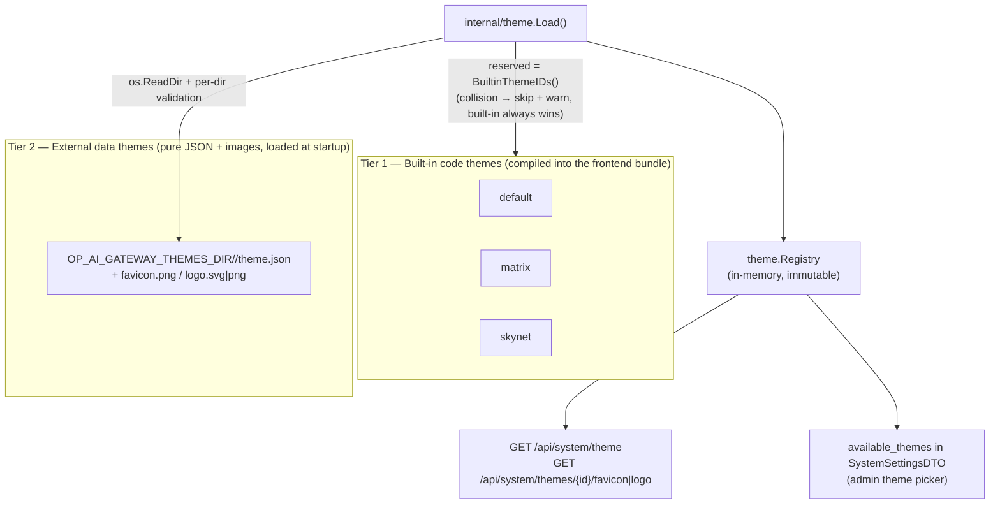
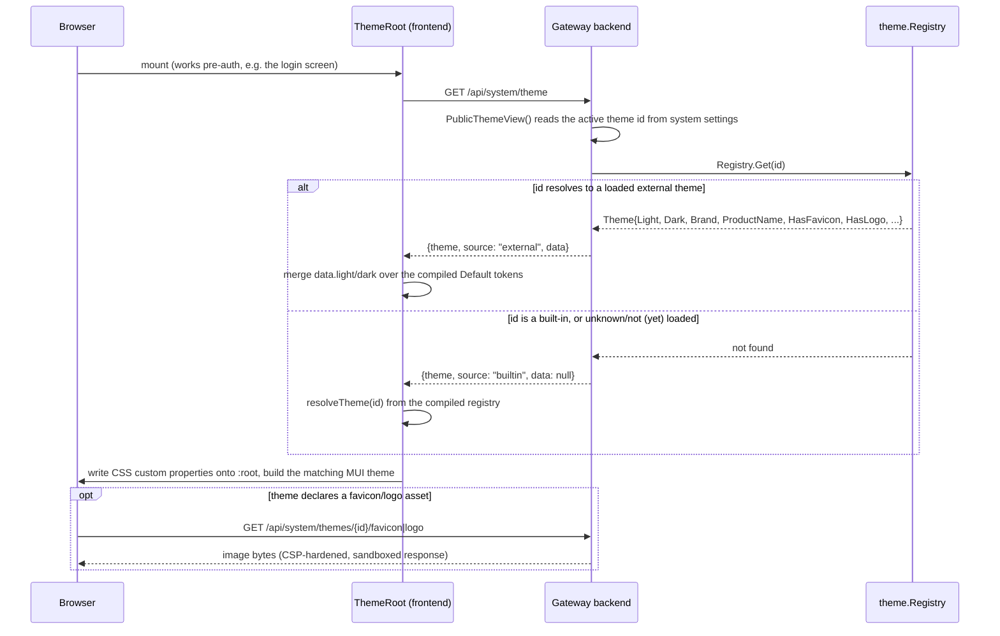

# Theming & Internationalization

How the portal looks (theme tokens, branding, light/dark) and what language it speaks (German/English) are both resolved at runtime from a small set of well-defined sources, never hard-coded into a single skin.

## 1. Two-tier theme model

Themes come from two independent sources that the frontend treats through one uniform pipeline:



| Tier | Where it lives | Format | Can contain code? |
|---|---|---|---|
| **Built-in** | `gateway/frontend/src/theme/tokens.ts`, `registry.ts` | TypeScript objects, compiled into the SPA bundle | Yes — e.g. the Matrix theme's animated canvas background is a React component |
| **External** | A directory tree read by `gateway/backend/internal/theme/theme.go` at process startup | `theme.json` (color tokens) + optional `favicon.png` / `logo.svg`/`logo.png` | No — pure data, validated against an allowlist, never executed as code |

An external theme id can never shadow a built-in one: `theme.Load` is called with the built-in ids as its `reserved` set (`portal.BuiltinThemeIDs()`), so a same-named external directory is skipped (with a `slog.Warn`) rather than silently overriding the compiled theme.

## 2. Built-in code themes

Defined in `gateway/frontend/src/theme/tokens.ts` and registered in `gateway/frontend/src/theme/registry.ts`. These are the only three built-in themes; there is no fourth one.

| id | Display name | Modes | Font | Product name | Notable behavior |
|---|---|---|---|---|---|
| `default` | Default | light **and** dark | MUI default | On-Prem AI Gateway | Baseline teal palette; the only built-in that ships both a `light` and a `dark` token set |
| `matrix` | Matrix | dark only | monospace | On-Prem AI Gateway | Brand mark renders a stylized logo (`MatrixLogo.tsx`) instead of text; mounts a decorative full-screen "digital rain" canvas (`MatrixRain.tsx`) behind the content |
| `skynet` | Skynet | dark only | monospace | **Skynet AI Gateway** | Renames the product via both the brand text (`"Skynet"`) and `productName` — the one built-in theme that changes the displayed product name |

A dark-only built-in (`matrix`, `skynet`) has no `dark` token block; `themeHasDark()` (`gateway/frontend/src/theme/registry.ts`) reports `false` for it and the color-mode toggle has no effect — the theme always renders its single, dark palette (see §5).

`MatrixRain` (`gateway/frontend/src/theme/MatrixRain.tsx`) is the one place a built-in theme ships actual behavior, not just colors: an HTML canvas draws falling glyphs on a `requestAnimationFrame` loop. It is purely decorative (`pointer-events: none`, `aria-hidden`), mounts only when `source === "builtin" && activeThemeId === "matrix"` (an external theme can never trigger it, since external ids can't collide with `matrix`), and renders a single static frame instead of animating when `prefers-reduced-motion: reduce` is set.

## 3. External data-only themes

An operator adds or replaces a theme without touching frontend code or rebuilding the SPA, by placing a directory under the path in `OP_AI_GATEWAY_THEMES_DIR` (default `/themes` inside the container; see `gateway/backend/internal/config/config.go`).

```
<OP_AI_GATEWAY_THEMES_DIR>/
  <id>/
    theme.json        # required
    favicon.png        # optional
    logo.svg            # optional (preferred over logo.png if both present)
    logo.png            # optional
```

Validation rules, enforced by `internal/theme.Load` (`gateway/backend/internal/theme/theme.go`):

| Rule | Detail |
|---|---|
| `<id>` charset | Must match `^[a-z0-9][a-z0-9-]*$`; a non-matching directory name is skipped with a warning, never an error |
| `theme.json` size | Capped at 256 KiB; oversize is skipped, never truncated |
| Image size | Each of `favicon.png` / `logo.svg` / `logo.png` capped at 1 MiB |
| Missing/malformed `theme.json`, or missing `name` | Theme is skipped with a `slog.Warn` |
| Unknown token key or non-string token value | That key is dropped with a warning; the rest of the theme still loads |
| Load failure isolation | Any single invalid theme directory never fails the whole load, and a missing themes directory entirely is not an error — external themes are optional |

`theme.json` shape (see `gateway/deploy/themes/example/theme.json`):

```json
{
  "name": "Example",
  "productName": "AI Gateway",
  "font": "",
  "brand": { "type": "text", "text": "Example", "title": "AI Gateway" },
  "light": { "brandPrimary": "#2563eb" },
  "dark": { "brandPrimary": "#60a5fa" }
}
```

- `name` (required, non-empty) — the display name in the theme picker.
- `productName`, `font` — optional display strings.
- `brand.type` is `"text"` (renders `brand.text`, falling back to `name`) or `"image"` (renders the theme's `logo.svg`/`logo.png` instead — but only if that asset actually shipped; an `"image"` brand with no logo file falls back to text rather than rendering a permanently broken ``).
- `light` / `dark` — **partial** maps of CSS-token overrides. Any key an operator's `theme.json` omits inherits its value from the built-in Default theme (`gateway/frontend/src/theme/registry.ts`'s `externalLightTokens`/`externalDarkTokens` merge the wire payload over `DEFAULT_THEME`), so a one-color rebrand is a valid, fully-coherent theme.

Recognized token keys (anything else is dropped with a warning):

```
surface, page, text, muted, line, brandAccent, brandPrimary, chartSeries2,
sidebar, sidebarActive, successBg, successText, watchBg, watchText,
standbyBg, standbyText, header, headerText, navText, navActiveText,
accentText, accentSoft
```

**Bake vs. mount** (`gateway/deploy/themes/README.md`): `Dockerfile.backend` copies `gateway/deploy/themes/` into the image at `/themes` (the `example/` theme ships this way in every build); a Docker Compose volume or a Kubernetes ConfigMap can additionally mount over `/themes` at runtime so an operator adds or replaces themes without rebuilding the image. Both mechanisms populate the same directory and can be combined at the per-theme-id level.

**Private themes stay out of the repository.** `gateway/deploy/themes/.gitignore` ignores everything in that directory except `.gitignore`, `README.md`, and `example/` — an operator's own branded theme (logos, wordmarks, colors) is deployment-specific and is never accidentally committed. See [Licensing](licensing.md) for why that boundary matters for a project shipped under AGPL-3.0-only.

## 4. Theme resolution flow



If the fetch fails, `ThemeRoot` keeps whatever theme is already active (the compiled Default on first load) rather than surfacing an error.

## 5. Public HTTP surface

Both endpoints are registered on the public mux and served **pre-authentication** — the login screen itself must be themed and favicon'd before any session exists (`gateway/backend/internal/gateway/system_settings_endpoints.go`, `theme_assets.go`).

| Endpoint | Method | Auth | Response |
|---|---|---|---|
| `/api/system/theme` | GET | public | `{ theme: string, source: "builtin"\|"external", data: Theme \| null }` — `data` is populated only for `source: "external"` |
| `/api/system/themes/{id}/favicon` | GET | public | The theme's favicon image, or 404 |
| `/api/system/themes/{id}/logo` | GET | public | The theme's logo image, or 404 |

Asset serving is deliberately hardened (`handleSystemThemeAsset` in `gateway/backend/internal/gateway/theme_assets.go`):

- `id` is resolved **only** by looking it up in the already-loaded `theme.Registry` — it is never joined onto a filesystem path built from request input. A path-traversal id (e.g. `..%2f..%2fetc`) simply fails to match any loaded theme and 404s like any other unknown id; traversal is structurally impossible, not merely filtered.
- The response carries `Content-Security-Policy: default-src 'none'; style-src 'unsafe-inline'; sandbox` and `X-Content-Type-Options: nosniff`, so an operator-supplied `logo.svg` — untrusted content that could otherwise embed a `<script>` — cannot execute anything even if a user navigates to the asset URL directly.
- The frontend never inlines an SVG logo into the DOM (no `dangerouslySetInnerHTML`); `Brand.tsx` always renders it via ``, which loads the SVG as an independent document with no script context.

The admin-facing theme **picker** is a separate, authenticated surface: `available_themes` (`[{id, name}]`) is a field of `SystemSettingsDTO`, returned by `GET /api/system/settings` (requires the `system` web scope) and combines the fixed built-ins with every currently loaded external theme (`Service.themeOptions`, `gateway/backend/internal/portal/service_system_settings.go`). Selecting a theme there writes the `theme` system setting that `PublicThemeView` later reads.

## 6. CSS-variable bridge and MUI integration

`ThemeRoot` (`gateway/frontend/src/theme/ThemeRoot.tsx`) is the single place tokens become pixels:

1. Resolved `ThemeTokens` (whichever tier they came from) are written as CSS custom properties (`--surface`, `--brand-primary`, `--chart-series-2`, …) directly onto `document.documentElement`, so any component — MUI or plain CSS — can read `var(--…)` without a re-render.
2. The same tokens drive a MUI theme built with `createTheme()`: `palette.primary` = `brandPrimary`, `palette.secondary` = `brandAccent` (identical in every built-in theme, only visually distinct when an external `theme.json` sets them apart), `palette.background`/`palette.text`/`palette.divider` from `page`/`surface`/`text`/`muted`/`line`.
3. A `GlobalStyles` block ships the Default theme's values as a static fallback for the CSS variables (first paint before the fetch resolves) and a theme-aware focus ring for non-MUI focusables.

MUI Core (`@mui/material`) is the sole component foundation; there is no second UI kit to keep in sync.

## 7. Light / dark mode

Color mode is a **per-viewer** preference, independent of the active theme:

- `useColorMode` (`gateway/frontend/src/theme/useColorMode.ts`) tracks a three-state preference — `"system"` (default), `"light"`, `"dark"` — persisted in `localStorage` (`op.colorMode`), plus the live OS preference via `window.matchMedia("(prefers-color-scheme: dark)")`.
- The **effective** mode is `dark` only if the viewer wants dark **and** the active theme actually offers a dark variant (`hasDark`); a dark-only theme (`matrix`, `skynet`) or an external theme with no `dark` block always renders its single palette regardless of preference.
- A manual toggle (`ColorModeMenu.tsx`) lets a user override the OS default per-browser; the preference does not round-trip to the backend — it is local to the device.

## 8. Internationalization

The portal ships German and English as first-class, always-shipped-together languages:

- `Locale = "de" | "en"` (`gateway/frontend/src/i18n.ts`) and a `PortalMessages` type derived directly from the German dictionary (`typeof de`) enumerate every translatable string as a typed key; the English dictionary is typed as `PortalMessages`, so it must implement the exact same key set, and a missing (or extra) translation is a compile error, not a runtime blank.
- The system-wide default is `OP_AI_GATEWAY_DEFAULT_LANGUAGE` (default `"de"`, see `gateway/backend/internal/config/config.go`), readable/writable through system settings.
- A signed-in user can override it per-account (`User.PreferredLanguage`, `gateway/backend/internal/portal/service.go`) via `PUT /api/portal/language`; an anonymous/pre-auth viewer gets the system default.
- `portal.KnownLanguages()` / `IsKnownLanguage()` (`gateway/backend/internal/portal/service_system_settings.go`) are the single source of truth for valid language ids on the backend, mirroring the frontend's `Locale` union.

## See also

- [Security, Authentication & Authorization](security-auth-rbac.md) — the session/CSRF model that the theme endpoints deliberately sit outside of (they are public and pre-auth by design).
- [Configuration](configuration.md) and [Configuration & Environment Variables](../reference/config-env.md) — `OP_AI_GATEWAY_THEMES_DIR`, `OP_AI_GATEWAY_DEFAULT_LANGUAGE`.
- [Licensing & Third-Party Notices](licensing.md) — why operator-branded external themes are gitignored rather than committed.
