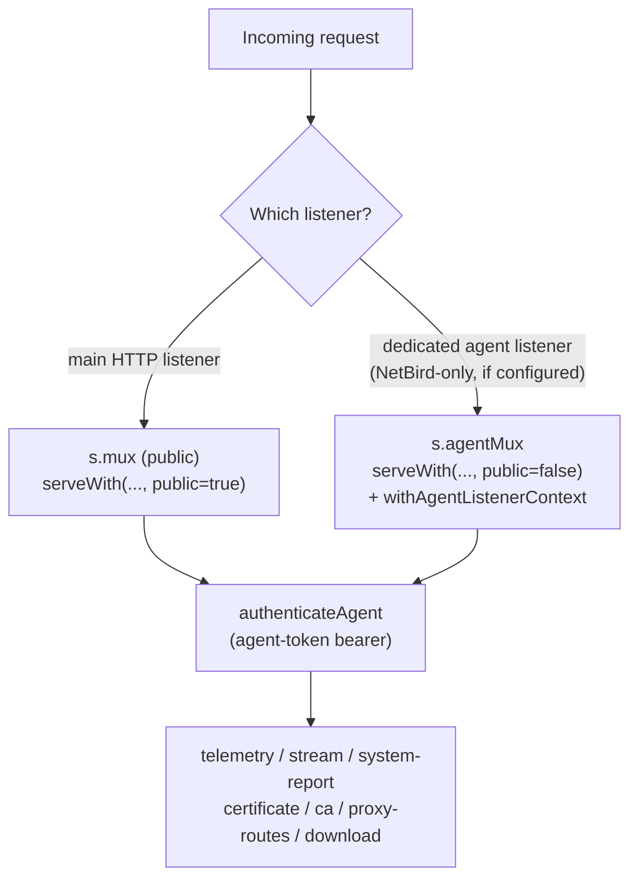

# HTTP API Surface (Reference)

Grouped reference for every HTTP route registered by the gateway (`internal/gateway/server.go` and its per-feature files), the auth mode each group expects, and a one-line purpose per endpoint. For the configuration that drives these routes, see [Configuration](../cross-cutting/configuration.md); for the underlying RBAC/session model, see the security & auth chapter.

## Auth modes

| Mode | How it's presented | Resolved by |
|---|---|---|
| **Public** | No credential | handler reads nothing auth-related |
| **Session + CSRF** | `op_ai_gateway_session` cookie; unsafe methods (non-GET/HEAD/OPTIONS) additionally require header `X-OP-CSRF: 1` | `authenticateWeb` |
| **Bearer** | `Authorization: Bearer <token>` — a user API token or a service token | `authenticate` |
| **Session-or-bearer** | Either of the above, resolved by the same call | `authenticateWeb` (used by every `requireWebScope`/`requireWebAnyScope` check) |
| **Bearer-only (any scope)** | Bearer only, accepting one of several scopes — used where a session principal must not be allowed (service-account-only paths) | `authenticate` via `requireAnyScope` |
| **Agent token** | `Authorization: Bearer <agent-secret>`, a separate per-AI-server credential (hashed lookup against `agent_tokens`, unrelated to user API tokens) | `authenticateAgent` |

On top of the auth mode, most session/bearer routes additionally require a **scope**:

| Scope | Granted to | Notes |
|---|---|---|
| `gateway:use` | every active user session; every ordinary API token | baseline — required by nearly all `/api/portal/*` and the inference/compat endpoints |
| `llm:invoke` | service tokens (service accounts) | narrower alternative accepted by inference/compat endpoints alongside `gateway:use`, per `requireAnyScope`/`requireWebAnyScope` |
| `admin` | user role `admin` or `system_admin` | required by global-admin management endpoints (servers/applications/mappings, model groups, model visibility, admin user-limits, `/api/admin/*`) |
| `system` | `system_admin` role **and** an elevated (step-up) session | required by every `/api/system/*` endpoint except the two public theme routes |

Many `/api/portal/*` endpoints (servers, applications, mappings, services, projects, groups, resource-groups) are gated at the HTTP layer only by the `gateway:use` baseline; **object-level authorization** (ownership, admin-group co-management, project/service delegate tiers) is then enforced inside `internal/portal.Service` itself, with a consistent no-existence-leak 404 for anything outside the caller's manageable set. The tables below note the small set of endpoints that additionally require the blanket `admin` or `system` scope at the HTTP layer.

## Dual-mux dispatch (agent endpoints)

The five `/api/agent/v1/*` handlers are registered identically on **both** the public mux (`s.mux`) and the dedicated mesh/agent mux (`s.agentMux`, served on a separate NetBird-facing listener when configured — see [Configuration §"Agent listener"](../cross-cutting/configuration.md)). Per-listener behavior (e.g. mesh-only enforcement, observed-TLS transport reporting) is threaded through the request context, not the handler function, since the same Go function backs both registrations.

Only requests that actually arrived on `agentMux` get `r.TLS` transport-hop reporting recorded (a public-mux request may be proxied over plaintext loopback internally and would misrepresent the real mesh transport).

## 1. Inference / compatibility endpoints

Client-facing, OpenAI/Anthropic/Codex/Claude-Code-compatible completion and model-listing routes. All require **session-or-bearer or bearer-only** auth with scope `gateway:use` or `llm:invoke` (service tokens); see the table for which variant each path uses. `/v1/responses` and `/v1/messages` also attempt **native passthrough** first (proxying the raw body straight to an upstream that natively speaks Codex/Claude Code) before falling back to translation.

| Path(s) | Method | Auth | Purpose |
|---|---|---|---|
| `/v1/chat/completions`, `/openai/v1/chat/completions` | POST | Session-or-bearer, `gateway:use`\|`llm:invoke` | OpenAI-compatible chat completions (streaming supported) |
| `/v1/responses`, `/openai/v1/responses` | POST | Bearer-only, `gateway:use`\|`llm:invoke` | OpenAI Responses API (Codex); native passthrough when the target app supports it |
| `/v1/messages`, `/anthropic/v1/messages` | POST | Bearer-only, `gateway:use`\|`llm:invoke` | Anthropic Messages API (Claude Code); native passthrough when the target app supports it — the only path where Anthropic streaming works end-to-end |
| `/v1/messages/count_tokens`, `/anthropic/v1/messages/count_tokens` | POST | Bearer-only, `gateway:use`\|`llm:invoke` | Anthropic token counting (utility call, no upstream inference, no billing) |
| `/v1/models`, `/openai/v1/models` | GET | Bearer-only, `gateway:use`\|`llm:invoke` | OpenAI-shaped model listing; discovery is unfiltered by a service token's own allowlist, but IS filtered by resource-group provisioning visibility |
| `/anthropic/v1/models` | GET | Session-or-bearer, `gateway:use` | Anthropic-shaped model listing |
| `/api/v0/models` | GET | Session-or-bearer, `gateway:use` | LM Studio-shaped model listing (emulated metadata only, e.g. `max_context_length`, for LM-Studio-aware clients such as opencode; actual chat still goes over `/v1/chat/completions`) |

## 2. Auth endpoints (`/api/auth/*`)

| Path | Method | Auth | Purpose |
|---|---|---|---|
| `/api/auth/login` | POST | Public + CSRF header | Password login; sets the session cookie on success |
| `/api/auth/logout` | POST | Session + CSRF | Clears the current session |
| `/api/auth/session` | GET | Public | Reports current auth state (`authenticated`, current-user DTO, default language) — used by the SPA on load; never errors on "not logged in" |
| `/api/auth/set-password` | POST | Public + CSRF header | Consumes a one-time set-password/invite token to set a password |

## 3. Portal endpoints (`/api/portal/*`)

Session-or-bearer, scope `gateway:use` unless noted. This is the bulk of the authenticated application API.

### Account, session, preferences

| Path | Methods | Purpose |
|---|---|---|
| `/api/portal/me` | GET | Current user DTO (role, elevation state, TOTP mode, etc.) |
| `/api/portal/password` | POST | Change own password (CSRF-enforced) |
| `/api/portal/language`, `/api/portal/currency` | GET/PUT, GET | Own preferred language; system-wide EUR→USD display factor |
| `/api/portal/preferences`, `/api/portal/preferences/{key}` | GET, GET/PUT | Opaque per-key UI preference storage |
| `/api/portal/chat-settings` | PUT | Own default chat run settings |
| `/api/portal/system-admin-mode` | POST/DELETE | Enter/leave System-Admin step-up elevation (requires role `system_admin`; may require re-entering the password per system setting) |
| `/api/portal/totp`, `/api/portal/totp/{action}` | GET/DELETE, POST | TOTP 2FA status/disable; enroll/confirm |

### Tokens, chats, usage

| Path | Methods | Purpose |
|---|---|---|
| `/api/portal/tokens`, `/api/portal/tokens/{id}[/rotate]` | GET/POST, PATCH/DELETE/POST | Own API token CRUD + rotate |
| `/api/portal/chats`, `/api/portal/chats/{id}[/runs...]` | GET/POST, GET/PUT/DELETE + run sub-paths | Portal built-in chat CRUD, run start/SSE events/cancel |
| `/api/portal/usage`, `/usage/stats`, `/usage/groups`, `/usage/timeseries`, `/usage/events` | GET | Own (or, with `admin` scope + `scope=all`, fleet-wide) usage analytics in various shapes |
| `/api/portal/usage/active` | GET | Currently in-flight requests (own, or all with `admin` scope) |
| `/api/portal/usage/captures/{id}` | GET | Read a captured request/response payload (capture must be enabled) |
| `/api/portal/benchmarks/active` | GET | Currently running benchmark jobs, visibility-filtered like server ownership |
| `/api/portal/dashboard` | GET | Aggregated dashboard payload |

#### Token model settings

User tokens and service tokens carry the same per-token model-settings **fields**,
but not the same write surface:

| Surface | Where the fields are writable | Where they are readable |
|---|---|---|
| User token | `POST /api/portal/tokens` (create) and `PATCH /api/portal/tokens/{id}` (update) | `GET /api/portal/tokens` |
| Service token | `POST /api/portal/services/{id}/tokens` (create) **only** — there is no update endpoint; `{tid}` accepts `DELETE`, and `{tid}/rotate` accepts `POST`, which replaces the secret and nothing else | `GET /api/portal/services/{id}/tokens` |

So a service token's model settings are **fixed at creation**: changing them
means deleting the token and creating a new one.

Every model-valued field is validated on write and an unroutable name is
rejected with `400 portal.token_model_override_invalid`. The set it is validated
against is the **writing principal's** callable models — the owner for a user
token, and for a service token the principal issuing it (a service delegate or
an authorized admin-group manager), never the service's own allowed-model list. That is a usability guard, not the security boundary: the
service allowlist still refuses the request at inference time if the two
disagree (see
[Security, Authentication & Authorization](../cross-cutting/security-auth-rbac.md)).

| Field | Shape | Meaning |
|---|---|---|
| `model_override` | string | catch-all: rewrites any requested model that has no rule of its own (`""` = off) |
| `model_override_map` | object, `requested -> {"to","offer","hide_target"}` | per-requested-name rules. `to` is the gateway model or group to route to; `offer` advertises the requested name in this token's model listing, inheriting the target's flavors; `hide_target` drops the target's own name from that listing. Both switches are listing-only |
| `unknown_model_redirect` | bool | opt into the unknown-model redirect |
| `unknown_model_redirect_blocked` | bool | widen "unknown" from "no such model" to "also models this token may not use"; ignored (stored `false`) while the redirect is off |
| `unknown_model_fallback` | string | model or group used when the marker below is empty or no longer routable; cleared while the redirect is off |
| `last_used_model` | string, **read-only** | the gateway model or group of this token's last successfully routed request. Present on token DTOs, accepted on no request body — a writable marker would let a client choose where its own unknown requests go |

The rule object is the only accepted wire shape; the legacy
`requested -> "target"` string map is tolerated when *reading* the stored
column, which is why the feature needed no data migration. Semantics — the
resolution order, the three model sets, and the invariant that a redirected
request still passes every admission gate — are in
[Routing & Model Selection §2.1–2.2](../cross-cutting/routing-and-model-selection.md).

### Models, servers, applications, mappings

| Path | Methods | Auth notes | Purpose |
|---|---|---|---|
| `/api/portal/models` | GET | `gateway:use` | Model catalog visible to the caller |
| `/api/portal/model-servers`, `/model-servers/events` | GET, GET (SSE) | `gateway:use` | Servers offering a given model + live benchmark/loaded state; SSE push on load-state change |
| `/api/portal/model-group-servers` | GET | `gateway:use` | Candidate servers for a model group, ranked by the group's **manual** traversal order + live per-mapping score (it does not model `member_order`, `loaded_only` or `min_tokens_per_second`, so such a group may be served in a different order than shown) |
| `/api/portal/model-groups`, `/model-groups/{id}` | GET/POST, GET/PUT/DELETE | **`admin`** | Model-group CRUD (global-admin capability) |
| `/api/portal/model-settings/{name}` | PUT | **`admin`** | Set a model's visibility |
| `/api/portal/servers`, `/servers/{id}[/...]` | GET/POST, GET/PATCH/DELETE + sub-paths (energy, admin-groups, applications, agent-token, resource-groups, models, certificate, https-switch-override, ping) | `gateway:use` + object-level ownership inside `portal.Service` | AI server CRUD and per-server management surface |
| `/api/portal/applications/{id}` | GET/PATCH/DELETE | `gateway:use` + ownership | Application (inference backend) CRUD |
| `/api/portal/mappings/{id}` | PATCH/DELETE | `gateway:use` + ownership | Model-mapping CRUD |
| `/api/portal/agent-binaries`, `/agent-binaries/{...}` | GET | `gateway:use` | List / download ServerAgent release binaries for manual install |

#### Agent-managed model runtime

All of these authorize **inside `portal.Service`** with the model-mapping write
rule (`system` scope, server ownership, or admin-group delegation carrying
`can_manage_servers` — plain `admin` is *not* sufficient); authorization failures
on a mapping collapse to `404 mapping.not_found` so nothing leaks existence. See
[Agent-Managed Model Runtime](../cross-cutting/agent-runtime-manager.md) for
semantics.

| Path | Methods | Scope | Purpose |
|---|---|---|---|
| `/api/portal/mappings/{id}/runtime-spec` | GET/PUT/DELETE | mapping | The launch specification for one mapping |
| `/api/portal/mappings/{id}/probe-vram` | POST | mapping (`AuthorizeBenchmarkScope`, **not** the mapping write rule above) | The **VRAM benchmark**: force-stop every managed spec on the server (*the target included*), load this one model, and report its VRAM. `202` + the initial `BenchmarkStatus`; the result arrives on the benchmark status poll / SSE as `results[].vram`. Reserves the server like any benchmark (`409 benchmark.already_running`, `409 benchmark.server_in_use`). See the four refusals below and [§11.6](../cross-cutting/agent-runtime-manager.md#116-the-vram-benchmark-load-one-model-alone-and-measure-what-it-costs) |
| `/api/portal/applications/{id}/runtime/coresidency` | GET/PUT | application | The application's complete co-residency pair list |
| `/api/portal/applications/{id}/runtime/warnings` | GET | application | `{"warnings":[…]}` — opaque codes; today `timeout_ms_below_startup_timeout` and `binary_path_os_mismatch` |
| `/api/portal/servers/{id}/gpu-budgets` | GET/PUT | server | `{"budgets":[…]}` on both GET and PUT — the server's complete per-GPU budget list |
| `/api/portal/servers/{id}/runtime/report` | GET | server | The file-mode agent's reported effective configuration |
| `/api/portal/servers/{id}/runtime/events` | GET (SSE) | server | Live per-spec runtime status (`GetServer` ownership check runs **before the first stream byte**) |
| `/api/portal/servers/{id}/runtime/logs?spec_id=…` | GET (SSE) | server | Live stdout+stderr of ONE managed process. Each generation's **opening marker entry** additionally carries the **resolved launch command** (`command`: binary, argv, work_dir and the complete effective environment, with every `${AGENT_ENV:NAME}`-derived value masked agent-side as its own placeholder). Same ownership check, before the first stream byte — argv is closer to user data than status, and the boundary is the same one, not a laxer one. `spec_id` is validated as well as authorized, because it is also shipped to the agent inside the watch command: `400 runtime_logs.spec_required` without it, `400 runtime_logs.spec_invalid` when it is over-long (rejected, never clamped), and `503 runtime_logs.too_many_specs` when the server already has the maximum number of distinct specs under view. Subscribing is what makes the agent stream, and unsubscribing is what stops it. |

Conventions worth stating, because each is a judgement call a client depends on:

- **Every write is a full-document replace, not a delta** — the spec PUT applies
  the whole spec verbatim (never merged against the stored row), and the two list
  PUTs replace the entire list. See
  [ADR-029](../09-architecture-decisions.md#adr-029--runtime-domain-writes-are-full-document-replaces-gated-on-their-own-get).
- **There is no bulk "list runtime specs for an application" endpoint.** The spec
  is mapping-scoped, so a client fans out one GET per mapping.
  `configured: false` is the *only* signal for "this mapping has no spec row
  yet" — every other field is then a zero value (`gpus`/`args`/`env` still
  non-nil but empty) and `id` is absent. A PUT never re-keys the row: the
  returned spec keeps its `id`.
- **`DELETE` returns `200 {"ok":true}`, never 204**; a wrong method returns 405
  with an `Allow` header.
- **`expected_uuid` / `expected_name` on a budget row are never
  client-writable** — a request's values are ignored, on first creation and on
  every later PUT. The server snapshots them from the latest telemetry sample for
  a brand-new GPU index (left empty when no sample exists) and preserves the
  stored values verbatim afterwards, because drift detection is only meaningful
  against the *original* snapshot. So on real hardware a created row comes back
  carrying the actual GPU identity, and an assertion must match only the subset
  under the caller's control (`index`, `budget_mb`).
- **`spec.vram_measured_mb` is agent-owned and always ignored on write**, even
  though the request shape carries it. The operator-owned figure is
  `vram_estimate_mb`. `spec.vram_locked` is how an operator opts out of being
  *governed* by the measurement without being able to forge it: locked, the
  write-back stops **and** the agent is served `vram_estimate_mb` in its
  runtime-config document. It is the documented recovery for a spec that a
  measurement above its GPU budget has left permanently `not_permitted`.
- **The VRAM benchmark writes neither of those two fields**, and its five
  refusals are all `409` — none of them is a malformed request; each is a
  conflict with the server's current state. They are checked **before** the
  server is reserved, so a refused run writes no spec and reserves nothing:

  | Code | Condition |
  |---|---|
  | `benchmark.vram_not_agent_managed` | The target's application is not `server_agent`, or the target has no *enabled* launch spec — so it is not in the spec set the run drains, and "the target among them" is false |
  | `benchmark.vram_isolation_unavailable` | File mode, or an agent that has not declared `runtime_manager`: every `admin_state` write would return 200 and stop nothing |
  | `benchmark.vram_no_gpu_samples` | The server's latest telemetry carries no GPU sample, so there is nothing to difference and no per-process measurer either |
  | `benchmark.vram_isolation_blocked` | A spec already carries an operator override (the target's own included), or a spec *other than the target* is pinned. The message names the spec |
  | `benchmark.vram_declared_gpu_missing` | The target's launch spec declares a GPU index the host does not report. A card the run cannot see never holds still, so every stability window would burn its bound and the run could reach no number. The message names the index |

  The result rides `BenchmarkStatus.results[].vram`, and `vram` **absent** means
  the run never reached the measurement phase, while `vram` **present** with
  `inconclusive` set means it ran and reached no number — two different next
  actions for the operator, so a client must not collapse them. `gpus` is
  always an array (never `null`), and `0` means *unknown* in both `delta_mb`
  and `measured_mb`, never a real zero.

  `isolated` is qualified by **`isolation_proof`**, which a client must read
  beside it rather than folding into it: `"config_acknowledged"` means the agent
  reported having applied a runtime-config document the run had verified
  force-stops the whole fleet, `"bind_delay"` means the agent never reports that
  (it does not declare `runtime_config_ack`) so the run waited out its
  guaranteed poll interval and observed no process. Those are different
  *strengths* of evidence. The field is present whether or not the isolation was
  confirmed — a failure then says which standard failed — and **absent** on a
  row written before the acknowledgement shipped, which a client must render as
  "not recorded" and never as `bind_delay`.

  `isolation_unacknowledged` is the matching `inconclusive` reason: the agent
  declared that it acknowledges and then never acknowledged a document that
  drains the fleet. Distinct from `isolation_timeout` on purpose — that one says
  the document landed and a *model* would not go quiet, this one says the
  document never landed, so the operator inspects the agent rather than the
  fleet.
- **`PUT /api/portal/mappings/{id}/runtime-spec` answers `409
  runtime_spec.server_benchmarking` while a benchmark run holds that mapping's
  server** — and this is the *only* write it gates, which a client
  reasoning about a run's isolation has to know. The endpoint is a full-document replace with `admin_state` among
  its fields, so it is an override action as much as an edit, and one
  "Force start" on a spec a VRAM run has drained puts a sibling's allocation
  inside the measurement window. The gate is the benchmark reservation — the
  same fact that already excludes the server from routing — checked after
  authorization, so an unauthorized caller learns nothing from it. `GET` and
  `DELETE` are ungated, and so is a write to any other server. Per-GPU budgets,
  the co-residency list, `runtime_max_processes`, mapping renames, the agent
  application's router port and the agent's own measured-VRAM write-back are all
  ungated too, so the runtime-config document — and therefore its `etag` — really
  does move during a run. The isolation wait handles that by re-deriving rather
  than by pinning one value; see
  [agent-runtime-manager §11.6](../cross-cutting/agent-runtime-manager.md#116-the-vram-benchmark-load-one-model-alone-and-measure-what-it-costs).
- **The SSE stream wraps every frame as `{"runtimes":[…]}` — not `{"data":[…]}`**
  like the model-servers and performance streams on this same portal. Both the
  initial `snapshot` frame and every later `update` frame carry the **complete**
  row set, so a consumer must *replace* its rows, never append; a `: ping`
  comment keeps the connection alive. Parsing the wrong key with a `?? []`
  fallback produces an eternally empty list with no error and no crash.
- **Status rows carry `spec_id` and never an `application_id`**, and the stream is
  authorized and keyed per **server** — so a client receives one flat,
  server-wide list with no per-application filter, and must join rows back to
  operator-facing names itself via `spec_id → spec.mapping_id → mapping`. Row
  shape: `{spec_id, model, state, since, pid?, port?, in_flight, restarts,
  gpus?, measured_at?, last_error?}` with `last_error = {message, at, exit_code,
  failures, stderr_tail?}` and `gpus = [{index, vram_measured_mb}]`.
- **`gpus`/`measured_at` are a watermark, and they are omitted together.**
  `measured_at` is the **gateway's** arrival time for the frame that carried the
  measurement, not the agent's self-reported `reported_at`; a frame that measured
  nothing (no measurer on the host, or a spec with no live process) carries
  neither key, and a measured `0` — *unknown*, everywhere in this feature — is
  dropped rather than published. This is the only way to learn a measurement's
  AGE: the durable value on the spec's `gpus[].vram_measured_mb` carries no
  timestamp and is not rewritten when it does not change, so polling the spec
  reads an arbitrarily old number as a fresh one. A consumer that needs a
  measurement it can attribute to something it just did must take it from a frame
  that arrived after that event.
- **The runtime-report response deliberately reuses the hardware panel's
  envelope**: `{available, collected_at?, updated_at?, report?, agent_version,
  agent_features}`. `available: false` means no report has ever been stored, not
  an error. The file-mode payload is **nested** under `report` —
  `{source, collected_at, parse_error?, config}` — **not** flattened as siblings
  of `available`; a client modelled on the flattened shape reads
  `source`/`parse_error`/`config` as `undefined` forever and concludes the server
  is in gateway mode. `agent_version` and `agent_features` are read from the
  server's latest telemetry row regardless of whether a report was ever stored
  (so no extra endpoint is needed for a feature-mismatch check) and are always
  present, possibly empty.
- **`report` is both optional *and* nullable on the wire.** A Go
  `json.RawMessage` with `omitempty` omits the field only when the blob is
  **empty**, and an empty stored blob is written out as the JSON literal `null`
  (length 4, so `omitempty` does not fire) — so *absent*, `null` and an object
  are all legal, and a type naming only two of the three is a lie. The same
  applies to the hardware response's `report`.
- **Every runtime collection is non-nil on the wire**: `args`, `env`, `gpus`,
  `specs`, `gpu_budgets`, `coresident`, `warnings`, `budgets` and
  `agent_features` serialise as `[]`/`{}` and never `null`, including on the
  empty and cleared paths.

Error codes and their statuses (the sentinel's own message string **is** the wire
code, and the gateway's error table repeats the same literal — so renaming a
sentinel is a breaking API change that must be applied in both places):

| Code | Status |
|---|---|
| `runtime_spec.not_found` | 404 |
| `runtime_spec.binary_required`, `.args_invalid`, `.env_invalid`, `.gpu_invalid`, `.tuning_invalid`, `.admin_state_invalid`, `.visible_devices_no_gpus`, `.visible_devices_conflict`, `.application_not_server_agent` | 400 |
| `runtime_coresidency.pair_invalid`, `server.gpu_budget_invalid`, `server.runtime_limit_invalid` | 400 |
| `application.managed_runtime_only`, `application.server_agent_exists` | **409** — the request shape is valid, it conflicts with the server's existing configuration |
| `application.proxy_listen_port_invalid` | 400 |
| `application.proxy_excluded_port_conflict`, `application.proxy_entry_scheme`, `application.proxy_listen_port_conflict` | **409** — the request shape is valid, it conflicts with the target's own state |
| unmapped | 500 `runtime_spec.request_failed` |

The application endpoints' unmapped fallback is **500 `application.request_failed`**
(`writePortalApplicationError`), not the `runtime_spec.request_failed` in the row
above. `application.proxy_listen_port_invalid` and
`application.proxy_listen_port_conflict` have existed as service sentinels since
migration 59 but appeared in neither `portalApplicationErrRows` nor
`sharedErrorMap`, so both fell through to that 500 until this branch mapped them
— a caller's own bad port reported as a server fault. A direct API consumer that
sends `proxy_listen_port` therefore sees 400/409 where it used to see 500; the
portal form never sends the field, so no first-party consumer changes.
`proxy_excluded_port_conflict` and `proxy_entry_scheme` are new with the
per-application proxy opt-out ([certificates-tls §7](../cross-cutting/certificates-tls.md#7-automatic-https-switch-of-applications)).

`application.server_agent_exists` (message `server already has a server_agent
application`) is returned by both the application **create** (POST) and
**update** (PATCH) endpoints, since retyping an existing application is the easy
way past a create-only gate.

The spec PUT's validation, all applied **before any mutation**: `binary` is
required and must be **absolute under Go's `filepath.IsAbs` for *either* target
platform**: POSIX (`/opt/llama/llama-server`) or Windows (a drive letter with
either separator, `C:\llama\llama-server.exe` / `c:/llama/…`; the UNC form
`\\host\share\…`; the `\\?\` / `\\.\` / `\??\` device forms). Refused: the empty
string, a relative path, a **drive-relative** path (`C:foo`, `c:`), and a
**root-relative** one (`\foo`, `\` — rooted on the current drive, so it names no
volume). The gateway is OS-agnostic and cannot execute the path, so this rule is
the **early-feedback mirror** of the agent's own `filepath.IsAbs` check
([§3.1](../cross-cutting/agent-runtime-manager.md#31-the-agent-local-policy)),
which remains the authority — deliberately neither stricter (a POSIX-only
`HasPrefix(binary, "/")` made a Windows AI server unconfigurable through the
portal) nor laxer (a spec the portal accepts and the agent then refuses becomes
a terminal `not_permitted` instead of a form error). Every tuning integer
(`listen_port`,
`health_timeout_seconds`, `startup_timeout_seconds`, `idle_timeout_seconds`,
`admission_wait_timeout_seconds`) must be `>= 0`; `admin_state` must be one of
the three valid values; GPU index `>= 0`, unique, `vram_estimate_mb >= 0`; and env
**keys** must match `^[A-Z_][A-Z0-9_]*$`. `set_visible_devices` adds two refusals
of its own, both returned **before any mutation**:
`runtime_spec.visible_devices_no_gpus` when it is on with an empty `gpus` (an
empty visibility value hides *every* card rather than restricting none), and
`runtime_spec.visible_devices_conflict` when it is on while `env` already sets
one of `CUDA_VISIBLE_DEVICES` / `ROCR_VISIBLE_DEVICES` / `HIP_VISIBLE_DEVICES`
(compared case-insensitively). Both rules are **vendor-independent** — this
gateway cannot know the target host's hardware — and the agent enforces the
identical pair again at launch, which is what covers the file-mode path that
never reaches this endpoint. See
[agent-runtime-manager.md §3.3](../cross-cutting/agent-runtime-manager.md#33-set_visible_devices-turning-the-gpu-list-into-an-enforcement). **Env values are never validated** —
that is load-bearing, since validating them would break the `${AGENT_ENV:NAME}`,
`${PORT}`, `${MODEL}` and `${HOST_GPU_IDS}` placeholder mechanism, and it means an env key naming an
agent-reserved base variable (`PATH`, `HOME`, `USERPROFILE`, `LOCALAPPDATA`,
`SYSTEMROOT`, `WINDIR`) and `${AGENT_ENV:OP_AGENT_*}` references are *accepted
and persisted* here, with the real refusal happening agent-side at process
start. Defaults applied on
zero/empty: `health_path` `/health`, `health_timeout_seconds` 5,
`startup_timeout_seconds` 180. A duplicate GPU index is refused as a **whole-write
failure, not deduped**, so no filled-in row is silently discarded.

### Groups, projects, services, resource-groups (governance model)

| Path | Methods | Purpose |
|---|---|---|
| `/api/portal/groups`, `/groups/{id}[/...]` | GET/POST, GET/PUT/DELETE + members/managers/candidates/accept/decline | User-group CRUD, membership, co-manager permissions, invitations |
| `/api/portal/groups/invitations` | GET | Caller's own pending group invitations |
| `/api/portal/projects`, `/projects/mine`, `/projects/{id}[/...]` | GET/POST, GET, GET/PUT/DELETE + members/candidates/groups/tokens | Project CRUD, ownership transfer, member/group/token management (owner/admin only inside the service) |
| `/api/portal/services`, `/services/{id}[/...]` | GET/POST, GET/PUT/DELETE + tokens/admin-groups | Service (service-account) CRUD, delegate-scoped token issuance |
| `/api/portal/resource-groups`, `/resource-groups/{id}[/...]` | GET/POST, GET/PATCH/DELETE + servers/admin-groups/provisions/candidates | Resource-group CRUD, server membership, provisioning to users/groups/services |
| `/api/portal/server-admin-group-candidates`, `/service-admin-group-candidates`, `/resource-group-admin-group-candidates`, `/admin-owner-candidates` | GET | Addable-candidate lists for the respective admin-group/owner pickers |
| `/api/portal/admin/users/{id}/limits` | GET/PUT | **`admin`** (plus a manageable-user-set check for a non-`system` caller) | Per-user rate/quota/budget limit management — deliberately no self-service path |

### Feature flags / small read-only status

| Path | Purpose |
|---|---|
| `/api/portal/netbird/enabled` | Whether NetBird integration is enabled (boolean only, no config leak) |
| `/api/portal/certificates/enabled` | Whether the certificate module is enabled |
| `/api/portal/health-check-interval` | Live app-health probe cadence (read-only mirror of a system setting) |
| `/api/portal/agent-presence-timeout` | Live agent-presence timeout (read-only mirror of a system setting) |

### Legacy / additional

| Path | Auth | Purpose |
|---|---|---|
| `/api/usage` | Bearer, `gateway:use` | Legacy simple own-usage-by-user endpoint (bearer-only, superseded by `/api/portal/usage*`) |
| `/api/admin/users`, `/api/admin/users/{id}` | Session-or-bearer, **`admin`** | Legacy top-level admin user list/detail (distinct from the portal-namespaced `/api/portal/admin/users/{id}/limits`) |

## 4. System endpoints (`/api/system/*`)

Session-or-bearer, scope **`system`** (role `system_admin` + step-up elevation) for every route **except** the two public theme routes.

| Path | Methods | Auth | Purpose |
|---|---|---|---|
| `/api/system/theme` | GET | **Public** | Active theme descriptor for the pre-login UI |
| `/api/system/themes/{id}/favicon\|logo` | GET | **Public** | External theme asset (favicon/logo); `{id}` resolved only against the loaded theme registry, never joined onto a filesystem path — no traversal surface |
| `/api/system/settings` | GET/PUT | `system` | System-wide settings (SMTP, NetBird, certificate gates, currency, etc.) |
| `/api/system/smtp/test` | POST | `system` | Send a test email with the currently configured/pending SMTP settings |
| `/api/system/tracing` | GET/PUT | `system` | OpenTelemetry tracing status/config |
| `/api/system/logs`, `/logs/events`, `/logs/level` | GET, GET (SSE), GET/PUT | `system` | Log buffer snapshot, live tail, runtime log-level control |
| `/api/system/netbird/test`, `/network`, `/groups`, `/peers`, `/gateway-setup-key`, `/enroll-sidecar`, `/status`, `/token-status`, `/rotate-token` | GET/POST (per route) | `system` | NetBird admin API connectivity test, network/group/peer inspection, sidecar self-enrollment, connection status, admin-token rotation |
| `/api/system/servers/{id}/netbird` | PUT | `system` | Per-server NetBird management (distinct from the portal's own-server routes) |
| `/api/system/certificates` | GET | `system` | Certificate module overview |
| `/api/system/certificates/renew` | POST | `system` | Force a renewal pass |
| `/api/system/certificates/ca`, `/ca/rotate` | GET, POST | `system` | Internal CA status; rotate the internal CA |
| `/api/system/certificates/reissue-all` | POST | `system` | Reissue every managed certificate |
| `/api/system/certificates/edge`, `/edge/reissue`, `/edge/bundle`, `/edge/key`, `/edge/proxy-config`, `/edge/probe` | GET/POST (per route) | `system` | The gateway's own edge (nginx-facing) certificate: status, reissue, bundle/key download, generated nginx proxy config, synthetic TLS self-probe |
| `/api/system/certificates/public/{domain}/bundle`, `/public/{domain}/key` | GET | `system` | Export a `kind=public`-managed domain's certificate bundle/key for an upstream reverse proxy; the `{domain}` wildcard resolves only against real `public`-kind rows, so a name collision can never leak a mesh/edge certificate |

## 5. Agent endpoints (`/api/agent/v1/*`)

**Agent-token bearer** auth (`authenticateAgent`) — a per-AI-server secret, distinct from user/service API tokens, hashed and looked up against `agent_tokens`. Registered on **both** the public mux and the dedicated agent mux (see the dual-mux diagram above).

| Path | Method | Purpose |
|---|---|---|
| `/api/agent/v1/telemetry` | POST | Ingest one telemetry sample (POST transport) |
| `/api/agent/v1/stream` | GET (WebSocket upgrade) | Persistent telemetry stream (WebSocket transport) + server-pushed doorbells (e.g. certificate updates) |
| `/api/agent/v1/system-report` | POST | Ingest the static hardware inventory report |
| `/api/agent/v1/certificate` | GET | Fetch the agent's current mesh leaf certificate (cert modes `files`/`proxy`) |
| `/api/agent/v1/ca` | GET | Fetch the internal CA bundle |
| `/api/agent/v1/proxy-routes` | GET | Fetch the gateway-provided TLS proxy route topology (cert mode `proxy`) |
| `/api/agent/v1/features` | GET | The **gateway's** declared feature list, ETag-conditional — the gateway→agent half of capability negotiation |
| `/api/agent/v1/runtime-config` | GET | The desired agent-managed runtime state for the caller's own server, ETag-conditional |
| `/api/agent/v1/runtime-report` | POST | Ingest a file-mode agent's *effective* runtime configuration (env values already masked agent-side) |
| `/api/agent/v1/download/{...}` | GET | Agent distribution: download a ServerAgent release binary/manifest/config (fetched by operators or scripts; the agent does not update itself) |

### 5.1 The two managed-runtime GETs

Both are `Cache-Control: no-store` (set on every path, **before** the method and
auth checks) and both accept `If-None-Match` in quoted, unquoted and weak
(`W/"…"`) forms, plus comma-separated lists and `*`, answering `304` with an
empty body on a match. A stricter reimplementation of that matching would break
agents relying on the looser forms.

**They deliberately differ in where the ETag lives**, and an agent implementer
reading only one of them guesses wrong:

| Endpoint | ETag carried in |
|---|---|
| `/features` | the `ETag` **header only** (a sha256 hex digest of the marshalled body) — no in-body field |
| `/runtime-config` | **both** the `ETag` header (quoted) and an in-body `etag` field |

The in-body copy is not redundant: the same runtime-config document also reaches
the agent as a WebSocket frame payload, which has no HTTP headers at all, so a
header-only representation would silently disagree across the two transports.
A pushed frame must therefore carry the full document **including** its `etag`.

`/features` returns the gateway's declared names —
`{"features":["runtime_manager","runtime_logs","runtime_config_ack"]}`. Gating is
name-based string equality: a feature is active only when the gateway and the
agent both declare it. A **404 is not an error** for an agent — it means an older
gateway, and reads as the empty feature set.

`/runtime-config` returns the desired state **for the server that owns the agent
token**; the server id is never taken from a parameter. Shape rules that two
independent implementations must agree on:

- top-level `router_listen`, `max_processes`, `gpu_budgets[{index, budget_mb}]`,
  `specs[]`, `coresident[[specIdA, specIdB]]`, `etag`;
- each spec carries `id`, `model`, `upstream_model`, `binary`, `args[]`, `env{}`,
  `work_dir`, `gpus[{index, vram_mb}]`, `listen_port`, `health_path`,
  `health_timeout_seconds`, `startup_timeout_seconds`, `idle_timeout_seconds`,
  `admission_wait_timeout_seconds`, `pinned`, `set_visible_devices`,
  `admin_state`;
- **`coresident` entries are SPEC ids, never mapping ids** — the mistake that
  would type-check and silently break admission;
- **`etag` is a deterministic digest over the document's own content** —
  `sha256` of the marshalled document with the `etag` field blanked — so equal
  content always yields an equal value, and *both* sides can compute it. That is
  not an implementation note: it is what lets the gateway derive the exact value
  an agent holding a given document must report back as
  `runtime_config_applied_etag`, and therefore what makes that acknowledgement a
  proof rather than a shared counter
  ([agent-runtime-manager §7.2](../cross-cutting/agent-runtime-manager.md#72-the-applied-document-acknowledgement));
- `gpus[].vram_mb` is the *measured* value if present, else the estimate, with
  `0` meaning **unknown** — never omitted, never null;
- only **enabled** specs appear, and a spec whose `mapping_id` no longer resolves
  is silently skipped;
- `specs`, `gpu_budgets` and `coresident` are always present arrays.

**A server with no `server_agent` application returns a fully zeroed document**
(`router_listen` 0, `max_processes` 0, all arrays empty) as a normal 200 with a
stable, reproducible ETag — not a partially populated one carrying the server's
real GPU budgets or process limit, and never an error: without a router port
there is nothing to apply budgets against, and it keeps the empty-document ETag
trivially reproducible. `/proxy-routes` answers its own genuinely-empty cases
the same way (unknown server, or a server out of https-auto-switch scope).

**Neither endpoint degrades a store failure into that empty answer.** Both used
to — "reads never fail" — and both now propagate it as a 500 instead, because
on both endpoints a well-formed empty body is not an absence of instruction but
a **teardown**: the runtime agent drops its router listener and drains every
spec, and the proxy agent closes every TLS listener it is running. A 500 is the
safe answer on both, since each client keeps its last known-good state on a
non-200. The empty document is reserved for the cases that genuinely mean
"nothing here".

### 5.2 WebSocket frames and the runtime report

Four frame types join the existing doorbells on `/api/agent/v1/stream`:

| Frame | Direction | Payload |
|---|---|---|
| `runtime_config` | gateway → agent | The **complete** runtime-config document plus its `etag` — the first gateway→agent frame that carries a payload rather than being a content-free doorbell. Never a delta, never a command. Best-effort: a full per-connection queue drops it (logged at Debug) with no error, because the agent's own conditional GET is the authoritative path. |
| `runtime_report` | agent → gateway | The same payload as the POST below. |
| `runtime_log_config` | gateway → agent | `{"spec_ids":[…],"epochs":{…}}` — the **full** set of specs whose managed-process output the gateway currently wants streamed, never a delta. `epochs` is one counter per spec id, bumped whenever a **viewer arrives**; the agent re-snapshots a spec whose epoch differs from the one its last snapshot was taken for, which is how the second viewer of an already-watched spec gets a history at all (the set alone is byte-identical for it). Sent on every subscribe/unsubscribe transition and restated — including as the empty set, and with every epoch bumped — on **every** new agent connection, so neither a watch set nor a history the gateway owes can outlive the connection it was issued on. A list of ids the gateway itself supplied, each with a counter, is the entire expressive power of the frame: it can never carry an instruction. Not feature-gated — an agent that does not understand it discards it, whereas gating the send would skip a freshly started agent whose features are not yet known. |
| `runtime_log` | agent → gateway | `{"spec_id","scrollback","scrollback_more","entries":[{"pid","at","text","dropped_bytes","event","exit_code","command":{"binary","args","work_dir","env","masked","env_redacted","truncated"}}]}` — one spec's output since the previous flush, **or one chunk of a history replay**. A retained history need not fit one frame, so a replay is a sequence of batches, every one flagged `scrollback` and every one but the last also flagged `scrollback_more`; the gateway collapses that sequence back to the portal's one-reset-then-appends contract and never forwards `scrollback_more`. `event` is a closed, allow-listed set (`started`/`exited`/`start_failed`); anything else is stripped on ingest. `command` is the **resolved** launch command of the generation an OPENING marker (`started`/`start_failed`) opens, and is stripped from any other entry by the same allow-list. `start_failed` has no pid and no output: the exec itself failed. `masked` and `env_redacted` are the agent's two withholding reasons — a `${AGENT_ENV:NAME}` span replaced by its own placeholder, and a file-mode agent withholding the values its local document sets — independent, both settable at once, and relayed as they arrive. The gateway clamps `command` lengths and counts, dropping over-long entries whole and setting `truncated`, but never re-masks — only the agent knows which bytes came from which placeholder. Relayed to open portal log views in memory and forgotten: **never stored, never logged**. |

`dropped_bytes` means the same thing wherever it appears: *N bytes the process
printed are missing immediately before this entry's text*. See
[Agent-Managed Model Runtime §14](../cross-cutting/agent-runtime-manager.md#14-managed-process-logs-t3).

The runtime report has different transport semantics on each path, and the WS
mapping is a house convention that is easy to get wrong:

| Path | Outcome |
|---|---|
| POST, success | `200 {"accepted":true,"server_id":"<id>"}` |
| POST, invalid payload | `400 agent.runtime_report_invalid` |
| POST, unknown server | `404 agent.unknown_server` |
| POST, store failure | `500 agent.runtime_report_failed` |
| WS, malformed frame | **silently skipped, connection kept open** — no per-frame ack exists |
| WS, unknown server | connection closed with `1008` PolicyViolation |
| WS, store error | connection closed with `1011` InternalError |

Both paths run through one ingest whose sanitisation is **structural, not a
string scan**: the `config` blob is re-parsed into a fully typed gateway-side
mirror of the runtime-config schema and re-marshalled, so any field the agent
sent that the struct does not model is silently dropped, and every `env` value
across every spec is overwritten with a fixed mask before anything is stored.
`source` and `parse_error` are clamped, and an empty or unparseable `config`
degrades to `"{}"` rather than rejecting the report — which is what makes a
broken local file diagnosable. Adding a `json.RawMessage` field here for
convenience reopens the leak.

The exact string `"file"` in `source` is what flips the server into file mode —
suppressing further `runtime_config` pushes to that agent — and it is set only
**after** the store write succeeds. Any other value, `"gateway"` included, clears
file mode. A cosmetic change to that literal, or setting the flag before the
write, either keeps pushing configuration at a file-managed agent or marks a
server file-mode on a failed ingest.

### 5.3 The agent's own router port (not a gateway endpoint)

For completeness, since the gateway's `server_agent` provider talks to it: the
agent's managed-runtime router serves **exactly four GET control paths** —
`/health`, `/v1/health`, `/running`, `/v1/models` — and routes everything else
on a `model` field in a JSON request body.

| Path | Answers |
|---|---|
| `GET /health`, `GET /v1/health` | `200 {"status":"ok"}` unconditionally, without touching the process manager |
| `GET /running` | llama-swap's shape, `{"running":[{"model":"<upstream>","state":"ready"}]}` — **only running** specs |
| `GET /v1/models` | OpenAI's shape, `{"object":"list","data":[{"id":"<upstream>","object":"model"}]}` — **every managed** spec, cold ones included |

Any other method on those exact paths falls through to model routing. A request
with no body, a non-JSON body, or a body naming no managed model gets
`404 runtime.model_not_managed` — **including a WebSocket handshake, which is a
bodiless GET**; there is no `/ws` and no upgrade path, and a child that answers
`101` anyway has its response refused. A body over 32 MiB gets
`413 runtime.request_too_large`. Responses are never buffered. Full error-code
table and the reasoning: [Agent-Managed Model
Runtime](../cross-cutting/agent-runtime-manager.md).

## 6. Health & SPA

| Path | Auth | Purpose |
|---|---|---|
| `/healthz` | Public | Liveness probe (registered on both `s.mux` and `s.agentMux`); also used by the container's own Docker healthcheck |
| `/.well-known/acme-challenge/{token}` | Public | ACME HTTP-01 challenge response (public mux only — deliberately reachable over plaintext regardless of any HTTPS-require gate, since an ACME order cannot use TLS to prove domain control) |
| `/` and everything unmatched on the backend | Public | The Go backend itself has no SPA/static-file serving; it answers any unmatched path with a JSON 404 (`request.not_found`). In the bundled deployment, the React SPA is served by nginx at `/portal/` (see `gateway/deploy/nginx/locations.conf`), which also proxies `/api/`, `/v1/`, `/openai/`, `/anthropic/`, `/healthz`, and the ACME challenge path to the backend |

## See also

- [Configuration](../cross-cutting/configuration.md) — session cookie, CSRF, and driver/env wiring behind this surface.
- [Configuration & Environment Variables (Reference)](./config-env.md) — every variable referenced above.
- [OpenAPI spec](./openapi.yaml) — machine-readable, path-level index of this surface (routes, methods, auth); this document stays the canonical prose reference.
- [Agent-Managed Model Runtime](../cross-cutting/agent-runtime-manager.md) — the semantics behind the runtime endpoints, the WebSocket frames, and the agent's router port.
