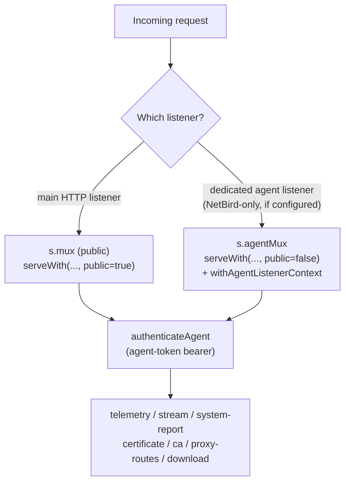

# HTTP API Surface (Reference)

Grouped reference for every HTTP route registered by the gateway (`internal/gateway/server.go` and its per-feature files), the auth mode each group expects, and a one-line purpose per endpoint. For the configuration that drives these routes, see [Configuration](../cross-cutting/configuration.md); for the underlying RBAC/session model, see the security & auth chapter.

## Auth modes

| Mode | How it's presented | Resolved by |
|---|---|---|
| **Public** | No credential | handler reads nothing auth-related |
| **Session + CSRF** | `op_ai_gateway_session` cookie; unsafe methods (non-GET/HEAD/OPTIONS) additionally require header `X-OP-CSRF: 1` | `authenticateWeb` |
| **Bearer** | `Authorization: Bearer <token>` — a user API token or a service token | `authenticate` |
| **Session-or-bearer** | Either of the above, resolved by the same call | `authenticateWeb` (used by every `requireWebScope`/`requireWebAnyScope` check) |
| **Bearer-only (any scope)** | Bearer only, accepting one of several scopes — used where a session principal must not be allowed (service-account-only paths) | `authenticate` via `requireAnyScope` |
| **Agent token** | `Authorization: Bearer <agent-secret>`, a separate per-AI-server credential (hashed lookup against `agent_tokens`, unrelated to user API tokens) | `authenticateAgent` |

On top of the auth mode, most session/bearer routes additionally require a **scope**:

| Scope | Granted to | Notes |
|---|---|---|
| `gateway:use` | every active user session; every ordinary API token | baseline — required by nearly all `/api/portal/*` and the inference/compat endpoints |
| `llm:invoke` | service tokens (service accounts) | narrower alternative accepted by inference/compat endpoints alongside `gateway:use`, per `requireAnyScope`/`requireWebAnyScope` |
| `admin` | user role `admin` or `system_admin` | required by global-admin management endpoints (servers/applications/mappings, model groups, model visibility, admin user-limits, `/api/admin/*`) |
| `system` | `system_admin` role **and** an elevated (step-up) session | required by every `/api/system/*` endpoint except the two public theme routes |

Many `/api/portal/*` endpoints (servers, applications, mappings, services, projects, groups, resource-groups) are gated at the HTTP layer only by the `gateway:use` baseline; **object-level authorization** (ownership, admin-group co-management, project/service delegate tiers) is then enforced inside `internal/portal.Service` itself, with a consistent no-existence-leak 404 for anything outside the caller's manageable set. The tables below note the small set of endpoints that additionally require the blanket `admin` or `system` scope at the HTTP layer.

## Dual-mux dispatch (agent endpoints)

The five `/api/agent/v1/*` handlers are registered identically on **both** the public mux (`s.mux`) and the dedicated mesh/agent mux (`s.agentMux`, served on a separate NetBird-facing listener when configured — see [Configuration §"Agent listener"](../cross-cutting/configuration.md)). Per-listener behavior (e.g. mesh-only enforcement, observed-TLS transport reporting) is threaded through the request context, not the handler function, since the same Go function backs both registrations.

Only requests that actually arrived on `agentMux` get `r.TLS` transport-hop reporting recorded (a public-mux request may be proxied over plaintext loopback internally and would misrepresent the real mesh transport).

## 1. Inference / compatibility endpoints

Client-facing, OpenAI/Anthropic/Codex/Claude-Code-compatible completion and model-listing routes. All require **session-or-bearer or bearer-only** auth with scope `gateway:use` or `llm:invoke` (service tokens); see the table for which variant each path uses. `/v1/responses` and `/v1/messages` also attempt **native passthrough** first (proxying the raw body straight to an upstream that natively speaks Codex/Claude Code) before falling back to translation.

| Path(s) | Method | Auth | Purpose |
|---|---|---|---|
| `/v1/chat/completions`, `/openai/v1/chat/completions` | POST | Session-or-bearer, `gateway:use`\|`llm:invoke` | OpenAI-compatible chat completions (streaming supported) |
| `/v1/responses`, `/openai/v1/responses` | POST | Bearer-only, `gateway:use`\|`llm:invoke` | OpenAI Responses API (Codex); native passthrough when the target app supports it |
| `/v1/messages`, `/anthropic/v1/messages` | POST | Bearer-only, `gateway:use`\|`llm:invoke` | Anthropic Messages API (Claude Code); native passthrough when the target app supports it — the only path where Anthropic streaming works end-to-end |
| `/v1/messages/count_tokens`, `/anthropic/v1/messages/count_tokens` | POST | Bearer-only, `gateway:use`\|`llm:invoke` | Anthropic token counting (utility call, no upstream inference, no billing) |
| `/v1/models`, `/openai/v1/models` | GET | Bearer-only, `gateway:use`\|`llm:invoke` | OpenAI-shaped model listing; discovery is unfiltered by a service token's own allowlist, but IS filtered by resource-group provisioning visibility |
| `/anthropic/v1/models` | GET | Session-or-bearer, `gateway:use` | Anthropic-shaped model listing |
| `/api/v0/models` | GET | Session-or-bearer, `gateway:use` | LM Studio-shaped model listing (emulated metadata only, e.g. `max_context_length`, for LM-Studio-aware clients such as opencode; actual chat still goes over `/v1/chat/completions`) |

## 2. Auth endpoints (`/api/auth/*`)

| Path | Method | Auth | Purpose |
|---|---|---|---|
| `/api/auth/login` | POST | Public + CSRF header | Password login; sets the session cookie on success |
| `/api/auth/logout` | POST | Session + CSRF | Clears the current session |
| `/api/auth/session` | GET | Public | Reports current auth state (`authenticated`, current-user DTO, default language) — used by the SPA on load; never errors on "not logged in" |
| `/api/auth/set-password` | POST | Public + CSRF header | Consumes a one-time set-password/invite token to set a password |

## 3. Portal endpoints (`/api/portal/*`)

Session-or-bearer, scope `gateway:use` unless noted. This is the bulk of the authenticated application API.

### Account, session, preferences

| Path | Methods | Purpose |
|---|---|---|
| `/api/portal/me` | GET | Current user DTO (role, elevation state, TOTP mode, etc.) |
| `/api/portal/password` | POST | Change own password (CSRF-enforced) |
| `/api/portal/language`, `/api/portal/currency` | GET/PUT, GET | Own preferred language; system-wide EUR→USD display factor |
| `/api/portal/preferences`, `/api/portal/preferences/{key}` | GET, GET/PUT | Opaque per-key UI preference storage |
| `/api/portal/chat-settings` | PUT | Own default chat run settings |
| `/api/portal/system-admin-mode` | POST/DELETE | Enter/leave System-Admin step-up elevation (requires role `system_admin`; may require re-entering the password per system setting) |
| `/api/portal/totp`, `/api/portal/totp/{action}` | GET/DELETE, POST | TOTP 2FA status/disable; enroll/confirm |

### Tokens, chats, usage

| Path | Methods | Purpose |
|---|---|---|
| `/api/portal/tokens`, `/api/portal/tokens/{id}[/rotate]` | GET/POST, PATCH/DELETE/POST | Own API token CRUD + rotate |
| `/api/portal/chats`, `/api/portal/chats/{id}[/runs...]` | GET/POST, GET/PUT/DELETE + run sub-paths | Portal built-in chat CRUD, run start/SSE events/cancel |
| `/api/portal/usage`, `/usage/stats`, `/usage/groups`, `/usage/timeseries`, `/usage/events` | GET | Own (or, with `admin` scope + `scope=all`, fleet-wide) usage analytics in various shapes |
| `/api/portal/usage/active` | GET | Currently in-flight requests (own, or all with `admin` scope) |
| `/api/portal/usage/captures/{id}` | GET | Read a captured request/response payload (capture must be enabled) |
| `/api/portal/benchmarks/active` | GET | Currently running benchmark jobs, visibility-filtered like server ownership |
| `/api/portal/dashboard` | GET | Aggregated dashboard payload |

#### Token model settings

User tokens and service tokens carry the same per-token model-settings **fields**,
but not the same write surface:

| Surface | Where the fields are writable | Where they are readable |
|---|---|---|
| User token | `POST /api/portal/tokens` (create) and `PATCH /api/portal/tokens/{id}` (update) | `GET /api/portal/tokens` |
| Service token | `POST /api/portal/services/{id}/tokens` (create) **only** — there is no update endpoint; `{tid}` accepts `DELETE`, and `{tid}/rotate` accepts `POST`, which replaces the secret and nothing else | `GET /api/portal/services/{id}/tokens` |

So a service token's model settings are **fixed at creation**: changing them
means deleting the token and creating a new one.

Every model-valued field is validated on write and an unroutable name is
rejected with `400 portal.token_model_override_invalid`. The set it is validated
against is the **writing principal's** callable models — the owner for a user
token, and for a service token the principal issuing it (a service delegate or
an authorized admin-group manager), never the service's own allowed-model list. That is a usability guard, not the security boundary: the
service allowlist still refuses the request at inference time if the two
disagree (see
[Security, Authentication & Authorization](../cross-cutting/security-auth-rbac.md)).

| Field | Shape | Meaning |
|---|---|---|
| `model_override` | string | catch-all: rewrites any requested model that has no rule of its own (`""` = off) |
| `model_override_map` | object, `requested -> {"to","offer","hide_target"}` | per-requested-name rules. `to` is the gateway model or group to route to; `offer` advertises the requested name in this token's model listing, inheriting the target's flavors; `hide_target` drops the target's own name from that listing. Both switches are listing-only |
| `unknown_model_redirect` | bool | opt into the unknown-model redirect |
| `unknown_model_redirect_blocked` | bool | widen "unknown" from "no such model" to "also models this token may not use"; ignored (stored `false`) while the redirect is off |
| `unknown_model_fallback` | string | model or group used when the marker below is empty or no longer routable; cleared while the redirect is off |
| `last_used_model` | string, **read-only** | the gateway model or group of this token's last successfully routed request. Present on token DTOs, accepted on no request body — a writable marker would let a client choose where its own unknown requests go |

The rule object is the only accepted wire shape; the legacy
`requested -> "target"` string map is tolerated when *reading* the stored
column, which is why the feature needed no data migration. Semantics — the
resolution order, the three model sets, and the invariant that a redirected
request still passes every admission gate — are in
[Routing & Model Selection §2.1–2.2](../cross-cutting/routing-and-model-selection.md).

### Models, servers, applications, mappings

| Path | Methods | Auth notes | Purpose |
|---|---|---|---|
| `/api/portal/models` | GET | `gateway:use` | Model catalog visible to the caller |
| `/api/portal/model-servers`, `/model-servers/events` | GET, GET (SSE) | `gateway:use` | Servers offering a given model + live benchmark/loaded state; SSE push on load-state change |
| `/api/portal/model-group-servers` | GET | `gateway:use` | Candidate servers for a model group, ranked by the group's **manual** traversal order + live per-mapping score (it does not model `member_order`, `loaded_only` or `min_tokens_per_second`, so such a group may be served in a different order than shown) |
| `/api/portal/model-groups`, `/model-groups/{id}` | GET/POST, GET/PUT/DELETE | **`admin`** | Model-group CRUD (global-admin capability) |
| `/api/portal/model-settings/{name}` | PUT | **`admin`** | Set a model's visibility |
| `/api/portal/servers`, `/servers/{id}[/...]` | GET/POST, GET/PATCH/DELETE + sub-paths (energy, admin-groups, applications, agent-token, resource-groups, models, certificate, https-switch-override, ping) | `gateway:use` + object-level ownership inside `portal.Service` | AI server CRUD and per-server management surface |
| `/api/portal/applications/{id}` | GET/PATCH/DELETE | `gateway:use` + ownership | Application (inference backend) CRUD |
| `/api/portal/mappings/{id}` | PATCH/DELETE | `gateway:use` + ownership | Model-mapping CRUD |
| `/api/portal/agent-binaries`, `/agent-binaries/{...}` | GET | `gateway:use` | List / download ServerAgent release binaries for manual install |

### Groups, projects, services, resource-groups (governance model)

| Path | Methods | Purpose |
|---|---|---|
| `/api/portal/groups`, `/groups/{id}[/...]` | GET/POST, GET/PUT/DELETE + members/managers/candidates/accept/decline | User-group CRUD, membership, co-manager permissions, invitations |
| `/api/portal/groups/invitations` | GET | Caller's own pending group invitations |
| `/api/portal/projects`, `/projects/mine`, `/projects/{id}[/...]` | GET/POST, GET, GET/PUT/DELETE + members/candidates/groups/tokens | Project CRUD, ownership transfer, member/group/token management (owner/admin only inside the service) |
| `/api/portal/services`, `/services/{id}[/...]` | GET/POST, GET/PUT/DELETE + tokens/admin-groups | Service (service-account) CRUD, delegate-scoped token issuance |
| `/api/portal/resource-groups`, `/resource-groups/{id}[/...]` | GET/POST, GET/PATCH/DELETE + servers/admin-groups/provisions/candidates | Resource-group CRUD, server membership, provisioning to users/groups/services |
| `/api/portal/server-admin-group-candidates`, `/service-admin-group-candidates`, `/resource-group-admin-group-candidates`, `/admin-owner-candidates` | GET | Addable-candidate lists for the respective admin-group/owner pickers |
| `/api/portal/admin/users/{id}/limits` | GET/PUT | **`admin`** (plus a manageable-user-set check for a non-`system` caller) | Per-user rate/quota/budget limit management — deliberately no self-service path |

### Feature flags / small read-only status

| Path | Purpose |
|---|---|
| `/api/portal/netbird/enabled` | Whether NetBird integration is enabled (boolean only, no config leak) |
| `/api/portal/certificates/enabled` | Whether the certificate module is enabled |
| `/api/portal/health-check-interval` | Live app-health probe cadence (read-only mirror of a system setting) |
| `/api/portal/agent-presence-timeout` | Live agent-presence timeout (read-only mirror of a system setting) |

### Legacy / additional

| Path | Auth | Purpose |
|---|---|---|
| `/api/usage` | Bearer, `gateway:use` | Legacy simple own-usage-by-user endpoint (bearer-only, superseded by `/api/portal/usage*`) |
| `/api/admin/users`, `/api/admin/users/{id}` | Session-or-bearer, **`admin`** | Legacy top-level admin user list/detail (distinct from the portal-namespaced `/api/portal/admin/users/{id}/limits`) |

## 4. System endpoints (`/api/system/*`)

Session-or-bearer, scope **`system`** (role `system_admin` + step-up elevation) for every route **except** the two public theme routes.

| Path | Methods | Auth | Purpose |
|---|---|---|---|
| `/api/system/theme` | GET | **Public** | Active theme descriptor for the pre-login UI |
| `/api/system/themes/{id}/favicon\|logo` | GET | **Public** | External theme asset (favicon/logo); `{id}` resolved only against the loaded theme registry, never joined onto a filesystem path — no traversal surface |
| `/api/system/settings` | GET/PUT | `system` | System-wide settings (SMTP, NetBird, certificate gates, currency, etc.) |
| `/api/system/smtp/test` | POST | `system` | Send a test email with the currently configured/pending SMTP settings |
| `/api/system/tracing` | GET/PUT | `system` | OpenTelemetry tracing status/config |
| `/api/system/logs`, `/logs/events`, `/logs/level` | GET, GET (SSE), GET/PUT | `system` | Log buffer snapshot, live tail, runtime log-level control |
| `/api/system/netbird/test`, `/network`, `/groups`, `/peers`, `/gateway-setup-key`, `/enroll-sidecar`, `/status`, `/token-status`, `/rotate-token` | GET/POST (per route) | `system` | NetBird admin API connectivity test, network/group/peer inspection, sidecar self-enrollment, connection status, admin-token rotation |
| `/api/system/servers/{id}/netbird` | PUT | `system` | Per-server NetBird management (distinct from the portal's own-server routes) |
| `/api/system/certificates` | GET | `system` | Certificate module overview |
| `/api/system/certificates/renew` | POST | `system` | Force a renewal pass |
| `/api/system/certificates/ca`, `/ca/rotate` | GET, POST | `system` | Internal CA status; rotate the internal CA |
| `/api/system/certificates/reissue-all` | POST | `system` | Reissue every managed certificate |
| `/api/system/certificates/edge`, `/edge/reissue`, `/edge/bundle`, `/edge/key`, `/edge/proxy-config`, `/edge/probe` | GET/POST (per route) | `system` | The gateway's own edge (nginx-facing) certificate: status, reissue, bundle/key download, generated nginx proxy config, synthetic TLS self-probe |
| `/api/system/certificates/public/{domain}/bundle`, `/public/{domain}/key` | GET | `system` | Export a `kind=public`-managed domain's certificate bundle/key for an upstream reverse proxy; the `{domain}` wildcard resolves only against real `public`-kind rows, so a name collision can never leak a mesh/edge certificate |

## 5. Agent endpoints (`/api/agent/v1/*`)

**Agent-token bearer** auth (`authenticateAgent`) — a per-AI-server secret, distinct from user/service API tokens, hashed and looked up against `agent_tokens`. Registered on **both** the public mux and the dedicated agent mux (see the dual-mux diagram above).

| Path | Method | Purpose |
|---|---|---|
| `/api/agent/v1/telemetry` | POST | Ingest one telemetry sample (POST transport) |
| `/api/agent/v1/stream` | GET (WebSocket upgrade) | Persistent telemetry stream (WebSocket transport) + server-pushed doorbells (e.g. certificate updates) |
| `/api/agent/v1/system-report` | POST | Ingest the static hardware inventory report |
| `/api/agent/v1/certificate` | GET | Fetch the agent's current mesh leaf certificate (cert modes `files`/`proxy`) |
| `/api/agent/v1/ca` | GET | Fetch the internal CA bundle |
| `/api/agent/v1/proxy-routes` | GET | Fetch the gateway-provided TLS proxy route topology (cert mode `proxy`) |
| `/api/agent/v1/download/{...}` | GET | Agent distribution: download a ServerAgent release binary/manifest/config (fetched by operators or scripts; the agent does not update itself) |

## 6. Health & SPA

| Path | Auth | Purpose |
|---|---|---|
| `/healthz` | Public | Liveness probe (registered on both `s.mux` and `s.agentMux`); also used by the container's own Docker healthcheck |
| `/.well-known/acme-challenge/{token}` | Public | ACME HTTP-01 challenge response (public mux only — deliberately reachable over plaintext regardless of any HTTPS-require gate, since an ACME order cannot use TLS to prove domain control) |
| `/` and everything unmatched on the backend | Public | The Go backend itself has no SPA/static-file serving; it answers any unmatched path with a JSON 404 (`request.not_found`). In the bundled deployment, the React SPA is served by nginx at `/portal/` (see `gateway/deploy/nginx/locations.conf`), which also proxies `/api/`, `/v1/`, `/openai/`, `/anthropic/`, `/healthz`, and the ACME challenge path to the backend |

## See also

- [Configuration](../cross-cutting/configuration.md) — session cookie, CSRF, and driver/env wiring behind this surface.
- [Configuration & Environment Variables (Reference)](./config-env.md) — every variable referenced above.
- [OpenAPI spec](./openapi.yaml) — machine-readable, path-level index of this surface (routes, methods, auth); this document stays the canonical prose reference.
