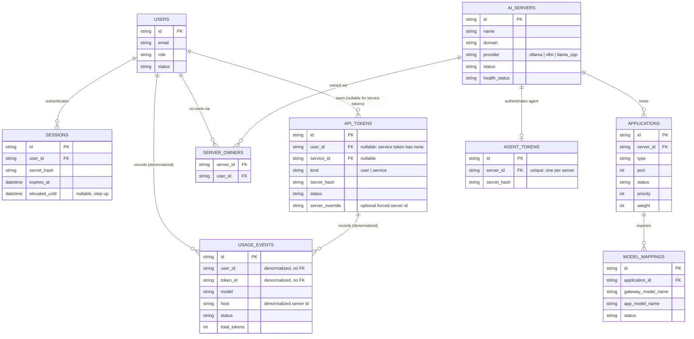

# Data Model (Reference)

The current domain tables, the core entity relationships, the Go types that
back them, and the full migration history that produced this schema. See
[Persistence](../cross-cutting/persistence.md) for the store boundary, the
dialect seam, and the migration runner mechanics; this chapter is the
concrete reference.

Obsolete tables are excluded: `model_hosts` was renamed to `ai_servers`
(baseline migration); `model_routes` was dropped (routing is mapping-based,
not route-based).

## 1. Current tables by area

### Identity & auth

| Table | Purpose |
|---|---|
| `users` | Local accounts: email, display name, role (`user`/`admin`/`system_admin`), status, preferred language, password hash, TOTP secret/enrollment state, session-chat capture flags. |
| `sessions` | Server-side session record: secret hash, expiry, last-seen, optional `elevated_until` (system-admin step-up window). |
| `set_password_tokens` | One-time tokens for the set/reset-password flow. |

### Tokens & usage

| Table | Purpose |
|---|---|
| `api_tokens` | Bearer API tokens. `user_id` is nullable (a *service* token has none instead); carries the per-token model catch-all override and override-rule map (`model_override_map`, a JSON string of `requested -> {to, offer, hide_target}`), the unknown-model redirect settings and the `last_used_model` marker it aims at, log-communication and secret-capture flags, optional project attribution, and an optional per-token AI-server override. |
| `route_affinity` | Sticky-routing memory: which application/server a given `(token, model, api_flavor, session)` was last routed to, with a TTL. |
| `usage_events` | One row per completed/failed request: tokens in/out/cached/cache-write, latency, status, provider/model, the client's originally-requested model (`requested_model`, since migration 61; `''` on rows recorded before it), session/service/project attribution, and P1 energy-attribution fields (`energy_wh`, `energy_marginal_wh`, `energy_source`). Deliberately carries **no foreign keys** on `user_id`/`token_id`/`host`/`service_id`/`project_id` — usage history must survive the deletion of the user, token, server, service, or project it references. |
| `captures` | Optional encrypted request/response payload capture, one row per `usage_events` row (FK cascade — a capture cannot outlive its usage event). |
| `principal_limits` | Optional per-principal (`user` or `service`) rate/quota/budget limits, keyed by `(principal_type, principal_id)`. |

### AI servers, applications & model mappings

| Table | Purpose |
|---|---|
| `ai_servers` | A physical/virtual host running Ollama, llama.cpp, or vLLM: domain/endpoint, health status, NetBird mesh linkage, energy-config (watts/price/PUE), admin-group containment root, per-server certificate/HTTPS-switch overrides, and the two managed-runtime columns `runtime_max_processes` (`0` = unlimited) and `managed_runtime_only`. |
| `server_owners` | `(server_id, user_id)` join — which users own/administer a given server. |
| `applications` | One upstream API surface on a server: port/scheme/API flavors, priority/weight for scoring, native-passthrough flags, health-check config, loaded-models/context/capacity probe paths, sealed per-application upstream token, benchmark-schedule config, assigned TLS proxy port, `proxy_excluded` (migration 70: the operator's opt-out from the gateway-guided TLS proxy). At most **one** row per server may have `type = 'server_agent'` (migration 68). |
| `model_mappings` | One gateway-model ↔ app-model binding on an application: performance metrics (tokens/s, load time, context size, vision capability, energy/token), concurrency-capacity metrics. |
| `model_mapping_benchmarks` | Historical benchmark runs for a mapping (one row per run): measured throughput/latency/context/vision-capable/error, optionally a capacity curve (`capacity_curve`) or a VRAM-benchmark result (`vram_json`, migration 71). Each kind-specific payload gets its **own** opaque column, read for that `kind` only. |
| `model_settings` | Per-gateway-model-name metadata — currently just visibility (`shown`/`hidden`/`locked`). |

### Agent-managed model runtime

See [Agent-Managed Model Runtime](../cross-cutting/agent-runtime-manager.md) for
what these five tables are for, and §4 below for their field semantics.

| Table | Purpose |
|---|---|
| `agent_runtime_specs` | One launch specification per model mapping (`mapping_id` unique, cascade): `binary_path`, opaque-JSON `args`/`env`, `work_dir`, `listen_port`, health path/timeouts, `startup_timeout_seconds`, `idle_timeout_seconds`, `admission_wait_timeout_seconds`, `pinned`, `admin_state`, `vram_locked`, `set_visible_devices` (migration 69: the agent sets the vendor-appropriate GPU visibility variable for this spec's child from its own GPU rows), `enabled` (off by default). |
| `agent_runtime_spec_gpus` | Per-GPU VRAM demand for a spec, PK `(spec_id, gpu_index)`: operator-owned `vram_estimate_mb` and agent-owned `vram_measured_mb`. |
| `agent_coresidency_rules` | The pairwise co-residency matrix, PK `(application_id, mapping_a_id, mapping_b_id)` with `a < b`; **row present = pair allowed**. |
| `ai_server_gpu_budgets` | Per-GPU VRAM ceiling for a server, PK `(server_id, gpu_index)`, plus the one-time `expected_uuid`/`expected_name` drift snapshot. |
| `server_runtime_reports` | 1:1 latest runtime-config report per server (upsert-overwrite), for an agent whose configuration source is a local file: an opaque validated JSON blob with env values already masked. |

### Model groups

| Table | Purpose |
|---|---|
| `model_groups` | A named priority-failover group offered to clients as a single synthetic gateway model (failover mode, subgroup traversal order, and the four combinable selection settings: `loaded_only`, `member_order`, `climb_speed_margin_percent`, `min_tokens_per_second` + `min_speed_fallback`). |
| `model_group_members` | Ordered members of a model group (a gateway model name + priority). |

### Telemetry, availability & hardware

| Table | Purpose |
|---|---|
| `server_telemetry` | Latest routing-scorer summary per server (CPU load, RAM/VRAM, active requests, queue depth, latency, error rate, provider health) — 1:1, upsert-overwrite. |
| `server_telemetry_samples` | Rich time-series performance samples pushed by the ServerAgent (CPU/mem/swap/load averages, GPU/network JSON, optional power draw and CPU temperature). |
| `server_availability_samples` | Time-series reachability samples (health, reachable/active application counts, agent-reporting flag, NetBird-connected flag). |
| `server_hardware` | Latest static hardware inventory reported by the agent (1:1, upsert-overwrite) as a privacy-scrubbed JSON blob — never serials, board/chassis UUIDs, or MAC addresses. |
| `agent_tokens` | The bearer credential a ServerAgent uses to authenticate to the gateway — exactly one per server (`server_id` is unique). |

### Certificates

| Table | Purpose |
|---|---|
| `certificates` | One ACME-managed TLS certificate per domain (`kind` = `gateway`/`server`/`public`); sealed private key, fingerprint, issuer fingerprint (self-signed CA rotation detection), issue/attempt/error bookkeeping. |

### Groups, projects, services & resource groups

| Table | Purpose |
|---|---|
| `user_groups` | The system → admin → user group tree (`tier`, optional `parent_group_id`, optional `owner_user_id`). Two fixed, migration-seeded default groups exist for idempotent seeding. |
| `user_group_members` | `(group_id, user_id)` membership, with state (`member`/`invited`) and inviter. |
| `user_group_managers` | Per-group co-managers, with five independently-toggleable permission flags (users, group, servers, services, resources). |
| `projects` | A cross-user grouping for usage attribution; optionally "coupled" to exactly one user-group (no individual members, owner derived from the group). |
| `project_members` | `(project_id, user_id)` membership. |
| `project_groups` | `(project_id, group_id)` — user-groups assigned to a project. |
| `services` | A service account: name/description/status, admin-group containment root. |
| `service_delegates` | Users delegated to manage a service, at one of two stages (token-delegate vs. full-delegate). |
| `service_allowed_models` | The gateway-model allowlist for a service's tokens. |
| `service_admin_groups` | `(service_id, group_id)` — admin groups that may manage a service. |
| `server_admin_groups` | `(server_id, group_id)` — admin groups that may manage a server. |
| `resource_groups` | A named management container for AI-servers (admin-group permissions model). |
| `resource_group_servers` | `(resource_group_id, server_id)` — member servers. |
| `resource_group_admin_groups` | `(resource_group_id, group_id)` — admin groups that may manage the resource group. |
| `resource_group_provisions` | Polymorphic "provisioned for" targets of a resource group (`target_kind` ∈ user_group/admin_group/user/service, `target_id` — no FK, since the target table depends on `target_kind`). |

### System settings & preferences

| Table | Purpose |
|---|---|
| `system_settings` | A generic key/value store for portal-wide settings (SMTP config, NetBird token, feature toggles, …). |
| `user_ui_preferences` | Per-user opaque JSON preferences, keyed by `(user_id, key)`. |

### Migration bookkeeping

| Table | Purpose |
|---|---|
| `schema_migrations` | `(version, name, applied_at)` — one row per applied migration; see [Persistence §3](../cross-cutting/persistence.md#3-the-migration-runner). |

## 2. Core entity relationships

The diagram below keeps to the load-bearing core — the tables every request
touches on its way through auth, routing, and usage recording — not the full
~40-table schema above.

`SERVER_OWNERS` is the `(server_id, user_id)` join table connecting `USERS`
and `AI_SERVERS` many-to-many. `USAGE_EVENTS`'s links to `USERS` and
`API_TOKENS` are deliberately **not** enforced foreign keys — see
[Persistence §1](../cross-cutting/persistence.md) and the `usage_events`
row above — so a request's usage history outlives the user, token, server,
service, or project that produced it.

## 3. Key domain types

| Go type | File | Purpose |
|---|---|---|
| `store.User` | `internal/store/models.go` | A local account (role/status/language/TOTP/password state). |
| `store.TokenRecord` | `internal/store/models.go` | An API token — user- or service-owned, with override/attribution fields. |
| `store.Session` | `internal/store/models.go` | A server-side session, including the step-up `ElevatedUntil` window. |
| `store.SetPasswordToken` | `internal/store/models.go` | A one-time set/reset-password token. |
| `store.UserUIPreference` | `internal/store/models.go` | One per-user UI preference (opaque JSON under a string key). |
| `store.UserGroup` / `UserGroupMembership` / `UserGroupManagerPerm` | `internal/store/models.go` | The system→admin→user group tree, its memberships, and per-co-manager permission flags. |
| `store.Project` | `internal/store/models.go` | A cross-user usage-attribution grouping, optionally coupled to a user-group. |
| `routing.AIServer` | `internal/routing/store.go` | A serving host: NetBird linkage, energy config, admin-group/certificate/HTTPS-switch overrides. |
| `routing.Application` | `internal/routing/store.go` | An upstream API surface on a server: scoring inputs, health-check config, probes, sealed upstream token. |
| `routing.ModelMapping` | `internal/routing/store.go` | A gateway-model ↔ app-model binding with performance and capacity metrics. |
| `routing.ModelGroup` / `GroupMember` / `ModelSetting` | `internal/routing/store.go` | Priority-failover synthetic models, their ordered members, and per-model visibility. |
| `routing.Service` / `ServiceDelegate` | `internal/routing/store.go` | A service account and its delegated managers. |
| `routing.ResourceGroup` / `ResourceGroupProvision` | `internal/routing/store.go` | A server-management container and its polymorphic provisioning targets. |
| `routing.ServerTelemetry` / `TelemetrySample` / `ServerAvailabilitySample` / `ServerHardware` | `internal/routing/store.go` | Latest scorer summary, time-series performance samples, availability samples, and static hardware inventory. |
| `routing.AgentToken` | `internal/routing/store.go` | The per-server ServerAgent bearer credential. |
| `routing.Certificate` | `internal/routing/store.go` | One ACME-managed TLS certificate (sealed key, fingerprints, issue/error state). |
| `routing.LimitConfig` | `internal/routing/store.go` | A principal's optional rate/quota/budget limits. |
| `usage.Event` | `internal/usage/recorder.go` | One recorded request: tokens, latency, status, attribution, and energy fields. |

## 4. Migration history (71 migrations)

All migrations live in `internal/store/migrate.go`, are forward-only, and
are applied — only the pending ones, each in its own transaction — by
`(*store.SQLStore).Migrate` on startup when `OP_AI_GATEWAY_AUTO_MIGRATE` is
set (see [Persistence §3](../cross-cutting/persistence.md#3-the-migration-runner)).

### Foundational

| # | Migration | Purpose |
|---|---|---|
| 1 | `baseline` | The full v1 schema: users, sessions, tokens, AI servers, applications, model mappings, usage events, captures, chats, and related indexes. |
| 2 | `user_totp` | Adds per-user TOTP 2FA columns (secret, pending secret, enabled flag, confirmed-at). |

### Telemetry & application probing

| # | Migration | Purpose |
|---|---|---|
| 3 | `server_telemetry_samples` | Adds the `server_telemetry_samples` time-series table. |
| 4 | `server_telemetry_bigint_bytes` | Widens `server_telemetry`'s byte columns from `integer` to `bigint` on Postgres (int4 overflow on hosts with >2 GB RAM/VRAM). |
| 5 | `application_native_passthrough` | Adds per-application native-passthrough flags (`native_responses`, `native_messages`). |
| 6 | `usage_provider_path` | Adds `usage_events.provider_path` — the actual upstream endpoint path called. |
| 7 | `token_model_override_map` | Adds `api_tokens.model_override_map` — the per-requested-model override map. |
| 8 | `application_loaded_models` | Adds `applications.loaded_models_path`/`loaded_models_format` (which upstream endpoint/format reports loaded models). |
| 9 | `model_mapping_metrics` | Adds the per-mapping performance-metric columns (throughput, load time, context size, metrics provenance). |
| 10 | `application_context_probe` | Adds `applications.context_probe_path` (optional context-size probe endpoint). |
| 11 | `model_mapping_benchmarks` | Adds the `model_mapping_benchmarks` history table (one row per benchmark run). |
| 12 | `application_benchmark_modes` | Adds the per-application scheduled/opportunistic benchmark-mode columns. |
| 13 | `mapping_concurrency_capacity` | Adds the per-mapping concurrency-capacity metric columns. |
| 14 | `application_capacity_probe` | Adds `applications.capacity_probe_path` (optional saturation-signal probe endpoint). |
| 15 | `model_mapping_benchmarks_capacity` | Adds capacity-curve columns to `model_mapping_benchmarks`. |
| 16 | `application_admission_queue_timeout` | Adds `applications.admission_queue_timeout_seconds` (bounded wait for a concurrency slot). |
| 17 | `server_app_path_and_upstream_token` | Adds server/application URL-path-suffix columns and the sealed per-application upstream token + header name. |

### NetBird mesh integration

| # | Migration | Purpose |
|---|---|---|
| 18 | `server_netbird` | Adds the core NetBird columns to `ai_servers` (enabled, setup-key id, group id, peer id, connected). |
| 19 | `server_netbird_groups` | Adds `ai_servers.netbird_group_ids` (opaque JSON mirror of the peer's policy groups). |
| 20 | `server_netbird_peer_managed` | Adds `ai_servers.netbird_peer_managed` (provenance: gateway-created peer vs. manually linked). |
| 21 | `server_netbird_policy_override` | Adds `ai_servers.netbird_policy_override` (per-server policy include/exclude). |
| 23 | `server_availability_samples` | Adds the `server_availability_samples` time-series table. |
| 24 | `server_netbird_allow_ping` | Adds `ai_servers.netbird_allow_ping`. |
| 25 | `server_netbird_ping_exclude` | Adds `ai_servers.netbird_ping_exclude` (opt-out from the account-wide ping-all switch). |
| 27 | `server_availability_netbird_connected` | Adds the NetBird-connected flag to `server_availability_samples`. |

### Model groups & vision capability

| # | Migration | Purpose |
|---|---|---|
| 22 | `model_groups` | Creates `model_groups` + `model_group_members` (priority-failover synthetic models). |
| 26 | `model_group_traversal` | Adds `model_groups.traversal` (subgroup expansion order: depth/breadth/round-robin). |
| 32 | `model_mappings_vision_capable` | Adds `model_mappings.vision_capable`. |
| 33 | `model_mapping_benchmarks_vision_capable` | Adds the definitive measured `vision_capable` flag to benchmark runs. |
| 62 | `model_group_selection_settings` | Adds the five model-group selection-setting columns: `loaded_only`, `member_order`, `climb_speed_margin_percent`, `min_tokens_per_second`, `min_speed_fallback`. |

### Hardware & power telemetry

| # | Migration | Purpose |
|---|---|---|
| 28 | `server_telemetry_samples_power` | Adds nullable CPU/system power-draw columns to `server_telemetry_samples`. |
| 29 | `server_hardware` | Creates the `server_hardware` table (1:1 latest static hardware inventory). |
| 30 | `server_telemetry_samples_cpu_temp` | Adds the nullable `cpu_temp_c` column. |
| 31 | `server_agent_presence_timeout` | Adds `ai_servers.agent_presence_timeout_seconds` (per-server override of the presence window). |

### Energy attribution

| # | Migration | Purpose |
|---|---|---|
| 34 | `usage_events_energy` | Adds the P1 energy-attribution columns to `usage_events` (`energy_wh`, `energy_marginal_wh`, `energy_source`). |
| 35 | `ai_servers_energy_config` | Adds the four per-server energy-config columns (estimated/idle watts, price/kWh, PUE). |
| 36 | `model_mappings_energy_wh_per_token` | Adds `model_mappings.energy_wh_per_token` (manually-entered per-token energy coefficient). |
| 37 | `ai_servers_price_unit` | Adds `ai_servers.price_unit` (display-only unit metadata for `price_per_kwh`). |

### Usage protocol/session attribution

| # | Migration | Purpose |
|---|---|---|
| 6 | `usage_provider_path` | *(see above)* |
| 38 | `usage_events_cache_write_tokens` | Adds `usage_events.cache_write_tokens` (prompt-cache write tokens, e.g. Anthropic cache creation). |
| 39 | `usage_events_session_source_agent` | Adds `usage_events.session_source`/`agent_id` (protocol-aware session attribution). |
| 61 | `usage_requested_model` | Adds `usage_events.requested_model` — the client's original model name, before any token model-override (`''` on rows recorded before this migration). |

### Service accounts, limits & affinity

| # | Migration | Purpose |
|---|---|---|
| 40 | `service_accounts` | Phase-1 service accounts: creates `services`/`service_delegates`/`service_allowed_models`, makes `api_tokens.user_id` nullable, adds `service_id`/`kind`. |
| 41 | `principal_limits` | Creates the `principal_limits` table (per-principal rate/quota/budget limits). |
| 42 | `route_affinity_user_id_nullable` | Makes `route_affinity.user_id` nullable (a service token has no user). |
| 43 | `float_columns_double_precision` | Widens every `real` column to `double precision` on Postgres (float32 precision loss on aggregation). |

### User groups & projects

| # | Migration | Purpose |
|---|---|---|
| 44 | `user_groups` | Creates the system→admin→user group tree (`user_groups`, `user_group_members`, `user_group_managers`), seeding two default groups. |
| 45 | `projects` | Creates `projects`/`project_members`/`project_groups`; adds `api_tokens.project_id` and `usage_events.project_id`/`project_name`. |
| 46 | `projects_coupled_group` | Adds `projects.coupled_group_id` (a project coupled 1:1 to a user-group). |
| 47 | `session_elevation` | Adds `sessions.elevated_until` (system-admin step-up mode). |

### Admin-group permissions

| # | Migration | Purpose |
|---|---|---|
| 48 | `user_group_managers_permissions` | Adds `can_manage_users`/`can_manage_group` co-manager flags. |
| 49 | `user_group_managers_can_manage_servers` | Adds the `can_manage_servers` co-manager flag. |
| 50 | `server_admin_groups` | Adds `ai_servers.system_group_id` and the `server_admin_groups` join table. |
| 51 | `user_group_managers_can_manage_services` | Adds the `can_manage_services` co-manager flag. |
| 52 | `service_admin_groups` | Adds `services.system_group_id` and the `service_admin_groups` join table. |
| 53 | `user_group_managers_can_manage_resources` | Adds the `can_manage_resources` co-manager flag. |

### Resource groups

| # | Migration | Purpose |
|---|---|---|
| 54 | `resource_groups` | Creates `resource_groups`, `resource_group_admin_groups`, `resource_group_servers`. |
| 55 | `resource_group_provisions` | Creates `resource_group_provisions` (polymorphic provisioning targets). |

### Server-override & certificates

| # | Migration | Purpose |
|---|---|---|
| 56 | `api_tokens_server_override` | Adds `api_tokens.server_override`/`server_override_force_unreachable`. |
| 57 | `certificates` | Creates the `certificates` table (ACME/Let's Encrypt management). |
| 58 | `server_certificate_override` | Adds `ai_servers.certificate_override` (per-server ACME include/exclude). |
| 59 | `application_proxy_listen_port` | Adds `applications.proxy_listen_port` (gateway-assigned TLS proxy port, P4 HTTPS switch). |
| 60 | `server_https_switch_override` | Adds `ai_servers.https_switch_override` (per-server HTTPS-auto-switch include/exclude). |

### Per-token model settings

| # | Migration | Purpose |
|---|---|---|
| 7 | `token_model_override_map` | *(see above)* — the column can now hold `requested -> {to, offer, hide_target}` objects; the legacy `requested -> "target"` string map is still decoded, so the per-row switches needed no migration of their own. |
| 63 | `token_unknown_model_redirect` | Adds `api_tokens.last_used_model` plus `unknown_model_redirect`/`unknown_model_redirect_blocked`/`unknown_model_fallback`. Defaults reproduce the pre-feature behavior exactly: the redirect is off, so resolution is unchanged for every existing token. |

**Rollback and `model_override_map`.** The four columns migration 63 adds are
append-only, so an older binary simply never selects them. The one place a
rollback can still lose data is `model_override_map`, and exactly one case does:

| Token's override rows | Read by a pre-v63 binary |
|---|---|
| neither `offer` nor `hide_target` used | **lossless** — `EncodeModelOverrideRules` writes those rows in the legacy `"requested":"target"` string form, byte-identical to what the old encoder wrote |
| at least one row uses a switch | **the whole map is lost** — the old decoder unmarshals the column into `map[string]string` and returns `nil` on the first object-valued row, taking the untouched sibling rows with it; the next save under the old binary then writes `""` over the column |

The encoder therefore picks the *narrowest* shape per row: legacy string when a
row needs nothing more, object only when a switch is actually set. A deployment
that never touches the new switches stays fully downgradable; the residual is
opt-in and limited to the tokens an operator configured with them (never the
catch-all `model_override`, which has its own column).

### Model-group speed floor

| # | Migration | Purpose |
|---|---|---|
| 64 | `model_group_min_tps_double_precision` | Widens migration 62's `model_groups.min_tokens_per_second` from PostgreSQL `real` (float32, which silently rounds) to `double precision`. A forward migration rather than an edit to 62, per the append-only rule and [ADR-005](../09-architecture-decisions.md#adr-005--postgresql-needs-wide-column-types); a no-op on SQLite. |

### Agent-managed model runtime

| # | Migration | Purpose |
|---|---|---|
| 65 | `agent_runtime_manager` | Creates `agent_runtime_specs` (one launch spec per model mapping), `agent_runtime_spec_gpus` (per-GPU VRAM demand), and `agent_coresidency_rules` (the pairwise matrix). |
| 66 | `server_runtime_limits` | Creates `ai_server_gpu_budgets` (PK `(server_id, gpu_index)`); adds `ai_servers.runtime_max_processes` (`0` = unlimited) and `ai_servers.managed_runtime_only`. |
| 67 | `server_runtime_reports` | Creates `server_runtime_reports` — 1:1 latest runtime-config report per server (PK `server_id`, upsert-overwrite), shaped column-for-column like migration 29's `server_hardware`: `report_json` is a validated opaque blob the store never parses. |
| 68 | `application_single_server_agent` | A **partial unique index only, no columns**: `applications(server_id) where type = 'server_agent'`, enforcing at most one `server_agent` application per server. Skips index creation (while still recording version 68) on a database that already holds duplicates — see [Persistence §3](../cross-cutting/persistence.md#3-the-migration-runner) for why that is a deliberate policy rather than an incomplete migration. |
| 69 | `runtime_spec_set_visible_devices` | Adds `agent_runtime_specs.set_visible_devices` (integer boolean, default `0`): the agent sets the vendor-appropriate GPU visibility variable (`CUDA_VISIBLE_DEVICES` on NVIDIA, `ROCR_VISIBLE_DEVICES` on AMD) for that spec's child from that spec's own GPU indices. Appended rather than folded into migration 65 — which created the table on the same unreleased branch — because 65 had already run against every developer database and both CI conformance legs. |
| 70 | `application_proxy_excluded` | Adds `applications.proxy_excluded` (integer boolean, default `0`): the operator's explicit opt-out from the gateway-guided TLS proxy, orthogonal to `scheme`. **Backfills** it to `1` for exactly `scheme = 'https' AND proxy_listen_port = 0` — the retired IMPLICIT encoding of "this application runs its own TLS", which the portal's candidate predicate already skipped — so the column becomes the single authoritative representation of that decision and no reader has to re-derive it. Every other stored shape stays `0`, including a disabled own-TLS row (it keeps the participation it would have had if re-enabled) and an empty-scheme row (an empty scheme resolves to http, which is a participating shape). Aborts the boot on failure rather than skipping like migration 68: a deterministic backfill has no pre-check to fail, and skipping it would leave the column and the retired encoding disagreeing forever. |

### VRAM benchmark

| # | Migration | Purpose |
|---|---|---|
| 71 | `model_mapping_benchmarks_vram_json` | Adds `model_mapping_benchmarks.vram_json` (`text`, default empty): the VRAM benchmark's per-GPU result for a `kind = 'vram'` history row. Its **own** column, following `capacity_curve` (migration 15) exactly — an opaque JSON string the store never parses, marshalled by the gateway and decoded in the portal DTO for that one kind; reusing `capacity_curve` would be a lie in a column name. `text` on both dialects, because the payload grows with the number of GPUs watched and with the per-spec isolation evidence, so it has no small bound to declare ([ADR-005](../09-architecture-decisions.md#adr-005--postgresql-needs-wide-column-types)). The v60-frozen baseline creates the table without the column, so the `ALTER` does real work on a fresh install as well as on an upgrade. **No backfill** — no earlier row has a VRAM result to derive — and the row is evidence, never authority: nothing reads it back into a launch spec's `vram_estimate_mb` or `vram_measured_mb`. |

Field semantics in these tables that are **not** self-evident, and where a
plausible-looking validation rule would break the normal case:

- **Every VRAM value is megabytes, stored as `integer`** (2³¹ MB ≈ 2 PB), and
  every new float column is `double precision` from the start — the ADR-005
  lesson applied so the int4-overflow class cannot recur here. `vram_mb`,
  `budget_mb`, `vram_estimate_mb` and `vram_measured_mb` are MB everywhere, on
  the wire and in the database, while live GPU telemetry reports **bytes** and
  must be converted at the boundary. Mixing the two silently makes the admission
  arithmetic wrong by a factor of a million.
- **The binary column is `binary_path`, not `binary`** (`BINARY` is a reserved
  PostgreSQL keyword), while the Go field stays `RuntimeSpec.Binary` and the wire
  field stays `binary`. Do not rename it to match.
- `agent_runtime_specs` holds **exactly one spec per mapping** (`mapping_id`
  unique, `on delete cascade`). `enabled` defaults **off**, so a half-finished row
  triggers nothing. `args` is an opaque JSON-array string and `env` an opaque JSON
  object (the `netbird_group_ids` pattern — the store never parses either); a
  stored value that fails to unmarshal surfaces as a **400**
  (`runtime_spec.args_invalid` / `runtime_spec.env_invalid`), never a raw JSON
  error or a 500. **`env` must never hold a secret value** — only
  `${AGENT_ENV:…}` references (see [ADR-027](../09-architecture-decisions.md#adr-027--model-secrets-never-enter-the-gateway)).
- **Five zero-values mean "unbounded" or "automatic", not "off":**
  `listen_port` 0 = the agent picks a free loopback port (the normal case);
  `idle_timeout_seconds` 0 = never unload; `admission_wait_timeout_seconds` 0 =
  wait until the client disconnects; `ai_servers.runtime_max_processes` 0 =
  unlimited; `ai_server_gpu_budgets.budget_mb` 0 = no budget for that GPU, i.e.
  unconstrained, **identical to an absent row** (which is why the portal's write
  validation rejects only negative values, and why the agent's admission policy
  skips any GPU index whose budget is `<= 0`). A validator that rejects 0 as
  unset breaks all five; one that reads `budget_mb` 0 as a literal ceiling of
  zero refuses every model on that card.
- `pinned` means "starts with the agent and is never evicted"; `admin_state` is
  `''` | `force_running` | `force_stopped`. `vram_locked` lives on the **spec**
  rather than per GPU, because an operator thinks "pin this model's numbers", not
  "pin GPU 2" (mirroring `metrics_locked`).
- **VRAM ownership is split and must stay split.**
  `agent_runtime_spec_gpus.vram_estimate_mb` is operator-owned (written by the
  portal) and `vram_measured_mb` is agent-owned (written only by the telemetry
  write-back). The portal's write reads the existing GPU rows first and copies
  each index's measured value forward, ignoring whatever the request carries
  there; a new index starts at measured 0. `vram_locked` is never consulted by
  the portal write path, but it governs **both** directions of the agent's
  relationship with the number: it stops the write-back, *and* it makes
  `agentRuntimeSpecDTO` serve `vram_estimate_mb` instead of `vram_measured_mb`.
  Both halves are needed for it to be an escape hatch rather than a one-way
  ratchet — see the runtime concept doc §5.1. A future handler
  that starts trusting `vram_measured_mb` from the request lets a UI round-trip
  erase real measurements, after which the agent does admission arithmetic on
  estimates it has already disproved.
- `agent_coresidency_rules` has PK `(application_id, mapping_a_id, mapping_b_id)`
  with the canonical order `mapping_a_id < mapping_b_id` enforced at **write**
  time — one row per unordered pair, making double occupancy structurally
  impossible. **Row present means pair allowed**; there is deliberately no
  `allowed` column, so "not co-resident" is the structural default (exactly
  today's llama-swap behaviour until an operator opens a cell) and the table stays
  small. Accepted trade-off: an explicit "forbidden" is indistinguishable from
  "never considered", and carries no `updated_at`. The diagonal stays empty —
  multiple instances of one spec is a concurrency question
  (`model_mappings.max_concurrency`), not a co-residency one. Adding an `allowed`
  boolean later would invert the safe default and reopen double occupancy.
  The **store is a dumb pair table**: it never sorts, rejects or rewrites an
  out-of-order or reversed pair. Canonicalisation and rejection of a reversed
  duplicate live only in the portal service, so anything writing these rows
  outside it — a fixture, an import path — must canonicalise itself or the matrix
  silently holds both directions.
- `ai_server_gpu_budgets` snapshots `expected_uuid` and `expected_name` **at
  creation only**, from the server's single newest telemetry sample, and copies
  them (with `created_at`) forward verbatim on every later write; the request's
  own values are never read — those fields exist on the DTO only because it
  doubles as the response shape. A mismatch against live telemetry is a
  **warning, never a blocker**: a driver update that renumbers cards must not take
  a server out of service. AMD (`cardN`, no UUID) and Apple (always index 0,
  unified memory) report no UUID and skip the check entirely rather than warning
  falsely. Refreshing the snapshot from the latest sample, or honouring the
  client's values, destroys the detector.
- `server_runtime_reports.report_json` is an **opaque string to the store**: it
  validates nothing. All sanitisation, env-value masking and `parse_error`
  redaction happen in the gateway's ingest before the upsert, so anyone adding a
  second writer of this table must repeat them — the store will happily persist
  unredacted secrets.
- **`applications.proxy_excluded = 1` implies `proxy_listen_port = 0`.**
  Participation in the gateway TLS proxy is operator-owned and orthogonal to
  `scheme`. The invariant is enforced **only** by `applyProxyExclusion` in the
  portal service — never by SQL (migration 70 adds no CHECK, index or trigger) and
  never by the memory driver. Note what it does **not** say: `proxy_excluded = 0`
  together with `proxy_listen_port = 0` is the normal **pre-assignment** state of a
  participating `http` application, and a validation rule that rejected it would
  break every application between creation and the agent's next routes fetch. See
  [ADR-030](../09-architecture-decisions.md#adr-030--proxy-participation-is-an-operator-owned-flag-with-a-port-invariant-not-an-encoding),
  [Certificates & TLS §7](../cross-cutting/certificates-tls.md#7-automatic-https-switch-of-applications)
  for the three-way write contract, and
  [Risks §11.1](../11-risks-and-technical-debt.md#111-operational-risks) for what a
  violating row costs.

Read shapes and store-level behaviour worth knowing:

- `ServerRuntimeReportByServer`, `RuntimeSpecByMapping` and `RuntimeSpecByID`
  return `(zero, false, nil)` when absent — a found-bool, not `ErrNotFound`.
- `UpsertRuntimeSpec`'s SQL is `insert … on conflict(mapping_id) do update`, and
  the update set-list **never touches `id`**. An upsert against a mapping that
  already has a spec therefore keeps the **stored** id (and `created_at`),
  discarding a different id supplied by the caller; the portal's write relies on
  this, reading the existing row first and preserving id/`created_at` while
  bumping `updated_at`. Code that assumes "upsert writes the id I passed" will
  build broken cross-references.
- **Deleting a model mapping on a `server_agent` application is a real
  runtime-config change, not bookkeeping.** The delete cascades the mapping's
  runtime spec, its per-spec GPU rows and its co-residency pairs (by FK on the SQL
  drivers, by hand in the memory driver), so it removes a whole `specs[]` entry
  from the agent's document — and the agent must be told. Reasoning about mapping
  deletion as a routing-only concern misses all three.

## See also

- [Persistence](../cross-cutting/persistence.md) — the store boundary,
  driver selection, the migration runner, and the narrow-type and
  secrets-at-rest rules that this schema is built under.
- [Agent-Managed Model Runtime](../cross-cutting/agent-runtime-manager.md) —
  what the runtime tables are *for*: the admission rule they feed, the document
  assembled from them, and the portal screen that edits them.
- [Certificates & TLS §7](../cross-cutting/certificates-tls.md#7-automatic-https-switch-of-applications)
  — the automatic HTTPS switch, and the write contract behind
  `applications.proxy_excluded` / `proxy_listen_port`.
- [ADR-030](../09-architecture-decisions.md#adr-030--proxy-participation-is-an-operator-owned-flag-with-a-port-invariant-not-an-encoding)
  — why participation is its own column rather than an encoding, and why
  migration 70 backfills rather than deriving forever. It links *to* this file;
  this is the way back.
